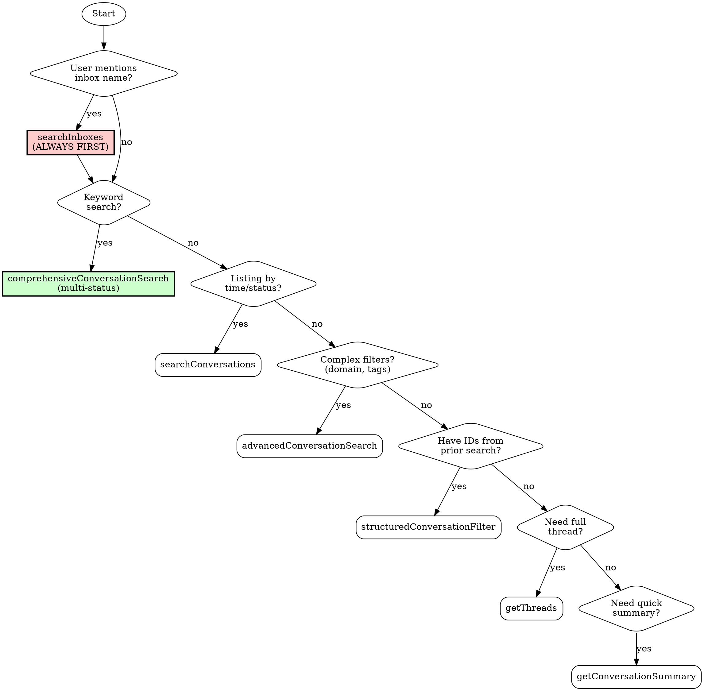

# HelpScout Navigation

Guide for correctly using HelpScout MCP tools. Prevents common mistakes and ensures complete search results.

## First Step: Diagnose Setup

Follow these steps IN ORDER. Do not skip ahead.

---

### Step 1: Check if MCP Tools are Available

Look for these tools in your available tools:
- `mcp__helpscout__searchInboxes`
- `mcp__helpscout__searchConversations`
- `mcp__helpscout__comprehensiveConversationSearch`

**If tools ARE available:** ✅ Skip to "Critical Rules" section. You're ready to go.

**If tools are NOT available:** Continue to Step 2.

---

### Step 2: Check if Credentials are Set

Run this command:
```bash
echo "HELPSCOUT_APP_ID: ${HELPSCOUT_APP_ID:+[SET]}" && echo "HELPSCOUT_APP_SECRET: ${HELPSCOUT_APP_SECRET:+[SET]}"
```

**If both show `[SET]`:** Credentials exist but MCP didn't start. Go to Step 4.

**If either is blank:** Credentials are missing. Go to Step 3.

---

### Step 3: Set Up Credentials

Tell the user:

> **HelpScout credentials are not configured.**
>
> **Get your credentials:**
> 1. Go to HelpScout → Your Profile → My Apps
> 2. Create a new app (or use existing)
> 3. Copy the **App ID** and **App Secret**
>
> **Add to your shell profile** (`~/.zshrc` or `~/.bashrc`):
> ```bash
> export HELPSCOUT_APP_ID="your-app-id-here"
> export HELPSCOUT_APP_SECRET="your-app-secret-here"
> ```
>
> **Then go to Step 4.**

---

### Step 4: Restart Correctly (IMPORTANT)

⚠️ **This is where most people get stuck.**

The MCP server inherits environment variables from Claude Code's process. If Claude Code was started before the credentials were set, it won't have them.

Tell the user:

> **You must restart BOTH your terminal AND Claude Code:**
>
> 1. **Quit Claude Code completely** (not just close the window)
> 2. **Close your terminal completely** (not just the tab)
> 3. **Open a new terminal** (this loads your updated `.zshrc`)
> 4. **Start Claude Code from this new terminal**
>
> ```bash
> claude
> ```
>
> The HelpScout MCP server will now start with the correct credentials.

**Do not proceed with HelpScout operations until the MCP tools are available.**

---

## Overview

The HelpScout MCP server provides 17 tools for searching and retrieving support conversations. However, using them incorrectly leads to missed tickets and incomplete results. This skill ensures you use the right tool in the right order.

**Core problems this skill solves:**
1. Users forget to call `searchInboxes` first (required for inbox-scoped searches)
2. `searchConversations` defaults to "active" status only (misses closed/pending)
3. Users don't know which search tool to use for their query type
4. Users don't know the customer/org lookup tools for account investigation
5. Users try conversation search when they should use customer or org tools

---

## Critical Rules (MUST READ FIRST)

### Rule 1: ALWAYS Call searchInboxes First

**When a user mentions an inbox by name, you MUST look up the inbox ID before searching.**

| User Says | You MUST Do First |
|-----------|-------------------|
| "Search the support inbox" | `searchInboxes(query: "support")` |
| "Find tickets in sales mailbox" | `searchInboxes(query: "sales")` |
| "Check the billing inbox" | `searchInboxes(query: "billing")` |

**Why:** All inbox-scoped searches require an inbox ID (numeric), not a name.

### Rule 2: searchConversations Defaults to "Active" Only

**DANGER:** `searchConversations` without a status parameter only returns active tickets.

| What You Want | WRONG Tool | RIGHT Tool |
|---------------|------------|------------|
| "Find tickets about billing" | `searchConversations(query: "billing")` | `comprehensiveConversationSearch(searchTerms: ["billing"])` |
| "Search for refund requests" | `searchConversations(query: "refund")` | `comprehensiveConversationSearch(searchTerms: ["refund"])` |

**Use `searchConversations` ONLY when:**
- Listing recent tickets (no keyword search)
- You explicitly want only active tickets
- Combined with explicit status parameter

**Use `comprehensiveConversationSearch` when:**
- Searching by keywords
- You want to find tickets regardless of status
- Default behavior (searches active + pending + closed)

### Rule 3: structuredConversationFilter is for AFTER Discovery

**This tool requires IDs from previous searches. Do NOT use for initial searches.**

| Use Case | Correct Approach |
|----------|------------------|
| Find ticket #42839 | `structuredConversationFilter(conversationNumber: 42839)` |
| Find John's assigned tickets | First: get John's ID. Then: `structuredConversationFilter(assignedTo: <johnId>)` |
| Find customer 12345's history | `structuredConversationFilter(customerIds: [12345])` |

---

## Decision Tree: Which Tool to Use



### Quick Decision Matrix

| I want to... | Use this tool | Required first? |
|--------------|---------------|-----------------|
| Search by keywords | `comprehensiveConversationSearch` | `searchInboxes` if inbox mentioned |
| List recent tickets (single status) | `searchConversations` | `searchInboxes` if inbox mentioned |
| List recent tickets (ALL statuses) | `structuredConversationFilter(sortBy: "waitingSince", status: "all")` | `searchInboxes` if inbox mentioned |
| Find tickets by email domain | `advancedConversationSearch` | `searchInboxes` if inbox mentioned |
| Look up ticket #12345 | `structuredConversationFilter` | None |
| Get all tickets from customer X | `structuredConversationFilter` | Need customer ID from prior search |
| Read full conversation | `getThreads` | Need conversation ID |
| Get quick overview | `getConversationSummary` | Need conversation ID |
| List all inboxes | `listAllInboxes` | None |
| Get current server time | `getServerTime` | None |
| Look up a customer by email | `searchCustomersByEmail` | None |
| Browse customers | `listCustomers` | None |
| Get full customer profile | `getCustomer` | Need customer ID |
| Get customer contact details | `getCustomerContacts` | Need customer ID |
| Browse organizations | `listOrganizations` | None |
| Get organization details | `getOrganization` | Need organization ID |
| See who is in an organization | `getOrganizationMembers` | Need organization ID |
| See org's support history | `getOrganizationConversations` | Need organization ID |

---

## Tool Reference Summary

| Tool | Purpose | Key Limitation |
|------|---------|----------------|
| `searchInboxes` | Get inbox ID from name | ALWAYS call first when inbox mentioned |
| `listAllInboxes` | List all available inboxes | Helper for discovery |
| `searchConversations` | List tickets by time/status | **Defaults to ACTIVE ONLY** |
| `comprehensiveConversationSearch` | Keyword search across statuses | Preferred for content search |
| `advancedConversationSearch` | Complex filters (domain, tags) | For boolean logic |
| `structuredConversationFilter` | ID-based lookup | Requires IDs from prior search |
| `getConversationSummary` | Quick overview | Needs conversation ID |
| `getThreads` | Full message history | Needs conversation ID |
| `getServerTime` | Current timestamp | For time-relative searches |
| `listCustomers` | Browse customers by name or query | Page-based v2 API |
| `searchCustomersByEmail` | Find customer by email | Uses v3 API with cursor pagination |
| `getCustomer` | Full customer profile with contacts | Includes embedded sub-resources |
| `getCustomerContacts` | All contact channels for a customer | Parallel sub-resource lookups |
| `listOrganizations` | Browse organizations | Sortable by activity, size, name |
| `getOrganization` | Organization profile with counts | Optional customer/conversation counts |
| `getOrganizationMembers` | Customers in an organization | 50 per page |
| `getOrganizationConversations` | Support history for an organization | 50 per page |

See [references/tool-reference.md](references/tool-reference.md) for complete parameter documentation.

---

## Common Workflows

### Workflow 1: Search Inbox X for Keyword Y

**User:** "Search the support inbox for billing issues"

**Steps:**
1. Look up inbox ID:
   ```
   searchInboxes(query: "support")
   ```
   Result: `{ id: 359402, name: "Support" }`

2. Search with inbox scope:
   ```
   comprehensiveConversationSearch(
     searchTerms: ["billing"],
     inboxId: "359402"
   )
   ```

### Workflow 2: Show Recent Tickets in Inbox X

**User:** "Show me recent tickets in the sales inbox"

**Steps:**
1. Look up inbox ID:
   ```
   searchInboxes(query: "sales")
   ```

2. List recent (no keyword = use searchConversations):
   ```
   searchConversations(
     inboxId: "359402",
     sort: "createdAt",
     order: "desc",
     limit: 20
   )
   ```

### Workflow 3: Find Ticket #12345

**User:** "Show me ticket 12345"

**Steps:**
1. Direct lookup (no inbox lookup needed):
   ```
   structuredConversationFilter(conversationNumber: 12345)
   ```

2. Get details:
   ```
   getConversationSummary(conversationId: "<id from step 1>")
   ```

### Workflow 4: Find All Tickets from Domain

**User:** "Find tickets from @acme.com"

**Steps:**
1. Use advanced search with domain filter:
   ```
   advancedConversationSearch(emailDomain: "acme.com")
   ```

### Workflow 5: List All Recent Tickets Across ALL Statuses

**User:** "Show me recent tickets from the last 30 days" (no specific status mentioned)

**Steps:**
1. Use `structuredConversationFilter` with a unique `sortBy` value:
   ```
   structuredConversationFilter(
     sortBy: "waitingSince",   // Required: unique sortBy enables all-status queries
     status: "all",            // Includes active, pending, closed, spam
     sortOrder: "desc",
     limit: 50,
     createdAfter: "2024-01-01T00:00:00Z"  // Optional: date filter
   )
   ```

**Why this works:**
- `structuredConversationFilter` supports `status: "all"` (unlike `searchConversations`)
- BUT it requires at least one "unique field" - using `sortBy: "waitingSince"` satisfies this
- Other unique sortBy values: `customerName`, `customerEmail`

**Common mistake:** Using `searchConversations(status: "all")` - this FAILS because `searchConversations` only accepts specific statuses (active/pending/closed/spam), not "all".

---

### Workflow 6: Get Full Conversation Thread

**User:** "Show me the full thread for conversation 12345678"

**Steps:**
1. Get all messages:
   ```
   getThreads(conversationId: "12345678", limit: 200)
   ```

---

### Workflow 7: Customer Investigation by Email

**User:** "Look up the customer jane@acme.com and show their history"

**Steps:**
1. Find customer by email:
   ```
   searchCustomersByEmail(email: "jane@acme.com")
   ```
   Result: `{ id: 12345, firstName: "Jane", organizationId: 456 }`

2. Get full profile:
   ```
   getCustomer(customerId: "12345")
   ```

3. Get their conversations:
   ```
   structuredConversationFilter(customerIds: [12345], status: "all", sortBy: "createdAt")
   ```

### Workflow 8: Organization Account Review

**User:** "Show me everything about the Acme Corp account"

**Steps:**
1. Find the organization:
   ```
   listOrganizations(sortField: "name")
   ```
   Find "Acme Corp" in results, get org ID.

2. Get organization details:
   ```
   getOrganization(organizationId: "456", includeCounts: true)
   ```

3. See who is in the org:
   ```
   getOrganizationMembers(organizationId: "456")
   ```

4. See their support history:
   ```
   getOrganizationConversations(organizationId: "456")
   ```

---

## Anti-Patterns (What NOT to Do)

| Mistake | Why It Fails | Correct Approach |
|---------|--------------|------------------|
| `searchConversations(query: "billing")` without status | Returns active only, misses 80%+ of tickets | `comprehensiveConversationSearch(searchTerms: ["billing"])` |
| `searchConversations(inboxId: "Support")` | Inbox ID must be numeric, not name | First: `searchInboxes(query: "Support")` |
| `searchConversations(status: "all")` | "all" is NOT a valid status for this tool | Use `structuredConversationFilter(sortBy: "waitingSince", status: "all")` |
| `structuredConversationFilter` as first search | Requires IDs you don't have yet | Start with `comprehensiveConversationSearch` |
| `structuredConversationFilter` without unique field | Tool requires a unique field to work | Add `sortBy: "waitingSince"` or provide assignedTo/customerIds/conversationNumber |
| Skipping `searchInboxes` when user mentions inbox | API requires numeric inbox ID | ALWAYS lookup first |
| Using `searchConversations` for keyword search | Misses closed/pending tickets | Use `comprehensiveConversationSearch` |

See [references/common-mistakes.md](references/common-mistakes.md) for more anti-patterns.

---

## Quick Reference Card

```bash
# STEP 1: Always get inbox ID first (when inbox mentioned)
searchInboxes(query: "support")  # Returns inbox ID

# STEP 2a: Keyword search (multi-status)
comprehensiveConversationSearch(
  searchTerms: ["billing", "refund"],
  inboxId: "359402",
  timeframeDays: 60
)

# STEP 2b: List recent (single status)
searchConversations(
  inboxId: "359402",
  status: "active",  # Required: active, pending, closed, or spam (NOT "all")
  sort: "createdAt",
  order: "desc"
)

# STEP 2c: List recent (ALL statuses)
structuredConversationFilter(
  sortBy: "waitingSince",  # Required: unique sortBy enables status: "all"
  status: "all",
  sortOrder: "desc",
  limit: 50
)

# Direct ticket lookup
structuredConversationFilter(conversationNumber: 12345)

# Email domain search
advancedConversationSearch(emailDomain: "acme.com")

# Full thread
getThreads(conversationId: "12345678")

# Quick summary
getConversationSummary(conversationId: "12345678")

# Customer lookup
searchCustomersByEmail(email: "jane@acme.com")
getCustomer(customerId: "12345")
getCustomerContacts(customerId: "12345")

# Organization traversal
listOrganizations(sortField: "conversationCount", sortOrder: "desc")
getOrganization(organizationId: "456", includeCounts: true)
getOrganizationMembers(organizationId: "456")
getOrganizationConversations(organizationId: "456")
```

---

## Common Mistakes Checklist

Before executing a HelpScout search, verify:

- [ ] Did user mention an inbox name? → Called `searchInboxes` first?
- [ ] Searching by keywords? → Using `comprehensiveConversationSearch` (not `searchConversations`)?
- [ ] Need closed/pending tickets? → NOT using bare `searchConversations`?
- [ ] Need ALL statuses? → Using `structuredConversationFilter(sortBy: "waitingSince", status: "all")` (NOT `searchConversations`)?
- [ ] Using inbox ID, not inbox name, in API calls?
- [ ] Using `structuredConversationFilter`? → Have unique field (conversationNumber, assignedTo, customerIds, folderId, or sortBy with waitingSince/customerName/customerEmail)?
- [ ] Looking up a customer? → Using `searchCustomersByEmail` (not conversation search)?
- [ ] Need customer's full profile? → Using `getCustomer` after finding ID?
- [ ] Investigating an account? → Starting with `listOrganizations` or `getOrganization`?

---
> Source: [drewburchfield/help-scout-mcp-server](https://github.com/drewburchfield/help-scout-mcp-server) — distributed by [TomeVault](https://tomevault.io).
<!-- tomevault:4.0:skill_md:2026-06-29 -->
