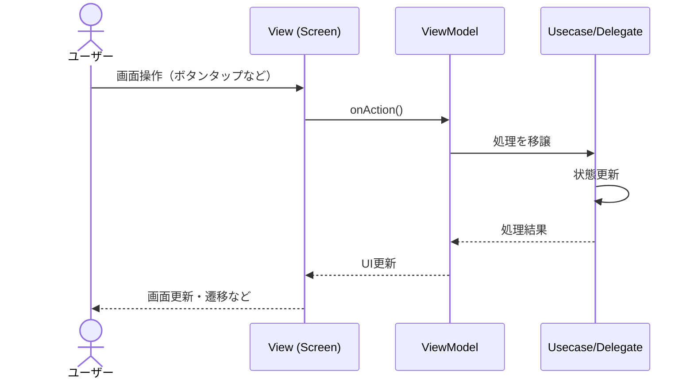

# ドキュメンテーション / 技術文書の記載

## 基本的な方針

### 文体

* ドキュメントは「である」調を用いて簡潔に表現する
* 技術的な正確性を保ちつつ、読みやすさを重視する

## ドキュメント構造

### 必須セクション

すべてのドキュメントには、以下のセクションを必ず含める：

1. **概要**: ドキュメントの冒頭に配置する
2. **よくあるパターンとアンチパターン**: ドキュメントの末尾に配置する

### 概要セクション

* 各ドキュメントの冒頭に「概要」セクションを配置する（必須）
* 対象コンポーネントの役割と特徴を簡潔に説明する
* 以下の要素を含める：
  * コンポーネントの目的と役割
  * 主要な特徴や設計思想
  * 関連するコンポーネントとの関係（必要に応じて）

### 原則・規則セクション

* 各規則・原則の配下に、以下の要素を含める：
  * **補足**: 規則・原則の意図や背景を説明する（必須）
  * **実装例**: 実際のコードベースから引用した実装例を示す（必須）
  * **アンチパターン**: 避けるべき実装パターンを示す（必要に応じて）

#### 補足サブセクションの記述ルール

* 各原則・規則の直下に「補足」サブセクションを配置する
* 補足の見出しは「`${原則名}の補足`」または「`${規則名}の補足`」とする
* 見出しが重複する場合は、文脈を追加して一意にする
  * 例：「補足」→「package分離の補足」「テスト用と本番用のInjection分離の補足」
* 補足には以下の内容を含める：
  * 規則・原則の意図や背景
  * 利点や注意点
  * 適用範囲や例外（存在する場合）

#### 実装例サブセクションの記述ルール

* 各原則・規則の直下に「実装例」サブセクションを配置する
* 実装例の見出しは「`${原則名}の実装例`」または「`${規則名}の実装例`」とする
* 見出しが重複する場合は、文脈を追加して一意にする
  * 例：「実装例」→「Usecase実装例」「注入順序とオーバーライドの実装例」
* 実装例には以下の要素を含める：
  * 良い例：推奨される実装パターンを示す
  * 悪い例：避けるべき実装パターンを示す（必要に応じて）
  * 実装例の前に、簡潔な説明を追加する

## 実装例の作成方法

### 既存コードの調査

* ドキュメント作成前に、既存のコードベースを調査する
* 実際の実装パターンを確認してから記述する
* 複数の実装例を参照し、代表的なパターンを選択する

### コード参照の形式

コードブロックには、以下の2つの形式がある。AI Agentは、コードの種類に応じて適切な形式を選択する必要がある。

#### 既存コードの参照

実在するコードベースからコードを引用する場合は、コードの場所をコメントとして記載する。

**形式**:

```dart
// ${パッケージ名}, ${ファイル名}.dart
// コード内容
```

**記述ルール**:

* コメントの形式は「`${パッケージ名}, ${ファイル名}.dart`」とする
* パッケージ名は、`pubspec.yaml`の`name`フィールドの値を使用する
* ファイル名は、実際のファイル名（拡張子を含む）を使用する
* コード内容は、実際のコードベースから引用する
* 架空のコード例は使用しない

**実装例**:

```dart
// usecase_error, crash_report_request.dart
@freezed
abstract class CrashReportRequest with _$CrashReportRequest {
  const factory CrashReportRequest({
    required dynamic error,
  }) = _CrashReportRequest;
}
```

#### 提案するコードブロック（テンプレート）

新しいコード例やテンプレートを示す場合は、言語名を最初に記述する。

**形式**:

```${言語名}
// コード内容
```

**記述ルール**:

* コードブロックの開始行に言語名を指定する
* 使用可能な言語名：`dart`、`yaml`、`bash`、`text`、`typescript`、`json`など
* ディレクトリ構成を示す場合は`text`を使用する
* テンプレート変数（`${変数名}`）を使用して汎用的なコードを示す
* ファイルパスだけを記述した形式（```` ```ファイルパス````）は使用しない

**実装例**:

```dart
/// ${機能の説明}.
abstract class ${機能名}Usecase {
  static final provider = Provider<${機能名}Usecase>(
    (ref) => throw UnimplementedError("$${機能名}Usecase is not implemented"),
  );

  /// ${メソッドの説明}.
  Future<${機能名}Result> ${メソッド名}(${機能名}Request request);

  const ${機能名}Usecase._();
}
```

**重要**: ファイルパスだけを記述した形式（```` ```ファイルパス````）は使用しない。必ず言語名（`dart`、`yaml`、`bash`など）を最初に記述する。

### ディレクトリ構成の記述

ディレクトリ構成を記述する場合は、以下のルールに従う。

**記述ルール**:

* ディレクトリ構成を記述する前に、実際の構成を確認する
* コードブロックの言語名は`text`を使用する
* テンプレート形式（`${変数名}`）を使用して、汎用的な構成を示す
* 実装例として、実際のディレクトリ構成を示す
* パスはプロジェクトルートからの相対パスで記述する

**形式**:

```text
${パス}/
├── ${ファイル名またはディレクトリ名}
│   └── ${ファイル名またはディレクトリ名}
└── ${ファイル名またはディレクトリ名}
```

**実装例**:

```text
app_packages/usecase/
├── school/                 # usecase_school（インターフェース）
│   ├── lib/
│   │   ├── usecase_school.dart  # パッケージ名と同一
│   │   └── src/kanji_search/
│   │       ├── kanji_search_usecase.dart
│   │       ├── kanji_search_request.dart
│   │       └── kanji_search_result.dart
│   └── _impl/              # usecase_school_impl（実装）
│       └── lib/
│           ├── usecase_school_impl.dart  # パッケージ名と同一
│           └── src/kanji_search_usecase/
│               └── kanji_search_usecase_impl.dart
└── injection/              # usecase_injection（依存注入）
    └── lib/
        ├── usecase_injection.dart  # パッケージ名と同一
        └── src/
            └── injection.dart
```

**テンプレート変数の使用**:

* 汎用的な構成を示す場合は、`${変数名}`形式のテンプレート変数を使用する
* テンプレート変数の例：`${機能名}`、`${レイヤー名}`、`${画面名}`など
* 実装例では、実際の値に置き換えて示す

## アプリフレームワーク（基盤）の記述

### 参考情報としての記述

* アプリフレームワーク（基盤）に関する記述は、参考情報として簡潔に述べる
* 既に実装済みで量産が不要なインターフェースについては、その旨を明記する
* 詳細な実装は参照先ファイルを指定する

### 実装者向けの情報に焦点

* 実装者が実際に使用する情報に焦点を当てる
* 基盤クラスの詳細な実装例は含めない

## パターンとアンチパターン

### 「よくあるパターンとアンチパターン」セクション

すべてのドキュメントには、末尾に「よくあるパターンとアンチパターン」セクションを配置する（必須）。

**セクション構造**:

```markdown
## よくあるパターンとアンチパターン

### 推奨されるパターン

1. **${パターン名}**
   * ${説明}

2. **${パターン名}**
   * ${説明}

### 避けるべきパターン

1. **${パターン名}**
   * ${説明}

2. **${パターン名}**
   * ${説明}
```

**記述ルール**:

* セクション見出しは「`よくあるパターンとアンチパターン`」とする
* 「推奨されるパターン」と「避けるべきパターン」の2つのサブセクションを含める
* 各パターンには番号付きリスト（`1.`）を使用する
* パターン名は太字（`**${パターン名}**`）で記述する
* 各パターンには簡潔な説明を付与する
* 説明は箇条書き（`*`）で記述する

### 推奨されるパターン

* 「推奨されるパターン」サブセクションに、推奨される実装パターンを記載する
* 各パターンに簡潔な説明を付与する
* パターンは重要度の高い順に並べる

### 避けるべきパターン

* 「避けるべきパターン」サブセクションに、アンチパターンを記載する
* アンチパターンは、避けるべき理由とともに記載する
* 実装例を示す場合は、誤った実装例として明示する
* パターンは重要度の高い順に並べる

## ドキュメントの組織化

### セクションの階層

* 原則・規則を上位セクション（`##`）として配置する
* 補足・実装例・アンチパターンを下位セクション（`###`、`####`）として配置する
* 階層が深くなりすぎないように注意する（最大4階層まで）
* 見出しの階層は連続させる（`##`の次は`###`、`###`の次は`####`）

### セクションの命名規則

* セクション見出しは簡潔で明確な名称とする
* 見出しが重複する場合は、文脈を追加して一意にする
* 例：「補足」→「package分離の補足」「テスト用と本番用のInjection分離の補足」
* 例：「実装例」→「Usecase実装例」「注入順序とオーバーライドの実装例」

### 類似セクションの統合

* 同等の構成を持つセクションは、統合して記述する
* 例：UsecaseレイヤーとDataレイヤーは同等の構成であるため、統合して記述する
* 統合する場合は、両方のレイヤーに適用される内容を記述する

### セクションの順序

推奨されるセクションの順序：

1. 概要
2. 原則・規則（各原則に補足・実装例を含める）
3. 実装詳細（必要に応じて）
4. よくあるパターンとアンチパターン
5. 参考リンク（Webページを参照した場合）

## コード参照のルール

### 実在するコードの参照

* コード参照は、実在するファイルからのみ行う
* 架空のコード例は使用しない
* コード参照を行う前に、実際のコードベースを確認する

### 参照範囲の明確化

* コード参照は、必要な範囲のみを参照する
* 説明に必要な最小限のコードのみを提示する
* 長いコードの場合は、重要な部分のみを抜粋し、省略部分はコメントで示す

### コード参照の検証

* コード参照後、実際のファイルが存在することを確認する
* 参照したコードが最新の実装と一致していることを確認する
* ファイルパスやパッケージ名が正確であることを確認する

## ドキュメント作成時の手順

AI Agentがドキュメントを作成・更新する際は、以下の手順に従う：

1. **既存コードの調査**
   * ドキュメント作成前に、既存のコードベースを調査する
   * 実際の実装パターンを確認してから記述する
   * 複数の実装例を参照し、代表的なパターンを選択する

2. **ドキュメント構造の確認**
   * 必須セクション（概要、よくあるパターンとアンチパターン）が含まれていることを確認する
   * セクションの階層が適切であることを確認する
   * 見出しの重複がないことを確認する

3. **コード参照の検証**
   * 参照したコードが実際に存在することを確認する
   * ファイルパスやパッケージ名が正確であることを確認する
   * コードブロックに言語名が指定されていることを確認する

4. **リンターエラーの確認**
   * ドキュメント作成後、リンターエラーがないことを確認する
   * よくあるリンターエラーをチェックする

5. **整合性の確認**
   * 実際の実装と整合性があることを確認する
   * ディレクトリ構成やファイルパスが正確であることを確認する

### テンプレート変数の使用

* 汎用的なコードや構成を示す場合は、テンプレート変数（`${変数名}`）を使用する
* テンプレート変数を使用した場合は、実装例として実際の値に置き換えた例も示す
* テンプレート変数の例：`${機能名}`、`${レイヤー名}`、`${画面名}`、`${メソッド名}`など

### 実装例の選択基準

* 実装例は、実際のコードベースから選択する
* 複数の実装例がある場合は、代表的なパターンを選択する
* 実装例は、説明に必要な最小限のコードのみを含める
* 長いコードの場合は、重要な部分のみを抜粋し、省略部分はコメントで示す

## 検証と確認

### 実装との整合性

* ドキュメント作成後、実際の実装と整合性があることを確認する
* ディレクトリ構成やファイルパスが正確であることを確認する
* 参照したコードが最新の実装と一致していることを確認する

### リンターエラーの確認

* ドキュメント作成後、リンターエラーがないことを確認する
* よくあるリンターエラーとその修正方法は以下の通りである

#### 見出しの重複（MD024/no-duplicate-heading）

* 同じ見出しが複数箇所に存在する場合、エラーが発生する
* 修正方法：見出しに文脈を追加して一意にする
  * 例：「補足」→「package分離の補足」「テスト用と本番用のInjection分離の補足」
  * 例：「実装例」→「Usecase実装例」「注入順序とオーバーライドの実装例」

#### コードブロックの言語タグ（MD040/fenced-code-language）

* コードブロックには必ず言語タグを指定する
* 修正方法：コードブロックの開始行に言語名を追加する
  * 例：`dart`、`bash`、`text`、`yaml`など
  * ディレクトリ構成を示す場合は`text`を使用する
    * `tree` コマンドの表示レイアウトを参考にする
  * 例

    ```dart
    // dartのコードサンプル
    void main() {

    }
    ```

    ```text
    # ディレクトリ構造の表示サンプル
    .cursor
    ├── agents
    ├── commands
    ├── mcp.json
    ├── rules
    ├── skills
    └── worktrees.json
    ```

#### コードブロックの前後の空行（MD031/blanks-around-fences）

* コードブロックの前後には空行が必要である
* 修正方法：コードブロックの前後に空行を追加する

#### ベアURL（MD034/no-bare-urls）

* URLはそのまま記述せず、角括弧で囲む
* 修正方法：URLを`<URL>`の形式で記述する
  * 例：`<https://docs.flutter.dev/ui/accessibility-and-internationalization/internationalization>`

#### リストのインデント（MD007/ul-indent）

* リストのインデントは2スペース単位で統一する
* 修正方法：ネストされたリスト項目のインデントを2スペース単位に調整する

#### リストスタイル（MD004/ul-style）

* リスト項目はアスタリスク（`*`）を使用する
* 修正方法：ダッシュ（`-`）を使用している箇所をアスタリスク（`*`）に変更する

#### 連続する空行（MD012/no-multiple-blanks）

* 連続する空行は1つまでとする
* 修正方法：2つ以上の連続する空行を1つに削減する

## 作図ルール

* 作図を行う場合は [mermaid](https://mermaid.js.org/) 形式を使用する
* コードブロックの言語名は`mermaid`を指定する
* 図の種類に応じて適切なmermaid構文を使用する
  * シーケンス図：`sequenceDiagram`
  * フローチャート：`flowchart`または`graph`
  * クラス図：`classDiagram`
  * 状態遷移図：`stateDiagram-v2`

**実装例**:



## 引用ルール

### Webページの参照

* ドキュメント内で参照しているWebページがある場合は、このルールに従う
* ドキュメントの末尾には必ず「参考リンク」セクションを作成する
* 参照したWebドキュメントへのリンクを記述する

### 参考リンクセクションの記述

**形式**:

```markdown
## 参考リンク

* ${リンクの説明}: <${URL}>
```

**記述ルール**:

* セクション見出しは「`参考リンク`」とする
* リスト形式（`*`）で記述する
* URLは角括弧で囲む（`<URL>`）
* リンクの説明をURLの前に記述する
* リンクは重要度の高い順に並べる

**実装例**:

```markdown
## 参考リンク

* Flutter公式ドキュメント: <https://docs.flutter.dev/>
* Riverpod公式ドキュメント: <https://riverpod.dev/>
```

## path記述ルール

### パスの記述方法

* パスを記述する際は基本的に特定パス（指定がない場合はワークスペースのルートディレクトリ）からの相対パスを用いる
* 絶対パスはOSや環境の差異により異なるため、非推奨である
* パスはスラッシュ（`/`）で区切る（Windows環境でも`\`ではなく`/`を使用する）

### パスの記述例

**良い例**:

* `app_packages/usecase/school/lib/src/kanji_search_usecase.dart`
* `docs/flutter/usecase.md`

**悪い例**:

* `/Users/example_user/work/path/to/repository/app_packages/usecase/school/lib/src/kanji_search_usecase.dart`（絶対パス）
* `app_packages\usecase\school\lib\src\kanji_search_usecase.dart`（Windows形式の区切り文字）

### パッケージ名の記述

* パッケージ名を記述する場合は、`pubspec.yaml`の`name`フィールドの値を使用する
* パッケージ名は、実際のパッケージ名と一致させる
* 例：`usecase_school`、`usecase_school_impl`、`usecase_injection`

---
> Converted and distributed by [TomeVault](https://tomevault.io/claim/eaglesakura) — claim your Tome and manage your conversions.
<!-- tomevault:4.0:skill_md:2026-04-14 -->
