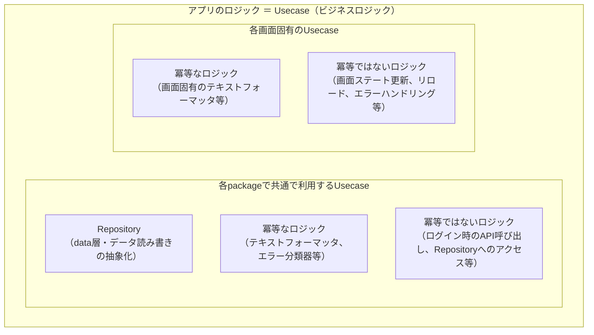

# Flutter-Layered-Architecture / 設計

* モノリス構造であり、 `dart workspace` 機能を用いたdartプロジェクトで構築される
* 複数の階層からなるアーキテクチャレイヤーを適用する。
* レイヤーごとに責任範囲を明確に分離し、上位レイヤーが下位レイヤーに依存する構造を取る。これにより、テスタビリティと保守性が向上する。

## レイヤー一覧

| レイヤー名 | package名プレフィックス | レイヤーレベル | 役割 |
| -- | -- | -- | -- |
| app | app | 7 | アプリケーション |
| screen | screen_* | 6 | 各画面、Model-View-ViewModelで設計・実装する |
| view | view_* | 5 | Widget等、UI要素 |
| usecase | usecase_* | 4 | ビジネスロジックを提供する |
| data | data_* | 4 | データRead/Writeロジックを提供する |
| infra | infra_* | 3 | OS差異・Unit Testと実機差異の吸収等、アプリ実行インフラを提供する |
| domain | domain_* | 2 | アプリドメインを提供する |
| foundation | foundation_* | 1 | DI等、アプリ実行基盤 |
| testing | testing_* | - | テストサポート、アーキテクチャレベル範囲外 |

## 依存する重要なライブラリ

* [riverpod](https://pub.dev/packages/riverpod)
  * レイヤー間の結合（Dependency Injection）に利用する

## インターフェースと実装の分離(Dependency Injection)

* レイヤー内でのpackage分離、循環参照防止、可換性等、様々な問題を解決するため、Dependency Injectionの導入が重要である。
* 各packageはインターフェース（`abstract interface class`）と実装（ `class` ） が明確に分離する
  * この分離は、dart packageの循環参照を防ぐことと、個別のライブラリの隠蔽のため採用されている
* 依存注入(Dependency Injection)には [riverpod](https://pub.dev/packages/riverpod) ライブラリを利用する
* Dependency Injectionを行い、かつ依存を含めたUnit Testを行うために `テスト専用のpackage` を導入している

## `ビジネスロジック(Usecase)` の考え方

* `Flutter-Layered-Architecture` において、「アプリに関連する処理は、すべてビジネスロジック(Usecase)である」と考える
* 各packageで共通で利用するUsecase
  * ビジネスロジックのなかで、data層に所属し、データ読み書きの抽象化を行うインターフェース、 `Repository` と呼ぶ
  * 冪等なロジック（アプリ固有のテキストフォーマッタ、エラー分類器等）
  * 冪等ではないロジック（ログイン時のAPI呼び出し、Repositoryへのアクセスを含んだ処理）
* 各画面固有のUsecase
  * 冪等なロジック（画面固有のテキストフォーマッタ等）
  * 冪等ではないロジック（画面ステートを更新する、データのリロード処理やエラーハンドリングの共通処理等）

## 追加ドキュメント

文脈に応じて、下記のドキュメントを追加ロードする.
ドキュメント記載の内容を遵守し、ユーザーの指示と統合して出力を行う.

* [アーキテクチャ全体像](./references/architecture-design.md)
  * 例: 詳細設計
* [依存注入](./references/dependency-injection.md)
  * 例: インターフェース設計、全体設計時

---
> Source: [eaglesakura/ai-agent-headquarters](https://github.com/eaglesakura/ai-agent-headquarters) — distributed by [TomeVault](https://tomevault.io).
<!-- tomevault:4.0:skill_md:2026-05-22 -->
