# 🐳 Skill: Experto en Docker Compose

> Documentación oficial: https://docs.openclaw.ai/

## Arquitectura de Servicios Docker

## Flujo de Red y Puertos

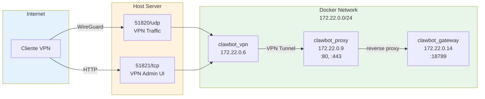

## Estructura del docker-compose.yml

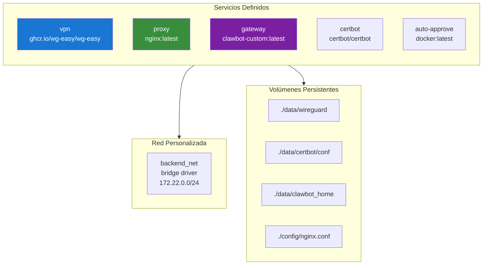

## Dependencias entre Servicios

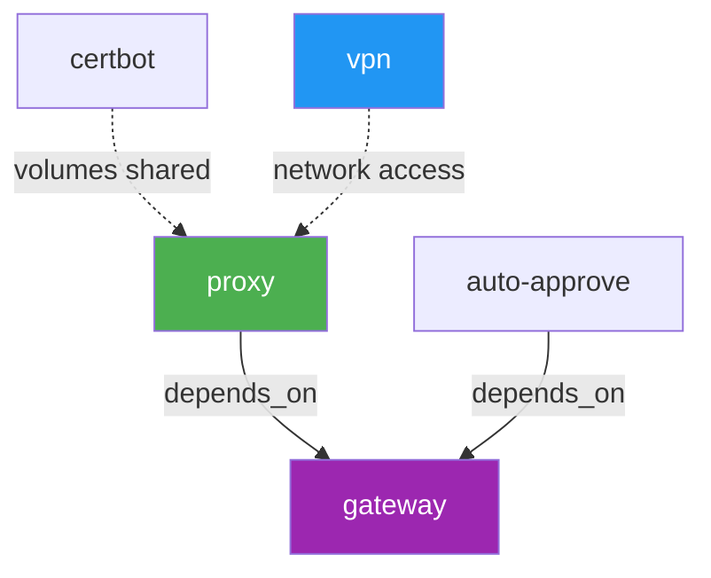

## Variables de Entorno Críticas

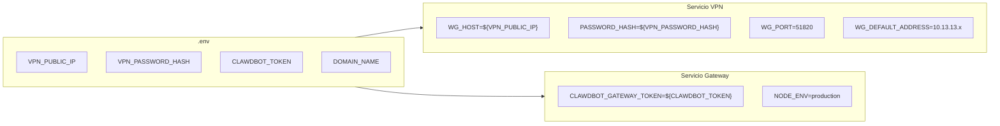

## Ciclo de Vida de Contenedores

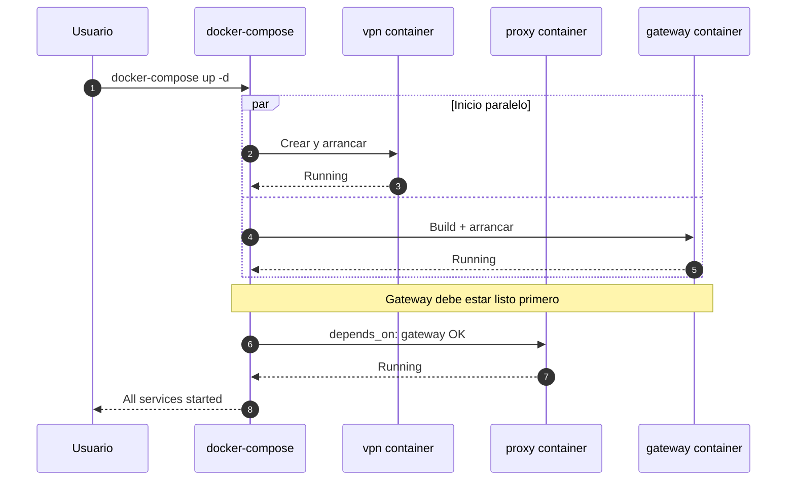

## Patrones de Volúmenes

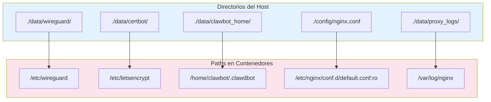

## Comandos Esenciales

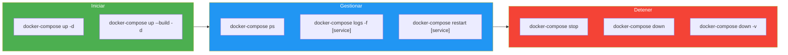

## Configuración de Red

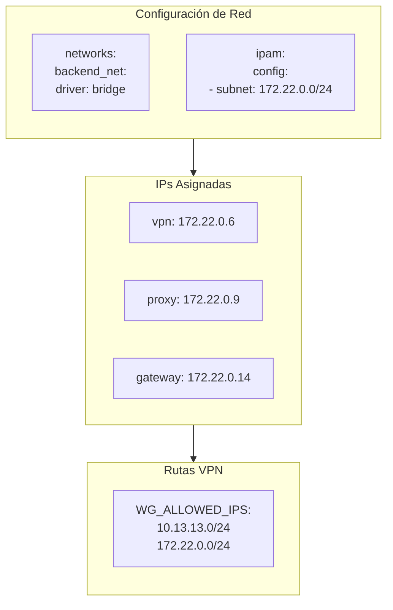

## Build del Dockerfile

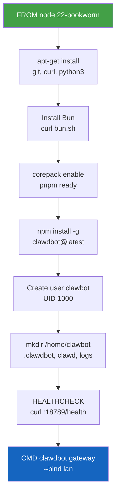

## Troubleshooting Docker

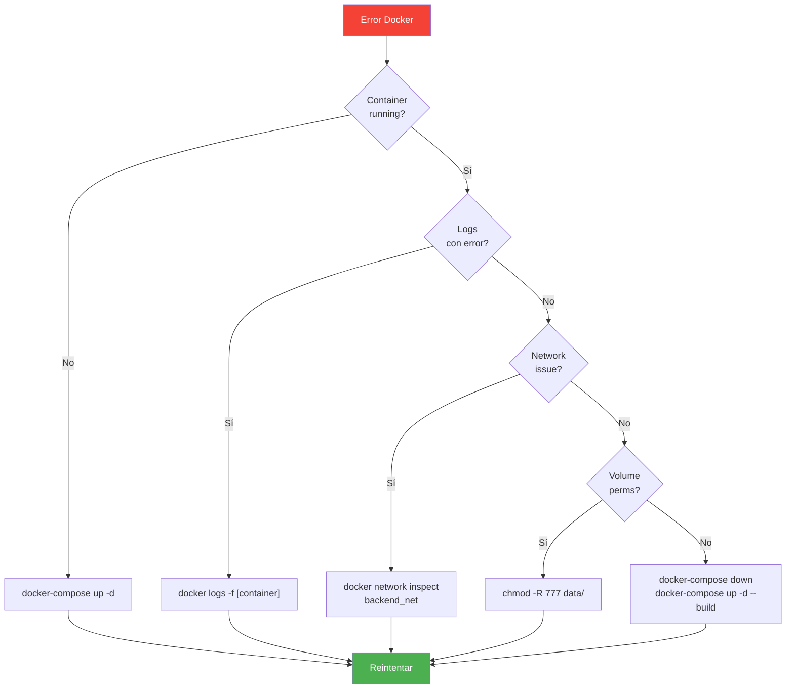

## Capacidades Especiales del VPN

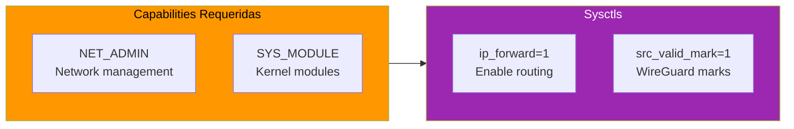

---
> Converted and distributed by [TomeVault](https://tomevault.io/claim/elisaul77) — claim your Tome and manage your conversions.
<!-- tomevault:4.0:skill_md:2026-04-14 -->
