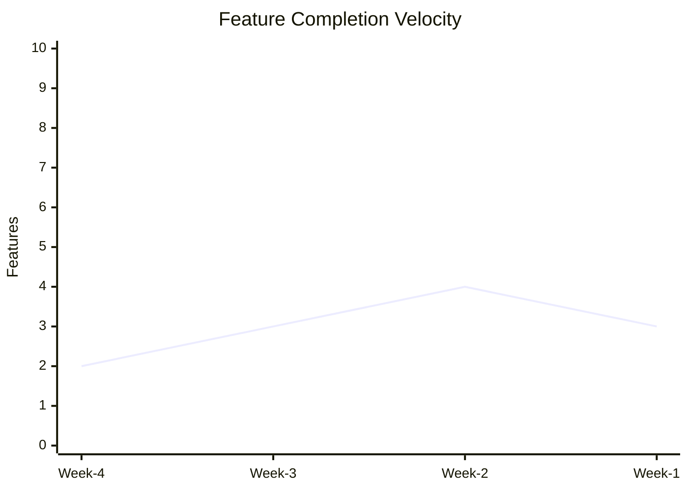
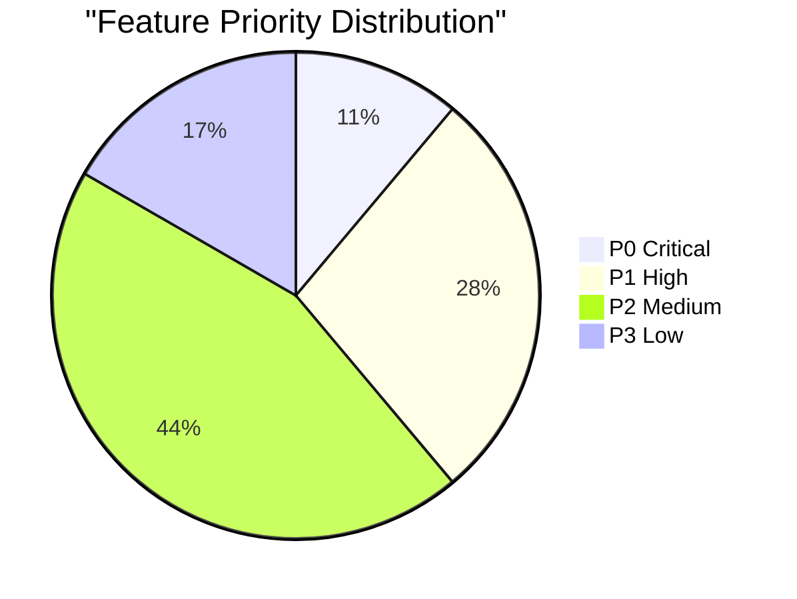

# Weekly Report Skill

Bu skill, progress-tracker agent'ın haftalık ilerleme raporu oluşturması için kullanılır.

---

## 📊 Rapor Bölümleri

### 1. Git Activity

```bash
# Son 7 gündeki commit sayısı
git log --since="7 days ago" --oneline | wc -l

# Commit'lerin dağılımı
git log --since="7 days ago" --format="%ad" --date=short | sort | uniq -c

# En aktif dosyalar
git log --since="7 days ago" --name-only --pretty=format: | sort | uniq -c | sort -rn | head -10

# Contributor listesi
git log --since="7 days ago" --format="%an" | sort | uniq -c | sort -rn
```

---

### 2. Feature Progress

```bash
# feature-list.json'dan istatistikler
cat feature-list.json | jq '{
  total: .total_features,
  completed: .completed_features,
  in_progress: [.features[] | select(.status == "in_progress")] | length,
  blocked: [.features[] | select(.status == "blocked")] | length,
  completion_rate: (.completed_features / .total_features * 100 | round)
}'

# Bu hafta tamamlanan feature'lar
cat feature-list.json | jq '.features[] | select(
  .completed_at >= (now - 7*24*60*60 | strftime("%Y-%m-%d"))
) | {id, title, completed_at}'

# Priority distribution
cat feature-list.json | jq '[.features[] | select(.status != "completed")] | group_by(.priority) | map({priority: .[0].priority, count: length})'
```

---

### 3. Code Quality Metrics

```bash
# Test coverage trend (eğer coverage report varsa)
if [ -f coverage/coverage-summary.json ]; then
  cat coverage/coverage-summary.json | jq '.total | {
    lines: .lines.pct,
    statements: .statements.pct,
    functions: .functions.pct,
    branches: .branches.pct
  }'
fi

# Lint issues
npm run lint 2>&1 | grep -E "warning|error" | wc -l

# File count ve lines of code
find src -name "*.ts" -o -name "*.js" | wc -l
find src -name "*.ts" -o -name "*.js" | xargs wc -l | tail -1
```

---

### 4. Agent Usage Statistics

```bash
# agent-metrics.json'dan özet
cat agent-metrics.json | jq '.agents | to_entries | map({
  agent: .key,
  tasks: .value.tasks_completed,
  avg_duration: .value.avg_duration_minutes,
  last_used: .value.last_used
}) | sort_by(-.tasks)'

# En aktif agent'lar
cat agent-metrics.json | jq '.agents | to_entries | map(select(.value.tasks_completed > 0)) | sort_by(-.value.tasks_completed) | .[0:5]'
```

---

### 5. Bug & Issue Tracking

```bash
# Son 7 gündeki bug count (eğer GitHub kullanıyorsa)
gh issue list --label bug --state all --created ">=$(date -v-7d +%Y-%m-%d)" --json number,title,state | jq 'length'

# Critical issues
gh issue list --label "priority:high" --state open --json number,title

# Error log analizi
if [ -f ~/.claude/error-log.txt ]; then
  tail -n 1000 ~/.claude/error-log.txt | grep "$(date -v-7d +%Y-%m-%d)" | wc -l
fi
```

---

### 6. Velocity Metrics

```bash
# Feature completion rate (son 4 hafta)
for week in 1 2 3 4; do
  start=$(date -v-${week}w -v-mon +%Y-%m-%d)
  end=$(date -v-${week}w -v+sun +%Y-%m-%d)
  count=$(cat feature-list.json | jq "[.features[] | select(.completed_at >= \"$start\" and .completed_at <= \"$end\")] | length")
  echo "Week -$week: $count features"
done

# Avg sessions per feature
cat feature-list.json | jq '[.features[] | select(.passes == true) | .actual_sessions] | add / length'
```

---

## 📝 Rapor Formatı

### Markdown Template

```markdown
# 📊 Weekly Report - Week of [TARIH]

## Executive Summary

- **Features Completed:** X
- **Active Development:** Y features
- **Code Quality:** Z% test coverage
- **Velocity:** W features/week

---

## 🎯 Feature Progress

### Completed This Week
- [F001] User Registration ✅
- [F002] Login System ✅

### In Progress
- [F003] Profile Management (60%)
- [F004] Password Reset (30%)

### Blocked
- [F005] OAuth Integration (waiting for API keys)

---

## 📈 Metrics

| Metric | This Week | Last Week | Trend |
|--------|-----------|-----------|-------|
| Commits | 45 | 38 | ⬆️ +18% |
| Features | 3 | 2 | ⬆️ +50% |
| Test Coverage | 78% | 75% | ⬆️ +3% |
| Bugs Found | 2 | 5 | ⬇️ -60% |

---

## 🤖 Agent Activity

| Agent | Tasks | Avg Duration | Most Used |
|-------|-------|--------------|-----------|
| backend-developer | 12 | 25min | ⭐ |
| qa-engineer | 8 | 15min | |
| architect | 3 | 45min | |

---

## 🔥 Highlights

- ✅ Completed user authentication flow
- ✅ Achieved 78% test coverage
- ⚠️ Database migration pending review

---

## 📅 Next Week Goals

- [ ] Complete profile management (F003)
- [ ] Implement password reset (F004)
- [ ] Increase test coverage to 80%
- [ ] Resolve OAuth blocker (F005)

---

**Report Generated:** [TIMESTAMP]
**By:** progress-tracker agent
```

---

## 🎨 Visualization (Optional)

### Velocity Chart (Mermaid)



### Priority Distribution



---

## 🔧 Kullanım

### Manual Report Generation

```bash
# progress-tracker agent'ı çağır
/weekly-report
```

### Automated Weekly Report

Cron job veya GitHub Actions ile:

```yaml
# .github/workflows/weekly-report.yml
name: Weekly Report
on:
  schedule:
    - cron: '0 9 * * 1'  # Her Pazartesi 09:00
jobs:
  report:
    runs-on: ubuntu-latest
    steps:
      - uses: actions/checkout@v2
      - name: Generate Report
        run: |
          # progress-tracker agent'ı tetikle
          echo "Weekly report generation"
```

---

## 📊 Trend Analysis

### Feature Completion Trend

```bash
# Son 8 haftanın completion rate'i
for i in {1..8}; do
  week_start=$(date -v-${i}w -v-mon +%Y-%m-%d)
  week_end=$(date -v-${i}w -v+sun +%Y-%m-%d)
  completed=$(cat feature-list.json | jq "[.features[] | select(.completed_at >= \"$week_start\" and .completed_at <= \"$week_end\")] | length")
  echo "Week -$i: $completed"
done | gnuplot -e "set term dumb; plot '-' with lines"
```

### Agent Efficiency Trend

```bash
# Agent başına ortalama süre değişimi
cat agent-metrics.json | jq '.agents | to_entries | map({
  agent: .key,
  efficiency: (if .value.avg_duration_minutes > 0 then .value.tasks_completed / .value.avg_duration_minutes else 0 end)
}) | sort_by(-.efficiency)'
```

---

## 🎯 KPI'lar (Key Performance Indicators)

| KPI | Target | Current | Status |
|-----|--------|---------|--------|
| Features/Week | 3 | 3 | ✅ On Track |
| Test Coverage | 80% | 78% | ⚠️ Near Target |
| Bug Backlog | <5 | 3 | ✅ Healthy |
| Deployment Frequency | 2/week | 2 | ✅ On Track |
| MTTR (Mean Time To Repair) | <2h | 1.5h | ✅ Excellent |

---

## 📧 Report Distribution

Raporu Slack'e gönder:

```bash
# Slack MCP ile
curl -X POST https://hooks.slack.com/services/YOUR/WEBHOOK/URL \
  -H 'Content-Type: application/json' \
  -d '{
    "text": "📊 Weekly Report Ready!",
    "attachments": [{
      "title": "Week of 2026-01-26",
      "text": "Features: 3 completed, 2 in progress",
      "color": "good"
    }]
  }'
```

---

## 🔗 Related Skills

- **feature-tracking** - Feature verileri
- **monitoring** - Production metrics
- **error-recovery** - Error trends
- **incremental-coding** - Session stats

---

## 📚 Örnek Komutlar

```bash
# Tam rapor oluştur
/weekly-report full

# Sadece feature özeti
/weekly-report features

# Agent metrics
/weekly-report agents

# Velocity trend
/weekly-report velocity
```

---

**Son Güncelleme:** 2026-01-26
**Kullanıcı:** progress-tracker agent
**Frequency:** Haftalık (Pazartesi sabahları)

---
> Converted and distributed by [TomeVault](https://tomevault.io/claim/erhankaraarslan) — claim your Tome and manage your conversions.
<!-- tomevault:4.0:skill_md:2026-04-16 -->
