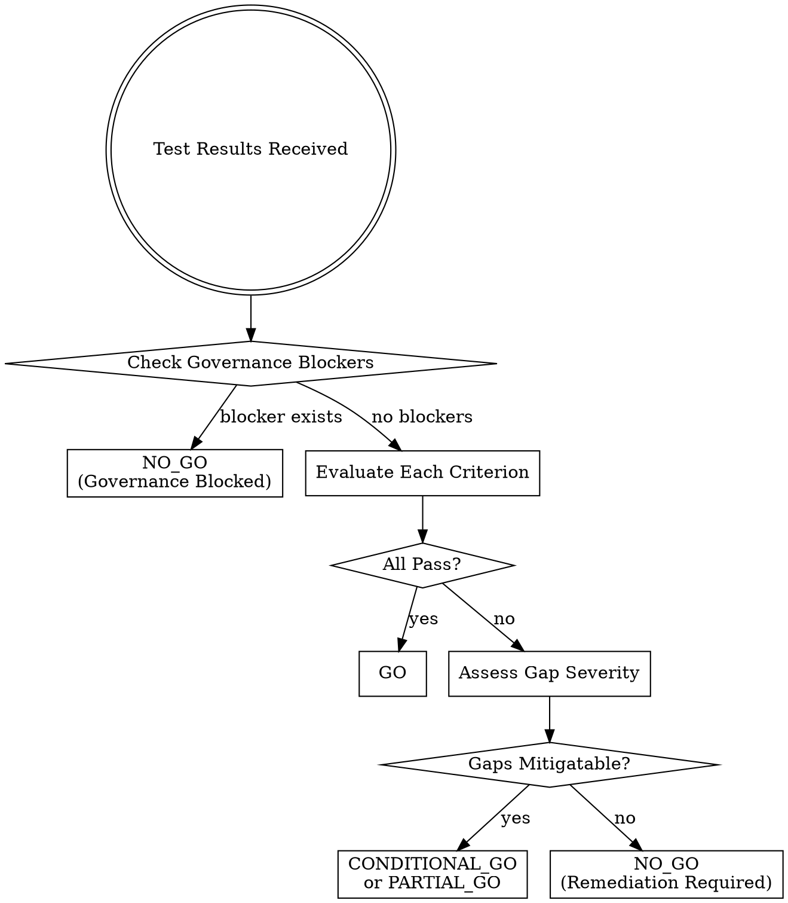

# Acceptance Gatekeeper

## Overview

Evaluate AI capability test results against acceptance criteria to determine production readiness. The goal is a defensible go/no-go decision that governance can approve and operations can act on.

**Core principle:** Check blockers first, then evaluate criteria, then assess if gaps are acceptable with mitigation.

## Verdict Categories

| Verdict | Meaning | Action |
|---------|---------|--------|
| GO | All criteria met, governance approved | Deploy to production |
| CONDITIONAL_GO | Gaps acceptable with documented mitigations | Deploy with restrictions/monitoring |
| PARTIAL_GO | Deploy for subset of scope | Production for passing scenarios only |
| NO_GO | Gaps too significant or governance blocked | Remediate before re-submission |

## Evaluation Flow



## Output Format

```yaml
acceptance_verdict:
  capability: "[Name]"
  version: "[Version tested]"
  overall: "[GO | CONDITIONAL_GO | PARTIAL_GO | NO_GO]"
  decision_date: "[YYYY-MM-DD]"
  valid_until: "[YYYY-MM-DD]"  # Re-evaluate if not deployed by this date

governance_gates:
  - gate: "[Gate name]"
    status: "[APPROVED | PENDING | REJECTED]"
    blocker: [true | false]
    action: "[Required action if blocking]"

criteria_evaluation:
  criterion_name:
    threshold: "[Required value]"
    actual: "[Measured value]"
    verdict: "[PASS | CONDITIONAL_PASS | FAIL]"
    gap: "[Difference if not passing]"
    gap_analysis: |
      [Detailed analysis of why gap exists]
    business_impact: |
      [Quantified impact: volume affected, $ cost, operational hours]
    mitigation:
      - "[Specific mitigation action]"
    residual_gap: "[Gap remaining after mitigation]"
    acceptable_with_mitigation: [true | false]

edge_cases:
  case_name:
    threshold: "[Required]"
    actual: "[Measured]"
    verdict: "[PASS | FAIL]"
    scope_impact: "[% of volume affected]"
    mitigation: "[How to handle]"

go_no_go:
  recommendation: "[GO | CONDITIONAL_GO | PARTIAL_GO | NO_GO]"
  rationale: |
    [Clear justification for decision]

  blockers_requiring_resolution:
    - "[Blocker and required action]"

  conditions_for_production:
    scope_restrictions:
      - restriction: "[What's excluded]"
        volume_impact: "[% of total]"
        handling: "[What happens to excluded items]"
    monitoring_requirements:
      - "[Specific monitoring requirement]"
    review_checkpoints:
      - "[When to re-evaluate]"
    rollback_triggers:
      - "[Condition that triggers rollback]"

  deployment_timeline:
    can_deploy: "[When/conditions]"
    estimated_date: "[If known]"

  escalation_path:
    if_business_requires_faster: "[Risk acceptance process]"
    exception_authority: "[Who can approve exceptions]"
    residual_risk_if_exception: "[What risk is being accepted]"
```

## Governance Gates

**Check these FIRST before evaluating technical criteria:**

| Gate | Typical Status | Blocker If |
|------|----------------|------------|
| Model Risk Management | PENDING/APPROVED | PENDING or REJECTED |
| Security Review | APPROVED | PENDING or REJECTED |
| Data Privacy Review | APPROVED | PENDING or REJECTED |
| Legal/Compliance | APPROVED | PENDING or REJECTED |
| Operations Sign-off | PENDING | Usually awaits acceptance |

```yaml
governance_gates:
  - gate: "Model Risk Management"
    status: "PENDING"
    blocker: true
    action: "Cannot deploy to production until MRM approval received"
```

**If any gate is a blocker, verdict is NO_GO regardless of test results.**

## Criterion Verdict Logic

For each acceptance criterion:

### PASS
- Actual meets or exceeds threshold
- No mitigation needed

### CONDITIONAL_PASS
- Actual within acceptable range of threshold (typically <5% gap)
- Gap addressable with operational mitigation
- Residual risk acceptable

### FAIL
- Actual significantly below threshold
- Gap not addressable without remediation
- Or edge case performance unacceptable

## Gap Analysis Framework

For each failing criterion:

### 1. Quantify the Gap
```yaml
gap: "-0.8%"  # 97.2% vs 98% threshold
```

### 2. Identify Root Cause
```yaml
gap_analysis: |
  Shortfall driven by:
  - Date format parsing: 2.1% error rate
  - Handwritten confirmations: 4.8% error rate
```

### 3. Calculate Business Impact
```yaml
business_impact: |
  At 5,000 confirmations/day:
  - Date errors: ~105 require manual correction
  - Handwritten: ~48 if 20% of volume
  - Operational cost: ~3 FTE-hours/day additional rework
```

### 4. Propose Mitigation
```yaml
mitigation:
  - "Route handwritten confirmations to manual queue"
  - "Add date format normalization preprocessing"
```

### 5. Assess Residual
```yaml
residual_gap: "0.3% after mitigations (97.2% → 97.8%)"
acceptable_with_mitigation: true
```

## Scope Restriction Quantification

When restricting scope, quantify the impact:

```yaml
scope_restrictions:
  - restriction: "Split fills excluded from automation"
    volume_impact: "~5% of daily volume"
    handling: "Route to manual processing queue"
  - restriction: "New counterparties (< 3 months) excluded"
    volume_impact: "~2% of daily volume"
    handling: "Manual processing with format logging for training"
```

**Total scope reduction:** Sum of exclusions = operational capacity needed.

## Escalation Path

Always document the exception process:

```yaml
escalation_path:
  if_business_requires_faster: |
    Executive risk acceptance memo required documenting:
    - Specific gaps being accepted
    - Business justification
    - Compensating controls
    - Review timeline
  exception_authority: "CRO + COO joint approval"
  residual_risk_if_exception: |
    Field extraction at 97.2% = ~40 additional errors/day
    Financial exposure: $X per error × 40 = $Y/day max
```

## Decision Validity

Decisions expire. Include validity period:

```yaml
decision_date: "2026-01-24"
valid_until: "2026-02-24"  # 30 days
```

**Why expiration matters:**
- Test results age
- Model performance can drift
- Requirements may change
- Governance approvals may expire

## Common Mistakes

| Mistake | Why It's Wrong | Do This Instead |
|---------|----------------|-----------------|
| "Close enough" without threshold | Subjective | Explicit pass/fail per criterion |
| Ignoring governance blockers | Can't deploy anyway | Check gates first |
| Aggregate accuracy only | Hides failure modes | Analyze each failure type |
| Binary pass/fail | Misses conditional paths | Evaluate mitigation options |
| No business impact | Stakeholders need context | Quantify in volume/$/hours |
| Mitigate without residual | Unknown remaining risk | Assess gap after mitigation |
| Point-in-time decision | Stale quickly | Include validity period |

## Red Flags in Your Output

If your evaluation has these, it's not ready:

- No governance gate check
- Passing without threshold comparison
- Gaps without quantification
- Mitigations without residual assessment
- No scope impact for restrictions
- Missing deployment conditions
- No escalation path

## Financial Services Context

Financial services acceptance requires:

### Regulatory Awareness
- Some capabilities have examination implications
- MRM approval is non-negotiable for model-based decisions
- Document decision rationale for audit

### Operational Readiness
- Operations sign-off typically follows acceptance decision
- Scope restrictions need operational capacity planning
- Rollback procedures must exist

### Risk Acceptance
- Exception authority is typically CRO/COO level
- Risk acceptance memos have retention requirements
- Residual risk must be quantified for acceptance

## Acceptance Checklist

Before issuing verdict:

- [ ] All governance gates checked (blockers identified)
- [ ] Each criterion evaluated with pass/fail
- [ ] Failing criteria have gap analysis
- [ ] Business impact quantified
- [ ] Mitigations proposed with residual assessment
- [ ] Scope restrictions quantified
- [ ] Monitoring requirements specified
- [ ] Rollback triggers defined
- [ ] Decision validity period set
- [ ] Escalation path documented

---
> Converted and distributed by [TomeVault](https://tomevault.io/claim/ethical-ai-syndicate) — claim your Tome and manage your conversions.
<!-- tomevault:4.0:skill_md:2026-04-13 -->
