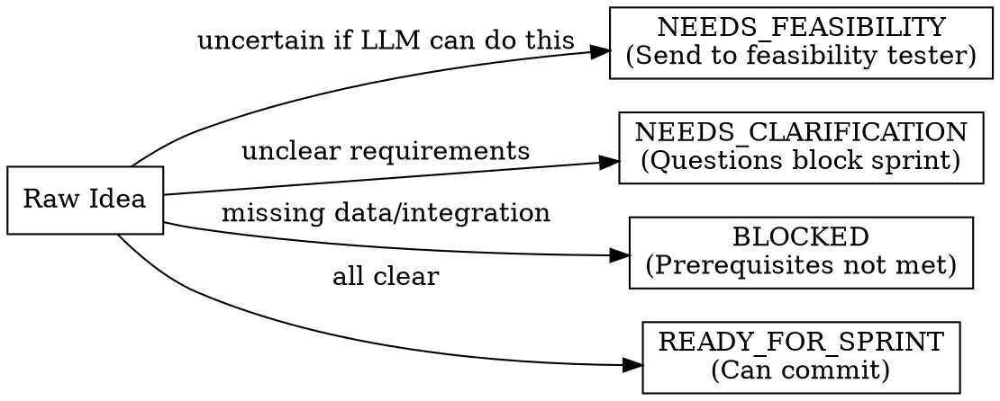

# AI Backlog Refiner

## Overview

Transform vague "AI should do X" requests into properly structured user stories with AI-specific requirements. The goal is a story that developers can estimate, sprint planners can commit to, and governance can approve.

**Core principle:** An AI story isn't ready for sprint until you can answer: "What accuracy is acceptable? What happens on low confidence? What data exists to train/evaluate this?"

## Refinement Status Categories

Every story MUST have a refinement status:



| Status | Meaning | Action |
|--------|---------|--------|
| READY_FOR_SPRINT | All acceptance criteria clear, data exists, integrations accessible | Can include in sprint planning |
| NEEDS_CLARIFICATION | Open questions block commitment | List questions, get answers first |
| NEEDS_FEASIBILITY | Uncertain if LLM can achieve required accuracy | Run through prompt-feasibility-tester |
| BLOCKED | Prerequisites not met | List blockers, cannot plan until resolved |

## Output Format

```yaml
story:
  id: "[PROJECT-XXX]"
  title: "[Concise capability name]"

  user_story:
    role: "[Who benefits]"
    capability: "[What they get]"
    value: "[Why it matters - specific, measurable]"

  acceptance_criteria:
    accuracy:
      - criterion: "[Specific metric]"
        threshold: "[Number]"
        measurement: "[How verified]"

    confidence_handling:
      high:
        threshold: "[≥ X.XX]"
        action: "[What happens]"
      medium:
        threshold: "[X.XX - Y.YY]"
        action: "[What happens]"
      low:
        threshold: "[< Z.ZZ]"
        action: "[What happens]"

    human_oversight:
      - "[Specific oversight requirement]"

    fallback_behavior:
      api_failure: "[What happens]"
      low_confidence: "[What happens]"
      unexpected_input: "[What happens]"
      edge_cases: "[What happens]"

  technical_requirements:
    input:
      format: "[What goes in]"
      constraints: "[Size limits, types]"
    output:
      format: "[What comes out]"
      schema: "[Structure]"
    latency: "[P95 requirement]"
    volume: "[Daily/hourly throughput]"
    integrations:
      - system: "[System name]"
        access: "[Read/Write]"
        status: "[Available/Needed]"

  data_requirements:
    training_data:
      source: "[Where from]"
      quantity: "[How much]"
      availability: "[Exists/Must create]"
      timeline: "[Weeks to obtain]"
    evaluation_set:
      size: "[Number of items]"
      ground_truth: "[Who provides labels]"
      availability: "[Exists/Must create]"
    ongoing:
      refresh_frequency: "[How often]"
      feedback_loop: "[How corrections flow back]"

  definition_of_done:
    metrics:
      - "[Specific metric with threshold]"
    testing:
      - "[Required test type]"
    governance:
      - "[Required approval]"

  refinement_status: [READY_FOR_SPRINT|NEEDS_CLARIFICATION|NEEDS_FEASIBILITY|BLOCKED]

  # If not READY_FOR_SPRINT:
  open_questions:
    - "[Question that must be answered]"
  blockers:
    - "[Thing that must be resolved]"
    timeline: "[Estimated time to unblock]"

  dependencies:
    must_exist_before_sprint:
      - "[Hard prerequisite]"
    can_parallel:
      - "[Can develop in parallel]"

  estimated_effort: "[Story points or T-shirt size]"
```

## AI-Specific Acceptance Criteria

Every AI story MUST address:

### 1. Accuracy Requirements
```yaml
accuracy:
  - criterion: "Classification accuracy"
    threshold: "≥ 98%"
    measurement: "On 1,000-item evaluation set"
  - criterion: "False positive rate"
    threshold: "≤ 0.5%"
    measurement: "Human audit of sample"
```

### 2. Confidence Handling (Required)
Force explicit handling for each tier:

| Tier | Threshold | Typical Actions |
|------|-----------|-----------------|
| HIGH | ≥ 0.95 | Auto-process, audit sample |
| MEDIUM | 0.80-0.94 | Route to human review |
| LOW | < 0.80 | Escalate, don't auto-process |

### 3. Human Oversight Model
- Who reviews AI decisions?
- What % are audited?
- How are overrides handled?

### 4. Fallback Behavior
```yaml
fallback_behavior:
  api_failure: "Queue for retry, alert after 3 failures"
  low_confidence: "Route to human queue"
  unexpected_input: "Reject with clear error, log for review"
  edge_cases: "Flag for senior review"
```

## Data Requirements Checklist

Don't accept "we'll get the data" - specify:

| Data Type | Must Answer |
|-----------|-------------|
| Training data | Source? Quantity? Exists or must create? Timeline? |
| Evaluation set | Size? Ground truth provider? Labeled? |
| Ongoing maintenance | Refresh frequency? Feedback mechanism? |

## Refinement Questions

Before marking READY_FOR_SPRINT, answer:

### Accuracy
- [ ] What error rate is acceptable?
- [ ] How is accuracy measured?
- [ ] Who provides ground truth?

### Confidence Handling
- [ ] What happens at high/medium/low confidence?
- [ ] Who reviews medium-confidence cases?
- [ ] What's the escalation path for low confidence?

### Human Oversight
- [ ] Who audits AI decisions?
- [ ] What % are manually reviewed?
- [ ] How are overrides tracked?

### Data
- [ ] Does training data exist or must be created?
- [ ] Is evaluation set available?
- [ ] Who labels ground truth?

### Integration
- [ ] Are required systems accessible?
- [ ] Are APIs available?
- [ ] Is test environment ready?

### Governance
- [ ] Does this require Model Risk review?
- [ ] Is legal/compliance sign-off needed?
- [ ] Are there regulatory implications?

## Common Mistakes

| Mistake | Why It's Wrong | Do This Instead |
|---------|----------------|-----------------|
| "AI should do X" | Vague value proposition | Specific measurable outcome |
| "Accuracy should be high" | No threshold | "≥ 98% on evaluation set" |
| "We'll review edge cases" | No structure | Define confidence tiers |
| "Data is available" | Unverified | Source, quantity, timeline |
| "Ready for sprint" | No checklist | Status with open questions |
| Binary confidence | Just high/low | Three tiers with actions |
| No fallback | Assumes success | Handle every failure mode |

## Financial Services Context

Financial services AI stories require:

### Regulatory Awareness
- Stories touching customer decisions need compliance review in DoD
- AML/fraud detection has specific model risk requirements
- Customer-facing AI may have fair lending implications

### Audit Requirements
- Every AI decision needs audit trail
- Explainability is a requirement, not nice-to-have
- Retention periods per FINRA Rule 4511 (6+ years)

### Model Risk Management
- Check if story requires MRM approval
- Include model documentation in DoD
- Plan for ongoing monitoring and drift detection

## Red Flags in Your Output

If your story has these, it's not ready:

- No accuracy threshold specified
- Confidence handling says "will define later"
- Data requirements say "we'll figure it out"
- Status is READY but open questions exist
- Human oversight model is "as needed"
- Fallback behavior not defined
- NEEDS_FEASIBILITY items not flagged

## Sprint Readiness Checklist

Before marking READY_FOR_SPRINT:

- [ ] All acceptance criteria have specific thresholds
- [ ] Confidence tiers have explicit actions
- [ ] Data requirements verified (exists, not assumed)
- [ ] Integration access confirmed (not "should be available")
- [ ] Governance requirements identified
- [ ] No open questions blocking commitment
- [ ] Estimated effort assigned
- [ ] Dependencies documented

---
> Converted and distributed by [TomeVault](https://tomevault.io/claim/ethical-ai-syndicate) — claim your Tome and manage your conversions.
<!-- tomevault:4.0:skill_md:2026-04-14 -->
