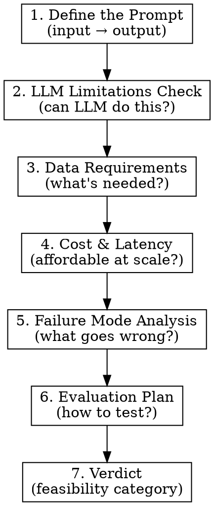

# Prompt Feasibility Tester

## Overview

Evaluate whether a proposed AI capability can actually work with current LLM technology before investing in development. The question isn't "can AI do something like this?" but "can we build a reliable prompt that does THIS specific task?"

**Core principle:** A capability is only feasible if you can describe the prompt that implements it. No prompt specification = no feasibility determination.

## The Evaluation Framework

Apply this framework to EVERY capability being evaluated:



## Step 1: Define the Prompt

**Before any analysis, specify what the prompt looks like:**

```yaml
prompt_specification:
  task: "[What the LLM is asked to do]"

  input_format:
    description: "[What goes into the prompt]"
    example: "[Concrete example]"
    size_estimate: "[Tokens/characters typical]"

  output_format:
    description: "[What the LLM produces]"
    schema: "[Structured format if applicable]"

  system_instructions: |
    [Draft of what the system prompt would say]

  example_exchange:
    user: "[Sample input]"
    assistant: "[Expected output]"
```

**If you can't write the prompt specification, the capability isn't well-defined enough to evaluate.**

## Step 2: LLM Limitations Check

**Score each limitation factor:**

| Factor | Question | RED FLAG if... |
|--------|----------|----------------|
| **Context Length** | Does input fit in context? | Input > 100K tokens typical |
| **Output Structure** | Is output reliably formatted? | Complex nested JSON required |
| **Consistency** | Same input → same output? | Exact match required every time |
| **Hallucination Risk** | Can LLM fabricate plausible errors? | Output must be factually perfect |
| **Latency** | Is response time acceptable? | <500ms required |
| **Reasoning Depth** | How many reasoning steps? | >5 dependent steps |

**For each factor, determine:**
- GREEN: LLM handles this well
- YELLOW: Possible with careful prompting/constraints
- RED: Fundamental limitation, requires workaround or different approach

## Step 3: Data Requirements

**What's needed to make this work?**

```yaml
data_requirements:
  training_data:
    needed: [yes/no]
    type: "[Fine-tuning, few-shot examples, RAG corpus]"
    quantity: "[How much]"
    availability: "[Exists/must create]"

  few_shot_examples:
    per_category: "[How many examples per case type]"
    coverage: "[What variation must examples cover]"

  retrieval_corpus:
    needed: [yes/no]
    content: "[What documents/data]"
    size: "[Approximate]"
    update_frequency: "[How often refreshed]"

  labeled_evaluation_set:
    needed: [yes]  # Always yes
    size: "[Minimum for statistical significance]"
    source: "[Where does ground truth come from]"
```

## Step 4: Cost & Latency Model

**Calculate operational reality:**

```yaml
cost_model:
  per_request:
    input_tokens: "[Estimate]"
    output_tokens: "[Estimate]"
    model: "[Which model needed]"
    cost_per_request: "[$ amount]"

  at_scale:
    daily_volume: "[From requirements]"
    daily_cost: "[$ amount]"
    monthly_cost: "[$ amount]"

  latency:
    expected_p50: "[ms]"
    expected_p99: "[ms]"
    acceptable_latency: "[From requirements]"
    meets_requirement: [yes/no]
```

## Step 5: Failure Mode Analysis

**What specific errors are likely?**

| Failure Mode | Likelihood | Detection | Impact | Mitigation |
|--------------|------------|-----------|--------|------------|
| [Specific error type] | [H/M/L] | [How we know] | [What happens] | [Prevention/recovery] |

**Common LLM failure modes to consider:**
- **Format violation:** Output doesn't match expected schema
- **Hallucination:** Fabricated facts/numbers
- **Omission:** Missing required fields
- **Inconsistency:** Different answers for same input
- **Boundary errors:** Wrong behavior at thresholds
- **Context overflow:** Input too long, truncated
- **Refusal:** Model declines task
- **Partial completion:** Stops mid-output

## Step 6: Evaluation Plan

**How do we know if this works?**

```yaml
evaluation_plan:
  benchmark_dataset:
    source: "[Where from]"
    size: "[N items]"
    ground_truth: "[How established]"

  metrics:
    primary: "[Main success metric]"
    threshold: "[Go/no-go value]"
    secondary: ["[Other metrics to track]"]

  test_protocol:
    methodology: "[How to run test]"
    sample_size: "[For statistical significance]"
    success_criteria: "[What determines pass/fail]"

  pilot_recommendation:
    scope: "[What to test first]"
    duration: "[How long]"
    decision_point: "[When to decide build vs no-build]"
```

## Step 7: Verdict Categories

**Classify feasibility:**

| Category | Criteria | Action |
|----------|----------|--------|
| **FEASIBLE** | All factors GREEN, data available, cost acceptable | Build with standard process |
| **FEASIBLE_WITH_CONSTRAINTS** | Some YELLOW factors, mitigations clear | Build with guardrails documented |
| **PROTOTYPE_FIRST** | Uncertain factors, evaluation needed | Build evaluation benchmark, test before committing |
| **NOT_FEASIBLE_AS_SPECIFIED** | RED factors present, but alternative exists | Redesign capability, then re-evaluate |
| **NOT_FEASIBLE** | Fundamental mismatch with LLM capabilities | Don't build with LLMs |

## Output Format

```yaml
capability: "[Name]"

prompt_specification:
  task: "[Task description]"
  input_format: "[What goes in]"
  output_format: "[What comes out]"
  example_prompt: |
    [Actual prompt draft]

llm_limitations:
  context_length: [GREEN|YELLOW|RED]
  output_structure: [GREEN|YELLOW|RED]
  consistency: [GREEN|YELLOW|RED]
  hallucination_risk: [GREEN|YELLOW|RED]
  latency: [GREEN|YELLOW|RED]
  reasoning_depth: [GREEN|YELLOW|RED]
  notes: "[Explanation of any YELLOW/RED]"

data_requirements:
  training_data: "[Specification]"
  few_shot_examples: "[Specification]"
  retrieval_corpus: "[Specification]"
  labeled_evaluation_set: "[Specification]"
  availability_assessment: "[What exists vs needs creation]"

cost_model:
  per_request_cost: "$X.XX"
  monthly_cost_at_scale: "$X,XXX"
  latency_assessment: "[Meets/doesn't meet requirements]"

failure_modes:
  - mode: "[Error type]"
    likelihood: [H|M|L]
    detection: "[Method]"
    impact: "[Consequence]"
    mitigation: "[Prevention/recovery]"

evaluation_plan:
  benchmark: "[Dataset description]"
  primary_metric: "[Metric name]"
  success_threshold: "[Value]"
  pilot_recommendation: "[Scope and duration]"

verdict: [FEASIBLE|FEASIBLE_WITH_CONSTRAINTS|PROTOTYPE_FIRST|NOT_FEASIBLE_AS_SPECIFIED|NOT_FEASIBLE]
verdict_rationale: "[Why this category]"
constraints: ["[If FEASIBLE_WITH_CONSTRAINTS, list constraints]"]
alternative: "[If NOT_FEASIBLE_AS_SPECIFIED, describe alternative approach]"
```

## Common Mistakes

| Mistake | Why It's Wrong | Do This Instead |
|---------|----------------|-----------------|
| "LLMs can do text tasks" | Generic claim, no prompt specification | Write the actual prompt |
| No hallucination analysis | Financial services can't tolerate fabrication | Identify specific hallucination risks |
| Ignoring consistency needs | "Works sometimes" isn't production-ready | Test consistency across runs |
| Cost not calculated | Enterprise scale changes everything | Calculate monthly cost at volume |
| No evaluation methodology | "We'll see if it works" isn't engineering | Define benchmark and threshold before building |
| Binary yes/no verdict | Reality is nuanced | Use feasibility categories |

## Red Flags in Your Analysis

If your output has these, you're not done:

- No prompt specification written
- All factors marked GREEN without justification
- "LLMs are good at this" without specific evidence
- No failure modes identified
- No cost estimate at scale
- No evaluation plan
- FEASIBLE verdict with no constraints mentioned for regulated use case

## Financial Services Context

Financial services feasibility requires extra scrutiny:

- **Hallucination = regulatory risk:** Fabricated numbers in filings, wrong AML classifications
- **Consistency = audit requirement:** Same input must produce same output for examination
- **Explainability = compliance need:** Must explain why AI made decision
- **Error tolerance = financial exposure:** Calculate dollar impact of error rates

**Default to PROTOTYPE_FIRST for any capability touching:**
- Regulatory filings
- AML/fraud detection
- Customer-facing decisions
- Financial calculations

---
> Converted and distributed by [TomeVault](https://tomevault.io/claim/ethical-ai-syndicate) — claim your Tome and manage your conversions.
<!-- tomevault:4.0:skill_md:2026-04-15 -->
