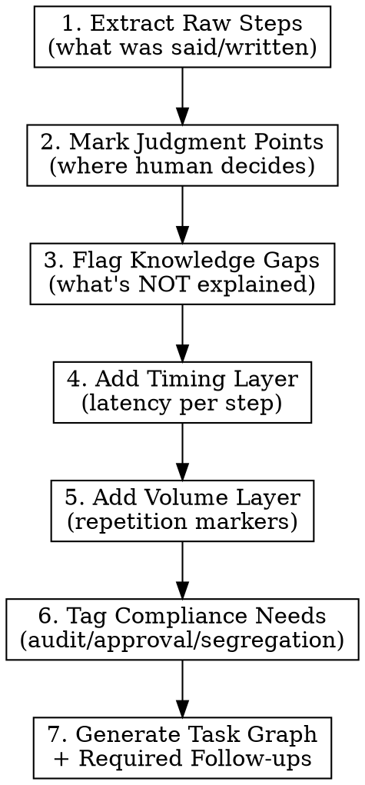

# Workflow Decomposer

## Overview

Turn human process descriptions into machine-readable task graphs that expose what's actually happening - including the judgment calls, timing bottlenecks, and undocumented expertise that determine where agents can safely operate.

**Core principle:** Expose what's unknown, not just what's stated. A good decomposition reveals gaps in understanding as clearly as it documents the happy path.

## When to Use

- SME interview transcript needs structuring
- SOP document needs automation analysis
- Shadowing notes need systematization
- Evaluating where AI agents can assist regulated workflows
- Justifying automation boundaries to compliance

## The Decomposition Process



**Do NOT skip steps.** The value is in steps 2-6, not just step 1.

## Step Details

### 1. Extract Raw Steps
List every action mentioned, in sequence. Don't interpret yet.

### 2. Mark Judgment Points (CRITICAL)

Look for these signals in the source material:

| Signal Phrase | What It Means |
|---------------|---------------|
| "I just know..." | Undocumented expertise |
| "It depends..." | Hidden decision tree |
| "Usually..." / "Sometimes..." | Exception paths exist |
| "If it's serious..." | Severity classification needed |
| "I check..." (without criteria) | Implicit validation rules |
| "The right one" / "appropriate" | Selection criteria undefined |

**For each judgment point, document:**
- What decision is being made
- What information the human uses
- What the decision criteria ARE (or flag as UNKNOWN)
- Whether criteria could be codified

### 3. Flag Knowledge Gaps

Create explicit `GAPS` section listing:
- Processes mentioned but not explained
- Decision criteria not specified
- Exception handling not described
- "Shortcuts" or optimizations mentioned but not detailed

**Each gap becomes a required follow-up question.**

### 4. Add Timing Layer

For EACH step, estimate or flag:
- **Work time**: Actual human effort
- **Wait time**: System response, approvals, external parties
- **Variability**: Normal vs exception case timing

The SME saying "could be an hour" is not enough - WHERE does that hour go?

### 5. Add Volume/Repetition Markers

Flag steps that are:
- High-frequency (many times per day/week)
- Batch-able (similar items grouped)
- Seasonal (month-end, quarter-end spikes)

**Repetitive + deterministic = automation candidate.**

### 6. Tag Compliance Requirements

For regulated environments, mark:
- **Audit trail**: Must log who/what/when
- **Approval**: Requires sign-off (by whom? threshold?)
- **Four eyes**: Requires independent verification
- **Segregation**: Cannot be done by same person as step X

## Output Format

```yaml
workflow:
  name: [Process Name]
  source: [interview/sop/shadowing]
  source_date: [when captured]

  steps:
    - id: step_1
      name: [Action Name]
      type: [action/decision/validation/system_action]
      inputs: [what's needed]
      outputs: [what's produced]

      # REQUIRED for decision/validation types
      judgment:
        decision: [what's being decided]
        criteria: [how it's decided, or "UNKNOWN - requires follow-up"]
        codifiable: [yes/no/partial]

      timing:
        work_time: [estimate or "UNKNOWN"]
        wait_time: [estimate or "UNKNOWN"]
        exception_multiplier: [Nx normal, or "UNKNOWN"]

      volume:
        frequency: [per day/week/month]
        batch_potential: [yes/no]
        peak_periods: [when volume spikes]

      compliance:
        audit_required: [yes/no]
        approval_required: [yes/no, by whom]
        segregation: [cannot follow step X]

      automation_assessment:
        level: [full/assisted/human_required]
        blockers: [what prevents automation]

  gaps:
    - id: gap_1
      description: [what's not explained]
      source_quote: [verbatim from input]
      follow_up_question: [specific question to ask]
      blocking: [yes/no - can we proceed without this?]
```

## Automation Assessment Rules

**Do NOT assess automation potential for a step until:**
1. The process for that step is documented (not just mentioned)
2. Decision criteria are defined (not UNKNOWN)
3. Inputs and outputs are specified

**If any blocking gap exists for a step:**
```yaml
automation_assessment:
  level: BLOCKED
  blocker: "GAP-X: [description]"
  prerequisite: "Resolve gap before assessment"
```

Do not speculate about automation potential for undefined processes. "UNKNOWN" and "BLOCKED" are valid, honest outputs.

## Common Mistakes

| Mistake | Why It's Wrong | Do This Instead |
|---------|----------------|-----------------|
| Skipping judgment identification | Can't automate what you can't define | Mark EVERY "it depends" moment |
| Accepting "it varies" as timing | Useless for optimization | Demand per-step breakdown |
| Glossing over "different process" | Hides complexity | Flag as blocking gap |
| Jumping to automation recommendations | Premature without full picture | Complete decomposition first |
| Assuming system steps are simple | Integration complexity hidden | Verify with technical SME |
| Assessing automation for undefined steps | False confidence | Mark as BLOCKED until process documented |

## Red Flags in Your Output

If your decomposition has these, you're not done:

- Steps without timing estimates (even rough ones)
- Decision steps without documented criteria
- "To be determined" or "varies" without follow-up flagged
- Gaps section is empty (there are ALWAYS gaps)
- No compliance tags in regulated workflow
- Automation assessment without blockers listed

## Rationalizations to Avoid

| Excuse | Reality |
|--------|---------|
| "The process is probably straightforward" | You don't know until it's documented |
| "This is likely automatable" | Can't assess what you haven't defined |
| "Standard system integration" | Every integration has hidden complexity |
| "I'll note it for follow-up" | Note it AND mark assessment as BLOCKED |
| "Common in the industry" | Their specific process may differ |

## Financial Services Context

This skill justifies where agents can safely take over without destabilizing regulated workflows:

1. **If judgment criteria can't be codified** → Human stays in loop
2. **If compliance requires audit trail** → Agent must log everything
3. **If timing is dominated by wait time** → Agent can't help much
4. **If volume is high AND logic is deterministic** → Prime automation target

The output should make these tradeoffs explicit and defensible to compliance.

---
> Converted and distributed by [TomeVault](https://tomevault.io/claim/ethical-ai-syndicate) — claim your Tome and manage your conversions.
<!-- tomevault:4.0:skill_md:2026-04-16 -->
