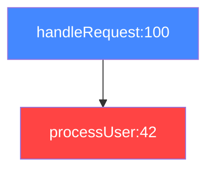

# UltraCode Tracing — Claude Code Skill

**Auto-activated for**: Debugging, "why not called", flow analysis, state dependencies, stacktrace diagnosis

Static analysis of code execution flow without running the code.

## When to Use

| Question | Tool | Returns |
|----------|------|---------|
| "Parse this stacktrace / crash log" | `analyze_stacktrace` | Error category, crash location, call chain, fixes |
| "How does code get from A to B?" | `trace_flow` | Paths, states, conditions, Mermaid |
| "Why isn't this method called?" | `trace_backwards` | Callers, blocking conditions, diagnosis |
| "How does data affect state?" | `trace_data_flow` | Sources, transformations, behavior matrix |
| "What changes with different values?" | `analyze_state_impact` | Scenarios, conflicts, ripple effects |
| "What conditions affect this scenario?" | `find_decision_points` | Decision points with classification |

---

## analyze_stacktrace — Diagnose Errors

Parse and diagnose stacktraces from **8 languages**. Auto-detects language, resolves frames to code graph entities, classifies errors, runs backwards trace and impact analysis.

```typescript
analyze_stacktrace({
  stacktrace: `TypeError: Cannot read property 'name' of undefined
    at processUser (src/users.ts:42:15)
    at handleRequest (src/server.ts:100:5)`,
  format: "text"
})
```

**Supported**: JS/TS (V8/Node), Python traceback, Java/Kotlin (Caused by chains), C#/.NET, Go goroutine panics, Rust panic/RUST_BACKTRACE, C/C++ (GDB/ASAN/macOS), Zig error traces.

**Returns:**
- Error category (null_reference, type_error, io_error, memory_error, concurrency_error, etc.)
- Severity (critical/high/medium/low)
- Crash location with entity binding
- Call chain with resolved/unresolved status
- Backwards trace (callers, blocking conditions)
- Impact analysis (affected entities, risk score)
- Missing checks and suggested fixes
- Mermaid flowchart of call chain

| Param | Type | Default | Description |
|-------|------|---------|-------------|
| `stacktrace` | string | **required** | Full stacktrace text |
| `language` | enum | auto | `javascript` / `python` / `java` / `csharp` / `go` / `rust` / `c/c++` / `zig` |
| `depth` | number | 10 | Max backwards trace depth |
| `includeImpactAnalysis` | boolean | true | Run impact analysis on crash entity |
| `includeBackwardsTrace` | boolean | true | Run backwards trace from crash point |
| `format` | enum | "text" | `text` / `json` / `mermaid` |
| `highlightRecentChanges` | boolean | false | Annotate crash/call chain entities with recently-changed status + entity history for crash point |
| `recentCommitsCount` | number | 10 | Number of recent commits to consider |

### Error Categories

| Category | Examples |
|----------|---------|
| `null_reference` | TypeError, NullPointerException, nil pointer dereference |
| `type_error` | ClassCastException, type assertion failed |
| `index_out_of_bounds` | IndexError, slice bounds out of range |
| `io_error` | ENOENT, FileNotFoundError |
| `network_error` | ECONNREFUSED, fetch failed |
| `memory_error` | OutOfMemoryError, SIGSEGV, stack overflow |
| `concurrency_error` | deadlock, ConcurrentModificationException |
| `timeout_error` | ETIMEDOUT, deadline exceeded |
| `import_error` | ModuleNotFoundError, cannot find module |
| `permission_error` | EPERM, access denied |

---

## trace_flow — Trace from A to B

Find all execution paths between two points:

```typescript
trace_flow({
  from: "handleLogin",
  to: "redirectToHome",
  trackStates: true,
  trackConditions: true,
  maxDepth: 15,
  format: "mermaid"
})
```

**Returns:**
- Paths with confidence scores
- State changes at each step
- Conditions and branches
- Mermaid sequence diagram

---

## trace_backwards — Why Not Called?

Understand why a method isn't being called:

```typescript
trace_backwards({
  target: "FinishTask",
  question: "why_not_called",
  depth: 15,
  includeStates: true
})
```

**Question types:**
- `why_not_called` — find blocking conditions
- `what_affects` — all dependencies
- `dependencies` — full dependency graph

**Returns:**
- Callers with probability (always/conditional/rare)
- Blocking conditions with recommendations
- State dependencies
- Call chains
- Diagnosis with suggested debug points

---

## trace_data_flow — Data Flow

Trace how data affects target state:

```typescript
trace_data_flow({
  entryPoint: "AppInit",
  targetState: "startPage",
  dataSources: ["config", "api:fetchUser"],
  trackTransformations: true,
  highlightRecentChanges: true  // annotate steps with recently-changed entities
})
```

**Returns:**
- Data flows from sources
- Transformations (parse, map, validate)
- Branches based on data
- Behavior matrix for different inputs
- `recentChangeSummary` — recently modified entities in the flow (with `highlightRecentChanges`)

---

## analyze_state_impact — State Impact

Understand how state affects different scenarios:

```typescript
analyze_state_impact({
  state: "user.isAuthenticated",
  scenarios: [
    { value: true, label: "logged in" },
    { value: false, label: "logged out" }
  ],
  highlightRecentChanges: true  // annotate usages with recently-changed status
})
```

**Returns:**
- All state usages (read/write/condition)
- Available and blocked paths per scenario
- Conflicts (multiple writers, race conditions)
- Ripple effects (direct and indirect)
- `recentChangeSummary` — recently modified entities (with `highlightRecentChanges`)

---

## find_decision_points — Decision Points

Find all places where code makes decisions:

```typescript
find_decision_points({
  scenario: "checkout flow",
  includeGuards: true,
  groupBy: "impact",
  highlightRecentChanges: true  // annotate with recently-changed status
})
```

**Decision types:** validation, api_response, state_mutation, guard, loop, error_handling, feature_flag

**Impact levels:** critical, high, medium, low

---

## Usage Examples

### Diagnosing a Crash

```typescript
// Step 1: Parse the stacktrace
analyze_stacktrace({
  stacktrace: `NullPointerException: ...
    at com.app.UserService.getProfile(UserService.java:42)
    at com.app.Controller.handle(Controller.java:15)`,
  format: "text"
})
// -> Category: null_reference, Severity: high
// -> Crash: UserService.getProfile at line 42
// -> Fix: Add null check before accessing property

// Step 2: Trace backwards from crash point
trace_backwards({
  target: "UserService.getProfile",
  question: "what_affects"
})
// -> Callers: Controller.handle, ScheduledJob.run
// -> Blocking: user == null when called from ScheduledJob
```

### Debugging: Why Doesn't It Fire?

```typescript
trace_backwards({
  target: "sendNotification",
  question: "why_not_called"
})
// -> Finds: "user.preferences.notifications === false" blocks

analyze_state_impact({
  state: "user.preferences.notifications",
  scenarios: [
    { value: true, label: "enabled" },
    { value: false, label: "disabled" }
  ]
})
```

### Understanding Data Flow

```typescript
trace_data_flow({
  entryPoint: "loadDashboard",
  targetState: "dashboardData"
})
// -> Shows: API -> parse -> validate -> setState
// -> Matrix: if API error -> fallback state
```

---

## Output Formats

### Text (default)
```
=== Stacktrace Diagnosis ===
HIGH: TypeError: Cannot read property 'name' of undefined
Category: null_reference
Frames: 5 total, 3 resolved

--- Crash Point ---
  processUser (src/users.ts:42)

--- Suggested Fixes ---
  [high] Add null/undefined check before accessing property
```

### Mermaid


---

## Recent Changes Context (Prolly Tree)

All 6 tracing tools support `highlightRecentChanges=true` to cross-reference results with Prolly Tree commit history:
- **`recentChangeSummary`** added to output with recently modified/added entities
- **`recentlyChanged: true`** annotated on individual steps/callers/decision points
- **`analyze_stacktrace`** additionally retrieves `crashPointHistory` — last 3 commits for the crash entity
- **Graceful degradation** — works without errors if Prolly Tree is unavailable

## Tool Reference

| Tool | Key Params |
|------|-----------|
| `analyze_stacktrace` | `stacktrace` (required), `language`, `format`, `depth`, `highlightRecentChanges` |
| `trace_flow` | `from` + `to` (required), `format`, `maxDepth`, `trackStates`, `highlightRecentChanges` |
| `trace_backwards` | `target` + `question` (required), `depth`, `includeStates`, `highlightRecentChanges` |
| `trace_data_flow` | `entryPoint` + `targetState` (required), `dataSources`, `highlightRecentChanges` |
| `analyze_state_impact` | `state` + `scenarios` (required), `scope`, `highlightRecentChanges` |
| `find_decision_points` | `scenario` (required), `groupBy`, `includeGuards`, `highlightRecentChanges` |

---

## Related Skills

- **`ultracode`** — Code analysis, semantic search, refactoring, code modification, security
- **`ultracode-autodoc`** — Working with `.autodoc/` directory

---
> Converted and distributed by [TomeVault](https://tomevault.io/claim/faxenoff) — claim your Tome and manage your conversions.
<!-- tomevault:4.0:skill_md:2026-04-11 -->
