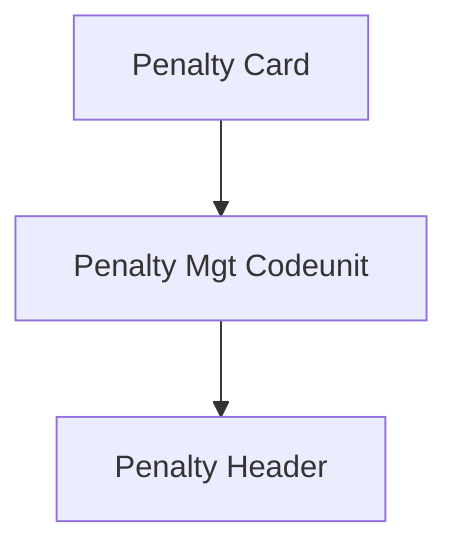

# Markdown to DOCX Converter with Template (Python)

## Overview

Converts markdown (.md) files to professionally formatted Word documents (.docx) using **Python** and the **python-docx** library. The conversion pipeline works in three stages:

1. **Parse** the markdown file into named sections (metadata fields + H2 body sections)
2. **Generate a JSON file** containing all extracted sections as key-value pairs
3. **Substitute `{{Placeholder}}` tokens** in the Word template with the corresponding JSON values

**The conversion is only considered complete when the custom template is applied and all placeholders are substituted.** The template ensures consistent branding, styles, headers, footers, and formatting across all generated documents.

## Agent Instructions

When asked to convert a markdown file to a Word document, follow this checklist in order:

1. **Validate** — Confirm `python-docx` is installed and the source `.md` file exists.
2. **List templates** — Run `--list-templates` to show available templates. If only one template exists, it is auto-selected (skip step 3).
3. **Ask user** — Present the available templates and ask the user to select one.
4. **Run** — Execute `convert_md_to_docx.py <markdown_path> --template <selection>`.
5. **Verify** — Confirm the `.docx` file was created and is at least 20 KB.
6. **Report** — Tell the user the output file path and confirm all placeholders were substituted.

> For CLI flags, JSON schema, field maps, examples, and error handling, see the reference sections below.

## Prerequisites

- **Python 3.10+** installed and available in the system PATH
- **python-docx** library — install via:
  ```bash
  pip install -r .github\skills\documentation-bc-md-to-docx-converter\scripts\requirements.txt
  ```
  or directly:
  ```bash
  pip install python-docx
  ```
- **Template files**: bundled in the skill's `templates/` folder (`1_UserStory_Template.docx`, `2_Spec_Template.docx`, `3_Analysis_Template.docx`, `4_Architecture_Template.docx`, `5_CCN_Template.docx`, `6_ReleaseNote_Template.docx`)
  - The template must contain `{{Placeholder}}` tokens in paragraphs, tables, headers, or footers that will be replaced with values from the parsed markdown
- **(Optional) Mermaid CLI** — only required when the source markdown contains `<!-- DIAGRAM: mermaid ... -->` markers (emitted by the `documentation-bc-ccn-generator` skill) and you want them rendered as inline images. Install once globally:
  ```bash
  npm install -g @mermaid-js/mermaid-cli
  ```
  After installation, `mmdc` must be on PATH. When `mmdc` is missing the converter still succeeds but each diagram is inserted as its plain-text fallback with a `[Diagram: <name> (<type>)]` label and a warning is printed.

## Quick Start

### Step 0: Install Python Dependencies

```bash
pip install -r .github\skills\documentation-bc-md-to-docx-converter\scripts\requirements.txt
```

### Step 1: List Available Templates

```bash
python .github\skills\documentation-bc-md-to-docx-converter\scripts\convert_md_to_docx.py --list-templates
```

This will display all available templates in the `templates/` folder with their index numbers.

### Step 2: Run the Converter with a Selected Template

```bash
python .github\skills\documentation-bc-md-to-docx-converter\scripts\convert_md_to_docx.py "docs\releasenotesmd\Release_Note_DSD-1234_Test_Customer_123456.md" --template 1
```

> **Note (macOS/Linux):** Replace backslashes with forward slashes in paths and line-continuation characters (`^`).

This will:
1. Parse the markdown into sections
2. Create a `.json` file alongside the output with all section values
3. Open the selected template, replace all `{{Placeholder}}` tokens, and save the `.docx`

## How the Pipeline Works

### Field Map Configuration

The converter uses a **unified field map registry** shared across every
`documentation-bc-*` skill at:

```
.github/skills/shared/unified-field-map.json
```

This JSON file is the **single source of truth** for all documentation
artefacts (USERSTORY, SPEC, ANALYSIS, ARCHITECTURE, CCN, PLAN,
RELEASENOTE). Each artefact entry contains pointers to:

- A reference markdown template under
  `.github/skills/documentation-bc-*-generator/references/*-template.md`
- A schema describing `frontmatterFields`, `metadataFields`, `sections`,
  plus `labelLocales` / `displayHeadingLocales` for multi-language output
- A canonical Word template (`templateHint` → filename in `templates/`)
- Detection metadata (`idPattern`, `filePattern`, `headingPattern`,
  `headingKey`, `extraMetadataKeys`)

**Detection order for `parse_markdown()`:**
1. Frontmatter `template:` value matched to a registered template filename.
2. Frontmatter `id:` matched against the artefact's `idPattern`.
3. Filename matched against the artefact's `filePattern`.

**Language resolution:** the converter selects the locale used to fill
`{{Label_<Key>}}` and `{{Label_Section_<Key>}}` placeholders in this
order: `--language` CLI flag → frontmatter `language:` field → `"en"`.

**To add new fields, sections, or languages:** edit the artefact's
schema entry in `unified-field-map.json` and add the matching
`{{Placeholder}}` in the Word template. No code changes required.

### Stage 1: Parse Markdown → Sections Dict

The script reads the markdown and extracts fields based on the resolved
artefact schema:

| Source | JSON Key | Driven By |
|--------|----------|----------|
| YAML frontmatter fields | `frontmatterFields[].key` (via `yamlKey`) | `unified-field-map.json` |
| H1 heading capture group | `headingKey` | `unified-field-map.json` (`headingPattern`) |
| Metadata table rows `\| **Label** \| Value \|` | `metadataFields[].key` / `extraMetadataKeys` entries | `unified-field-map.json` |
| `## Heading` sections via `<!-- section-key: <Key> -->` anchors | `<Key>` from the anchor (PascalCase) | Reference template anchors + `sections[]` |
| `Label_<Key>` / `Label_Section_<Key>` localised labels | `resolve_label()` using `labelLocales[lang]` | `unified-field-map.json` + `--language` |

Any `## Heading` without a section-key anchor is still captured using a
PascalCase key derived from the heading text.

### Stage 2: Write JSON File

A JSON file is created next to the output `.docx` with the same base name:

```json
{
  "CustomerName": "Test Customer 123456",
  "CCNNr": "DSD-1234",
  "Version": "1.0.0.0",
  "ChangeRequestDetails": "Implementation of the BC Dataverse...",
  "TestingSteps": "1. Open the **CDS Countries** list page..."
}
```

If any `<!-- DIAGRAM: mermaid type="..." name="<name>" -->...<!-- /DIAGRAM -->` marker block was found inside an H2 section body, the body text keeps a `{{DIAGRAM:<name>}}` token where the marker was and a top-level `_diagrams` entry is added to the JSON:

```json
{
  "ArchitectureSolutionFromARCHNNN": "... prose ... {{DIAGRAM:component-view}} ... more prose ...",
  "_diagrams": {
    "component-view": {
      "type": "flowchart",
      "name": "component-view",
      "mermaid": "flowchart TD\n  A --> B\n  ...",
      "fallback": "<ASCII art kept verbatim from the marker block>"
    }
  }
}
```

The `_diagrams` key is reserved — never use it as a placeholder name. The JSON file is the single source of truth: editing `mermaid` source there and re-running the substitution stage is enough to update the diagram in the docx (no markdown changes needed).

### Stage 3: Substitute Placeholders in Template

The script opens the `.dotx/.docx` template and searches for `{{Key}}` placeholders in:

- **Body paragraphs** (all runs are joined, substituted, then rewritten)
- **Body tables** (every cell in every row, including nested tables — in cells with rich formatting, all runs are joined into a single run using the first run's formatting before substitution; rich formatting within the placeholder span is not preserved)
- **Headers and footers** (all section headers/footers including first-page and even-page variants)

Each `{{Key}}` token is replaced with the value from the JSON sections dict. If a key is not found in the JSON, the placeholder is left unchanged.

After `{{Key}}` substitution, any `{{DIAGRAM:<name>}}` tokens that landed inside the resulting text are processed in a second pass per-paragraph:

1. The corresponding entry is looked up in `_diagrams`.
2. Its `mermaid` source is written to a temp file and rendered to PNG via `mmdc -i <src>.mmd -o <out>.png -b white --quiet`.
3. The token is replaced **in place** with an inline picture run sized to 6.0 inches wide (Inches(6)); surrounding text on the same line is preserved.
4. Rendered PNGs are cached per-run keyed by the mermaid source, so repeating a diagram costs nothing extra.
5. If `mmdc` is not installed, the mermaid source is empty, rendering fails, or `mmdc` times out (30-second limit), the token is replaced with a `[Diagram: <name> (<type>)]` label followed by the diagram's `fallback` text and a warning is printed (`[WARNING] Mermaid render timed out for <name>` on timeout). The conversion does **not** fail.

#### Bare ` ```mermaid ``` ` fences

In addition to the explicit `<!-- DIAGRAM: mermaid ... -->` marker pair, any **bare** triple-backtick ` ```mermaid ``` ` fence found inside an H2 section body is auto-promoted to a synthetic diagram entry. The fence is extracted, given a generated name (`auto-mermaid-1`, `auto-mermaid-2`, …), its first non-empty source line is used to derive the diagram `type` (`flowchart`, `erDiagram`, `sequenceDiagram`, …), and a `{{DIAGRAM:auto-mermaid-N}}` token is left in the body. From there it follows the exact same render-or-fallback path as a marker-delimited diagram. This lets generator skills emit plain Mermaid code blocks without forcing markers, while preserving deterministic JSON keys.

#### Inline `` images

Inline markdown images of the form `` found in any H2 section body are extracted into `sections["_images"]` and replaced with a `{{IMAGE:<auto-img-N>}}` token. During substitution the token is rendered as an inline picture sized to 6.0 inches wide. Path resolution order:

1. Relative to the markdown file's parent directory.
2. Relative to the repo root (the workspace folder containing the converter).

If neither resolution succeeds, the original `` markdown is left in place untouched and a `[WARNING] Image not found, leaving as text` line is printed. URLs (`http://`, `https://`) and `data:` URIs are not downloaded and are also left as text. Like `_diagrams`, the `_images` key is reserved — never use it as a placeholder name.

#### Placeholder Format

Use double curly braces with the exact PascalCase key: `{{CustomerName}}`, `{{CCNNr}}`, `{{ChangeRequestDetails}}`, etc. Keys map directly to the JSON output from Stage 2. Unmatched placeholders are left unchanged.

#### Markdown-aware section body rendering

When a placeholder's substituted value contains block-level markdown (detected by the presence of fenced code blocks, GFM pipe tables, ordered/unordered list items, ATX headings, or a blank-line separator), the converter does **not** flatten the text into a single paragraph. Instead it tokenises the value into a small block model and emits the corresponding native Word constructs as siblings inserted **before** the placeholder paragraph; the original placeholder paragraph is then removed so no empty residual paragraph remains.

Supported subset:

- **Inline**: `**bold**`, `*italic*` / `_italic_`, `` `code` `` (rendered with `Consolas` font), `[label](url)` (rendered as a blue-underlined run using color `#0563C1`; no real hyperlink relationship is attached — visual fidelity only).
- **Paragraphs**: split on blank lines; inline markdown applied per paragraph.
- **Headings**: `#` … `######` produce a paragraph carrying the resolved value (no heading style is applied — styling continues to follow the template's placeholder paragraph formatting).
- **Lists**: unordered (`-`, `*`, `+`) and ordered (`1.`, `2.`, …) lists. Each item becomes its own paragraph, prefixed literally with `"• "` or `"N. "`. Literal prefixes are used (instead of `List Bullet` / `List Number` Word styles) so output is consistent regardless of which styles the template defines.
- **Tables**: GFM pipe tables (header row + `--- | ---` separator) are emitted as raw `<w:tbl>` XML built via `OxmlElement`, with `tblW=auto` and single 4px borders on all six edges. The header row's cell runs are set to bold. Cells render their inline markdown.
- **Fenced code**: ```` ```lang ```` blocks render one paragraph per source line, each in `Consolas`. The language hint is currently informational only (no syntax highlighting).

Mechanics:

- Insertion uses lxml `paragraph._element.addprevious(new_elem)` followed by `parent.remove(p_elem)`. This is parent-agnostic and works whether the placeholder paragraph lives in the document body, a table cell (including nested tables), a header, a footer, or a text-box content region.
- Every rendered paragraph clones the template paragraph's `<w:pPr>` and every new run inherits the template run's font/size/color via `copy_run_format`. This keeps localised typography intact.
- `{{DIAGRAM:<name>}}` and `{{IMAGE:<name>}}` tokens are preserved through tokenisation and rendered at the inline level via the same `_embed_diagram` / `_embed_image` path used by Stage 3, so mermaid charts and inline images embedded in a section body appear as native pictures in the resulting docx (not as raw tokens or markdown source).
- If a value does not look like block markdown, the legacy single-paragraph path (`apply_formatted_text_to_paragraph`) is used unchanged, preserving prior behaviour for short scalar values like `{{CustomerName}}` or `{{Version}}`.

### Stage 4: TOC / Field Auto-Update

After saving the `.docx`, the converter patches `word/settings.xml` inside the ZIP archive to inject `<w:updateFields w:val="true"/>`. This instructs Word (and LibreOffice) to refresh all document fields — including the Table of Contents — the first time the file is opened. No external dependencies (Word COM, LibreOffice macro) are required; the patch uses only Python's `zipfile` and `xml.etree.ElementTree` modules.

The patch is applied automatically on every conversion. If it fails for any reason, a `[WARNING]` is printed but the `.docx` is still usable — the user simply needs to manually update the TOC (`Right-click TOC → Update Field`).

## Markdown Structure Requirements

The markdown must follow this structure for proper conversion:

```markdown
# Release Note – [Customer Name]

| Field | Value |
|-------|-------|
| **CCN Nr.** | DSD-XXXX |
| **Issue Nr.** | IXXXX |
| **Version** | X.X.X.X |
| **Date** | DD/MM/YYYY |
| **Title** | Description |
| **Released By** | Author |

---

## Change Request Details

Content here...

---

## Testing Setup

Content here...

---

## Testing Steps

Content here...
```

## Core Workflow

The conversion follows these steps:

### Step 1: Validate Inputs

- Verify `python-docx` is installed; if not, instruct the user to `pip install python-docx` and do not proceed.
- Confirm the source markdown file exists.
- Run `--list-templates`; auto-select if only one template exists, otherwise ask the user to choose.

### Step 2: Parse Markdown and Generate JSON

- Parse the markdown file extracting frontmatter fields, H1 heading, metadata table fields, and H2 section bodies (located via `<!-- section-key: ... -->` anchors).
- Resolve the artefact type via the unified field map. The converter raises a `ValueError` if no artefact type can be determined (the markdown must carry a `template:` frontmatter entry, a matching `id:`, or a filename pattern declared in the registry).
- Emit `{{Label_<Key>}}` / `{{Label_Section_<Key>}}` placeholders for the resolved language (`--language` → frontmatter `language:` → `"en"`).
- If a required metadata field is missing, the converter aborts with an error listing the missing fields. Optional missing fields use their `default` value or leave the `{{Placeholder}}` unchanged.
- Write the sections dict to a `.json` file alongside the output.

### Step 3: Substitute Placeholders in Template

- Open the template with `python-docx`
- Walk all paragraphs, tables, headers, and footers
- Replace every `{{Key}}` placeholder with the corresponding value from the JSON
- Save the result as `.docx`

### Step 4: Verify Output

- Confirm the `.docx` file was created
- Confirm the output `.docx` file size is at least 20 KB (template-styled documents are typically 50–100 KB)
- Report output file location to the user

### Step 5: Report Completion

Only report the conversion as **complete** after confirming:
1. The `.docx` file exists
2. The `.json` file was created with all sections
3. Template placeholders were substituted
4. No errors occurred during conversion

## Usage Examples

### Example 1: List available templates

```bash
python .github\skills\documentation-bc-md-to-docx-converter\scripts\convert_md_to_docx.py --list-templates
```

### Example 2: Convert using a template by number

```bash
python .github\skills\documentation-bc-md-to-docx-converter\scripts\convert_md_to_docx.py ^
    "docs\releasenotesmd\ReleaseNote_v2.0.md" ^
    --template 1
```

### Example 3: Convert with custom output path

```bash
python .github\skills\documentation-bc-md-to-docx-converter\scripts\convert_md_to_docx.py ^
    "README.md" ^
    --template 1 ^
    --output "docs\README_formatted.docx"
```

### Example 4: Batch convert all markdown files in a folder

```powershell
Get-ChildItem ".\docs\releasenotesmd\*.md" | ForEach-Object {
    python ".github\skills\documentation-bc-md-to-docx-converter\scripts\convert_md_to_docx.py" $_.FullName --template 1
}
```

## Script Parameters

```
markdown_path (positional, required for conversion)
    Path to the markdown file to convert.
    Not required when using --list-templates.

--template <path|number|name>
    Template to use for conversion. Accepts:
    - A number (1, 2, ...) matching the index from --list-templates
    - A template file name from the templates folder
    - A full file path to any .dotx/.docx template
    Default: Auto-selected if only one template exists in the templates folder.

--output <path>
    Custom output .docx file path (optional).
    Default: Same folder and name as input with .docx extension.
    Special: If the input's parent folder is exactly named "releasenotesmd" (case-insensitive), output is written to a sibling folder named "releasenotesdocx", which is created if it does not exist.

--open
    Open the generated .docx file after conversion.
    Default: false

--language <bcp47>
    BCP-47 language code used to fill {{Label_<Key>}} and
    {{Label_Section_<Key>}} placeholders from the unified field map
    (supported: en, es, fr, de, it, pt, nl).
    Default: resolved from frontmatter `language:` field, then "en".

--language-fallback <bcp47>
    BCP-47 fallback language used when a label is missing in the
    requested --language (for example, a French registry entry that
    only declares en/es labels).
    Default: "en".

--strict / --no-strict
    Strict mode (default ON): any {{...}} placeholder still present in
    the output after substitution causes the converter to abort with
    exit code 1. Use --no-strict to downgrade to warnings only.

--report
    Write a sibling `<output>.report.json` next to the .docx listing
    the parsed sections, the placeholders that appeared in the
    template, which ones were substituted, which ones remain
    unresolved, and the keys of any rendered diagrams and embedded
    images. Useful for CI smoke tests and review evidence.

--list-templates
    List all available templates in the templates folder and exit.
    Does not require markdown_path.
```

## Generated Files

For each conversion, up to three output files are produced:

| File | Description |
|------|-------------|
| `<name>.docx` | The final Word document with template styles and substituted content |
| `<name>.json` | The intermediate JSON file with all parsed sections (useful for debugging or re-processing) |
| `<name>.report.json` | *(only with `--report`)* Audit log of template placeholders, substituted/unresolved tokens, diagrams, and images |

> **Note:** If an output file already exists at the target path, it is overwritten without prompting.

### `<name>.report.json` schema

When invoked with `--report`, the converter writes a sibling JSON document with
the following shape, suitable for CI assertions or review evidence:

```json
{
    "input": "<absolute path to .md>",
    "output": "<absolute path to .docx>",
    "template": "<absolute path to template>",
    "artifactType": "CCN",
    "language": "es",
    "languageFallback": "en",
    "strict": true,
    "parsedSections": ["BusinessContext", "CcnTitle", "..."],
    "templatePlaceholders": ["{{BusinessContext}}", "..."],
    "substitutedPlaceholders": ["{{BusinessContext}}", "..."],
    "unresolvedPlaceholders": ["{{Approvals}}"],
    "diagrams": ["auto-mermaid-1"],
    "images": ["auto-img-1"]
}
```

`unresolvedPlaceholders` is the union of `templatePlaceholders` minus
`substitutedPlaceholders`. An empty array means every `{{...}}` token in the
template received a value.

## Smoke testing a finished `.docx`

A standalone helper at
`.github/skills/documentation-bc-md-to-docx-converter/scripts/verify_docx_placeholders.py`
opens any `.docx` and exits non-zero if any `{{...}}` token remains in the
body, nested tables, headers, or footers. Generator SKILLs can invoke it
inline:

```bash
python .github/skills/documentation-bc-md-to-docx-converter/scripts/verify_docx_placeholders.py path/to/output.docx
# exits 0 when clean, 1 with a per-token report when not
```

It is also importable:

```python
from verify_docx_placeholders import verify
leftover = verify("path/to/output.docx")
assert not leftover, leftover
```

## Adding New Fields

To add new fields to the entire pipeline (markdown → JSON → DOCX), update these three files:

### 1. Update the shared field map

Edit `.github/skills/shared/unified-field-map.json`:

**For a new metadata table field** (appears in the `| Field | Value |` table):
```json
{
  "key": "ApprovedBy",
  "label": "Approved By",
  "required": true,
  "format": "text",
  "default": null,
  "autoPopulate": null
}
```
Add this to the `metadataFields` array.

**For a new body section** (appears as a `## Heading`):
```json
{
  "key": "DeploymentNotes",
  "heading": "Deployment Notes",
  "required": false,
  "description": "Special deployment instructions"
}
```
Add this to the `sections` array.

### 2. Update the markdown template

Edit `.github/skills/bc-release-note-generator/assets/release-note-template.md`:

**For metadata fields:** Add a row to the table:
```markdown
| **Approved By** | {{APPROVED_BY}} |
```

**For body sections:** Add a new section:
```markdown
---

## Deployment Notes

{{DEPLOYMENT_NOTES}}
```

### 3. Update the Word template(s)

Add a `{{ApprovedBy}}` or `{{DeploymentNotes}}` placeholder in the Word template(s) at `.github/skills/documentation-bc-md-to-docx-converter/templates/`.

**No code changes are required in either skill.** The converter dynamically loads the field map and the release note generator references it through the SKILL.md instructions.

## Error Handling

| Error | Cause | Solution |
|-------|-------|----------|
| "python-docx is not installed" | python-docx library not available | Run `pip install python-docx` or `pip install -r .github\skills\documentation-bc-md-to-docx-converter\scripts\requirements.txt` |
| "Template file not found" | Template missing from skill templates folder | Ensure the desired template exists in `.github/skills/documentation-bc-md-to-docx-converter/templates/` |
| "Markdown file not found" | Invalid input path | Check the file path and try again |
| `[WARNING] Mermaid CLI (mmdc) not found on PATH` | Mermaid CLI not installed | Install with `npm install -g @mermaid-js/mermaid-cli`. The conversion still succeeds with text-only fallbacks. |
| `[WARNING] Failed to render mermaid diagram '<name>'` | The mermaid source inside the marker is invalid | Open `<output>.json`, fix the `_diagrams.<name>.mermaid` source, and re-run the conversion. |
| `[WARNING] Diagram token '<name>' has no matching entry in the JSON` | A `{{DIAGRAM:<name>}}` token was emitted by the parser but the diagram block was malformed (e.g. missing `<!-- /DIAGRAM -->`) | Repair the marker pair in the source markdown. |
| `[WARNING] Placeholder  could not be resolved (spans complex run)` | A placeholder spans a hyperlink or field code in the template and cannot be reassembled | Move the `{{Placeholder}}` to a plain-text run in the template (not inside a hyperlink). |
| `[WARNING] Mermaid render timed out for <name>` | `mmdc` did not complete within 30 seconds (large or complex diagram) | Simplify the diagram source, or render it manually and embed as an image in the template. |
| "Cannot write JSON file" | The intermediate JSON file is locked by another process or the destination is read-only | Close any program holding the file and retry, or use `--output` to specify a writable destination. |
| "field-map.json parse error at line N, column N" | Legacy `field-map.json` is no longer used | Delete any local `field-map.json`; the converter now reads `.github/skills/shared/unified-field-map.json`. |
| "Could not determine artifact type for '<path>'" | Frontmatter is missing `template:`, `id:`, or filename does not match any registered pattern | Add a `template: <docx filename>` line to the markdown's YAML frontmatter, or rename the file to match the artefact's `filePattern`. |
| "[ERROR] N unresolved placeholder(s) and --strict is on" | One or more `{{...}}` tokens remained in the output | Add the missing value to the markdown (or the schema), or run with `--no-strict` to downgrade to warnings. |

## Troubleshooting

### Template path has spaces

Ensure the path is quoted. The template filename contains spaces, so always wrap it in quotes when passing as an argument.

## Mermaid Diagrams (CCN workflow)

When the input markdown was produced by the `documentation-bc-ccn-generator` skill, every diagrammable block is wrapped in a marker pair:

```markdown
<!-- DIAGRAM: mermaid type="flowchart" name="component-view" -->

<!-- /DIAGRAM -->
```

Recognised attributes on the opening marker:

| Attribute | Required | Allowed values |
|---|---|---|
| `type` | yes | `flowchart`, `erDiagram`, `stateDiagram`, `sequenceDiagram` (free-form accepted, only used for the fallback label) |
| `name` | yes | kebab-case identifier, must be unique within the document. If two diagrams share a name, the converter aborts with an error listing the duplicates. |

How the converter handles them:

1. **Parsing** \u2014 the marker block is removed from the section body and replaced with the token `{{DIAGRAM:<name>}}`. The mermaid source is extracted from the inner ```` ```mermaid ```` fenced block. If no `mermaid` fence is present, any non-fenced inner content is kept as `fallback` text (no diagram will be rendered).
2. **JSON** \u2014 a top-level `_diagrams` object is added with one entry per name (`type`, `name`, `mermaid`, `fallback`).
3. **Substitution** \u2014 after `{{Key}}` placeholders are replaced, each `{{DIAGRAM:<name>}}` token is replaced with an inline PNG rendered by `mmdc`. Width defaults to 6 inches.
4. **Fallback** — diagram fallback rules:

   | Condition | Action | Warning printed | Conversion succeeds? |
   |---|---|---|---|
   | `mmdc` not installed | Text label + `fallback` text inserted | `[WARNING] Mermaid CLI (mmdc) not found on PATH` | Yes |
   | `mermaid` source is empty | Text label + `fallback` text inserted | `[WARNING] Failed to render mermaid diagram '<name>'` | Yes |
   | `mmdc` render fails | Text label + `fallback` text inserted | `[WARNING] Failed to render mermaid diagram '<name>'` | Yes |
   | `mmdc` times out (30 s) | Text label + `fallback` text inserted | `[WARNING] Mermaid render timed out for <name>` | Yes |
   | `{{DIAGRAM:<name>}}` token has no matching `_diagrams` entry | Empty string inserted | `[WARNING] Diagram token '<name>' has no matching entry in the JSON` | Yes |
   | All conditions normal | Inline PNG at 6.0 inches width inserted | (none) | Yes |

Important constraints:

- The marker block must be present **outside** any other fenced code block \u2014 the converter does not look inside ```` ```text ```` or similar wrappers.
- `{{DIAGRAM:<name>}}` is a reserved token shape; do not author it manually outside a marker block.
- The `_diagrams` JSON key is reserved \u2014 do not declare a section heading that would collide with it.
- Editing `_diagrams.<name>.mermaid` in the generated JSON and re-running the converter is the supported way to tweak a single diagram without re-running the whole CCN generator.

## Integration with Other Skills

**Common workflow - Release Note generation:**
1. Write release notes in markdown format
2. Use `documentation-bc-md-to-docx-converter` to produce the formatted Word document with corporate template
3. Result: Professional, template-styled `.docx` ready for distribution

**PDF text to formatted Word:**
1. Use `pdf-text-extractor` to extract PDF content to markdown
2. Use `documentation-bc-md-to-docx-converter` to convert to styled Word document

---
> Source: [fernandoartalf/AL-Copilot-Skills-Collection](https://github.com/fernandoartalf/AL-Copilot-Skills-Collection) — distributed by [TomeVault](https://tomevault.io).
<!-- tomevault:4.0:skill_md:2026-06-15 -->
