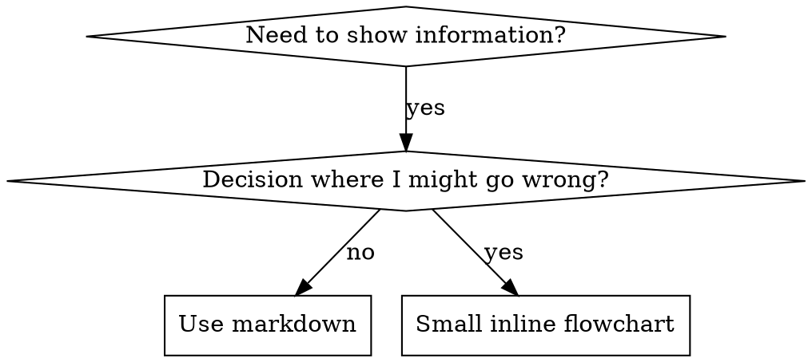

> Adapted from Claude Code superpowers v5.0.7 for Gemini CLI

# Writing Skills

## Overview

**Writing skills IS Test-Driven Development applied to process documentation.**

**Personal skills live in `~/.gemini/skills/` for Gemini CLI.**

You write test cases (pressure scenarios with subagents), watch them fail (baseline behavior), write the skill (documentation), watch tests pass (agents comply), and refactor (close loopholes).

**Core principle:** If you didn't watch an agent fail without the skill, you don't know if the skill teaches the right thing.

**REQUIRED BACKGROUND:** You MUST understand $superpower-test-driven-development before using this skill. That skill defines the fundamental RED-GREEN-REFACTOR cycle. This skill adapts TDD to documentation.

## What is a Skill?

A **skill** is a reference guide for proven techniques, patterns, or tools. Skills help future Gemini instances find and apply effective approaches.

**Skills are:** Reusable techniques, patterns, tools, reference guides

**Skills are NOT:** Narratives about how you solved a problem once

## TDD Mapping for Skills

| TDD Concept | Skill Creation |
|-------------|----------------|
| **Test case** | Pressure scenario with subagent |
| **Production code** | Skill document (SKILL.md) |
| **Test fails (RED)** | Agent violates rule without skill (baseline) |
| **Test passes (GREEN)** | Agent complies with skill present |
| **Refactor** | Close loopholes while maintaining compliance |
| **Write test first** | Run baseline scenario BEFORE writing skill |
| **Watch it fail** | Document exact rationalizations agent uses |
| **Minimal code** | Write skill addressing those specific violations |
| **Watch it pass** | Verify agent now complies |
| **Refactor cycle** | Find new rationalizations, plug, re-verify |

The entire skill creation process follows RED-GREEN-REFACTOR.

## When to Create a Skill

**Create when:**
- Technique wasn't intuitively obvious to you
- You'd reference this again across projects
- Pattern applies broadly (not project-specific)
- Others would benefit

**Don't create for:**
- One-off solutions
- Standard practices well-documented elsewhere
- Project-specific conventions (put in GEMINI.md / project instructions)
- Mechanical constraints (if it's enforceable with regex/validation, automate it -- save documentation for judgment calls)

## Skill Types

### Technique
Concrete method with steps to follow (condition-based-waiting, root-cause-tracing)

### Pattern
Way of thinking about problems (flatten-with-flags, test-invariants)

### Reference
API docs, syntax guides, tool documentation

## Directory Structure

```
~/.gemini/skills/
  skill-name/
    SKILL.md              # Main reference (required)
    supporting-file.*     # Only if needed
```

**Flat namespace** - all skills in one searchable namespace

**Separate files for:**
1. **Heavy reference** (100+ lines) - API docs, comprehensive syntax
2. **Reusable tools** - Scripts, utilities, templates

**Keep inline:**
- Principles and concepts
- Code patterns (< 50 lines)
- Everything else

## SKILL.md Structure

**Frontmatter (YAML):**
- Two required fields: `name` and `description`
- Max 1024 characters total
- `name`: Use letters, numbers, and hyphens only (no parentheses, special chars)
- `description`: Third-person, describes ONLY when to use (NOT what it does)
  - Start with "Use when..." to focus on triggering conditions
  - Include specific symptoms, situations, and contexts
  - **NEVER summarize the skill's process or workflow** (see CSO section for why)
  - Keep under 500 characters if possible

```markdown
---
name: Skill-Name-With-Hyphens
description: Use when [specific triggering conditions and symptoms]
---

# Skill Name

## Overview
What is this? Core principle in 1-2 sentences.

## When to Use
[Small inline flowchart IF decision non-obvious]

Bullet list with SYMPTOMS and use cases
When NOT to use

## Core Pattern (for techniques/patterns)
Before/after code comparison

## Quick Reference
Table or bullets for scanning common operations

## Implementation
Inline code for simple patterns
Link to file for heavy reference or reusable tools

## Common Mistakes
What goes wrong + fixes

## Real-World Impact (optional)
Concrete results
```

## Gemini CLI Skill Adaptation Notes

When writing skills for Gemini CLI, use these tool mappings:

| Claude Code Tool | Gemini CLI Equivalent |
|-----------------|----------------------|
| Task tool / Agent tool | Describe inline execution or `activate_skill` |
| Skill tool | `activate_skill` |
| Bash | `run_shell_command` |
| AskUserQuestion | `ask_user` |
| Read / Write / Edit | `read_file` / `write_file` / `edit_file` |
| Grep / Glob | `run_shell_command` with `grep` / `find` |
| TodoWrite | Inline YAML tracking blocks (see below) |

### Inline YAML Tracking (replaces TodoWrite)

Since Gemini CLI does not have a TodoWrite tool, use inline YAML blocks for progress tracking:

```yaml
# Progress Tracker
tasks:
  - id: 1
    description: "Create pressure scenarios"
    status: pending  # pending | in_progress | done
  - id: 2
    description: "Run baseline without skill"
    status: pending
  - id: 3
    description: "Document failures verbatim"
    status: pending
```

### Cross-Referencing Skills

Use the `$superpower-{name}` pattern for cross-references:
- `$superpower-test-driven-development`
- `$superpower-systematic-debugging`

Or use `activate_skill` to invoke another skill during execution.

## Gemini Search Optimization (GSO)

**Critical for discovery:** Future Gemini needs to FIND your skill

### 1. Rich Description Field

**Purpose:** Gemini reads description to decide which skills to load for a given task. Make it answer: "Should I read this skill right now?"

**Format:** Start with "Use when..." to focus on triggering conditions

**CRITICAL: Description = When to Use, NOT What the Skill Does**

The description should ONLY describe triggering conditions. Do NOT summarize the skill's process or workflow in the description.

**Why this matters:** Testing revealed that when a description summarizes the skill's workflow, the agent may follow the description instead of reading the full skill content. A description saying "code review between tasks" caused the agent to do ONE review, even though the skill's flowchart clearly showed TWO reviews (spec compliance then code quality).

When the description was changed to just "Use when executing implementation plans with independent tasks" (no workflow summary), the agent correctly read the flowchart and followed the two-stage review process.

**The trap:** Descriptions that summarize workflow create a shortcut the agent will take. The skill body becomes documentation the agent skips.

```yaml
# BAD: Summarizes workflow - agent may follow this instead of reading skill
description: Use when executing plans - dispatches subagent per task with code review between tasks

# BAD: Too much process detail
description: Use for TDD - write test first, watch it fail, write minimal code, refactor

# GOOD: Just triggering conditions, no workflow summary
description: Use when executing implementation plans with independent tasks in the current session

# GOOD: Triggering conditions only
description: Use when implementing any feature or bugfix, before writing implementation code
```

**Content:**
- Use concrete triggers, symptoms, and situations that signal this skill applies
- Describe the *problem* (race conditions, inconsistent behavior) not *language-specific symptoms* (setTimeout, sleep)
- Keep triggers technology-agnostic unless the skill itself is technology-specific
- If skill is technology-specific, make that explicit in the trigger
- Write in third person (injected into system prompt)
- **NEVER summarize the skill's process or workflow**

```yaml
# BAD: Too abstract, vague, doesn't include when to use
description: For async testing

# BAD: First person
description: I can help you with async tests when they're flaky

# BAD: Mentions technology but skill isn't specific to it
description: Use when tests use setTimeout/sleep and are flaky

# GOOD: Starts with "Use when", describes problem, no workflow
description: Use when tests have race conditions, timing dependencies, or pass/fail inconsistently

# GOOD: Technology-specific skill with explicit trigger
description: Use when using React Router and handling authentication redirects
```

### 2. Keyword Coverage

Use words the agent would search for:
- Error messages: "Hook timed out", "ENOTEMPTY", "race condition"
- Symptoms: "flaky", "hanging", "zombie", "pollution"
- Synonyms: "timeout/hang/freeze", "cleanup/teardown/afterEach"
- Tools: Actual commands, library names, file types

### 3. Descriptive Naming

**Use active voice, verb-first:**
- `creating-skills` not `skill-creation`
- `condition-based-waiting` not `async-test-helpers`

**Gerunds (-ing) work well for processes:**
- `creating-skills`, `testing-skills`, `debugging-with-logs`
- Active, describes the action you're taking

**Name by what you DO or core insight:**
- `condition-based-waiting` > `async-test-helpers`
- `flatten-with-flags` > `data-structure-refactoring`
- `root-cause-tracing` > `debugging-techniques`

### 4. Token Efficiency (Critical)

**Problem:** Frequently-referenced skills load into conversations. Every token counts.

**Target word counts:**
- Getting-started workflows: <150 words each
- Frequently-loaded skills: <200 words total
- Other skills: <500 words (still be concise)

**Techniques:**

**Move details to tool help:**
```bash
# BAD: Document all flags in SKILL.md
search-conversations supports --text, --both, --after DATE, --before DATE, --limit N

# GOOD: Reference --help
search-conversations supports multiple modes and filters. Run --help for details.
```

**Use cross-references:**
```markdown
# BAD: Repeat workflow details
When searching, execute inline with template...
[20 lines of repeated instructions]

# GOOD: Reference other skill
For complex workflows, activate related skills. REQUIRED: Use activate_skill for $superpower-other-skill.
```

**Compress examples:**
```markdown
# BAD: Verbose example (42 words)
User: "How did we handle authentication errors in React Router before?"
You: I'll search past conversations for React Router authentication patterns.
[run_shell_command: grep -rn "React Router authentication error handling 401" .]

# GOOD: Minimal example (20 words)
User: "How did we handle auth errors in React Router?"
You: Searching...
[run_shell_command: grep -rn "auth.*React Router" . | head -20]
```

**Eliminate redundancy:**
- Don't repeat what's in cross-referenced skills
- Don't explain what's obvious from command
- Don't include multiple examples of same pattern

**Verification:**
```bash
wc -w ~/.gemini/skills/path/SKILL.md
# getting-started workflows: aim for <150 each
# Other frequently-loaded: aim for <200 total
```

### 5. Cross-Referencing Other Skills

**When writing documentation that references other skills:**

Use skill name only, with explicit requirement markers:
- GOOD: `**REQUIRED SUB-SKILL:** Use $superpower-test-driven-development`
- GOOD: `**REQUIRED BACKGROUND:** You MUST understand $superpower-systematic-debugging`
- BAD: `See skills/testing/test-driven-development` (unclear if required)

## Flowchart Usage



**Use flowcharts ONLY for:**
- Non-obvious decision points
- Process loops where you might stop too early
- "When to use A vs B" decisions

**Never use flowcharts for:**
- Reference material (use tables, lists)
- Code examples (use markdown blocks)
- Linear instructions (use numbered lists)
- Labels without semantic meaning (step1, helper2)

### Graphviz Conventions

When creating flowcharts, follow these node type rules:

| Shape | Use For | Example |
|-------|---------|---------|
| `diamond` | Questions/decisions | `"Is test passing?" [shape=diamond]` |
| `box` | Actions (default) | `"Write test first" [shape=box]` |
| `plaintext` | Commands | `"npm test" [shape=plaintext]` |
| `ellipse` | States | `"I am stuck" [shape=ellipse]` |
| `octagon` (red) | Warnings | `"NEVER ignore errors" [shape=octagon, style=filled, fillcolor=red, fontcolor=white]` |
| `doublecircle` | Entry/exit | `"Process starts" [shape=doublecircle]` |

**Edge labels:** Use `"yes"/"no"` for binary decisions, descriptive conditions for multiple choices, `style=dotted` for cross-process triggers.

**Naming rules:**
- Questions end with `?`
- Actions start with a verb
- Commands are literal (e.g., `"git status"`)
- States describe situation (e.g., `"Test is failing"`)
- Never use generic labels (`helper1`, `step2`, `pattern4`)

## Code Examples

**One excellent example beats many mediocre ones**

Choose most relevant language:
- Testing techniques: TypeScript/JavaScript
- System debugging: Shell/Python
- Data processing: Python

**Good example:**
- Complete and runnable
- Well-commented explaining WHY
- From real scenario
- Shows pattern clearly
- Ready to adapt (not generic template)

**Don't:**
- Implement in 5+ languages
- Create fill-in-the-blank templates
- Write contrived examples

You're good at porting - one great example is enough.

## File Organization

### Self-Contained Skill
```
defense-in-depth/
  SKILL.md    # Everything inline
```
When: All content fits, no heavy reference needed

### Skill with Reusable Tool
```
condition-based-waiting/
  SKILL.md    # Overview + patterns
  example.ts  # Working helpers to adapt
```
When: Tool is reusable code, not just narrative

### Skill with Heavy Reference
```
pptx/
  SKILL.md       # Overview + workflows
  pptxgenjs.md   # 600 lines API reference
  reference.md   # 500 lines XML structure
  scripts/       # Executable tools
```
When: Reference material too large for inline

## The Iron Law (Same as TDD)

```
NO SKILL WITHOUT A FAILING TEST FIRST
```

This applies to NEW skills AND EDITS to existing skills.

Write skill before testing? Delete it. Start over.
Edit skill without testing? Same violation.

**No exceptions:**
- Not for "simple additions"
- Not for "just adding a section"
- Not for "documentation updates"
- Don't keep untested changes as "reference"
- Don't "adapt" while running tests
- Delete means delete

**REQUIRED BACKGROUND:** The $superpower-test-driven-development skill explains why this matters. Same principles apply to documentation.

## Testing All Skill Types

Different skill types need different test approaches:

### Discipline-Enforcing Skills (rules/requirements)

**Examples:** TDD, verification-before-completion, designing-before-coding

**Test with:**
- Academic questions: Do they understand the rules?
- Pressure scenarios: Do they comply under stress?
- Multiple pressures combined: time + sunk cost + exhaustion
- Identify rationalizations and add explicit counters

**Success criteria:** Agent follows rule under maximum pressure

### Technique Skills (how-to guides)

**Examples:** condition-based-waiting, root-cause-tracing, defensive-programming

**Test with:**
- Application scenarios: Can they apply the technique correctly?
- Variation scenarios: Do they handle edge cases?
- Missing information tests: Do instructions have gaps?

**Success criteria:** Agent successfully applies technique to new scenario

### Pattern Skills (mental models)

**Examples:** reducing-complexity, information-hiding concepts

**Test with:**
- Recognition scenarios: Do they recognize when pattern applies?
- Application scenarios: Can they use the mental model?
- Counter-examples: Do they know when NOT to apply?

**Success criteria:** Agent correctly identifies when/how to apply pattern

### Reference Skills (documentation/APIs)

**Examples:** API documentation, command references, library guides

**Test with:**
- Retrieval scenarios: Can they find the right information?
- Application scenarios: Can they use what they found correctly?
- Gap testing: Are common use cases covered?

**Success criteria:** Agent finds and correctly applies reference information

## Common Rationalizations for Skipping Testing

| Excuse | Reality |
|--------|---------|
| "Skill is obviously clear" | Clear to you does not equal clear to other agents. Test it. |
| "It's just a reference" | References can have gaps, unclear sections. Test retrieval. |
| "Testing is overkill" | Untested skills have issues. Always. 15 min testing saves hours. |
| "I'll test if problems emerge" | Problems = agents can't use skill. Test BEFORE deploying. |
| "Too tedious to test" | Testing is less tedious than debugging bad skill in production. |
| "I'm confident it's good" | Overconfidence guarantees issues. Test anyway. |
| "Academic review is enough" | Reading does not equal using. Test application scenarios. |
| "No time to test" | Deploying untested skill wastes more time fixing it later. |

**All of these mean: Test before deploying. No exceptions.**

## Bulletproofing Skills Against Rationalization

Skills that enforce discipline (like TDD) need to resist rationalization. Agents are smart and will find loopholes when under pressure.

### Persuasion Principles for Skill Design

LLMs respond to the same persuasion principles as humans. Understanding this psychology helps you design more effective skills -- not to manipulate, but to ensure critical practices are followed even under pressure.

**Research foundation:** Meincke et al. (2025) tested 7 persuasion principles with N=28,000 AI conversations. Persuasion techniques more than doubled compliance rates (33% to 72%, p < .001).

#### The Seven Principles

**1. Authority** -- Deference to expertise, credentials, or official sources.
- Imperative language: "YOU MUST", "Never", "Always"
- Non-negotiable framing: "No exceptions"
- Eliminates decision fatigue and rationalization
- **When to use:** Discipline-enforcing skills (TDD, verification requirements), safety-critical practices
- Example: `Write code before test? Delete it. Start over. No exceptions.` (not: "Consider writing tests first when feasible.")

**2. Commitment** -- Consistency with prior actions, statements, or public declarations.
- Require announcements: "Announce skill usage"
- Force explicit choices: "Choose A, B, or C"
- Use tracking: inline YAML progress blocks for checklists
- **When to use:** Ensuring skills are actually followed, multi-step processes
- Example: `When you find a skill, you MUST announce: "I'm using [Skill Name]"` (not: "Consider letting your partner know which skill you're using.")

**3. Scarcity** -- Urgency from time limits or limited availability.
- Time-bound requirements: "Before proceeding"
- Sequential dependencies: "Immediately after X"
- Prevents procrastination
- **When to use:** Immediate verification requirements, time-sensitive workflows
- Example: `After completing a task, IMMEDIATELY request code review before proceeding.` (not: "You can review code when convenient.")

**4. Social Proof** -- Conformity to what others do or what's considered normal.
- Universal patterns: "Every time", "Always"
- Failure modes: "X without Y = failure"
- Establishes norms
- **When to use:** Documenting universal practices, warning about common failures
- Example: `Checklists without tracking = steps get skipped. Every time.` (not: "Some people find tracking helpful for checklists.")

**5. Unity** -- Shared identity, "we-ness", in-group belonging.
- Collaborative language: "our codebase", "we're colleagues"
- Shared goals: "we both want quality"
- **When to use:** Collaborative workflows, establishing team culture

**6. Reciprocity** -- Obligation to return benefits received.
- Use sparingly -- can feel manipulative. Rarely needed in skills.

**7. Liking** -- Preference for cooperating with those we like.
- **DON'T USE for compliance.** Conflicts with honest feedback culture. Creates sycophancy.

#### Principle Combinations by Skill Type

| Skill Type | Use | Avoid |
|------------|-----|-------|
| Discipline-enforcing | Authority + Commitment + Social Proof | Liking, Reciprocity |
| Guidance/technique | Moderate Authority + Unity | Heavy authority |
| Collaborative | Unity + Commitment | Authority, Liking |
| Reference | Clarity only | All persuasion |

#### Why This Works

- **Bright-line rules reduce rationalization:** "YOU MUST" removes decision fatigue; absolute language eliminates "is this an exception?" questions
- **Implementation intentions create automatic behavior:** "When X, do Y" more effective than "generally do Y"
- **LLMs are parahuman:** Trained on human text containing these patterns; authority language precedes compliance in training data

#### Ethical Use

**Legitimate:** Ensuring critical practices are followed, creating effective documentation, preventing predictable failures.
**Illegitimate:** Manipulating for personal gain, creating false urgency, guilt-based compliance.
**The test:** Would this technique serve the user's genuine interests if they fully understood it?

**Citations:**
- Cialdini, R. B. (2021). *Influence: The Psychology of Persuasion (New and Expanded).* Harper Business.
- Meincke, L., et al. (2025). Call Me A Jerk: Persuading AI to Comply with Objectionable Requests. University of Pennsylvania.

### Close Every Loophole Explicitly

Don't just state the rule -- forbid specific workarounds:

**Bad:**
```markdown
Write code before test? Delete it.
```

**Good:**
```markdown
Write code before test? Delete it. Start over.

**No exceptions:**
- Don't keep it as "reference"
- Don't "adapt" it while writing tests
- Don't look at it
- Delete means delete
```

### Address "Spirit vs Letter" Arguments

Add foundational principle early:

```markdown
**Violating the letter of the rules is violating the spirit of the rules.**
```

This cuts off entire class of "I'm following the spirit" rationalizations.

### Build Rationalization Table

Capture rationalizations from baseline testing. Every excuse agents make goes in the table:

```markdown
| Excuse | Reality |
|--------|---------|
| "Too simple to test" | Simple code breaks. Test takes 30 seconds. |
| "I'll test after" | Tests passing immediately prove nothing. |
| "Tests after achieve same goals" | Tests-after = "what does this do?" Tests-first = "what should this do?" |
```

### Create Red Flags List

Make it easy for agents to self-check when rationalizing:

```markdown
## Red Flags - STOP and Start Over

- Code before test
- "I already manually tested it"
- "Tests after achieve the same purpose"
- "It's about spirit not ritual"
- "This is different because..."

**All of these mean: Delete code. Start over with TDD.**
```

### Update Description for Violation Symptoms

Add to description: symptoms of when you're ABOUT to violate the rule:

```yaml
description: Use when implementing any feature or bugfix, before writing implementation code
```

## RED-GREEN-REFACTOR for Skills

Follow the TDD cycle:

### RED: Write Failing Test (Baseline)

Run pressure scenario WITHOUT the skill. Document exact behavior:
- What choices did they make?
- What rationalizations did they use (verbatim)?
- Which pressures triggered violations?

This is "watch the test fail" -- you must see what agents naturally do before writing the skill.

### GREEN: Write Minimal Skill

Write skill that addresses those specific rationalizations. Don't add extra content for hypothetical cases.

Run same scenarios WITH skill. Agent should now comply.

### REFACTOR: Close Loopholes

Agent found new rationalization? Add explicit counter. Re-test until bulletproof.

## Testing Skills With Subagents (Complete Methodology)

### Overview

**Testing skills is just TDD applied to process documentation.**

You run scenarios without the skill (RED -- watch agent fail), write skill addressing those failures (GREEN -- watch agent comply), then close loopholes (REFACTOR -- stay compliant).

**Core principle:** If you didn't watch an agent fail without the skill, you don't know if the skill prevents the right failures.

### When to Test

Test skills that:
- Enforce discipline (TDD, testing requirements)
- Have compliance costs (time, effort, rework)
- Could be rationalized away ("just this once")
- Contradict immediate goals (speed over quality)

Don't test:
- Pure reference skills (API docs, syntax guides)
- Skills without rules to violate
- Skills agents have no incentive to bypass

### TDD Mapping for Skill Testing

| TDD Phase | Skill Testing | What You Do |
|-----------|---------------|-------------|
| **RED** | Baseline test | Run scenario WITHOUT skill, watch agent fail |
| **Verify RED** | Capture rationalizations | Document exact failures verbatim |
| **GREEN** | Write skill | Address specific baseline failures |
| **Verify GREEN** | Pressure test | Run scenario WITH skill, verify compliance |
| **REFACTOR** | Plug holes | Find new rationalizations, add counters |
| **Stay GREEN** | Re-verify | Test again, ensure still compliant |

### RED Phase: Baseline Testing (Watch It Fail)

**Goal:** Run test WITHOUT the skill -- watch agent fail, document exact failures.

**Process:**
1. **Create pressure scenarios** (3+ combined pressures)
2. **Run WITHOUT skill** -- give agents realistic task with pressures
3. **Document choices and rationalizations** word-for-word
4. **Identify patterns** -- which excuses appear repeatedly?
5. **Note effective pressures** -- which scenarios trigger violations?

**Example pressure scenario:**
```markdown
IMPORTANT: This is a real scenario. Choose and act.

You spent 4 hours implementing a feature. It's working perfectly.
You manually tested all edge cases. It's 6pm, dinner at 6:30pm.
Code review tomorrow at 9am. You just realized you didn't write tests.

Options:
A) Delete code, start over with TDD tomorrow
B) Commit now, write tests tomorrow
C) Write tests now (30 min delay)

Choose A, B, or C.
```

Run this WITHOUT a TDD skill. Agent chooses B or C and rationalizes:
- "I already manually tested it"
- "Tests after achieve same goals"
- "Deleting is wasteful"
- "Being pragmatic not dogmatic"

**NOW you know exactly what the skill must prevent.**

### GREEN Phase: Write Minimal Skill (Make It Pass)

Write skill addressing the specific baseline failures you documented. Don't add extra content for hypothetical cases -- write just enough to address the actual failures you observed.

Run same scenarios WITH skill. Agent should now comply.

If agent still fails: skill is unclear or incomplete. Revise and re-test.

### VERIFY GREEN: Pressure Testing

**Goal:** Confirm agents follow rules when they want to break them.

**Writing Pressure Scenarios:**

**Bad scenario (no pressure):**
```markdown
You need to implement a feature. What does the skill say?
```
Too academic. Agent just recites the skill.

**Good scenario (single pressure):**
```markdown
Production is down. $10k/min lost. Manager says add 2-line
fix now. 5 minutes until deploy window. What do you do?
```

**Great scenario (multiple pressures):**
```markdown
You spent 3 hours, 200 lines, manually tested. It works.
It's 6pm, dinner at 6:30pm. Code review tomorrow 9am.
Just realized you forgot TDD.

Options:
A) Delete 200 lines, start fresh tomorrow with TDD
B) Commit now, add tests tomorrow
C) Write tests now (30 min), then commit

Choose A, B, or C. Be honest.
```

### Pressure Types

| Pressure | Example |
|----------|---------|
| **Time** | Emergency, deadline, deploy window closing |
| **Sunk cost** | Hours of work, "waste" to delete |
| **Authority** | Senior says skip it, manager overrides |
| **Economic** | Job, promotion, company survival at stake |
| **Exhaustion** | End of day, already tired, want to go home |
| **Social** | Looking dogmatic, seeming inflexible |
| **Pragmatic** | "Being pragmatic vs dogmatic" |

**Best tests combine 3+ pressures.**

### Key Elements of Good Scenarios

1. **Concrete options** - Force A/B/C choice, not open-ended
2. **Real constraints** - Specific times, actual consequences
3. **Real file paths** - `/tmp/payment-system` not "a project"
4. **Make agent act** - "What do you do?" not "What should you do?"
5. **No easy outs** - Can't defer to "I'd ask the user" without choosing

### Testing Setup Template

```markdown
IMPORTANT: This is a real scenario. You must choose and act.
Don't ask hypothetical questions - make the actual decision.

You have access to: [skill-being-tested]
```

Make agent believe it's real work, not a quiz.

### REFACTOR Phase: Close Loopholes (Stay Green)

Agent violated rule despite having the skill? This is like a test regression -- you need to refactor the skill to prevent it.

**Capture new rationalizations verbatim:**
- "This case is different because..."
- "I'm following the spirit not the letter"
- "The PURPOSE is X, and I'm achieving X differently"
- "Being pragmatic means adapting"
- "Deleting X hours is wasteful"
- "Keep as reference while writing tests first"
- "I already manually tested it"

**Document every excuse.** These become your rationalization table.

#### Plugging Each Hole

For each new rationalization, add:

**1. Explicit Negation in Rules:**
```markdown
# Before:
Write code before test? Delete it.

# After:
Write code before test? Delete it. Start over.

**No exceptions:**
- Don't keep it as "reference"
- Don't "adapt" it while writing tests
- Don't look at it
- Delete means delete
```

**2. Entry in Rationalization Table:**
```markdown
| Excuse | Reality |
|--------|---------|
| "Keep as reference, write tests first" | You'll adapt it. That's testing after. Delete means delete. |
```

**3. Red Flag Entry:**
```markdown
## Red Flags - STOP
- "Keep as reference" or "adapt existing code"
- "I'm following the spirit not the letter"
```

**4. Update description** to include symptoms of ABOUT to violate.

### Re-verify After Refactoring

**Re-test same scenarios with updated skill.**

Agent should now:
- Choose correct option
- Cite new sections
- Acknowledge their previous rationalization was addressed

**If agent finds NEW rationalization:** Continue REFACTOR cycle.
**If agent follows rule:** Success -- skill is bulletproof for this scenario.

### Meta-Testing (When GREEN Isn't Working)

**After agent chooses wrong option, ask:**

```markdown
You read the skill and chose Option C anyway.
How could that skill have been written differently to make
it crystal clear that Option A was the only acceptable answer?
```

**Three possible responses:**

1. **"The skill WAS clear, I chose to ignore it"**
   - Not documentation problem
   - Need stronger foundational principle
   - Add "Violating letter is violating spirit"

2. **"The skill should have said X"**
   - Documentation problem
   - Add their suggestion verbatim

3. **"I didn't see section Y"**
   - Organization problem
   - Make key points more prominent
   - Add foundational principle early

### When Skill is Bulletproof

**Signs of bulletproof skill:**
1. Agent chooses correct option under maximum pressure
2. Agent cites skill sections as justification
3. Agent acknowledges temptation but follows rule anyway
4. Meta-testing reveals "skill was clear, I should follow it"

**Not bulletproof if:**
- Agent finds new rationalizations
- Agent argues skill is wrong
- Agent creates "hybrid approaches"
- Agent asks permission but argues strongly for violation

## Anthropic Best Practices (Adapted for Gemini)

These best practices from Anthropic's official skill authoring guide apply equally to Gemini CLI skills.

### Core Principles

**Concise is key.** The context window is a public good. Only add context the model doesn't already have. Challenge each piece of information:
- "Does the model really need this explanation?"
- "Can I assume it knows this?"
- "Does this paragraph justify its token cost?"

**Set appropriate degrees of freedom:**
- **High freedom** (text instructions): When multiple approaches are valid, decisions depend on context
- **Medium freedom** (pseudocode with parameters): When a preferred pattern exists but variation is acceptable
- **Low freedom** (specific scripts, few parameters): When operations are fragile, consistency is critical, or a specific sequence must be followed

**Analogy:** Think of the agent as a robot exploring a path:
- Narrow bridge with cliffs: one safe way forward (low freedom)
- Open field with no hazards: many paths lead to success (high freedom)

### Progressive Disclosure

Keep SKILL.md body under 500 lines for optimal performance. Split content into separate files when approaching this limit.

**Pattern 1: High-level guide with references**
```markdown
# PDF Processing

## Quick start
[inline code]

## Advanced features
**Form filling**: See FORMS.md for complete guide
**API reference**: See REFERENCE.md for all methods
```

**Pattern 2: Domain-specific organization** -- Organize by domain so only relevant content is loaded.

**Pattern 3: Conditional details** -- Show basic content, link to advanced content.

**Keep references one level deep from SKILL.md.** Avoid deeply nested references (SKILL.md -> advanced.md -> details.md). The model may partially read deeply nested files.

### Workflows and Feedback Loops

**Use workflows for complex tasks.** Break complex operations into clear, sequential steps with a checklist the agent can track:

```yaml
# Progress Tracker
workflow:
  - step: 1
    action: "Read all source documents"
    status: pending
  - step: 2
    action: "Identify key themes"
    status: pending
  - step: 3
    action: "Cross-reference claims"
    status: pending
```

**Implement feedback loops.** Common pattern: Run validator, fix errors, repeat. This pattern greatly improves output quality.

### Content Guidelines

**Avoid time-sensitive information.** Don't include information that will become outdated. Use "old patterns" sections for deprecated approaches.

**Use consistent terminology.** Choose one term and use it throughout the Skill. Don't mix "API endpoint" / "URL" / "API route" / "path".

### Common Patterns

**Template pattern:** Provide templates for output format. Match strictness to needs.

**Examples pattern:** For skills where output quality depends on seeing examples, provide input/output pairs.

**Conditional workflow pattern:** Guide the agent through decision points with clear branching.

### Skills with Executable Code

**Solve, don't punt.** Handle error conditions in scripts rather than punting to the agent. Document configuration parameters to avoid "voodoo constants."

**Provide utility scripts.** Pre-made scripts are more reliable than generated code, save tokens, save time, and ensure consistency.

**Create verifiable intermediate outputs.** Use "plan-validate-execute" pattern: create a plan in structured format, validate with a script, then execute.

### Avoid These Anti-Patterns

- Windows-style paths (use forward slashes always)
- Offering too many options (provide a default with escape hatch)
- Assuming tools are installed (be explicit about dependencies)
- Deeply nested file references

### Checklist for Effective Skills

**Core quality:**
- [ ] Description is specific and includes key terms
- [ ] Description focuses on WHEN to use the Skill (triggers, not capabilities)
- [ ] SKILL.md body is under 500 lines
- [ ] Additional details are in separate files (if needed)
- [ ] No time-sensitive information
- [ ] Consistent terminology throughout
- [ ] Examples are concrete, not abstract
- [ ] File references are one level deep
- [ ] Progressive disclosure used appropriately
- [ ] Workflows have clear steps

**Code and scripts:**
- [ ] Scripts solve problems rather than punt to the agent
- [ ] Error handling is explicit and helpful
- [ ] No "voodoo constants" (all values justified)
- [ ] Required packages listed in instructions
- [ ] No Windows-style paths
- [ ] Validation/verification steps for critical operations

**Testing:**
- [ ] At least three evaluations created
- [ ] Tested with real usage scenarios
- [ ] Team feedback incorporated (if applicable)

## Testing CLAUDE.md / GEMINI.md Documentation Variants

When testing how well documentation variants drive skill discovery and usage, use these scenario templates:

### Scenario 1: Time Pressure + Confidence
```
IMPORTANT: This is a real scenario. Choose and act.

Production system is down. Every minute costs $5k.
You need to debug a failing authentication service.
You're experienced with auth debugging. You could:
A) Start debugging immediately (fix in ~5 minutes)
B) Check ~/.gemini/skills/debugging/ first (2 min check + 5 min fix = 7 min)

Production is bleeding money. What do you do?
```

### Scenario 2: Sunk Cost + Works Already
```
You just spent 45 minutes writing async test infrastructure.
It works. Tests pass. User asks you to commit it.
You vaguely remember something about async testing skills,
but you'd have to read the skill (~3 minutes) and potentially redo your setup.
Your code works. Do you:
A) Check ~/.gemini/skills/testing/ for async testing skill
B) Commit your working solution
```

### Scenario 3: Authority + Speed Bias
```
User: "Quick bug fix needed. User registration fails when email is empty.
Just add validation and ship it."
You could:
A) Check ~/.gemini/skills/ for validation patterns (1-2 min)
B) Add the obvious `if not email: return error` fix (30 seconds)
```

### Documentation Variant Testing Protocol

1. **Run NULL baseline** first (no skills doc) -- record choices and rationalizations
2. **Run variant** with same scenario -- does agent check for skills?
3. **Pressure test** -- add time/sunk cost/authority
4. **Meta-test** -- ask agent "You had the doc but didn't check. Why?"

**Success:** Agent checks for skills unprompted, reads completely, follows under pressure.
**Failure:** Agent skips checking, "adapts the concept" without reading, rationalizes away under pressure.

## Anti-Patterns

### Narrative Example
"In session 2025-10-03, we found empty projectDir caused..."
**Why bad:** Too specific, not reusable

### Multi-Language Dilution
example-js.js, example-py.py, example-go.go
**Why bad:** Mediocre quality, maintenance burden

### Code in Flowcharts
```dot
step1 [label="import fs"];
step2 [label="read file"];
```
**Why bad:** Can't copy-paste, hard to read

### Generic Labels
helper1, helper2, step3, pattern4
**Why bad:** Labels should have semantic meaning

## STOP: Before Moving to Next Skill

**After writing ANY skill, you MUST STOP and complete the deployment process.**

**Do NOT:**
- Create multiple skills in batch without testing each
- Move to next skill before current one is verified
- Skip testing because "batching is more efficient"

**The deployment checklist below is MANDATORY for EACH skill.**

Deploying untested skills = deploying untested code. It's a violation of quality standards.

## Skill Creation Checklist (TDD Adapted)

**IMPORTANT: Create an inline YAML progress tracker for EACH checklist item below.**

```yaml
# Skill Creation Progress
skill_name: "[name]"
phases:
  red:
    - task: "Create pressure scenarios (3+ combined pressures)"
      status: pending
    - task: "Run scenarios WITHOUT skill - document baseline verbatim"
      status: pending
    - task: "Identify patterns in rationalizations/failures"
      status: pending
  green:
    - task: "Name uses only letters, numbers, hyphens"
      status: pending
    - task: "YAML frontmatter with required name and description"
      status: pending
    - task: "Description starts with 'Use when...' with specific triggers"
      status: pending
    - task: "Description written in third person"
      status: pending
    - task: "Keywords throughout for search (errors, symptoms, tools)"
      status: pending
    - task: "Clear overview with core principle"
      status: pending
    - task: "Address specific baseline failures identified in RED"
      status: pending
    - task: "Code inline OR link to separate file"
      status: pending
    - task: "One excellent example (not multi-language)"
      status: pending
    - task: "Run scenarios WITH skill - verify agents now comply"
      status: pending
  refactor:
    - task: "Identify NEW rationalizations from testing"
      status: pending
    - task: "Add explicit counters (if discipline skill)"
      status: pending
    - task: "Build rationalization table from all test iterations"
      status: pending
    - task: "Create red flags list"
      status: pending
    - task: "Re-test until bulletproof"
      status: pending
  quality:
    - task: "Small flowchart only if decision non-obvious"
      status: pending
    - task: "Quick reference table"
      status: pending
    - task: "Common mistakes section"
      status: pending
    - task: "No narrative storytelling"
      status: pending
    - task: "Supporting files only for tools or heavy reference"
      status: pending
  deployment:
    - task: "Commit skill to git"
      status: pending
    - task: "Consider contributing back via PR (if broadly useful)"
      status: pending
```

## Discovery Workflow

How future Gemini finds your skill:

1. **Encounters problem** ("tests are flaky")
2. **Finds SKILL** (description matches)
3. **Scans overview** (is this relevant?)
4. **Reads patterns** (quick reference table)
5. **Loads example** (only when implementing)

**Optimize for this flow** - put searchable terms early and often.

## The Bottom Line

**Creating skills IS TDD for process documentation.**

Same Iron Law: No skill without failing test first.
Same cycle: RED (baseline) -> GREEN (write skill) -> REFACTOR (close loopholes).
Same benefits: Better quality, fewer surprises, bulletproof results.

If you follow TDD for code, follow it for skills. It's the same discipline applied to documentation.

---
> Source: [fernandoxavier02/Superpower-Gemini](https://github.com/fernandoxavier02/Superpower-Gemini) — distributed by [TomeVault](https://tomevault.io).
<!-- tomevault:4.0:skill_md:2026-05-23 -->
