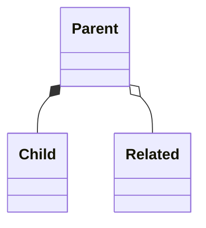
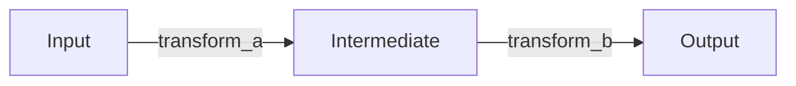
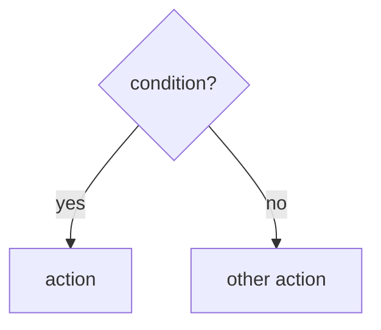

# Examine

Systematically examine source code from different perspectives. Supports parallel subagent execution for comprehensive analysis.

## Usage

`/examine [type] [scope]`
`/examine all [scope]`        # Parallel: data + flow + decisions
`/examine [type] [scope1] [scope2] ...`  # Parallel by scope

**Types:**
- `data` - Data representations (schemas, types, models)
- `flow` - Data flow (transformations through pipeline)
- `decisions` - Decision flow (control flow, validators, branching)
- `docs` - Documentation verification/generation
- `all` - All analysis types in parallel (spawns 3 subagents)

**Scope:** Module, file, path, or keyword (e.g., `auth`, `src/models/`, `api`)

---

## Step 0: Clarify (if needed)

**This step runs in the main conversation (foreground) - cannot be parallelized.**

**If type or scope is missing/ambiguous, use `/clarify` to gather:**

1. **Analysis type** - What perspective?
   - Data representations (schemas, types)
   - Data flow (transformations)
   - Decision flow (control flow, validators)
   - Documentation
   - All of the above (parallel)

2. **Scope** - What to examine?
   - Specific module or directory
   - Specific file
   - Feature area or keyword
   - Multiple areas (parallel)

3. **Output preferences** - What format?
   - Structured markdown summary
   - Mermaid diagrams
   - Documentation (format auto-detected)
   - Verification report

4. **Depth** - How deep?
   - Overview (high-level structure)
   - Detailed (all fields, validators)
   - Comprehensive (cross-references, examples)

**After clarification, announce:** "I'm using the /examine skill to examine [scope] from a [type] perspective."

---

## Step 1: Resolve Scope to Files

**This step runs in the main conversation before any parallelization.**

### If scope is a path (contains `/` or `.`)

Use directly: `src/auth/`, `models.py`, `app/api/v1/`

### If scope is a keyword

1. **Check memory bank first** - Read `.claude/memorybank/overview.md` for documented modules:
   ```markdown
   ## Key Modules
   | Module | Path | Recommended Analysis |
   |--------|------|---------------------|
   | auth | src/auth/ | flow, decisions |
   ```

2. **Search project structure** for matching directories/files

3. **Present candidates** if multiple matches found

### If scope is empty

- Examine current working directory
- Or ask: "What module/area should I examine?"

### Common Scope Patterns

| Scope keyword | Typical locations | Suggested analysis |
|---------------|-------------------|-------------------|
| `schema`, `models`, `types` | `**/schema/`, `**/models/`, `**/types/` | data |
| `api`, `routes`, `endpoints` | `**/api/`, `**/routes/`, `**/handlers/` | flow, decisions |
| `utils`, `helpers`, `lib` | `**/utils/`, `**/lib/`, `**/helpers/` | flow |
| `config`, `settings` | `**/config/`, `*.config.*`, `settings.*` | data |
| `auth`, `security` | `**/auth/`, `**/security/`, `**/middleware/` | flow, decisions |
| `db`, `database`, `store` | `**/db/`, `**/database/`, `**/repositories/` | data, flow |
| `tests`, `spec` | `**/test*/`, `**/*_test.*`, `**/*.spec.*` | decisions |

### Resolution Examples

- `auth` → found `src/services/auth/` (3 files)
- `models` → found `app/models/` (12 files) and `api/models.py` (1 file) → ask which
- `pipeline` → no exact match → suggest: "Did you mean `src/data/pipeline.py` or `scripts/`?"

---

## Step 2: Determine Parallelization Strategy

After scope resolution, decide whether to parallelize.

### Decision Matrix

| Scenario | File Count | Strategy |
|----------|------------|----------|
| Single type, 1-5 files | ≤5 | Sequential (no subagents) |
| Single type, 6+ files | >5 | Parallel by file groups |
| `all` type, any scope | any | Parallel by type (3 subagents) |
| Multiple scopes | any | Parallel by scope |
| Multiple types + scopes | any | Parallel by type × scope |

### Parallelization Modes

#### Mode A: By Analysis Type
**Trigger:** `/examine all [scope]` or multiple types requested

Launch 3 subagents in parallel:
```
Subagent 1: examine data [scope]
Subagent 2: examine flow [scope]
Subagent 3: examine decisions [scope]
```

#### Mode B: By Scope Segment
**Trigger:** Multiple directories or large scope (>10 files)

Launch N subagents in parallel:
```
Subagent 1: examine [type] src/auth/
Subagent 2: examine [type] src/api/
Subagent 3: examine [type] src/db/
```

#### Mode C: Hybrid (Type × Scope)
**Trigger:** `/examine all auth api db` or comprehensive analysis request

Launch up to 9 subagents (3 types × 3 scopes):
```
auth:data    auth:flow    auth:decisions
api:data     api:flow     api:decisions
db:data      db:flow      db:decisions
```

**Limit:** Cap at 6 concurrent subagents to manage context consumption.

### When NOT to Parallelize

- Single file analysis
- Small scope (≤5 files)
- `docs` type with `--verify` (needs cross-referencing)
- When user explicitly requests sequential analysis

---

## Step 3: Execute Analysis

### Sequential Execution (No Subagents)

Follow the analysis type instructions below directly.

### Parallel Execution (With Subagents)

1. **Construct subagent prompts** using templates below
2. **Launch all subagents in a single message** with multiple Task tool calls
3. **Wait for all results**
4. **Proceed to synthesis** (Step 4)

---

## Subagent Prompt Templates

### Template: Data Analysis Subagent

```
Examine data representations in [SCOPE].

Files to analyze:
[FILE_LIST]

Extract for each class/model:
- Name, base class, purpose (from docstring)
- Fields: name, type, default, constraints
- Validators and their rules
- Relationships to other models

Also extract:
- Enums with values and semantics
- Type unions and discriminators

Return as structured markdown with tables.
Keep response under 400 lines.
Do NOT ask clarifying questions.
```

### Template: Flow Analysis Subagent

```
Examine data flow in [SCOPE].

Files to analyze:
[FILE_LIST]

Trace:
- Entry points (APIs, scripts, CLI)
- Input format/source
- Each transformation step
- Output format/destination

For each transformation:
- Function/method name and location
- Input type → Output type
- Key logic applied

Return as structured markdown with Mermaid flowchart.
Keep response under 400 lines.
Do NOT ask clarifying questions.
```

### Template: Decisions Analysis Subagent

```
Examine decision flow in [SCOPE].

Files to analyze:
[FILE_LIST]

Identify:
- if/elif/else branches
- match/switch statements
- Validator logic
- Error conditions and guard clauses

For each decision point:
- Location (file:line)
- Condition being checked
- Outcomes for each branch
- Exceptions raised

Return as structured markdown with decision tables.
Keep response under 400 lines.
Do NOT ask clarifying questions.
```

### Template: File Group Subagent

```
Analyze [TYPE] for these files:
[FILE_LIST]

[TYPE-SPECIFIC INSTRUCTIONS]

Return results as a consolidated table, not per-file sections.
Keep response under 300 lines.
Do NOT ask clarifying questions.
```

---

## Step 4: Synthesize Results (Parallel Mode Only)

After all subagents complete, merge their outputs.

### Synthesis Process

1. **Collect all outputs** - each subagent returns structured markdown
2. **Merge by section** - combine Models, Flows, Decisions into unified view
3. **Deduplicate** - remove redundant entries found by multiple agents
4. **Cross-reference** - identify relationships discovered across analyses:
   - Models referenced in flow transformations
   - Validators that affect decision points
   - Data types that flow through multiple stages
5. **Generate unified output** - single document with all findings

### Synthesis Output Template

```markdown
## Comprehensive Analysis: [SCOPE]

*Analyzed via [N] parallel subagents in [TYPE_LIST] modes*

---

### Data Representations
[Merged from data subagent(s)]

#### Models
[Combined model tables]

#### Enums
[Combined enum tables]

#### Type Relationships
[Merged relationship diagram]

---

### Data Flow
[Merged from flow subagent(s)]

#### Pipeline Overview
[Combined flowchart - may need manual merge of multiple diagrams]

#### Stage Details
[Combined stage descriptions]

---

### Decision Points
[Merged from decisions subagent(s)]

#### Validation Rules
[Combined validation table]

#### Error Conditions
[Combined error table]

---

### Cross-Cutting Concerns

#### Data-Flow Connections
- Model `[X]` is input to `[transform_a]`
- Model `[Y]` is output of `[transform_b]`

#### Flow-Decision Connections
- `[transform_a]` branches on `[condition]`
- Validator `[V]` guards `[transform_b]`

#### Discovered Patterns
- [Pattern observed across multiple analyses]
```

---

## Analysis Type: `data`

Examine data representations - schemas, types, structures.

### Process

1. **Identify schema files** in scope
2. **Extract for each class/model:**
   - Name and inheritance
   - Fields: name, type, default, constraints
   - Validators and their rules
   - Relationships to other models
3. **Extract enums:** values and semantics
4. **Map type unions and discriminators**

### Output Format: Structured Summary

```markdown
## Data Representations: [Scope]

### Models

#### [ModelName]
- **Base:** [BaseClass]
- **Purpose:** [from docstring]

| Field | Type | Default | Constraints |
|-------|------|---------|-------------|
| field_name | type | default | Field(gt=0) |

**Validators:**
- `_validate_x`: [what it checks]

### Enums

#### [EnumName]
| Value | Description |
|-------|-------------|
| VALUE | meaning |

### Type Unions

- `[UnionName] = TypeA | TypeB | TypeC` (discriminator: `[field]`)

### Relationships


```

---

## Analysis Type: `flow`

Examine data flow - how data transforms through the system.

### Process

1. **Identify entry points** (scripts, APIs, CLI commands)
2. **Trace data path:**
   - Input format/source
   - Each transformation step
   - Output format/destination
3. **Document transformations:**
   - Function/method performing transform
   - Input type → Output type
   - Key logic applied

### Output Format: Flow Diagram + Notes

```markdown
## Data Flow: [Scope]

### Pipeline Overview



### Stage Details

#### [Stage Name]
- **Input:** [Type/Format]
- **Output:** [Type/Format]
- **Transform:** `function_name()` in `file.py:line`
- **Key Logic:**
  - Step 1
  - Step 2

### Data Shape Changes

| Stage | Structure | Key Fields |
|-------|-----------|------------|
| Input | [InputType] | [primary fields] |
| After [transform] | [OutputType] | [transformed fields] |
| Final | [ResultType] | [output fields] |
```

---

## Analysis Type: `decisions`

Examine decision flow - control flow, validators, branching logic.

### Process

1. **Identify decision points:**
   - if/elif/else branches
   - match/switch statements
   - validator logic
   - error conditions
   - guard clauses
2. **Document each decision:**
   - Condition being checked
   - Outcomes for each branch
   - Side effects or raised exceptions
3. **Map validation chains**

### Output Format: Decision Tree + Rules

```markdown
## Decision Flow: [Scope]

### Decision Points

#### [Function/Validator Name]
**Location:** `file.py:line`



**Rules:**
- If [condition]: [outcome]
- If [other condition]: [outcome]
- Otherwise: [default]

### Validation Rules

| Validator | Checks | On Failure |
|-----------|--------|------------|
| `validate_x` | field > 0 | ValueError |
| `check_auth` | user authenticated | 401 Unauthorized |

### Error Conditions

| Condition | Exception/Status | Message |
|-----------|------------------|---------|
| invalid input | ValidationError | "Field X is required" |
| not found | 404 | "Resource not found" |
```

---

## Analysis Type: `docs`

Verify or generate documentation.

**Note:** `docs` type with `--verify` should NOT be parallelized as it requires cross-referencing between source and documentation.

### Modes

- `--verify`: Audit existing docs against source
- `--generate`: Create new documentation

### Output Format Detection

Auto-detect project's documentation system:

| Check for | Doc system | Output format |
|-----------|------------|---------------|
| `_quarto.yml` | Quarto | `.qmd` |
| `mkdocs.yml` | MkDocs | `.md` |
| `docusaurus.config.js` | Docusaurus | `.md` / `.mdx` |
| `docs/` with `.rst` | Sphinx | `.rst` |
| None of above | Generic | `.md` |

### Verification Report Format

```markdown
## Documentation Audit: [Scope]

### Coverage Summary

| Component | Documented | Accurate | Missing |
|-----------|------------|----------|---------|
| Functions | 15/20 | 12/15 | 5 |
| Classes | 8/8 | 6/8 | 0 |
| Modules | 3/5 | 3/3 | 2 |

### Issues Found

#### Outdated
- `docs/api.md` references `old_function()` (removed in `commit abc123`)

#### Missing
- `src/utils/helpers.py` - no module docstring
- `UserService.create()` - undocumented parameters

### Recommendations
1. Update API docs to reflect current signatures
2. Add docstrings to utility functions
```

### Generation Template

```markdown
---
title: "[Title]"
---

Brief description of what this documents.

## Overview


## [Content Sections]

Tables, code examples, explanations.

## API Reference

[Generated from source]

## Related Documentation

- [Link](path) - Description
```

---

## Project-Specific Scope Configuration

Projects can define custom scope mappings in `.claude/memorybank/overview.md`:

```markdown
## Key Modules

| Module | Path | Recommended Analysis |
|--------|------|---------------------|
| auth | src/auth/ | flow, decisions |
| models | src/database/models/ | data |
| api | src/api/v2/ | flow |
| validators | src/core/validation/ | decisions |
```

If this table exists, use it for scope resolution before falling back to discovery patterns.

---

## Examples

### Example 1: Comprehensive Analysis (Parallel)

```
User: /examine all auth

Claude:
1. Resolves "auth" → src/services/auth/ (8 files)
2. Determines: "all" type triggers Mode A parallelization
3. Launches 3 subagents:
   - Task 1: "Examine data in src/services/auth/"
   - Task 2: "Examine flow in src/services/auth/"
   - Task 3: "Examine decisions in src/services/auth/"
4. Waits for all to complete
5. Synthesizes into unified output
```

### Example 2: Multi-Scope Analysis (Parallel)

```
User: /examine flow auth api db

Claude:
1. Resolves each scope:
   - auth → src/services/auth/
   - api → src/api/v2/
   - db → src/database/
2. Determines: 3 scopes triggers Mode B parallelization
3. Launches 3 subagents:
   - Task 1: "Examine flow in src/services/auth/"
   - Task 2: "Examine flow in src/api/v2/"
   - Task 3: "Examine flow in src/database/"
4. Synthesizes flow diagrams into combined view
```

### Example 3: Single Analysis (Sequential)

```
User: /examine data models

Claude:
1. Resolves "models" → src/models/ (4 files)
2. Determines: single type, ≤5 files → sequential
3. Reads files directly, no subagents
4. Returns data analysis output
```

---

## Checklist

- [ ] Clarified type, scope, output, depth (if not provided)
- [ ] Resolved scope to specific files/directories
- [ ] Checked memory bank for project-specific mappings
- [ ] **Determined parallelization strategy (Step 2)**
- [ ] **Constructed subagent prompts if parallel mode**
- [ ] **Launched subagents in single message if parallel mode**
- [ ] Read all relevant source files (or delegated to subagents)
- [ ] Applied appropriate analysis type
- [ ] **Synthesized results if parallel mode (Step 4)**
- [ ] Generated output in correct format
- [ ] Included diagrams where helpful
- [ ] Cross-referenced related components

---
> Converted and distributed by [TomeVault](https://tomevault.io/claim/fpontejos) — claim your Tome and manage your conversions.
<!-- tomevault:4.0:skill_md:2026-04-14 -->
