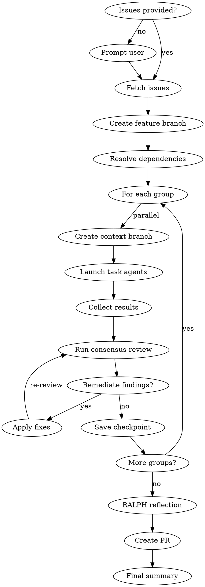

# Multi-Task Orchestration

Execute orchestration from GitHub issues or epics with parallel agents, dependency resolution, consensus reviews, and automatic remediation using contextd for memory, checkpoints, and context folding.

## Prerequisites: contextd REQUIRED

**This skill CANNOT function without contextd.**

Orchestration depends on:
- `branch_create` / `branch_return` for context isolation (CRITICAL)
- `checkpoint_save` / `checkpoint_resume` for state management
- `memory_record` for learning capture

**If contextd unavailable:**
1. STOP - inform user: "Orchestration requires contextd for context isolation"
2. Suggest: "Run `/contextd:init` to configure contextd"
3. NO FALLBACK - this skill is inoperable without contextd

## Shared Orchestration Patterns

This skill builds on shared orchestration patterns. See:
- `includes/orchestration/parallel-execution.md` - Agent dispatch and concurrency
- `includes/orchestration/result-synthesis.md` - Collecting and merging results
- `includes/orchestration/context-management.md` - Context folding and memory
- `includes/orchestration/checkpoint-patterns.md` - Save/resume workflows

The patterns below are **contextd-specific** extensions for issue-driven orchestration.

## Orchestration Flow



## Agents

| Agent | Purpose |
|-------|---------|
| `contextd:orchestrator` | This agent - manages workflow |
| `contextd:task-agent` | Executes individual tasks |

## Contextd Tools Required

**Memory:** `memory_search`, `memory_record`, `memory_consolidate`
**Checkpoints:** `checkpoint_save`, `checkpoint_resume`, `checkpoint_list`
**Context Folding:** `branch_create`, `branch_return`, `branch_status`
**Remediation:** `remediation_record`, `remediation_search`
**Reflection:** `reflect_analyze`, `reflect_report`

## Phase 0: Input Resolution

**If no issues provided, prompt the user:**

```
AskUserQuestion(
  questions: [{
    question: "Which issues or epic would you like to orchestrate?",
    header: "Issues",
    options: [
      { label: "Enter issue numbers", description: "Comma-separated list (e.g., 42,43,44)" },
      { label: "Select an epic", description: "Epic issue that contains sub-issues" },
      { label: "Current milestone", description: "All open issues in current milestone" }
    ],
    multiSelect: false
  }]
)
```

**For "Current milestone":**
```
gh issue list --milestone "$(gh api repos/:owner/:repo/milestones --jq '.[0].title')" --json number,title
-> Present list for confirmation
```

## Phase 1: Issue Discovery

```
1. Fetch issue details:
   gh issue view <number> --json number,title,body,labels,milestone

2. For epics (single issue with sub-issues):
   gh api graphql -f query='{ repository(owner:"X", name:"Y") {
     issue(number: N) { trackedIssues(first: 50) { nodes { number title } } }
   }}'

3. Extract task information:
   - number -> Task ID
   - title -> Task name
   - body -> Agent prompt (look for ## Agent Prompt or ## Description)
   - labels -> Priority (P0, P1, P2), type (feature, bug, etc.)
   - "Depends On: #XX" in body -> Dependencies

4. Record to memory:
   memory_record(title: "Orchestration: Issues #{list}", ...)
```

## Phase 1.5: Branch Setup (MANDATORY)

**NEVER push directly to main. ALWAYS create a feature branch first.**

```
1. Generate branch name from epic/issue:
   branch_name = "feature/issue-{epic_number}-{sanitized_title}"
   Example: "feature/issue-123-locomo-benchmark"

2. Create and checkout feature branch:
   git checkout -b {branch_name}

3. Verify branch:
   git branch --show-current
   → Must NOT be "main" or "master"

4. If already on main with uncommitted changes:
   git stash
   git checkout -b {branch_name}
   git stash pop
```

**Why this matters:**
- Enables code review before merge
- Provides rollback capability
- Maintains audit trail
- Allows CI/CD validation

## Phase 2: Initialization

```
1. Read engineering practices:
   Read("CLAUDE.md"), Read("engineering-practices.md")

2. Search past orchestrations:
   memory_search(project_id, "orchestration", limit: 5)

3. If resuming:
   checkpoint_list(session_id: "orchestrate-{issue_ids}")
   checkpoint_resume(checkpoint_id)

4. Create main context branch:
   branch_create(description: "Orchestration: #{issue_ids}", budget: 16384)

5. Save initial checkpoint:
   checkpoint_save(name: "orchestrate-start")
```

## Phase 3: Dependency Resolution

```
1. Build dependency graph from issue relationships
2. Generate parallel groups (topological sort)
3. Validate no circular dependencies

Example:
  #42 depends on nothing -> Group 1
  #43 depends on nothing -> Group 1
  #44 depends on #42 -> Group 2
  #45 depends on #43, #44 -> Group 3
```

## Phase 4: Group Execution

See `includes/orchestration/parallel-execution.md` for agent dispatch patterns.

For each dependency group:

```
1. Create context branch (budget: 8192)
   branch_create(description: "Group {n}: #{issue_numbers}")

2. Launch parallel task agents for issues in group:
   Task(
     subagent_type: "contextd:task-agent",
     prompt: |
       # Issue #{number}: {title}

       {issue_body}

       ## Contextd Integration
       - Record decisions with memory_record
       - Record fixes with remediation_record
       - Update issue with progress comments via `gh issue comment`
     description: "Issue #{number}: {title}",
     run_in_background: true
   )

3. Monitor and collect results:
   TaskOutput(task_id, block=false)
   branch_status(branch_id) -> check budget

4. Return from branch:
   branch_return(message: "Group complete: {summary}")
```

## Phase 5: Consensus Review

See `includes/orchestration/result-synthesis.md` for result collection and conflict resolution.
See `includes/orchestration/consensus-review.md` for consensus patterns and thresholds.

### 100% Consensus Requirement

Task orchestration requires **100% consensus** from all reviewers:

| Requirement | Threshold |
|-------------|-----------|
| Consensus Score | 100% |
| Vetoes | 0 (any veto blocks) |
| Critical/High | 0 |

If any reviewer vetoes or finds critical/high issues:
1. Create remediation task
2. Fix the issues
3. Re-run full review
4. Continue until 100% consensus

After each group:

```
1. Launch review agents in parallel:
   Task(subagent_type: "fs-dev:security-reviewer", ...)
   Task(subagent_type: "fs-dev:vulnerability-reviewer", ...)
   Task(subagent_type: "fs-dev:code-quality-reviewer", ...)
   Task(subagent_type: "fs-dev:documentation-reviewer", ...)
   Task(subagent_type: "fs-dev:go-reviewer", ...)  # if Go code

2. Collect verdicts using result synthesis patterns
   - Parse findings from each reviewer
   - Detect conflicts between reviewers
   - Record to memory_record

3. Calculate consensus:
   consensus_score = (approvals / total_reviewers) * 100

4. Apply veto threshold:
   - strict: ALL findings must be fixed (100% consensus required)
   - standard: CRITICAL/HIGH must be fixed (security/vulnerability have veto power)
   - advisory: Log only, continue

5. If consensus < 100% OR any veto:
   - Create remediation tasks for all blocking findings
   - Fix issues
   - Re-run full review
   - Loop until 100% consensus
```

## Phase 6: Remediation

If findings require fixes:

```
1. Search past remediations:
   remediation_search(query: "{finding.type}")

2. Apply fixes, run tests

3. Record new remediation:
   remediation_record(error_signature, root_cause, solution)

4. Re-run review if needed
```

## Phase 7: Checkpoint

See `includes/orchestration/checkpoint-patterns.md` for checkpoint naming and retention.

After each group passes review:

```
checkpoint_save(
  name: "orchestrate-group-{n}-complete",
  summary: "Completed: #{issues}, Remaining: #{remaining}"
)
```

## Phase 8: RALPH Reflection

After all groups complete:

```
1. Analyze patterns:
   reflect_analyze(project_id, period_days: 1)

2. Consolidate similar learnings:
   memory_consolidate(similarity_threshold: 0.8)

3. Generate report:
   reflect_report(format: "markdown")
```

## Phase 9: Final Summary & PR Creation

**NEVER push directly to main. ALWAYS create a pull request.**

```
1. Return from main branch:
   branch_return(message: "Orchestration complete: {metrics}")

2. Push feature branch to remote:
   git push -u origin {branch_name}

3. Create pull request:
   gh pr create \
     --title "feat: {epic_title}" \
     --body "## Summary
   Orchestrated implementation of #{epic_number}.

   ## Issues Completed
   - #{issue_list}

   ## Consensus Review
   All groups passed {threshold} review.

   ## Test Results
   {test_summary}"

4. Update issues with PR link:
   gh issue comment <number> --body "Implementation PR: #{pr_url}"

5. Record final memory:
   memory_record(title: "Orchestration Complete", outcome: "success")

6. Save final checkpoint:
   checkpoint_save(name: "orchestrate-complete")
```

**Do NOT close issues until PR is merged.**

## Issue Body Format

Issues should include an agent prompt section:

```markdown
## Description
Brief description of what this issue accomplishes.

## Agent Prompt
Detailed instructions for the task agent.

## Acceptance Criteria
- [ ] Criterion 1
- [ ] Criterion 2

## Dependencies
Depends On: #42, #43
```

## Review Thresholds

| Threshold | Behavior |
|-----------|----------|
| `strict` | 100% findings addressed before proceeding |
| `standard` | Security/vulnerability vetoes block, others advisory |
| `advisory` | Report only, continue execution |

## Resume Capability

```
/contextd:orchestrate --resume "group-2-complete"

-> Loads checkpoint state
-> Skips completed groups
-> Continues from saved point
```

## Anti-Patterns

See shared anti-patterns in `includes/orchestration/` files.

**Issue-specific anti-patterns:**

| Pattern | Problem | Solution |
|---------|---------|----------|
| Push directly to main | Bypasses review, no rollback | ALWAYS create feature branch + PR |
| Skip input prompt | User confusion | ALWAYS use AskUserQuestion if no issues |
| Skip pre-flight | Miss past learnings | ALWAYS search memory first |
| Monolith execution | No isolation | Use context branches per group |
| Skip remediation recording | Knowledge lost | ALWAYS record fixes |
| Over-budget branches | Context overflow | Monitor with branch_status |
| No GitHub comments | Lost visibility | Update issues with progress |
| Ignore dependencies | Execution order wrong | Parse "Depends On" in issue body |
| Close issues before merge | Premature closure | Wait for PR merge to close issues |

---

## Resource Monitoring

See `includes/orchestration/context-management.md` for base budget patterns.

### Issue Group Budget Tracking

Track budget per dependency group using `branch_status`:

```json
{
  "per_group_budget": {
    "group_1": { "allocated": 10000, "used": 8500, "issues": [42, 43] },
    "group_2": { "allocated": 10000, "used": 6200, "issues": [44] },
    "group_3": { "allocated": 10000, "used": 0, "issues": [45] }
  }
}
```

### Branch-Based Monitoring

```
Every 5 minutes OR after each task:
  1. branch_status(branch_id) -> get token usage
  2. Compare to thresholds (70% warning, 90% critical)
  3. If warning: checkpoint_save(auto_created: true)
  4. If critical: pause, notify, wait for user
```

---

## Concurrency Limits

See `includes/orchestration/parallel-execution.md` for base concurrency patterns.

### Issue-Driven Concurrency

For GitHub issue orchestration, concurrency is managed per dependency group:

```json
{
  "issue_concurrency": {
    "max_parallel_agents": 4,
    "max_per_group": 2,
    "queue_overflow": "wait",
    "timeout_minutes": 30,
    "priority_labels": ["P0", "P1", "P2"]
  }
}
```

**Priority override:** Issues with `P0` label execute before `P1`/`P2` when queue is full.

---

## Dead Letter Queue for Failed Tasks

See `includes/orchestration/parallel-execution.md` for base retry and error handling patterns.

### Issue-Specific DLQ

Failed issues are tracked with GitHub integration:

```json
{
  "dlq_entry": {
    "task_id": "task_abc123",
    "issue_number": 42,
    "failure_reason": "timeout after 30 minutes",
    "error_message": "Agent did not complete within budget",
    "retry_count": 2,
    "max_retries": 3,
    "github_comment": true
  }
}
```

### DLQ Escalation

| Failures | Action |
|----------|--------|
| 3+ | Notify user |
| 5+ | Pause orchestration, await confirmation |
| 10+ | Abort, add comment to epic issue |

### Issue Failure Correlation

```
dlq_analyze() for issues:
  - Correlated issues (same dependency failing)
  - Label patterns (bug issues failing more)
  - Recommendations (increase budget, split issues)
```

---

## Unified Memory Type References

Tag orchestration artifacts with standard types:

| Artifact | Tag | Purpose |
|----------|-----|---------|
| Orchestration start | `type:decision`, `category:planning` | Track scope |
| Task completion | `type:learning`, `category:execution` | What worked |
| Task failure | `type:failure`, `category:execution` | What failed |
| Remediation applied | `type:remediation`, `category:fix` | Error patterns |
| Review findings | `type:pattern`, `category:quality` | Code patterns |

---

## Hierarchical Namespace Guidance

### Orchestration Namespaces

```
<org>/<project>/orchestrations/<orchestration_id>

Examples:
  fyrsmithlabs/contextd/orchestrations/epic-42
  fyrsmithlabs/marketplace/orchestrations/v1.6-release
```

### Nested Task Namespaces

```
<orchestration_namespace>/groups/<group_id>/tasks/<task_id>

Example:
  fyrsmithlabs/contextd/orchestrations/epic-42/groups/1/tasks/issue-43
```

---

## Audit Fields

All orchestration records include:

| Field | Description | Auto-set |
|-------|-------------|----------|
| `created_by` | Orchestrator session | Yes |
| `created_at` | Start timestamp | Yes |
| `completed_at` | End timestamp | Yes |
| `duration_seconds` | Total execution time | Yes |
| `task_count` | Number of tasks | Yes |
| `success_count` | Completed tasks | Yes |
| `failure_count` | Failed tasks | Yes |

---

## Claude Code 2.1 Patterns

See `includes/orchestration/parallel-execution.md` for base Task tool patterns.

### Issue-to-Task Mapping

Map GitHub issue dependencies to Task dependencies:

```
# Group 1 (parallel - no issue dependencies)
task_42 = Task(prompt: "Execute issue #42", run_in_background: true)
task_43 = Task(prompt: "Execute issue #43", run_in_background: true)

# Group 2 (issue #44 depends on #42)
task_44 = Task(prompt: "Execute issue #44", addBlockedBy: [task_42.id])

# Group 3 (issue #45 depends on #43 and #44)
task_45 = Task(prompt: "Execute issue #45", addBlockedBy: [task_43.id, task_44.id])
```

### Orchestration Safety Hooks

Prevent dangerous operations during issue execution:

```json
{
  "hook_type": "PreToolUse",
  "tool_name": "Bash",
  "condition": "orchestration_active AND command.matches('git push --force|rm -rf')",
  "prompt": "Dangerous operation during orchestration. Checkpoint first and confirm with user."
}
```

### Issue Completion Hook

Auto-record task completions and update GitHub:

```json
{
  "hook_type": "PostToolUse",
  "tool_name": "Task",
  "condition": "task_completed AND orchestration_active",
  "prompt": "Task completed. Record to memory_record, update issue with progress comment."
}
```

---

## Event-Driven State Sharing

Orchestration emits events for other skills:

```json
{
  "event": "orchestration_started",
  "payload": {
    "orchestration_id": "epic-42",
    "issues": [42, 43, 44, 45],
    "groups": 3,
    "estimated_duration": "2 hours"
  },
  "notify": ["workflow", "consensus-review"]
}
```

Subscribe to orchestration events:
- `orchestration_started` - Orchestration began
- `group_started` - Group execution began
- `task_started` - Individual task began
- `task_completed` - Task finished (success or failure)
- `task_failed` - Task moved to DLQ
- `group_completed` - All tasks in group done
- `review_triggered` - Consensus review started
- `orchestration_paused` - Budget/failure pause
- `orchestration_completed` - All groups done

---
> Converted and distributed by [TomeVault](https://tomevault.io/claim/fyrsmithlabs) — claim your Tome and manage your conversions.
<!-- tomevault:4.0:skill_md:2026-04-15 -->
