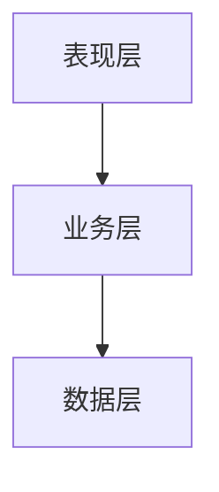
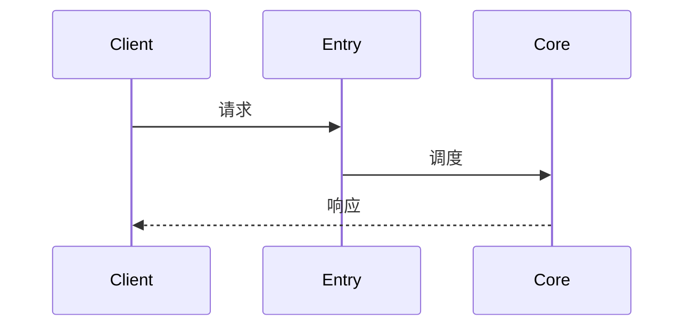

AI README 生成器
本 Skill 用于为项目自动生成「AI + 人类」共用的项目规则文档，全部规则与模板都内联在本文件里，不依赖任何外部 references/ 或 assets/。
目标产物结构
项目根/
├── AGENTS.md # 面向 AI Agent 的项目入口（必生成）
└── .cursor/rules/ai-readme/
 ├── RULE.mdc # 必读入口 + 快速导航
 ├── generated/ # AI 从代码扫描出的"技术事实"
 │ ├── 项目结构.mdc
 │ ├── 技术架构.mdc
 │ ├── 开发指南.mdc
 │ └── 核心流程.mdc
 └── manual/ # 待人工补充的"业务知识"
 ├── 业务知识.mdc
 └── 历史经验.mdc
核心原则
类目	谁写	原则
generated/	AI 写	只写"代码里能看到"的客观信息（结构、技术栈、命令、调用链）
manual/	人写（AI 给模板）	业务术语、领域规则、踩坑——AI 只生成空模板，已存在则跳过
AGENTS.md	AI 写	项目入口：概述 + 命令 + 边界，每次都重新生成
RULE.mdc	AI 写	快速导航；每写完一份 generated/ 立即更新此文件中的状态
执行流程（按顺序执行，不要跳步）
阶段 1：扫描
1. 读项目根的依赖文件，识别语言与框架：
2. package.json / pnpm-lock.yaml → JS/TS
3. pom.xml / build.gradle → Java
4. pyproject.toml / requirements.txt → Python
5. Cargo.toml → Rust
6. go.mod → Go
7. 用 Glob 列出 src/、app/、lib/、tests/ 等核心目录
8. 抽样阅读 3~5 个核心源文件，识别分层与入口
9. 检查 .cursor/rules/ai-readme/ 是否已存在产物：
10. 不存在 → 全量生成
11. 存在 → 增量更新（保留 manual/，重写 generated/ 与 RULE.mdc）
阶段 2：制定 todo
用 todo 工具列出 7 项任务，逐项完成：
1. 写 RULE.mdc（先骨架）
2. 写 generated/项目结构.mdc → 立即把 RULE.mdc 中对应行 [ ] 改为 [x]
3. 写 generated/技术架构.mdc → 立即更新 RULE.mdc
4. 写 generated/开发指南.mdc → 立即更新 RULE.mdc
5. 写 generated/核心流程.mdc → 立即更新 RULE.mdc
6. 写 manual/ 模板（已存在则跳过）
7. 写项目根 AGENTS.md
阶段 3：自检
●  所有 generated/ 在 RULE.mdc 中是否都已 [x]
●  「项目结构 → 技术架构 → 核心流程」三处描述同一入口/类名是否一致
●  是否给用户列出了"需要人工补充的 TODO"清单
硬性约束
● 禁止覆盖manual/ 已存在的文件
● 禁止使用 Emoji（⚠️ 除外）
● 不要凭空捏造 API、路径、命令；不确定就标 <!-- TODO -->
● 每个 .mdc 文档至少包含 1 个 Mermaid 或 ASCII 图
● 每个 .mdc 文档必须有 frontmatter：description + alwaysApply: false
● 写入文件前先用 Read 工具确认文件是否存在；存在且属于 manual/ 时跳过

模板：RULE.mdc
---
description: "AI README 必读入口 - 项目规则导航；任何任务前先读此文件"
alwaysApply: false
---
# AI README - 项目规则入口
## 项目总览
<!-- 一段话描述项目定位 -->

## 生成信息
- 生成时间：YYYY-MM-DD HH:mm
- 生成分支：<branch>
## 快速导航
### AI 生成文档（generated/）
- [] [项目结构](./generated/项目结构.mdc) - 目录树、模块划分；了解代码组织时使用
- [] [技术架构](./generated/技术架构.mdc) - 分层架构、技术栈；了解技术选型时使用
- [] [开发指南](./generated/开发指南.mdc) - 环境搭建、构建/启动命令；上手时使用
- [] [核心流程](./generated/核心流程.mdc) - 主要业务调用链；理解系统时使用
### 人工维护文档（manual/）
- [] [业务知识](./manual/业务知识.mdc) - 项目背景、领域术语、业务规则
- [] [历史经验](./manual/历史经验.mdc) - 踩坑记录；写代码前必读
完成一份 generated/ 后，把对应行的 [ ] 改为 [x] 并追加时间戳，例如：
- [x] [项目结构](./generated/项目结构.mdc) - ... (2026-04-28 16:30)


模板：generated/项目结构.mdc
---
description: "项目结构 - 目录树、模块划分、依赖关系；当需要了解代码组织时使用"
alwaysApply: false
---
<!-- AI生成，可根据团队规范更新 -->
# 项目结构
## 目录树
```
项目根/
├── ...
```
## 模块职责
| 目录 | 职责 | 关键文件 |
| --- | --- | --- |
## 模块依赖关系


模板：generated/技术架构.mdc
---
description: "技术架构 - 分层架构和技术栈清单；当需要了解技术选型时使用"
alwaysApply: false
---
<!-- AI生成，可根据团队规范更新 -->
# 技术架构
## 架构总览

## 分层说明
| 分层 | 职责 | 主要类/文件 |
| --- | --- | --- |
## 技术栈
| 类目 | 技术 | 版本 | 用途 |
| --- | --- | --- | --- |
| 语言/运行时 | | | |
| 主框架 | | | |
| 测试框架 | | | |
| 构建工具 | | | |


模板：generated/开发指南.mdc
---
description: "开发指南 - 环境搭建、启动命令、配置说明；当需要设置开发环境时使用"
alwaysApply: false
---
<!-- AI生成，可根据团队规范更新 -->
# 开发指南
## 环境准备
| 工具 | 版本 |
| --- | --- |
## 常用命令
| 操作 | 命令 |
| --- | --- |
| 安装依赖 | |
| 本地启动 | |
| 构建打包 | |
| 运行测试 | |
| 代码检查 | |
## 配置文件清单
| 文件 | 作用 |
| --- | --- |
## 调试与验证
<!-- 健康检查、本地访问入口、日志位置 -->


模板：generated/核心流程.mdc
---
description: "核心流程 - 主要业务调用链；当需要理解系统运作时使用"
alwaysApply: false
---
<!-- AI生成，可根据团队规范更新 -->
# 核心流程
> 提示：以下流程由 AI 从代码推断而来，**请用户确认 P0/P1 是否就是团队认知中的核心**。
## 流程清单
| 优先级 | 流程名 | 入口 | 备注 |
| --- | --- | --- | --- |
| P0 | | | |
| P1 | | | |
## 流程 1：<名称>

### 调用链
1. <文件:类.方法>
2. ...
### 关键分支
<!-- 异常、降级、缓存命中等 -->


模板：manual/业务知识.mdc（仅在不存在时创建）
---
description: "业务知识 - 项目背景、领域术语、业务规则；当需要理解业务上下文时使用"
alwaysApply: false
---
# 业务知识
## 项目背景
<!-- TODO: 一句话描述项目 + 解决什么问题 + 服务谁 -->
## 领域术语
| 术语 | 代码名 | 业务含义 |
| --- | --- | --- |
## 核心业务规则
<!-- TODO: 状态流转 / 计算规则 / 限制条件 -->


模板：manual/历史经验.mdc（仅在不存在时创建）
---
description: "历史经验 - 踩坑记录；AI 写代码或做方案前必读"
alwaysApply: false
---
# 历史经验
> AI 与新成员写代码前先看这里，避免重复踩坑。
## 踩坑记录
<!-- TODO: 问题 → 原因 → 方案 -->


模板：项目根目录 AGENTS.md
# AGENTS.md
## 项目概述
<!-- 一句话项目定位 + 核心能力 -->
## 开发命令
- 安装依赖：
- 本地启动：
- 构建打包：
- 运行测试：
## 关键目录
-`src/` -
-`tests/` -
## 边界约束
<!-- 团队约定、注解/导入限制、不要做的事 -->
## AI 上下文
详细规则见 `.cursor/rules/ai-readme/RULE.mdc`：
- 架构：`.cursor/rules/ai-readme/generated/技术架构.mdc`
- 流程：`.cursor/rules/ai-readme/generated/核心流程.mdc`
- 业务（人工维护）：`.cursor/rules/ai-readme/manual/业务知识.mdc`
- 踩坑（人工维护）：`.cursor/rules/ai-readme/manual/历史经验.mdc`


验收标准
执行完毕后，必须输出：
1. 已生成文件清单（含路径、大小）
2. 每份文档当前状态（[x] / [ ] / [?]）
3. 需要人工补充的 TODO 清单（来自 manual/ 中的 <!-- TODO -->）
4. 推荐的下一步动作（哪几处建议团队第一时间补全）

---
> Source: [gabrielmoreira/agent-skills-mirror](https://github.com/gabrielmoreira/agent-skills-mirror) — distributed by [TomeVault](https://tomevault.io).
<!-- tomevault:4.0:skill_md:2026-05-23 -->
