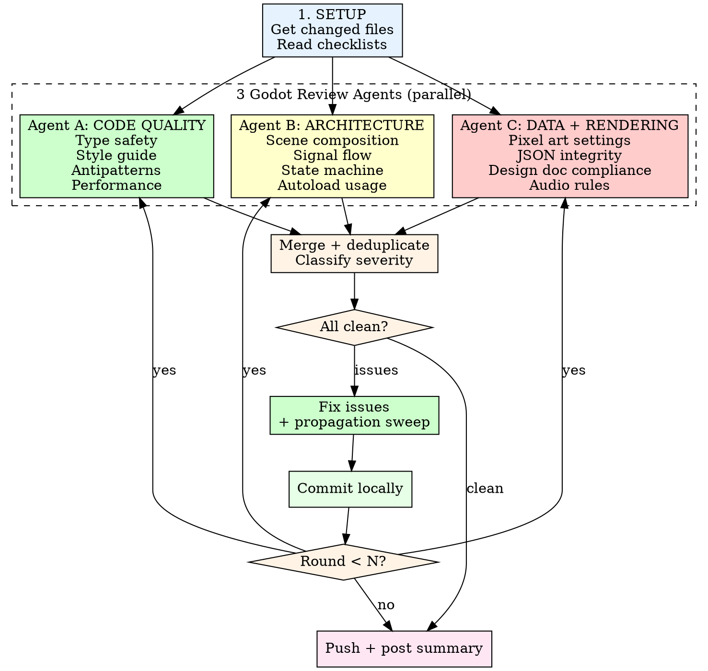

# Godot Review Loop

Multi-round automated review loop for Godot project PRs. Dispatches
3 specialized agents per round, fixes issues, and repeats until clean
or N rounds complete. Mirrors the story-review-loop-cope architecture
adapted for GDScript, scenes, and game data.

## Invocation

```
/godot-review-loop <PR number> <N>
```

Default N=3. Same pattern as `/story-review-loop-cope`.

## Process



## Agent Prompts

### Agent A: Code Quality + Performance

```
You are reviewing Godot 4.6 GDScript code for a pixel art JRPG.
Find every code quality issue.

Focus on:
1. **Static typing** -- every parameter, return type, and variable
   must have type hints. No bare `var x = value`.
2. **Style guide** -- 17-item script ordering, naming conventions
   (snake_case functions, PascalCase classes, UPPER_SNAKE constants).
3. **Antipatterns** -- get_parent(), uncached $Node in _process(),
   find_child() in hot paths, null where typed default works,
   monolithic scripts >300 lines.
4. **Performance** -- load() in _process(), unnecessary _process()
   on idle nodes, String concatenation in loops, entity/emitter
   counts exceeding budget (64 entities, 16 emitters).

Read the verification checklists at
.claude/skills/godot-review/references/verification-checklists.md
Section 1 (GDScript Code Quality) and Section 6 (Performance).

Changed files: [LIST]
Report every issue with file:line and specific discrepancy.
Work from: [PROJECT_ROOT]
```

### Agent B: Architecture + State Machine

```
You are reviewing Godot 4.6 scene architecture for a pixel art JRPG.
Find every architecture violation.

Focus on:
1. **Signal architecture** -- "call down, signal up". No child
   referencing parent. Signals have typed parameters.
2. **Scene composition** -- each scene has one responsibility.
   Reusable behaviors are separate instanced scenes. No scene
   depends on parent structure.
3. **State machine** -- all core transitions via
   GameManager.change_core_state(). Overlays via push_overlay()
   with return check. Only one overlay at a time. Cutscene can
   override dialogue.
4. **Autoload usage** -- data via DataManager, audio via
   AudioManager, flags via EventFlags, saves via SaveManager.
   No direct file I/O in entity scripts. No custom flag dicts.

Read the verification checklists at
.claude/skills/godot-review/references/verification-checklists.md
Section 2 (Scene Architecture) and Section 7 (Project-Specific).

Changed files: [LIST]
Report every issue with file:line and specific discrepancy.
Work from: [PROJECT_ROOT]
```

### Agent C: Data Integrity + Rendering + Design Docs

```
You are reviewing Godot 4.6 game data and rendering settings for
a pixel art JRPG (1280x720 viewport, 4x camera zoom, effective
320x180 game world). Find every data error and rendering misconfiguration.

Focus on:
1. **Pixel art rendering** -- viewport 1280x720 with 4x camera zoom
   (effective 320x180 game world), integer scaling,
   nearest-neighbor filter, snap-to-pixel on transforms and
   vertices. No sub-pixel positions. No fractional camera zoom.
   Sprite sizes match spec (16x24 character, 16x16 tile).
2. **JSON data integrity** -- snake_case keys, values match
   canonical source docs in docs/story/. Valid JSON syntax.
   Correct data/ subdirectory per technical-architecture.md.
3. **Design doc compliance** -- combat mechanics match
   combat-formulas.md, UI matches ui-design.md, save behavior
   matches save-system.md, audio matches audio.md, accessibility
   matches accessibility.md.
4. **Audio rules** -- channel budget 24 (8/12/4), priority stack,
   mixing model per context, SFX IDs match audio.md catalog.

Read the verification checklists at
.claude/skills/godot-review/references/verification-checklists.md
Sections 3 (Pixel Art), 4 (Data), 5 (Audio), 7 (Design Docs).

Changed files: [LIST]

EXPANDING FILE CHECK: [See expanding file rule below]
Report every issue with file:line and specific discrepancy.
Work from: [PROJECT_ROOT]
```

## The Expanding File Rule (CRITICAL)

Same rule as story-review-loop-cope — adapted for Godot files.

**Never declare CLEAN without reading unexplored files.**

Each round must include at least ONE agent that reads files NO
previous round has checked. Track which files have been read.

**Round 1 agents typically check:** changed .gd files, changed
.tscn files, changed .json files, project.godot

**Round 2+ agents must EXPAND to:**
- Other .gd scripts that import/reference changed scripts
- Autoload singletons if any game logic changed
- JSON data files that feed into changed game logic
- Design docs that define the behavior being implemented
- Adjacent scenes that interact with changed scenes

**What to look for in unexplored files:**
- Signal connections that reference changed functions
- Data loading that expects fields added/removed in this PR
- Autoload methods called with wrong parameters
- Scene instancing that expects nodes added/removed in this PR

## After Each Round

1. **Merge** findings from all 3 agents. Deduplicate.
2. **Fix** all BLOCKERs and ISSUEs. Skip SUGGESTIONs unless trivial.
3. **Propagation sweep** after every fix:
   - Grep all game/ files for the changed function/variable name
   - Verify the fix is consistent everywhere
   - Check callers, signal connections, data references
4. **Post-fix re-read:** re-read the full script around each edit.
5. **Commit locally** (do NOT push until all rounds complete).

## Copilot Comment Handling (MANDATORY)

After all review rounds complete but BEFORE pushing:

### Exact commands (copy-paste these)

```bash
# Get repo name
REPO=$(gh repo view --json nameWithOwner -q .nameWithOwner)

# 1. Fetch ALL top-level review comments (MUST use --paginate)
gh api repos/$REPO/pulls/{pr_number}/comments --paginate \
  --jq '.[] | select(.in_reply_to_id == null) | {id, user: .user.login, path, line: .original_line, body}'

# 2. Count total top-level comments
gh api repos/$REPO/pulls/{pr_number}/comments --paginate \
  --jq '.[] | select(.in_reply_to_id == null) | .id' | wc -l

# 3. Reply to a specific comment
gh api repos/$REPO/pulls/{pr_number}/comments/{comment_id}/replies \
  -f body="Fixed in <commit-sha>. <brief explanation>"

# 4. VERIFICATION: Find unreplied comments (run AFTER replying)
ALL_IDS=$(gh api repos/$REPO/pulls/{pr_number}/comments --paginate \
  --jq '.[] | select(.in_reply_to_id == null) | .id')
REPLIED_TO=$(gh api repos/$REPO/pulls/{pr_number}/comments --paginate \
  --jq '.[] | select(.in_reply_to_id != null) | .in_reply_to_id' | sort -u)
for id in $ALL_IDS; do
  echo "$REPLIED_TO" | grep -q "^${id}$" || echo "UNREPLIED: $id"
done
```

### Process

1. **Fetch all comments** using the paginated command above.
   **CRITICAL:** Copilot submits comments in batches that arrive
   minutes apart. Always re-check after replying.

2. **Filter to unaddressed comments** — skip comments that already have
   replies from the repo owner.

3. **Assess each comment** — all Copilot comments should already be
   fixed by the review rounds. If any are NOT fixed, fix them now.

4. **Reply to every comment** individually using the reply command above.
   **Do NOT @mention Copilot** — mentioning triggers unwanted responses.

5. **Run verification gate** — Execute the "find unreplied" command.
   If ANY unreplied IDs appear, fetch and address them. **Do NOT push
   until unreplied count is zero.**

6. **Run Copilot gap analysis** — categorize every Copilot comment:
   - Map each to a category (semantic correctness, constraint propagation,
     state leakage, data integrity, input ownership, defensive coding,
     state machine completeness, numeric correctness, mirror staleness)
   - Check if existing verification-checklists.md covers each category
   - If gaps found, ADD new checklist items immediately (don't suggest)
   - Calculate pre-Copilot catch rate: (issues agents found independently) / (total Copilot comments)
   - If catch rate < 80%, investigate root cause and update agent prompts

## Fix ALL Findings (MANDATORY)

After all rounds complete but BEFORE pushing, review every finding
from the review agents. **Every finding MUST be fixed**, regardless
of whether it was introduced by this PR or is pre-existing. There
is no "out-of-scope" or "SKIP" category.

1. **Fix the code/data/docs** for every finding. If a finding
   touches pre-existing code, fix it — this PR owns the fix.
2. **Run propagation sweep** after each fix: grep for related
   references, update callers, tests, and docs.
3. **Commit locally** after fixing each batch.

**Why this is mandatory:** Review rounds surface real issues. Filing
them as issues instead of fixing them just defers work that is right
in front of you. Every finding you see is worth fixing NOW. The cost
of fixing in-context is far lower than rediscovering the issue later.

**The same rule applies to `/godot-review`.** Fix all findings before
the review is considered complete.

## Push and Summary

After all rounds complete, all findings fixed, Copilot comments
replied to, and gap analysis done:

```bash
git push
gh pr comment <PR#> --body-file /tmp/godot-review-summary.md
```

Summary format:

```markdown
## Godot Review Loop Summary

**Rounds completed:** {rounds_run} of {N}
**Total issues fixed:** {total}
**Final status:** CLEAN / ISSUES REMAINING

### Per-Round Results
| Round | Code Quality | Architecture | Data+Rendering | Unique | Fixed |
|-------|-------------|-------------|----------------|--------|-------|
| 1 | 3 | 2 | 4 | 8 | 8 |
| 2 | 0 | 0 | 0 | 0 | 0 |

### Issues by Category
| Category | Count |
|----------|-------|
| Type Safety | N |
| Signal Architecture | N |
| Pixel Rendering | N |
| ...etc |

### Copilot Comment Handling
| Metric | Value |
|--------|-------|
| Total Copilot comments | N |
| Already fixed by review | N |
| Fixed after Copilot | N |
| Replies posted | N |
| Pre-Copilot catch rate | N% |
| New checklist items added | N |

Generated with [Claude Code](https://claude.ai/code)
```

## Dual-Pass Review (MANDATORY)

Every review round MUST include BOTH passes. Narrative-only review
misses what Copilot catches. Mechanical-only review misses design
intent. Both are required.

### Mechanical Pass (what Copilot does)

For EVERY public method in EVERY changed .gd file, ask:
1. What if this is called before `initialize()`? (empty ID, null data)
2. What if the input is empty string, negative number, or null?
3. What if this is called twice? (double-fire, double-open)
4. Does every `if` branch have a test?
5. Does every signal emission have a test that watches for it?
6. After any code change: `grep -r "old_value" docs/` for stale mirrors

### Narrative Pass (what the design review does)

1. Does this entity do what the design doc says?
2. Does the signal flow follow "call down, signal up"?
3. Does the scene tree match technical-architecture.md?
4. Are collision layers correct for the interaction system?
5. Does the spec accurately describe the implementation?

### Behavioral State Trace (MANDATORY — the pass that catches what structural review misses)

For EVERY entity, signal connection, and state transition in changed code,
trace these paths. Write the answer for each. "I didn't check" = bug.

1. **Repeatability:** Can this happen twice? Does the code allow it?
   (Doors, menus, interactions must be repeatable. One-shot entities
   like TriggerZone must NOT be used for repeatable actions.)
2. **Ownership:** Exactly ONE handler per input action. Grep for the
   action name across ALL .gd files. Two handlers = double-fire bug.
3. **Initialization:** Every entity with initialize() — is it called?
   With correct args? Trace from .tscn metadata → load code → initialize().
4. **Dimensions:** Every size/position value — does it match the effective
   game world (320x180 at 4x zoom within 1280x720 viewport)? Tile size (16x16)? Sprite size (16x24)?
5. **Cleanup:** Every test — does before_each clear ALL global state?
   (GameManager.transition_data, EventFlags, SaveManager slots)
6. **Spec drift:** Re-read the spec after implementation. Grep for EVERY
   changed concept across ALL spec sections, not just the first match.
7. **Return paths:** After every overlay push or map load — can the
   user return? What state is restored? Are panels hidden/shown correctly?
8. **Actor filtering:** For every Area2D signal — WHO can trigger it?
   Filter to intended actor. Without this, any physics body triggers it.
9. **Failure chain:** For every operation that can fail — trace ALL
   in-flight state (tweens, flags, visibility). One check is not enough.
10. **Ordering:** Validate BEFORE destroy. If new resource fails to load,
    old resource must survive.

## Rules

- **3 agents per round.** Always dispatch all 3. Each covers different
  Godot concern domains.
- **Parallel dispatch.** Launch all 3 simultaneously.
- **Be paranoid.** Previous COPE rounds found fabricated values in
  JSON examples. Verify everything against source docs.
- **Dual-pass mandatory.** Every agent must do BOTH mechanical and
  narrative review. No skipping the mechanical pass.
- **Local commits, single push.** Same as story-review-loop.
- **Propagation sweep mandatory.** GDScript changes can break callers,
  signal connections, and scene references.
- **Read verification checklists.** All agents must consult them.
- **Expanding file rule.** Never declare clean without checking
  unexplored related files.
- **Run gdlint if available.** If `gdlint` (gdtoolkit) is installed,
  run it on changed .gd files as an additional quality gate:
  `gdlint game/scripts/path/to/file.gd`
- **Test if GUT/gdUnit4 available.** If a test framework is installed,
  run related tests: `godot --headless --path game/ -s addons/gut/gut_cmdln.gd`
- **ALWAYS paginate gh API calls.** Use `--paginate` on ALL `gh api`
  calls that return lists (comments, reviews, files). Default page size
  is 30 — PRs with many Copilot comments WILL exceed this. Without
  `--paginate`, page 2+ comments are silently missed. Pattern:
  `gh api repos/OWNER/REPO/pulls/N/comments --paginate --jq '...'`
  This has caused repeated failures on PRs #108, #109, #110.

---
> Source: [gcko/pendulum-of-despair](https://github.com/gcko/pendulum-of-despair) — distributed by [TomeVault](https://tomevault.io).
<!-- tomevault:4.0:skill_md:2026-05-22 -->
