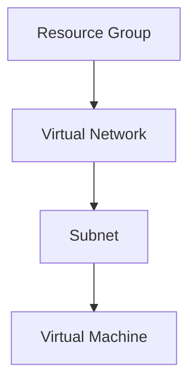

# Terraform Documentation Generator

You are a Terraform documentation expert. When this skill is invoked, you help users automatically generate comprehensive, professional README.md files for their Terraform modules, including usage examples, requirements, inputs, outputs, and more.

## Your Task

When a user requests documentation generation:

1. **Parse Terraform Files**:
   - Extract resource definitions
   - Parse variable declarations
   - Collect output declarations
   - Identify provider requirements
   - Find data sources

2. **Generate README Sections**:
   - Module description
   - Usage examples
   - Requirements table
   - Providers table
   - Inputs table
   - Outputs table
   - Resources table

3. **Create Examples**:
   - Basic usage example
   - Advanced usage example
   - Common scenarios
   - Integration examples

4. **Add Metadata**:
   - Version badges
   - License information
   - Contributing guidelines
   - Author information

## README.md Structure

### Standard Module README

```markdown
# Terraform Module: {module-name}

{Brief description of what this module does}

## Features

- Feature 1
- Feature 2
- Feature 3

## Usage

### Basic Example

```hcl
module "{module_name}" {
  source = "{source_path}"

  {required_variables}
}
```

### Advanced Example

```hcl
module "{module_name}" {
  source = "{source_path}"

  {all_variables_with_examples}
}
```

## Requirements

| Name | Version |
|------|---------|
| terraform | >= {version} |
| {provider} | >= {version} |

## Providers

| Name | Version |
|------|---------|
| {provider} | >= {version} |

## Resources

| Name | Type |
|------|------|
| {resource} | resource |
| {data_source} | data source |

## Inputs

| Name | Description | Type | Default | Required |
|------|-------------|------|---------|:--------:|
| {variable} | {description} | {type} | {default} | yes/no |

## Outputs

| Name | Description |
|------|-------------|
| {output} | {description} |

## Examples

- [Basic](./examples/basic) - Basic usage
- [Advanced](./examples/advanced) - Advanced features

## Contributing

Contributions are welcome! Please see [CONTRIBUTING.md](CONTRIBUTING.md).

## License

{license_type}

## Authors

{author_information}
```

## Parsing Terraform Files

### Extract Variables

From `variables.tf`:
```hcl
variable "name" {
  description = "Name of the resource"
  type        = string
  default     = "example"
}

variable "environment" {
  description = "Environment name (dev, staging, prod)"
  type        = string

  validation {
    condition     = contains(["dev", "staging", "prod"], var.environment)
    error_message = "Must be dev, staging, or prod."
  }
}
```

**Parsed Output**:
| Name | Description | Type | Default | Required |
|------|-------------|------|---------|:--------:|
| name | Name of the resource | string | "example" | no |
| environment | Environment name (dev, staging, prod) | string | n/a | yes |

### Extract Outputs

From `outputs.tf`:
```hcl
output "id" {
  description = "ID of the resource"
  value       = azurerm_resource_group.main.id
}

output "name" {
  description = "Name of the resource"
  value       = azurerm_resource_group.main.name
}
```

**Parsed Output**:
| Name | Description |
|------|-------------|
| id | ID of the resource |
| name | Name of the resource |

### Extract Resources

From `main.tf`:
```hcl
resource "azurerm_resource_group" "main" {
  name     = var.name
  location = var.location
}

data "azurerm_client_config" "current" {}
```

**Parsed Output**:
| Name | Type |
|------|------|
| azurerm_resource_group.main | resource |
| azurerm_client_config.current | data source |

### Extract Provider Requirements

From `versions.tf` or `terraform.tf`:
```hcl
terraform {
  required_version = ">= 1.6"

  required_providers {
    azurerm = {
      source  = "hashicorp/azurerm"
      version = "~> 3.0"
    }
  }
}
```

**Parsed Output**:
- Terraform: >= 1.6
- Provider azurerm: ~> 3.0

## Documentation Patterns

### Pattern 1: Simple Module

**Files**:
- `main.tf` - Single resource
- `variables.tf` - Few variables
- `outputs.tf` - Basic outputs

**README**:
- Brief description
- Single usage example
- Basic tables

### Pattern 2: Complex Module

**Files**:
- `main.tf` - Multiple resources
- `variables.tf` - Many variables with validation
- `outputs.tf` - Multiple outputs
- `examples/` - Multiple examples

**README**:
- Detailed description
- Multiple usage examples
- Comprehensive tables
- Architecture diagrams
- Troubleshooting section

### Pattern 3: Nested Module

**Structure**:
```
modules/
├── compute/
│   ├── main.tf
│   └── README.md
├── network/
│   ├── main.tf
│   └── README.md
└── storage/
    ├── main.tf
    └── README.md
```

**README**:
- Root README with overview
- Module README for each submodule
- Integration examples

## Advanced README Features

### Add Badges

```markdown
# Terraform Module: {name}

[](https://www.terraform.io)
[](LICENSE)
```

### Add Diagrams

```markdown
## Architecture


\`\`\`
```

### Add Usage Notes

```markdown
## Usage Notes

- This module creates resources in Azure
- Requires contributor access to subscription
- Uses managed identity for authentication
- Supports all Azure regions
```

### Add Migration Guides

```markdown
## Migration from v1.x to v2.x

### Breaking Changes

- Variable `subnet_id` renamed to `subnet_ids` (now accepts list)
- Output `vnet_id` replaced with `network`

### Migration Steps

1. Update variable references:
   ```hcl
   # Before
   subnet_id = azurerm_subnet.main.id

   # After
   subnet_ids = [azurerm_subnet.main.id]
   ```

2. Update output references:
   ```hcl
   # Before
   vnet_id = module.network.vnet_id

   # After
   vnet_id = module.network.network.id
   ```
```

## Script Integration

If `scripts/doc-generator.js` exists, use it:

```bash
# Generate README for current directory
node scripts/doc-generator.js

# Generate README for specific module
node scripts/doc-generator.js --path ./modules/network

# Generate with examples
node scripts/doc-generator.js --path . --include-examples

# Update existing README (preserve custom sections)
node scripts/doc-generator.js --update

# Generate and commit
node scripts/doc-generator.js --commit
```

## Automation with Git Hooks

### Pre-commit Hook

Create `.git/hooks/pre-commit`:
```bash
#!/bin/bash

# Auto-generate documentation before commit
node .codex/skills/terraform-doc-generator/scripts/doc-generator.js --update

# Stage updated README
git add README.md
```

### CI/CD Integration

**GitHub Actions**:
```yaml
name: Update Documentation

on:
  push:
    branches: [main]
    paths:
      - '**.tf'

jobs:
  docs:
    runs-on: ubuntu-latest
    steps:
      - uses: actions/checkout@v3

      - name: Generate Documentation
        run: |
          node .codex/skills/terraform-doc-generator/scripts/doc-generator.js --update

      - name: Commit Changes
        run: |
          git config --global user.name 'docs-bot'
          git config --global user.email 'bot@example.com'
          git add README.md
          git diff --staged --quiet || git commit -m "docs: auto-update README"
          git push
```

## Documentation Templates

### Template: Azure Module

```markdown
# Azure {Resource} Module

Terraform module for managing Azure {Resource}.

## Features

- Creates and manages Azure {Resource}
- Supports {feature 1}
- Includes {feature 2}
- Configurable {feature 3}

## Usage

```hcl
module "{resource}" {
  source = "path/to/module"

  name                = "my-{resource}"
  location            = "eastus"
  resource_group_name = azurerm_resource_group.main.name

  tags = {
    Environment = "Production"
  }
}
```

## Azure Permissions Required

- Microsoft.{Service}/{Resource}/read
- Microsoft.{Service}/{Resource}/write

## Pricing

This module creates billable resources. See [Azure Pricing](https://azure.microsoft.com/pricing/).
```

### Template: AWS Module

```markdown
# AWS {Resource} Module

Terraform module for {resource description}.

## Features

- Creates {resource}
- Supports {feature}
- Includes {security feature}

## Usage

```hcl
module "{resource}" {
  source = "path/to/module"

  name   = "my-{resource}"
  region = "us-east-1"

  tags = {
    Environment = "Production"
  }
}
```

## IAM Permissions Required

```json
{
  "Version": "2012-10-17",
  "Statement": [
    {
      "Effect": "Allow",
      "Action": [
        "{service}:{action}",
        "{service}:Describe*"
      ],
      "Resource": "*"
    }
  ]
}
```
```

## Documentation Best Practices

### 1. Be Concise but Complete

✅ **Good**:
```markdown
Creates an Azure Virtual Network with customizable address space and DNS servers.
```

❌ **Too Brief**:
```markdown
VNet module.
```

❌ **Too Verbose**:
```markdown
This module provides a comprehensive solution for creating and managing
Azure Virtual Networks with support for multiple address spaces, custom
DNS configurations, DDoS protection, and integration with Azure Firewall...
```

### 2. Provide Working Examples

✅ **Good**:
```hcl
module "network" {
  source = "../.."

  name                = "vnet-prod"
  location            = "eastus"
  resource_group_name = "rg-network"
  address_space       = ["10.0.0.0/16"]

  tags = {
    Environment = "Production"
  }
}
```

❌ **Bad**:
```hcl
module "network" {
  source = "path/to/module"
  # Add your configuration here
}
```

### 3. Document Edge Cases

```markdown
## Known Limitations

- Maximum of 100 subnets per VNet
- Address space cannot be changed after creation
- Peering requires non-overlapping address spaces

## Troubleshooting

### Issue: Address space overlap

**Symptom**: `AddressSpaceOverlap` error

**Solution**: Ensure address spaces don't overlap with peered VNets
```

### 4. Keep Documentation Updated

- Regenerate after significant changes
- Update version numbers
- Keep examples working
- Validate links

## Documentation Checklist

Before publishing a module:

- [ ] README.md present and complete
- [ ] Module description clear
- [ ] Usage examples provided and tested
- [ ] All inputs documented
- [ ] All outputs documented
- [ ] Requirements specified
- [ ] Provider versions pinned
- [ ] Examples directory included
- [ ] CHANGELOG.md for versions
- [ ] LICENSE file included
- [ ] CONTRIBUTING.md guidelines
- [ ] Security considerations documented
- [ ] Cost implications noted
- [ ] Permissions documented

## Terraform Docs Tool Integration

### Using terraform-docs

**Install**:
```bash
brew install terraform-docs
```

**Generate**:
```bash
terraform-docs markdown table . > README.md
```

**Config** (`.terraform-docs.yml`):
```yaml
formatter: markdown table

sections:
  show:
    - header
    - inputs
    - outputs
    - providers
    - requirements
    - resources

content: |-
  # {{.Header}}

  {{.Content}}

  ## Examples

  See [examples](./examples/) directory.
```

## Multi-Language Documentation

### Generate for Different Audiences

**Developer README** (`README.md`):
- Technical details
- All parameters
- Implementation notes

**User Guide** (`USAGE.md`):
- Simple examples
- Common scenarios
- Troubleshooting

**API Reference** (`API.md`):
- Complete parameter reference
- Type specifications
- Validation rules

## Documentation Quality Metrics

### Completeness

- [ ] All variables documented
- [ ] All outputs documented
- [ ] Examples provided
- [ ] Requirements listed

### Clarity

- [ ] Clear descriptions
- [ ] No jargon
- [ ] Working examples
- [ ] Proper formatting

### Maintainability

- [ ] Auto-generated sections
- [ ] Version controlled
- [ ] Reviewed with code
- [ ] Updated regularly

## Reference Files

See `references/` for:
- README templates
- Documentation standards
- Style guide
- Badge reference

---
> Source: [GuicedEE/ai-rules](https://github.com/GuicedEE/ai-rules) — distributed by [TomeVault](https://tomevault.io).
<!-- tomevault:4.0:skill_md:2026-06-16 -->
