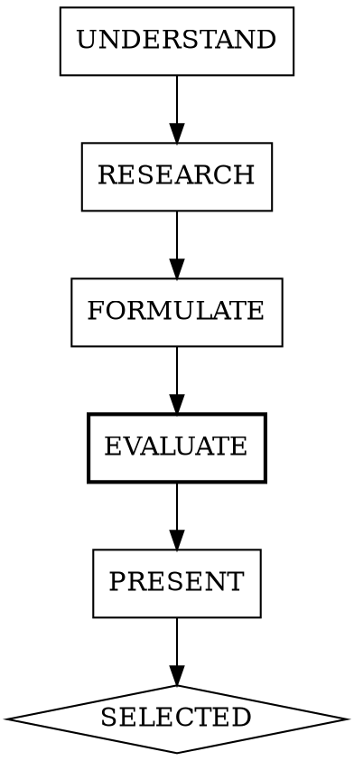

# Planning

## Overview

Research-first planning. Validate approaches against real documentation, real codebases, and real implementations before writing code. Dual-engine evaluation cross-validates feasibility.

**Core principle:** No implementation without evidence-backed, cross-validated approach selection.

**Announce at start:** "I'm using the planning skill to research approaches before implementation."

## When to Use

- New feature requiring architectural decisions
- Unfamiliar library or pattern
- Multiple valid approaches exist
- User asks "how should we build X?"

**Don't use for:** Single-line fixes, obvious bugs, tasks with explicit instructions.

## State Persistence

All planning artifacts are persisted to enable plan-to-review linkage:

```
plans/{slug}/
  state.json          # phase, timestamp, selected approach
  approaches.json     # the 3 approaches with evidence
  claude-eval.json    # Claude's evaluation
  codex-eval.json     # Codex's evaluation (or skip marker)
  merged-eval.json    # merged evaluation result
```

Generate slug from feature name: lowercase, hyphens for spaces, strip special chars, truncate to 50 chars.

**state.json:**
```json
{
  "feature": "description",
  "phase": "UNDERSTAND|RESEARCH|FORMULATE|EVALUATE|PRESENT|SELECTED",
  "timestamp": "ISO-8601",
  "selectedApproach": null
}
```

## The Process



### UNDERSTAND

Clarify scope with the user. Identify:
- What the feature needs to do
- Constraints (performance, compatibility, existing patterns)
- Technologies already in use

Check for an existing `plans/{slug}/` directory first. If one exists with `phase: "SELECTED"`, the feature was already planned — ask the user whether to reuse the existing plan, extend it, or start fresh. If it exists with an earlier phase, offer to resume from where it left off.

Create `plans/{slug}/` directory (if new) and initialize `state.json` with `phase: "UNDERSTAND"`.

#### btca Resource Check (optional)

If the btca MCP tools are available (`listResources`, `ask`):

1. Call `listResources` to see what codebase resources are indexed
2. Match resources against the project's tech stack (check `package.json`, import statements, config files)
3. If matching resources exist, flag them in `state.json` as `"btcaResources": ["resource-name"]` for the RESEARCH phase

**When btca adds value** (flag for RESEARCH):
- Feature involves framework conventions, patterns, or architecture (routing, auth, SSR, data loading)
- Project uses less-documented or rapidly evolving libraries
- Project depends on internal/private codebases with no public docs
- The question is "how should we structure X?" — not "what API does Y have?"

**Skip btca when:**
- The question is about API usage — Context7 already provides clear docs
- Libraries are mature and well-documented (React, Express, lodash, zod)
- No framework-level architectural decisions are involved

**If btca is available but no matching resources exist** and the feature involves framework patterns:
- Identify the canonical repo URL for relevant dependencies (run `npm view {pkg} repository.url` for npm packages)
- Suggest specific commands: `btca add -n {name} {repo-url}`
  - For monorepos, include `--searchPath`: `btca add -n sveltekit https://github.com/sveltejs/kit --searchPath packages/kit`
- Offer to run the commands if the user approves

**If btca MCP is not configured** but the btca CLI is detected (noted in session-start):
- Suggest one-time setup: `claude mcp add --transport stdio btca-local -- bunx btca mcp`

### RESEARCH

**All three core sources are REQUIRED. Do them in parallel using subagents. btca is a fourth optional source when resources were flagged in UNDERSTAND.**

#### Context7: Current Library Docs
```
1. resolve-library-id for each relevant library
2. query-docs for the specific feature/API needed
3. Note: version-specific gotchas, recommended patterns, deprecations
```

#### Serper Search: Real-World Implementations
```
1. Search for "[feature] [framework] implementation"
2. Search for "[feature] best practices [year]"
3. Look for: blog posts with code, official guides, comparison articles
```

#### GitHub: Analogous Codebases
```
1. search-code for the pattern/API in real projects
2. search-repositories for projects solving the same problem
3. Look for: how production codebases structure this, common pitfalls
```

#### btca: Source-Level Patterns (optional)

Only run this subagent if `state.json` has `btcaResources` flagged from the UNDERSTAND phase.

```
1. Call btca ask with the matched resources
2. Ask about patterns, conventions, and structure — not API signatures
   e.g. "How does SvelteKit handle server-side authentication?"
   NOT "What parameters does the redirect function accept?"
3. Note: answers are grounded in actual source code, not documentation
```

If btca `ask` fails or returns no useful results, continue without it — the three core sources are sufficient.

Update `state.json` with `phase: "RESEARCH"`.

### FORMULATE

Formulate exactly 3 approaches. Three is deliberate: fewer than 3 risks anchoring on one idea; more than 3 overwhelms decision-making without adding clarity. Three forces you to find a genuinely distinct middle-ground option beyond the obvious "simple vs. complex" dichotomy.

For each approach, provide:

```
### Approach N: [Name]

**How it works:** [2-3 sentences]

**Evidence:**
- Context7: [what the docs say about this approach]
- Serper: [what real-world articles recommend]
- GitHub: [how production codebases do it]
- btca: [what the source code reveals about patterns/structure] (if available)

**Trade-offs:**
- Pro: [concrete benefit with source]
- Pro: [concrete benefit with source]
- Con: [concrete drawback with source]

**Fits this project because:** [why this works for the specific codebase]
```

Write `plans/{slug}/approaches.json`:
```json
[
  {
    "index": 1,
    "name": "Approach Name",
    "howItWorks": "description",
    "evidence": { "context7": "...", "serper": "...", "github": "...", "btca": "..." /* omit if btca not used */ },
    "tradeoffs": { "pros": ["..."], "cons": ["..."] },
    "fitReason": "..."
  }
]
```

Update `state.json` with `phase: "FORMULATE"`.

### EVALUATE

Dual-engine evaluation of the formulated approaches. Claude evaluates inline, then calls `codex` MCP tool for Codex's perspective, and merges the results.

**Step 1 — Claude evaluation:**

Evaluate `approaches.json` against the project context. Read:
- `plans/{slug}/approaches.json`
- Relevant project files (package.json, existing architecture, etc.)

Produce evaluation as JSON:
```json
{
  "engine": "claude",
  "evaluations": [
    {
      "approachIndex": 1,
      "feasibility": "high|medium|low",
      "risks": ["risk 1", "risk 2"],
      "strengths": ["strength 1"],
      "implementationNotes": "specific details"
    }
  ],
  "preferredApproach": 1,
  "reason": "why this approach is best"
}
```

Write to `plans/{slug}/claude-eval.json`.

**Step 2 — Codex evaluation via MCP:**

Call the `codex` MCP tool with these exact parameters:
- `prompt`: Include the contents of `approaches.json` and ask Codex to evaluate each approach for feasibility, risks, strengths, and implementation notes. Instruct it to return the same evaluation JSON format with `"engine": "codex"`. Use `@` file references (e.g., `@package.json`, `@tsconfig.json`) — these must be repo-relative paths resolved via `cwd`.
- `model`: `gpt-5-codex`
- `sandbox`: `read-only`
- `cwd`: the repository root (run `git rev-parse --show-toplevel` if not already known)

**Validate the response before writing.** Treat ALL of the following as Codex-unavailable:
- Tool call throws or times out
- Response is empty or whitespace-only
- Response is not valid JSON matching the requested schema
- Response contains MCP error text (e.g., `"Codex CLI Not Found"`, `"Codex Execution Error"`)

If valid, write Codex response to `plans/{slug}/codex-eval.json`.

If Codex is unavailable (any condition above), write a skip marker:
```json
{"engine": "codex", "status": "skipped — codex MCP unavailable"}
```
Report: `"Codex evaluation: skipped (unavailable)"`

**Step 3 — Inline merge:**

Compare the two evaluations by approach index:

| Pattern | Classification | Action |
|---|---|---|
| Both prefer same approach | **AGREE** | Strong signal. Merge rationales. |
| Different preferred approaches | **CHALLENGE** | Surface both rationales. Flag for human decision. |
| One engine identifies a risk/strength the other missed | **COMPLEMENT** | Merge into the approach's evaluation. |

Produce merged evaluation:
```json
{
  "approaches": [
    {
      "index": 1,
      "name": "approach name",
      "claudeEval": { "feasibility": "high", "risks": [], "strengths": [] },
      "codexEval": { "feasibility": "high", "risks": [], "strengths": [] },
      "merged": {
        "feasibility": "high",
        "risks": ["merged unique risks from both"],
        "strengths": ["merged unique strengths from both"],
        "classification": "AGREE|CHALLENGE|COMPLEMENT"
      }
    }
  ],
  "recommendation": {
    "approachIndex": 1,
    "confidence": "high|medium|low",
    "reason": "Both engines agree on approach 1 due to...",
    "dissent": null
  },
  "summary": {
    "agreement": "full|partial|none",
    "enginesUsed": ["claude", "codex"]
  }
}
```

Write to `plans/{slug}/merged-eval.json`.

If Codex was unavailable, pass through Claude eval with `"enginesUsed": ["claude"]` and `"confidence": "medium"` (single-engine, lower confidence).

Update `state.json` with `phase: "EVALUATE"`.

### PRESENT

Present all 3 approaches to the user with:
1. The original evidence from RESEARCH
2. The cross-validated evaluation from EVALUATE (merged-eval.json)
3. Highlight where engines agreed (strong signal) or disagreed (flag for human decision)

State your recommendation, incorporating merge confidence. Wait for user selection before writing any code.

### SELECTED

Record the user's choice:
- Update `state.json` with `phase: "SELECTED"` and `selectedApproach: N`
- Proceed with implementation

## Plan-to-Review Linkage

The `core:review-code` agent can read `plans/{slug}/approaches.json` and `state.json` to validate that implementation matches the selected approach. When running code review after a planned feature, reference the plan directory.

## Red Flags

**Never:**
- Skip MCP research and guess at approaches
- Present approaches without evidence from real sources
- Start implementation before user selects an approach
- Present fewer than 3 or more than 3 approaches
- Use only one MCP source (all three required)
- Skip the EVALUATE phase even if Codex is unavailable (Claude-only eval still adds value)

**If MCP is unavailable:**
- Note which source is missing
- Use WebSearch as fallback for that source
- Still present 3 evidence-backed approaches

**If Codex is unavailable:**
- Claude-only evaluation proceeds normally
- Merged eval passes through Claude eval with `enginesUsed: ["claude"]`
- Status message: "Codex not available — Claude-only evaluation."

## Quality Checklist

- [ ] All three core MCP sources consulted (Context7, Serper, GitHub)
- [ ] btca consulted if resources were flagged in UNDERSTAND (optional)
- [ ] Exactly 3 approaches with concrete trade-offs
- [ ] Each approach cites real evidence (not hypothetical)
- [ ] EVALUATE phase completed (merged-eval.json exists)
- [ ] Cross-validation results shown to user
- [ ] Recommendation stated with reasoning
- [ ] User selected approach before implementation began
- [ ] `plans/{slug}/state.json` records selected approach

---
> Converted and distributed by [TomeVault](https://tomevault.io/claim/guyathomas) — claim your Tome and manage your conversions.
<!-- tomevault:4.0:skill_md:2026-04-15 -->
