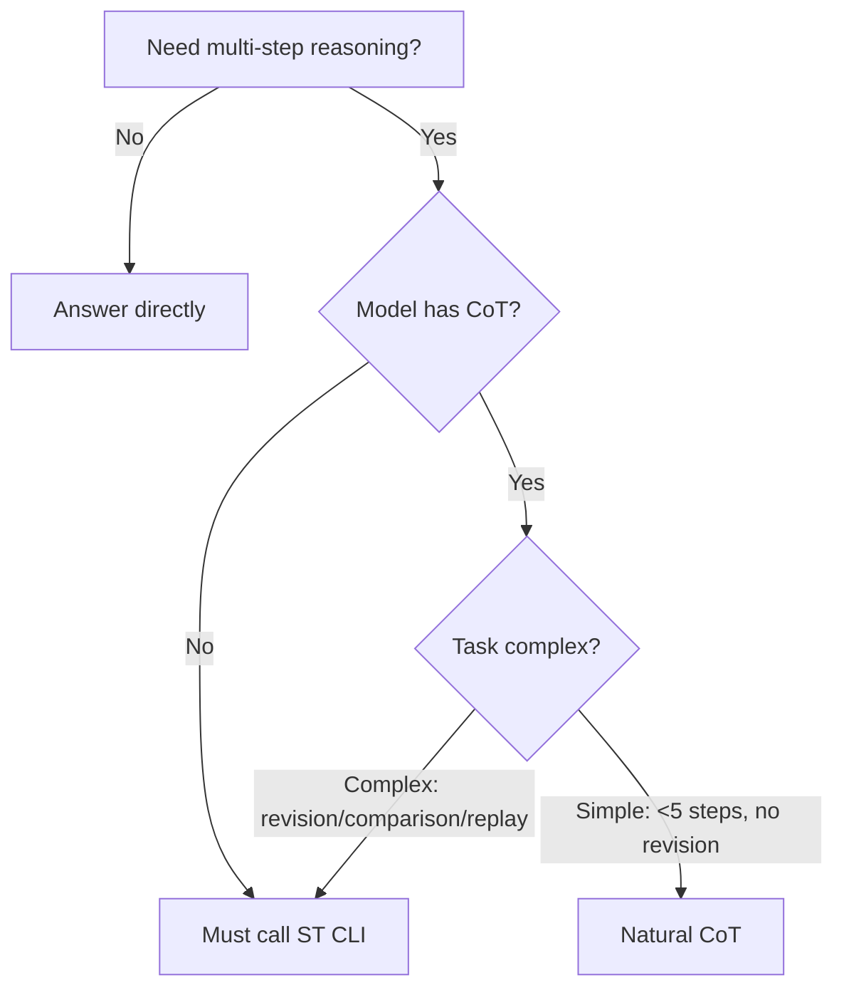

# Sequential Thinking

The core of this skill is not "write more thoughts." It is to let AI **continuously advance, allow correction, and finally converge on conclusions** in complex problems. The CLI is only the execution carrier; the skill itself defines when to enter this thinking mode and how to avoid degrading sequential thinking into loose output.

## Mission

Use this skill to turn complex problems into a **bounded, correctable, reviewable reasoning process**:

- Clarify the problem first, instead of rushing to answers
- Allow correction and judgment updates during progress
- Compare alternatives when complexity increases, instead of forcing one path
- Converge to conclusions and recommendations within limited steps
- Preserve a replayable reasoning trace at the end

This skill does not solve "can't think." It solves "thinking too scattered, concluding too early, too hard to review."

## Core Capabilities

- **Iterative advancement**: break complex problems into consecutive steps
- **Dynamic correction**: revisit and revise earlier judgments when new evidence appears
- **Branch comparison**: compare alternatives before converging
- **Context retention**: keep clear boundaries and goals in multi-step reasoning
- **Conclusion closure**: must end with a judgment, not endless divergence

## When to Use

### Core Decision Rule

> **Model capability sets baseline; task complexity decides escalation.**

| Model capability | Simple task | Complex task |
|---------|:-------:|:-------:|
| **Has CoT** | Natural CoT is enough | Call ST CLI |
| **No CoT** | **Must call ST CLI** | **Must call ST CLI** |

### Mnemonic

> **"No CoT -> must use ST**
> **Has CoT -> use ST only for complex tasks"**

### Scenarios where CLI is mandatory

| Scenario | Decision standard | Why CLI is needed |
|------|---------|---------------|
| **No CoT model** | Current model cannot output chain-of-thought | External tool required to structure reasoning |
| **Premise correction** | Earlier judgment is wrong and must be revised | CLI session keeps history for revision |
| **Multi-option comparison** | Need trade-offs between 2+ candidates | `branch` mode is designed for this |
| **Replayable trace** | Need auditable, reproducible reasoning | CLI can generate replay docs |
| **Complex convergence** | Problem needs >5 steps to converge | Forced step limits prevent endless divergence |

### Scenarios where natural CoT is enough (with CoT)

| Scenario | Decision standard | Why CLI is not needed |
|------|---------|-----------------|
| **Linear reasoning** | No premise correction, linear progression | Model output is sufficient |
| **Simple analysis** | Clear boundaries, <5 steps | No extra tooling required |
| **Quick decision** | Need conclusion only, no replay trace | CoT is sufficient |
| **Exploratory thinking** | Still diverging, uncertain about convergence | Explore with CoT first, then decide |

### Decision tree



### Not suitable for

- Simple fact lookup
- Tasks solvable in one step
- Problems with already obvious path and no multi-step derivation needed
- Pure brainstorming without required convergence

## Working Philosophy

- **Find the core problem before answers**: do not mistake symptom description for root cause diagnosis
- **Allow corrections instead of defending bad premises**: if earlier steps are wrong, go back and fix
- **Reduce complexity before adding solutions**: identify the principal contradiction first
- **Advance one step at a time**: current step states only current judgment
- **Must land on conclusions**: "I can keep thinking" is not a default exit

## Installation & Runtime Model

This skill provides thinking method and invocation constraints for agents; CLI is distributed via npm.

Before use, ensure CLI is installed locally:

```bash
npm install -g sequential-thinking-cli

# or
pnpm add -g sequential-thinking-cli
```

After installation, use `sthink` as command entry.

## CLI Contract

This skill no longer requires AI to hand-write thought JSON. Execution uses main CLI actions:

- `start`
- `step`
- `replay`

### `start`

Accepts only four inputs:

- `name`
- `goal`
- `mode`
- `totalSteps`

Constraints:

- `mode` only allows `explore`, `branch`, `audit`
- `totalSteps` only allows `5` or `8`

If unsure which mode to use, default to `explore`. Use `branch` only when clearly comparing candidate paths; use `audit` only when clearly reviewing existing judgments.

### `step`

Accepts only:

- `content`

All other context should be automatically restored and injected by runtime.

### `replay`

Used to read completed sessions and generate replay docs; optionally export to current directory.

## Recommended Workflow

```text
1. Decide whether the problem truly needs sequential-thinking; do not apply by default.
2. If needed, install or confirm local npm CLI.
3. Use `sthink start` with `name`, `goal`, `mode`, `totalSteps`.
4. Use `sthink step` to advance step by step; each step contains only current progress.
5. When new evidence appears, correct earlier judgments.
6. At convergence, output conclusion, risks, and next-step recommendations.
7. Optionally run `sthink replay` to generate/export replay docs.
```

## Examples

The following examples are not for hand-writing JSON; they show where this skill provides real value: **advance, correct, converge**.

### Example 1: Basic reasoning

```bash
sthink start --name "query-diagnosis" --goal "locate root cause of query performance degradation" --mode explore --totalSteps 5
sthink step --sessionPath "<session-path>" --content "Do not rush to pick optimization means. First split layers: single SQL degradation, interface-level N+1, or upper-layer amplification. If root cause is unclear, cache/index/rewrite may all become patches."
sthink step --sessionPath "<session-path>" --content "Logs show user-detail endpoint triggers many repeated reads in one request, with clear N+1 signals. But cannot conclude yet; repeated queries may be symptoms. Need to verify whether slowness is from query count or one inherently slow query. Increase total steps."
sthink step --sessionPath "<session-path>" --content "Converged: primary cause is N+1 during list-page batch loading; secondary cause is missing index on related fields amplifying single-query cost. Sequence should remove N+1 first, then add index and validate tail latency."
```

### Example 2: Premise correction

```bash
sthink step --sessionPath "<session-path>" --content "After reviewing profiling results, prior judgment needs correction: the real bottleneck is missing index on join columns, which amplifies full-scan costs per join. N+1 still exists but is not first-order bottleneck; priority should move down."
```

### Example 3: Complex change decomposition

```bash
sthink start --name "change-impact-analysis" --goal "decompose impact and priorities of complex changes" --mode explore --totalSteps 5
sthink step --sessionPath "<session-path>" --content "User proposed multiple rule changes at once; do not treat them as one type. Split by type: mechanism principles, numeric balancing, interface semantic changes, and doc-implementation drift."
sthink step --sessionPath "<session-path>" --content "Build an impact matrix. Mechanism changes flow into ADR/System Design; numeric balancing affects rule tables/config/test baselines; interface semantic changes are most dangerous because they silently break caller assumptions."
sthink step --sessionPath "<session-path>" --content "Converged: first handle items changing system boundaries or call semantics, then numeric/experience items. Sequence should fix docs/contracts before balancing, otherwise implementation and review build on drifting premises."
```

### Example 4: Branch comparison

```bash
sthink start --name "performance-tradeoff" --goal "compare priority of cache stopgap vs query optimization" --mode branch --totalSteps 5
sthink step --sessionPath "<session-path>" --content "Option A: introduce cache first to reduce peaks. Fast effect, low interface intrusion, good for stopgap; downside is complexity in consistency/invalidation and may preserve accidental complexity. Option B: optimize indexes and rewrite queries directly. Root-cause oriented and cleaner long-term, but requires careful validation of write amplification, lock contention, and regression risk."
```

## Storage & Export Boundary

- runtime automatically saves session state and step records
- replay docs can be generated after completion
- `replay` supports export to current directory for review/reuse

## Heuristic Reminders

These are heuristic prompts, not hard constraints. The key is reducing wasted loops and approaching conclusions.

- **Problem-definition prompt**: Are you describing symptoms or locating root cause?
- **Evidence prompt**: Is current judgment based on facts/observations or guesses?
- **Boundary prompt**: Is impact local module, single system, or cross-system?
- **Complexity prompt**: Are you reducing essential complexity or adding accidental complexity?
- **Convergence prompt**: Is there enough to conclude, or still ineffective divergence?

## Tips

- Do not hand-write thought JSON; let CLI runtime handle pacing, persistence, replay
- Do not treat sequential-thinking as default; use only when multi-step convergence is truly needed
- If unsure mode, start with `explore`
- `step` `content` should only express current progress, not repeated full context
- If a premise is wrong, state correction explicitly
- At convergence, clearly output conclusions, risks, next actions
- `replay` is available only for completed sessions

---
> Source: [Haaaiawd/ANWS](https://github.com/Haaaiawd/ANWS) — distributed by [TomeVault](https://tomevault.io).
<!-- tomevault:4.0:skill_md:2026-06-23 -->
