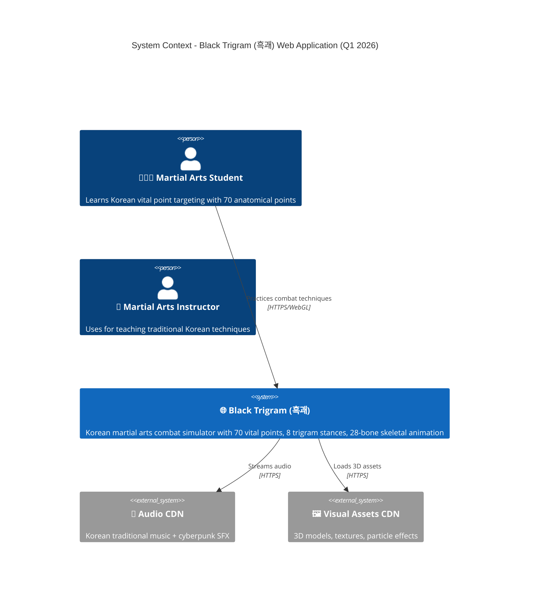
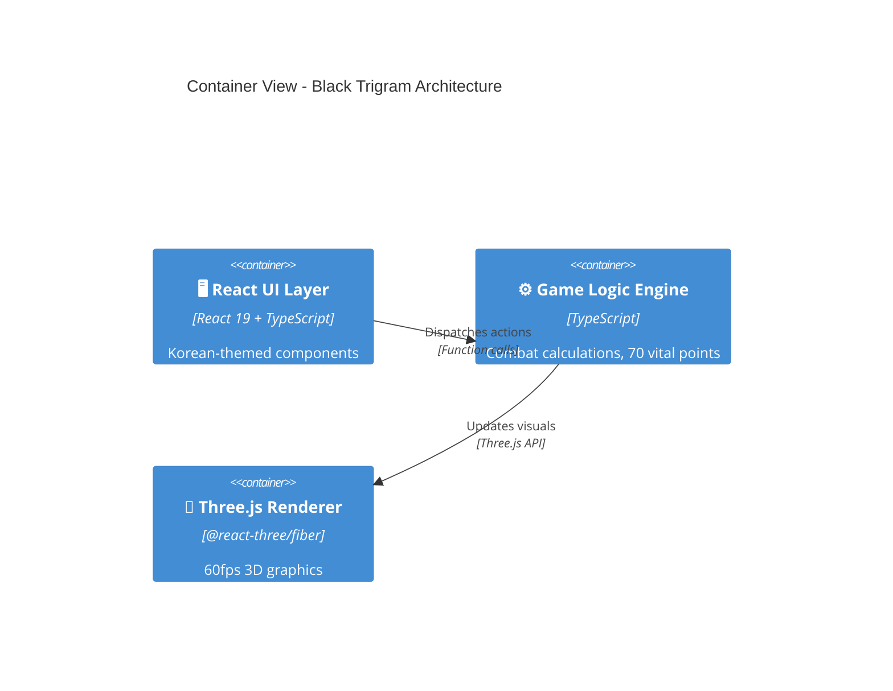

# C4 Architecture Documentation Skill

## Purpose

This skill ensures that all architectural changes in Black Trigram comply with the C4 Architecture Model and maintain comprehensive, up-to-date documentation across current and future architectural states.

## When to Apply

**Automatically trigger this skill when:**
- Adding new components, containers, or systems
- Modifying game architecture or data flow
- Implementing new features that affect system structure
- Refactoring existing architecture
- Planning future roadmap items
- Updating technical stack or dependencies
- Reviewing pull requests with architectural implications
- Creating or modifying combat systems
- Integrating Three.js components or rendering logic

## Core Principles

### 1. C4 Model Hierarchy

**ALWAYS structure documentation following C4 levels:**

✅ **Level 1: System Context**
- Show Black Trigram in relation to external actors (players, instructors)
- Document external systems (CDNs, cultural databases)
- Define system boundaries clearly
- Use Mermaid C4Context diagrams

✅ **Level 2: Container View**
- Document React UI Layer, Game Logic Engine, Three.js Renderer
- Show Animation System, Audio Engine, State Manager
- Illustrate Performance Monitor and optimization components
- Use Mermaid C4Container diagrams

✅ **Level 3: Component View**
- Detail Combat System (70 vital points, 8 trigram stances)
- Document Skeletal Animation (28 bones, 7 hand poses)
- Show Three.js integration patterns
- Map Korean theming components
- Use Mermaid C4Component diagrams

✅ **Level 4: Code Implementation**
- Reference actual TypeScript/React implementations
- Link to component files and directories
- Provide code examples inline
- Document API interfaces and contracts

### 2. Required Architecture Documentation

**ALL architectural changes MUST update these files:**

#### ARCHITECTURE.md (Current State)
Document the **present implementation**:
- ✅ System Context with Mermaid C4 diagrams
- ✅ Container architecture (React 19 + Three.js stack)
- ✅ Component breakdown (Combat, Trigram, Animation systems)
- ✅ File structure (Q1 2026 layout)
- ✅ Combat flow sequences with vital points
- ✅ Skeletal animation architecture (28-bone system)
- ✅ Performance benchmarks (60fps targets)
- ✅ SWOT analysis with current metrics
- ✅ Korean martial arts integration patterns

#### FUTURE_ARCHITECTURE.md (Planned Evolution)
Document **planned improvements** for:
- ✅ Roadmap items (Q2 2026+)
- ✅ Combat realism enhancements (remaining 4/12 systems)
- ✅ VR/AR integration plans
- ✅ Multiplayer architecture considerations
- ✅ Advanced AI and physics systems
- ✅ Performance optimization goals
- ✅ Technical debt remediation plans
- ✅ Scalability improvements

#### DATA_MODEL.md (Current Data)
Document **implemented data structures**:
- ✅ Player state interfaces
- ✅ Trigram stance data (8 stances with Korean names)
- ✅ Vital point definitions (70 points with Korean/English/TCM names)
- ✅ Combat metrics and calculations
- ✅ Animation state machines
- ✅ TypeScript interfaces and types
- ✅ State management schemas (Zustand)

#### FUTURE_DATA_MODEL.md (Planned Data)
Document **future data requirements**:
- ✅ Advanced combat statistics
- ✅ Player progression systems
- ✅ Multiplayer state synchronization
- ✅ Analytics and telemetry data
- ✅ Extended anatomical models
- ✅ AI behavior trees

#### FLOWCHART.md (Current Flows)
Document **implemented workflows**:
- ✅ Combat input → action → rendering flow
- ✅ Trigram stance selection logic
- ✅ Vital point targeting sequence
- ✅ Damage calculation pipeline
- ✅ Animation state transitions
- ✅ Audio feedback triggers
- ✅ User navigation flows

#### FUTURE_FLOWCHART.md (Planned Flows)
Document **future workflow designs**:
- ✅ Advanced combat mechanics
- ✅ Multiplayer interaction flows
- ✅ Training mode progressions
- ✅ Achievement systems
- ✅ Social features

#### STATEDIAGRAM.md (Current State Machines)
Document **implemented state machines**:
- ✅ Combat states (idle, attacking, defending, hit, KO)
- ✅ Animation states (28-bone skeletal system)
- ✅ UI states (intro, training, combat, settings)
- ✅ Trigram stance transitions
- ✅ Health and damage states

#### FUTURE_STATEDIAGRAM.md (Planned States)
Document **future state machines**:
- ✅ Advanced combat states (grappling, environmental)
- ✅ AI opponent behavior states
- ✅ Multiplayer synchronization states
- ✅ Tutorial progression states

#### MINDMAP.md (Current Concepts)
Document **implemented system relationships**:
- ✅ Core game concepts hierarchy
- ✅ Technical architecture layers
- ✅ Component dependencies
- ✅ Korean martial arts philosophy integration

#### FUTURE_MINDMAP.md (Planned Concepts)
Document **future system expansions**:
- ✅ New feature concepts
- ✅ Extended martial arts systems
- ✅ Advanced gameplay mechanics
- ✅ Community and social features

#### SWOT.md (Current Analysis)
Document **present strengths, weaknesses, opportunities, threats**:
- ✅ Quantified metrics (70/70 vital points, 8/8 stances)
- ✅ Performance benchmarks (60fps desktop, 30-45fps mobile)
- ✅ Market positioning
- ✅ Technical debt assessment
- ✅ Risk analysis

#### FUTURE_SWOT.md (Strategic Planning)
Document **future strategic analysis**:
- ✅ Growth opportunities
- ✅ Planned capability enhancements
- ✅ Market expansion strategies
- ✅ Risk mitigation roadmap

### 3. ISMS Policy References

**Always reference applicable ISMS policies:**

| Policy | When to Reference |
|--------|------------------|
| [Information Security Policy](https://github.com/Hack23/ISMS-PUBLIC/blob/main/Information_Security_Policy.md) | All architecture changes |
| [Secure Development Policy](https://github.com/Hack23/ISMS-PUBLIC/blob/main/Secure_Development_Policy.md) | System design and implementation |
| [Change Management Policy](https://github.com/Hack23/ISMS-PUBLIC/blob/main/Change_Management_Policy.md) | Architecture modifications |
| [Documentation Standards](https://github.com/Hack23/ISMS-PUBLIC/blob/main/Documentation_Policy.md) | All documentation updates |

### 4. Architecture Documentation Checklist

**Before approving any architectural change:**

- [ ] **C4 Diagrams Updated**: System Context, Container, Component views reflect changes
- [ ] **Current State Documented**: ARCHITECTURE.md, DATA_MODEL.md, FLOWCHART.md, STATEDIAGRAM.md, MINDMAP.md updated
- [ ] **Future State Planned**: FUTURE_* files updated if roadmap affected
- [ ] **SWOT Updated**: Metrics and analysis reflect new capabilities or technical debt
- [ ] **Mermaid Syntax Valid**: All diagrams render correctly
- [ ] **Korean Integration**: Martial arts concepts properly documented
- [ ] **Performance Impact**: Benchmarks updated if architecture affects performance
- [ ] **Dependencies Mapped**: New external systems or libraries documented
- [ ] **File Structure**: Project organization reflects architectural changes
- [ ] **Code Examples**: Actual implementation samples provided

### 5. Common Architecture Anti-Patterns to REJECT

**Immediately flag and reject these patterns:**

❌ **Undocumented Architectural Changes**
```typescript
// BAD: Adding new system without updating ARCHITECTURE.md
// New grappling system added but not documented in C4 diagrams
export class GrapplingSystem { ... }
```

❌ **Incomplete C4 Diagrams**
```mermaid
# BAD: Missing relationships or actors
C4Context
    System(blackTrigram, "Black Trigram")
    # Missing Player actor, external systems, relationships
```

❌ **Out-of-Sync Documentation**
```markdown
<!-- BAD: ARCHITECTURE.md shows 8 stances but code implements 10 -->
## Trigram System
Black Trigram implements 8 traditional stances...
```

❌ **Missing Future Planning**
```markdown
<!-- BAD: Adding feature without updating FUTURE_ARCHITECTURE.md -->
## New VR Support
VR support implemented but no roadmap documentation.
```

❌ **Generic or Non-Specific Documentation**
```markdown
<!-- BAD: Vague descriptions without Korean context -->
## Combat System
The game has a combat system with attacks and defense.
# Missing: 70 vital points, 8 trigram stances, Korean terminology
```

### 6. Required Architecture Patterns

**Enforce these documentation patterns:**

✅ **Complete C4 System Context**


✅ **Detailed Container Relationships**


✅ **Specific Metrics in SWOT**
```markdown
## Strengths ✅

### Technical Excellence
- **Combat Realism**: 8/12 systems complete (67%)
- **Vital Points**: 70/70 anatomical points (100%)
- **Trigram Stances**: 8/8 traditional stances (100%)
- **Performance**: 60fps desktop, 30-45fps mobile
- **Test Coverage**: 85% unit tests, 70% E2E coverage
```

✅ **Clear Future Roadmap**
```markdown
## Q2 2026 Roadmap

### Combat Realism Completion (4 remaining systems)
- [ ] Advanced grappling mechanics
- [ ] Environmental interaction physics
- [ ] Weapon integration system
- [ ] Advanced AI opponent behavior

**Target**: 12/12 systems (100% combat realism)
**Timeline**: Q2 2026
**Dependencies**: Three.js physics integration, skeletal animation v2
```

✅ **Korean Martial Arts Context**
```markdown
## Trigram System (팔괘 체계)

### Eight Stances Implementation
- **☰ 건 (Geon)** - Heaven: Direct force techniques
  - **Korean**: 천둥벽력 (Cheondung Byeokryeok)
  - **English**: Thunder Wall Strike
  - **Biomechanics**: Shoulder-driven linear power
  - **Implementation**: `src/systems/combat/stances/geon.ts`
```

## Enforcement Rules

### Rule 1: No Architectural Changes Without Documentation

```
IF (code change affects system architecture)
THEN (update ARCHITECTURE.md AND relevant C4 diagrams)
ELSE (reject the change)
```

### Rule 2: Current and Future States Must Sync

```
IF (FUTURE_ARCHITECTURE.md item is implemented)
THEN (move to ARCHITECTURE.md AND update SWOT metrics)
ELSE (maintain in future planning)
```

### Rule 3: All C4 Diagrams Must Be Valid Mermaid

```
IF (architectural diagram added or modified)
THEN (validate Mermaid syntax AND test rendering)
ELSE (fix syntax errors before approval)
```

### Rule 4: Korean Context Required for Martial Arts Systems

```
IF (combat or martial arts system added/modified)
THEN (include Korean names, philosophy, AND English translations)
ELSE (add cultural context before approval)
```

### Rule 5: Metrics Must Be Quantified

```
IF (SWOT or status updated)
THEN (provide specific numbers: X/Y complete, N% coverage)
ELSE (add quantifiable metrics)
```

### Rule 6: File Structure Reflects Architecture

```
IF (new component or system added)
THEN (place in correct directory AND document in File Structure section)
ELSE (reorganize to match architectural patterns)
```

## Architecture Quality Standards

### High-Quality Architecture Documentation Example

```markdown
## 🧩 Component View - Combat System

### Combat Engine (전투 엔진)

**Responsibility**: Orchestrate all combat interactions with anatomical precision.

**Components**:
- **Vital Point Targeting System (급소격 시스템)**
  - **Purpose**: 70 anatomical vital points with Korean/English/TCM names
  - **Implementation**: `src/systems/combat/vital-points/VitalPointSystem.ts`
  - **Data Model**: `src/systems/combat/vital-points/vital-points-data.ts`
  - **Korean Context**: Based on traditional 경혈 (Gyeonghyeol) acupoint theory
  - **Interfaces**:
    ```typescript
    interface VitalPoint {
      readonly id: string;
      readonly nameKorean: string;
      readonly nameEnglish: string;
      readonly nameTCM: string;
      readonly location: { x: number; y: number; z: number };
      readonly severity: 'high' | 'medium' | 'low';
      readonly effects: readonly DamageEffect[];
    }
    ```

- **Trigram Stance System (팔괘 자세 시스템)**
  - **Purpose**: 8 traditional I Ching stances with unique combat properties
  - **Implementation**: `src/systems/combat/stances/TrigramSystem.ts`
  - **Korean Philosophy**: Based on 주역 (Juyeok) / I Ching principles
  - **Performance**: <1ms stance transition time
  - **States**:
    ```mermaid
    stateDiagram-v2
        [*] --> Geon: Select Heaven
        [*] --> Tae: Select Lake
        Geon --> Tae: Transition
        Tae --> Li: Transition
        note right of Geon: 건 (Heaven)\nDirect force
        note right of Tae: 태 (Lake)\nFluid motion
    ```

**Performance Targets**:
- Combat calculation: <5ms per frame
- Vital point detection: <2ms per hit
- Stance transition: <1ms
- Total combat overhead: <10ms (maintains 60fps)

**Dependencies**:
- Three.js Renderer (for hit detection raycasting)
- Animation System (for skeletal animation coordination)
- Audio Engine (for damage-based sound feedback)

**Testing**:
- Unit tests: `src/systems/combat/__tests__/CombatSystem.test.ts`
- Coverage: 92%
- E2E tests: `cypress/e2e/combat-system.cy.ts`
```

### Low-Quality Architecture Documentation Example (REJECT)

```markdown
<!-- BAD: Vague, missing metrics, no Korean context, no code references -->

## Combat System

The combat system handles fighting. It has attacks and defense.
It uses some Korean martial arts concepts.

The system is fast and works well.

Implementation is in the combat folder.
```

**Why This Is Rejected**:
- ❌ No C4 diagram or architectural context
- ❌ No specific metrics (70 vital points, 8 stances)
- ❌ No Korean terminology or cultural context
- ❌ No performance targets or benchmarks
- ❌ No file paths or code examples
- ❌ No interfaces or data models
- ❌ No testing information
- ❌ Vague language ("fast", "works well")

## ISO 27001 Alignment

This skill enforces controls from:

- **A.5.1** - Policies for Information Security (Documentation standards)
- **A.8.1** - Inventory of Assets (Architecture components cataloged)
- **A.12.1** - Operational Procedures and Responsibilities (Development standards)
- **A.14.1** - Security Requirements of Information Systems (Architectural security)
- **A.14.2** - Security in Development and Support Processes (Documentation in SDLC)

## NIST CSF 2.0 Alignment

- **GV.OC-02**: Internal and external stakeholders understand their roles
- **GV.PO-01**: Policy is established and communicated
- **ID.AM-01**: Physical devices and systems are inventoried
- **ID.AM-02**: Software platforms and applications are inventoried
- **ID.AM-04**: External dependencies are inventoried
- **PR.DS-06**: Integrity checking mechanisms verify software assets

## CIS Controls v8.1 Alignment

- **Control 1**: Inventory and Control of Enterprise Assets
- **Control 2**: Inventory and Control of Software Assets
- **Control 4**: Secure Configuration of Enterprise Assets and Software
- **Control 14**: Security Awareness and Skills Training (via documentation)
- **Control 16**: Application Software Security (architectural security)

## Special Considerations for Black Trigram

### Korean Martial Arts Documentation Standards

**ALWAYS include:**
- ✅ Korean terminology with hangul (한글)
- ✅ English translations
- ✅ Cultural context and philosophy (주역, 경혈)
- ✅ Traditional martial arts references (Hapkido, Taekwondo)
- ✅ I Ching / Trigram philosophy integration

### Three.js Architecture Patterns

**ALWAYS document:**
- ✅ React + Three.js integration approach
- ✅ Html overlay usage for UI elements
- ✅ 3D mesh usage for game objects
- ✅ Performance optimization techniques (instancing, LOD)
- ✅ 60fps performance targets and benchmarks
- ✅ WebGL compatibility considerations

### Performance Architecture

**ALWAYS include:**
- ✅ Target frame rates (60fps desktop, 30-45fps mobile)
- ✅ Performance budgets per system (<5ms combat, <2ms vital point detection)
- ✅ Optimization strategies (instancing, object pooling, LOD)
- ✅ Profiling results and benchmarks
- ✅ Memory usage targets

## Documentation Update Workflow

### When Adding New Features

```
1. Design Phase:
   - Update FUTURE_ARCHITECTURE.md with planned design
   - Create C4 Component diagram draft
   - Update FUTURE_DATA_MODEL.md with data structures
   - Update FUTURE_FLOWCHART.md with workflows

2. Implementation Phase:
   - Create components following architectural patterns
   - Write unit and E2E tests
   - Profile performance impact

3. Documentation Phase:
   - Move design from FUTURE_* to current docs
   - Update ARCHITECTURE.md with implemented design
   - Add actual code examples and file paths
   - Update SWOT.md with new metrics
   - Update DATA_MODEL.md with final interfaces

4. Review Phase:
   - Validate all Mermaid diagrams render
   - Ensure Korean context included
   - Verify performance targets met
   - Check test coverage meets standards
```

### When Refactoring Architecture

```
1. Assessment:
   - Document current state in ARCHITECTURE.md
   - Identify technical debt in SWOT.md
   - Plan refactoring in FUTURE_ARCHITECTURE.md

2. Execution:
   - Refactor code incrementally
   - Maintain test coverage >85%
   - Monitor performance continuously

3. Documentation:
   - Update C4 diagrams to reflect new structure
   - Update file structure documentation
   - Update component relationships
   - Remove technical debt from SWOT.md
```

## Remember

**Architecture documentation is the blueprint of Black Trigram. Every component, every system, every decision must be captured with precision and clarity.**

When documenting architecture:
1. **VISUALIZE** - Create clear C4 diagrams with Mermaid
2. **CONTEXTUALIZE** - Include Korean martial arts philosophy
3. **QUANTIFY** - Provide specific metrics and benchmarks
4. **IMPLEMENT** - Show actual code examples and file paths
5. **PLAN** - Document future evolution in FUTURE_* files
6. **VALIDATE** - Ensure documentation matches implementation

**흑괘의 구조를 명확히 하라** - _Clarify the Structure of the Black Trigram_

---
> Converted and distributed by [TomeVault](https://tomevault.io/claim/hack23) — claim your Tome and manage your conversions.
<!-- tomevault:4.0:skill_md:2026-04-12 -->
