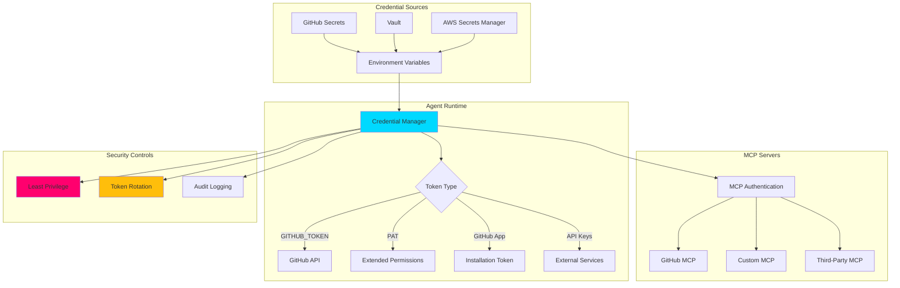

# 🔐 Authentication and Credentials for Agentic Workflows

## 📋 Overview

This skill provides comprehensive security patterns for managing authentication and credentials in GitHub Agentic Workflows. It covers GitHub token types, secure credential storage, token rotation strategies, least privilege access control, MCP server authentication, and API key management best practices for production-ready autonomous agent systems.

## 🎯 Core Concepts

### Authentication Architecture



### Security Principles

1. **Least Privilege**: Minimal permissions required for task
2. **Defense in Depth**: Multiple layers of security
3. **Token Rotation**: Regular credential updates
4. **Audit Trail**: Complete authentication logging
5. **Secure Storage**: Encrypted credential management
6. **Time-Limited Access**: Short-lived tokens when possible

## 🔑 GitHub Token Types

### 1. GITHUB_TOKEN (Automatic)

#### Characteristics

```yaml
# Automatic token provided by GitHub Actions
# - Automatically created per workflow run
# - Expires when workflow completes
# - Scoped to the repository
# - Configurable permissions

permissions:
  contents: read       # Read repository contents
  pull-requests: write # Create/update PRs
  issues: write       # Create/update issues
  statuses: read      # Read commit statuses
```

#### Usage Pattern

```yaml
# .github/workflows/agent-pr-review.yml
name: Agent PR Review

on:
  pull_request:
    types: [opened, synchronize]

permissions:
  contents: read
  pull-requests: write

jobs:
  review:
    runs-on: ubuntu-latest
    steps:
      - name: Checkout Code
        uses: actions/checkout@v4
        with:
          token: ${{ secrets.GITHUB_TOKEN }}  # Automatic token
          
      - name: Run Agent Review
        env:
          GITHUB_TOKEN: ${{ secrets.GITHUB_TOKEN }}
        run: |
          node scripts/agents/pr-reviewer.js \
            --pr-number=${{ github.event.pull_request.number }}
            
      - name: Post Review Comment
        uses: actions/github-script@v7
        with:
          github-token: ${{ secrets.GITHUB_TOKEN }}
          script: |
            await github.rest.pulls.createReview({
              owner: context.repo.owner,
              repo: context.repo.repo,
              pull_number: context.issue.number,
              body: 'Agent review completed ✅',
              event: 'COMMENT'
            });
```

#### Limitations

```yaml
# GITHUB_TOKEN limitations:
# ❌ Cannot trigger other workflow runs
# ❌ Cannot access other repositories
# ❌ Cannot push to protected branches (unless configured)
# ❌ Expires at end of workflow run
# ❌ Limited to repository permissions

# Use PAT for these scenarios:
# ✅ Triggering workflows
# ✅ Cross-repository operations
# ✅ Protected branch pushes
# ✅ Long-running agent processes
```

### 2. Personal Access Token (PAT)

#### Classic PAT Configuration

```yaml
# GitHub Settings → Developer settings → Personal access tokens → Tokens (classic)
# 
# Recommended Scopes for Agentic Workflows:
# ✅ repo (Full control of private repositories)
#    - repo:status (Access commit status)
#    - repo_deployment (Access deployment status)
#    - public_repo (Access public repositories)
#    - repo:invite (Access repository invitations)
# ✅ workflow (Update GitHub Action workflows)
# ✅ write:packages (Upload packages to GitHub Package Registry)
# ✅ read:packages (Download packages from GitHub Package Registry)
# ✅ admin:org (Full control of organizations)
#    - read:org (Read organization data)
# ✅ admin:repo_hook (Full control of repository hooks)

# Expiration: 90 days (recommended for security)
```

#### Fine-Grained PAT (Recommended)

```yaml
# GitHub Settings → Developer settings → Personal access tokens → Fine-grained tokens
#
# Permissions for Agentic Workflows:
# 
# Repository permissions:
#   - Actions: Read and write
#   - Contents: Read and write
#   - Issues: Read and write
#   - Metadata: Read-only (mandatory)
#   - Pull requests: Read and write
#   - Workflows: Read and write
#
# Organization permissions (if needed):
#   - Members: Read-only
#
# Account permissions:
#   - None (unless required)
#
# Repository access:
#   - Only select repositories (principle of least privilege)
#
# Expiration: 90 days
```

#### Usage in Workflows

```yaml
# Store PAT as repository secret:
# Repository Settings → Secrets and variables → Actions → New repository secret
# Name: COPILOT_MCP_GITHUB_PERSONAL_ACCESS_TOKEN

jobs:
  agent-task:
    runs-on: ubuntu-latest
    steps:
      - name: Checkout with PAT
        uses: actions/checkout@v4
        with:
          token: ${{ secrets.COPILOT_MCP_GITHUB_PERSONAL_ACCESS_TOKEN }}
          fetch-depth: 0
          
      - name: Run Agent with PAT
        env:
          GITHUB_TOKEN: ${{ secrets.COPILOT_MCP_GITHUB_PERSONAL_ACCESS_TOKEN }}
        run: |
          # Agent can now:
          # - Push to protected branches
          # - Trigger other workflows
          # - Access multiple repositories
          node scripts/agents/cross-repo-agent.js
          
      - name: Create PR (Triggers Workflows)
        uses: peter-evans/create-pull-request@v6
        with:
          token: ${{ secrets.COPILOT_MCP_GITHUB_PERSONAL_ACCESS_TOKEN }}
          title: 'Agent Update'
          body: 'Automated changes by agent'
          branch: 'agent/update'
```

### 3. GitHub App Token

#### App Creation and Configuration

```bash
# 1. Create GitHub App
# GitHub Settings → Developer settings → GitHub Apps → New GitHub App

# App Configuration:
# - Name: Agentic Workflow Bot
# - Homepage URL: https://github.com/your-org/your-repo
# - Webhook: Optional (for event-driven agents)
# - Permissions:
#   Repository permissions:
#     - Actions: Read & write
#     - Contents: Read & write
#     - Issues: Read & write
#     - Pull requests: Read & write
#     - Workflows: Read & write
#   Organization permissions:
#     - Members: Read-only (if needed)

# 2. Generate Private Key
# Download private key (PEM file)

# 3. Install App on Repository
# Install App → Select repositories

# 4. Store App Credentials
# - APP_ID: From app settings
# - PRIVATE_KEY: PEM file content (as secret)
# - INSTALLATION_ID: From installation URL
```

#### Generate Installation Token

```javascript
// scripts/agents/lib/github-app-auth.js
import { createAppAuth } from '@octokit/auth-app';
import { Octokit } from '@octokit/rest';
import fs from 'fs';

/**
 * GitHub App authentication for agentic workflows
 */
class GitHubAppAuth {
  constructor(options = {}) {
    this.appId = options.appId || process.env.GITHUB_APP_ID;
    this.privateKey = options.privateKey || process.env.GITHUB_APP_PRIVATE_KEY;
    this.installationId = options.installationId || process.env.GITHUB_APP_INSTALLATION_ID;
    
    if (!this.appId || !this.privateKey) {
      throw new Error('GitHub App credentials not configured');
    }
  }
  
  /**
   * Create authenticated Octokit instance
   */
  async createOctokit() {
    const auth = createAppAuth({
      appId: this.appId,
      privateKey: this.privateKey,
      installationId: this.installationId
    });
    
    const { token } = await auth({ type: 'installation' });
    
    return new Octokit({
      auth: token,
      userAgent: 'agentic-workflow-bot/1.0.0'
    });
  }
  
  /**
   * Get installation token (for direct use)
   */
  async getInstallationToken() {
    const auth = createAppAuth({
      appId: this.appId,
      privateKey: this.privateKey,
      installationId: this.installationId
    });
    
    const { token, expiresAt, permissions } = await auth({ type: 'installation' });
    
    return {
      token,
      expiresAt: new Date(expiresAt),
      permissions
    };
  }
  
  /**
   * Revoke installation token (cleanup)
   */
  async revokeToken(token) {
    const octokit = new Octokit({ auth: token });
    await octokit.apps.deleteToken({
      client_id: this.appId,
      access_token: token
    });
  }
}

export default GitHubAppAuth;

// Usage in workflow
const appAuth = new GitHubAppAuth({
  appId: process.env.GITHUB_APP_ID,
  privateKey: process.env.GITHUB_APP_PRIVATE_KEY,
  installationId: process.env.GITHUB_APP_INSTALLATION_ID
});

const octokit = await appAuth.createOctokit();

// Use octokit for API calls
const { data: pr } = await octokit.pulls.get({
  owner: 'owner',
  repo: 'repo',
  pull_number: 123
});
```

#### Workflow Integration

```yaml
# .github/workflows/agent-github-app.yml
name: Agent with GitHub App

on:
  issues:
    types: [opened]

jobs:
  process-issue:
    runs-on: ubuntu-latest
    steps:
      - name: Checkout Code
        uses: actions/checkout@v4
        
      - name: Generate App Token
        id: app-token
        uses: actions/create-github-app-token@v1
        with:
          app-id: ${{ secrets.GITHUB_APP_ID }}
          private-key: ${{ secrets.GITHUB_APP_PRIVATE_KEY }}
          
      - name: Run Agent with App Token
        env:
          GITHUB_TOKEN: ${{ steps.app-token.outputs.token }}
        run: |
          node scripts/agents/issue-processor.js \
            --issue-number=${{ github.event.issue.number }}
            
      - name: Cleanup (token automatically revoked)
        run: echo "Token expires in 1 hour"
```

## 🔒 Credential Storage

### 1. GitHub Secrets

#### Repository Secrets

```bash
# Add secret via GitHub UI:
# Repository → Settings → Secrets and variables → Actions → New repository secret

# Or via GitHub CLI:
gh secret set ANTHROPIC_API_KEY --body "sk-ant-..."
gh secret set OPENAI_API_KEY --body "sk-..."
gh secret set MCP_DATABASE_URL --body "postgresql://..."

# List secrets:
gh secret list

# Delete secret:
gh secret delete ANTHROPIC_API_KEY
```

#### Environment Secrets

```yaml
# Use GitHub Environments for stage-specific secrets
# Repository → Settings → Environments → New environment

# Development environment
name: development
secrets:
  - API_KEY: dev-key-123
  - DATABASE_URL: postgresql://dev-db

# Production environment
name: production
secrets:
  - API_KEY: prod-key-456
  - DATABASE_URL: postgresql://prod-db
protection_rules:
  - required_reviewers: 2
  - wait_timer: 5  # minutes
```

```yaml
# Use environment secrets in workflow
jobs:
  deploy-dev:
    runs-on: ubuntu-latest
    environment: development
    steps:
      - name: Deploy Agent
        env:
          API_KEY: ${{ secrets.API_KEY }}
          DATABASE_URL: ${{ secrets.DATABASE_URL }}
        run: ./deploy.sh
        
  deploy-prod:
    runs-on: ubuntu-latest
    environment: production
    needs: deploy-dev
    steps:
      - name: Deploy Agent
        env:
          API_KEY: ${{ secrets.API_KEY }}
          DATABASE_URL: ${{ secrets.DATABASE_URL }}
        run: ./deploy.sh
```

#### Organization Secrets

```bash
# For multi-repository access
# Organization → Settings → Secrets and variables → Actions

# Add organization secret:
gh secret set SHARED_API_KEY \
  --org your-org \
  --repos "repo1,repo2,repo3" \
  --body "shared-key-789"
```

### 2. External Secret Managers

#### AWS Secrets Manager

```yaml
# .github/workflows/agent-aws-secrets.yml
name: Agent with AWS Secrets

jobs:
  agent-task:
    runs-on: ubuntu-latest
    permissions:
      id-token: write  # For OIDC authentication
      contents: read
      
    steps:
      - name: Configure AWS Credentials
        uses: aws-actions/configure-aws-credentials@v4
        with:
          role-to-assume: arn:aws:iam::123456789012:role/GitHubActionsRole
          aws-region: us-east-1
          
      - name: Retrieve Secrets
        id: secrets
        run: |
          # Get secret from AWS Secrets Manager
          SECRET_JSON=$(aws secretsmanager get-secret-value \
            --secret-id agentic-workflow/production \
            --query SecretString \
            --output text)
          
          # Parse and export secrets
          echo "::add-mask::$(echo $SECRET_JSON | jq -r '.api_key')"
          echo "API_KEY=$(echo $SECRET_JSON | jq -r '.api_key')" >> $GITHUB_ENV
          
      - name: Run Agent with Secret
        env:
          API_KEY: ${{ env.API_KEY }}
        run: node scripts/agents/secure-agent.js
```

#### HashiCorp Vault

```yaml
# .github/workflows/agent-vault.yml
name: Agent with Vault

jobs:
  agent-task:
    runs-on: ubuntu-latest
    steps:
      - name: Retrieve Secrets from Vault
        id: secrets
        uses: hashicorp/vault-action@v2
        with:
          url: https://vault.example.com
          method: approle
          roleId: ${{ secrets.VAULT_ROLE_ID }}
          secretId: ${{ secrets.VAULT_SECRET_ID }}
          secrets: |
            secret/data/agentic-workflow api_key | API_KEY ;
            secret/data/agentic-workflow db_password | DB_PASSWORD
            
      - name: Run Agent
        env:
          API_KEY: ${{ steps.secrets.outputs.API_KEY }}
          DB_PASSWORD: ${{ steps.secrets.outputs.DB_PASSWORD }}
        run: node scripts/agents/vault-agent.js
```

### 3. Secure Secret Handling

```javascript
// scripts/agents/lib/credential-manager.js
import { SecretsManager } from '@aws-sdk/client-secrets-manager';
import crypto from 'crypto';

/**
 * Secure credential manager for agentic workflows
 */
class CredentialManager {
  constructor(options = {}) {
    this.secretsClient = options.secretsClient || new SecretsManager({
      region: process.env.AWS_REGION || 'us-east-1'
    });
    this.cache = new Map();
    this.cacheTTL = options.cacheTTL || 300000; // 5 minutes
  }
  
  /**
   * Get secret with caching
   */
  async getSecret(secretName, options = {}) {
    // Check cache
    const cached = this.cache.get(secretName);
    if (cached && Date.now() - cached.timestamp < this.cacheTTL) {
      return cached.value;
    }
    
    // Retrieve from secrets manager
    let secret;
    if (secretName.startsWith('aws:')) {
      secret = await this.getAWSSecret(secretName.replace('aws:', ''));
    } else if (secretName.startsWith('env:')) {
      secret = process.env[secretName.replace('env:', '')];
    } else {
      throw new Error(`Unknown secret source for: ${secretName}`);
    }
    
    // Cache secret
    this.cache.set(secretName, {
      value: secret,
      timestamp: Date.now()
    });
    
    return secret;
  }
  
  /**
   * Get secret from AWS Secrets Manager
   */
  async getAWSSecret(secretId) {
    const response = await this.secretsClient.getSecretValue({
      SecretId: secretId
    });
    
    if (response.SecretString) {
      return JSON.parse(response.SecretString);
    } else {
      throw new Error(`Secret ${secretId} is not a string`);
    }
  }
  
  /**
   * Rotate secret
   */
  async rotateSecret(secretName, newValue) {
    if (secretName.startsWith('aws:')) {
      await this.rotateAWSSecret(secretName.replace('aws:', ''), newValue);
    }
    
    // Invalidate cache
    this.cache.delete(secretName);
  }
  
  /**
   * Rotate AWS secret
   */
  async rotateAWSSecret(secretId, newValue) {
    await this.secretsClient.updateSecret({
      SecretId: secretId,
      SecretString: JSON.stringify(newValue)
    });
  }
  
  /**
   * Mask sensitive values in logs
   */
  maskSecret(value) {
    if (!value || value.length < 8) return '***';
    
    // Show first and last 4 characters
    return `${value.slice(0, 4)}...${value.slice(-4)}`;
  }
  
  /**
   * Validate secret format
   */
  validateSecret(secret, type) {
    switch (type) {
      case 'github-token':
        // GitHub tokens start with specific prefixes
        return /^(ghp_|gho_|ghu_|ghs_|ghr_)/.test(secret);
        
      case 'anthropic-key':
        return /^sk-ant-api03-/.test(secret);
        
      case 'openai-key':
        return /^sk-/.test(secret);
        
      default:
        return true;
    }
  }
  
  /**
   * Clear cache (on shutdown)
   */
  clearCache() {
    this.cache.clear();
  }
}

export default CredentialManager;

// Usage
const credManager = new CredentialManager();

// Get secret
const apiKey = await credManager.getSecret('aws:agentic-workflow/api-key');

// Mask in logs
console.log(`Using API key: ${credManager.maskSecret(apiKey)}`);

// Validate
if (!credManager.validateSecret(apiKey, 'anthropic-key')) {
  throw new Error('Invalid API key format');
}
```

## 🔄 Token Rotation

### 1. Automated Rotation Strategy

```yaml
# .github/workflows/rotate-secrets.yml
name: Rotate Secrets

on:
  schedule:
    - cron: '0 0 1 * *'  # Monthly rotation
  workflow_dispatch:

permissions:
  contents: read
  issues: write

jobs:
  check-expiration:
    name: Check Token Expiration
    runs-on: ubuntu-latest
    outputs:
      needs_rotation: ${{ steps.check.outputs.needs_rotation }}
      
    steps:
      - name: Check PAT Expiration
        id: check
        env:
          GITHUB_TOKEN: ${{ secrets.COPILOT_MCP_GITHUB_PERSONAL_ACCESS_TOKEN }}
        run: |
          # Get token expiration
          EXPIRATION=$(gh api /user \
            -H "Accept: application/vnd.github+json" \
            | jq -r '.token_expires_at // "never"')
          
          if [ "$EXPIRATION" = "never" ]; then
            echo "⚠️ Token has no expiration (not recommended)"
            echo "needs_rotation=false" >> $GITHUB_OUTPUT
            exit 0
          fi
          
          # Calculate days until expiration
          EXPIRE_DATE=$(date -d "$EXPIRATION" +%s)
          NOW=$(date +%s)
          DAYS_LEFT=$(( ($EXPIRE_DATE - $NOW) / 86400 ))
          
          echo "Days until expiration: $DAYS_LEFT"
          
          if [ $DAYS_LEFT -lt 14 ]; then
            echo "⚠️ Token expires in $DAYS_LEFT days - rotation needed"
            echo "needs_rotation=true" >> $GITHUB_OUTPUT
          else
            echo "✅ Token valid for $DAYS_LEFT days"
            echo "needs_rotation=false" >> $GITHUB_OUTPUT
          fi
          
  notify-rotation:
    name: Notify About Rotation
    needs: check-expiration
    if: needs.check-expiration.outputs.needs_rotation == 'true'
    runs-on: ubuntu-latest
    
    steps:
      - name: Create Rotation Issue
        uses: actions/github-script@v7
        with:
          github-token: ${{ secrets.GITHUB_TOKEN }}
          script: |
            // Check if rotation issue already exists
            const { data: issues } = await github.rest.issues.listForRepo({
              owner: context.repo.owner,
              repo: context.repo.repo,
              state: 'open',
              labels: 'security,credential-rotation',
              per_page: 10
            });
            
            const existingIssue = issues.find(issue => 
              issue.title.includes('Token Rotation Required')
            );
            
            if (existingIssue) {
              console.log('Rotation issue already exists:', existingIssue.number);
              return;
            }
            
            // Create new rotation issue
            await github.rest.issues.create({
              owner: context.repo.owner,
              repo: context.repo.repo,
              title: '🔐 Token Rotation Required',
              body: `## Security Notice
              
The GitHub Personal Access Token used by agentic workflows is expiring soon.

### Action Required
1. Go to [GitHub Settings → Personal Access Tokens](https://github.com/settings/tokens)
2. Generate a new fine-grained token with same permissions
3. Update repository secret: \`COPILOT_MCP_GITHUB_PERSONAL_ACCESS_TOKEN\`
4. Test workflows after rotation
5. Close this issue

### Token Details
- **Current Status**: Expires in < 14 days
- **Used In**: Agentic workflow automations
- **Permissions**: Contents, PRs, Issues, Workflows

---
*Auto-generated rotation reminder*`,
              labels: ['security', 'credential-rotation', 'high-priority'],
              assignees: ['security-team']
            });
```

### 2. Zero-Downtime Rotation

```javascript
// scripts/agents/lib/rotation-handler.js

/**
 * Handle token rotation without downtime
 */
class RotationHandler {
  constructor(options = {}) {
    this.primaryToken = options.primaryToken;
    this.fallbackToken = options.fallbackToken;
    this.rotationState = 'active'; // active, rotating, completed
  }
  
  /**
   * Get active token (with fallback)
   */
  async getToken() {
    try {
      // Try primary token
      await this.validateToken(this.primaryToken);
      return this.primaryToken;
    } catch (error) {
      if (this.fallbackToken) {
        console.warn('Primary token failed, using fallback');
        return this.fallbackToken;
      }
      throw error;
    }
  }
  
  /**
   * Validate token is still valid
   */
  async validateToken(token) {
    const response = await fetch('https://api.github.com/user', {
      headers: {
        'Authorization': `Bearer ${token}`,
        'Accept': 'application/vnd.github+json'
      }
    });
    
    if (!response.ok) {
      throw new Error('Token validation failed');
    }
    
    return true;
  }
  
  /**
   * Perform rotation
   */
  async rotate(newToken) {
    this.rotationState = 'rotating';
    
    try {
      // Validate new token
      await this.validateToken(newToken);
      
      // Set new token as fallback first
      this.fallbackToken = newToken;
      
      // Wait for in-flight operations to complete
      await this.waitForInFlightOperations();
      
      // Switch tokens
      this.primaryToken = newToken;
      this.fallbackToken = null;
      
      this.rotationState = 'completed';
      console.log('✅ Token rotation completed successfully');
    } catch (error) {
      this.rotationState = 'failed';
      console.error('❌ Token rotation failed:', error);
      throw error;
    }
  }
  
  async waitForInFlightOperations() {
    // Wait for pending operations
    await new Promise(resolve => setTimeout(resolve, 5000));
  }
}

export default RotationHandler;
```

## 🛡️ Least Privilege Access

### 1. Granular Permissions

```yaml
# Minimal permissions for different agent types

# Read-only analysis agent
permissions:
  contents: read
  pull-requests: read

# PR review agent
permissions:
  contents: read
  pull-requests: write

# Issue triage agent
permissions:
  contents: read
  issues: write

# Deployment agent
permissions:
  contents: read
  deployments: write
  statuses: write

# Full automation agent (use sparingly)
permissions:
  contents: write
  pull-requests: write
  issues: write
  workflows: write
```

### 2. Permission Validation

```javascript
// scripts/agents/lib/permission-checker.js

/**
 * Validate agent has required permissions
 */
class PermissionChecker {
  constructor(octokit) {
    this.octokit = octokit;
    this.permissions = null;
  }
  
  /**
   * Get current token permissions
   */
  async getPermissions() {
    if (this.permissions) return this.permissions;
    
    const { data } = await this.octokit.rest.users.getAuthenticated();
    this.permissions = data.permissions || {};
    
    return this.permissions;
  }
  
  /**
   * Check if permission is granted
   */
  async hasPermission(permission, level = 'read') {
    const perms = await this.getPermissions();
    const currentLevel = perms[permission];
    
    if (!currentLevel) return false;
    
    const levels = ['read', 'write', 'admin'];
    const currentIndex = levels.indexOf(currentLevel);
    const requiredIndex = levels.indexOf(level);
    
    return currentIndex >= requiredIndex;
  }
  
  /**
   * Require specific permission (throw if not granted)
   */
  async requirePermission(permission, level = 'read') {
    const has = await this.hasPermission(permission, level);
    
    if (!has) {
      throw new Error(
        `Missing required permission: ${permission}:${level}. ` +
        `Please update workflow permissions.`
      );
    }
  }
  
  /**
   * Check multiple permissions
   */
  async checkPermissions(required) {
    const results = {};
    
    for (const [permission, level] of Object.entries(required)) {
      results[permission] = await this.hasPermission(permission, level);
    }
    
    return results;
  }
}

// Usage
const checker = new PermissionChecker(octokit);

// Check single permission
await checker.requirePermission('pull_requests', 'write');

// Check multiple permissions
const perms = await checker.checkPermissions({
  contents: 'read',
  pull_requests: 'write',
  issues: 'write'
});

if (!perms.pull_requests) {
  console.error('Missing required PR write permission');
}
```

## 🔌 MCP Server Authentication

### 1. GitHub MCP Server

```json
// .github/copilot-mcp.json
{
  "mcpServers": {
    "github": {
      "type": "local",
      "command": "npx",
      "args": [
        "-y",
        "@modelcontextprotocol/server-github",
        "--toolsets", "all",
        "--tools", "*"
      ],
      "env": {
        "GITHUB_TOKEN": "${{ secrets.COPILOT_MCP_GITHUB_PERSONAL_ACCESS_TOKEN }}",
        "GITHUB_PERSONAL_ACCESS_TOKEN": "${{ secrets.COPILOT_MCP_GITHUB_PERSONAL_ACCESS_TOKEN }}",
        "GITHUB_OWNER": "Hack23",
        "GITHUB_API_URL": "https://api.githubcopilot.com/mcp/insiders"
      },
      "tools": ["*"]
    }
  }
}
```

### 2. Custom MCP Server with Auth

```javascript
// scripts/mcp-servers/authenticated-mcp.js
import { McpServer } from '@modelcontextprotocol/sdk';
import { createHmac, timingSafeEqual } from 'crypto';

/**
 * Custom MCP server with authentication
 */
class AuthenticatedMCPServer extends McpServer {
  constructor(options = {}) {
    super(options);
    
    this.apiKey = options.apiKey || process.env.MCP_API_KEY;
    this.allowedOrigins = options.allowedOrigins || ['localhost'];
    
    if (!this.apiKey) {
      throw new Error('MCP_API_KEY not configured');
    }
    
    // Add authentication middleware
    this.use(this.authenticateRequest.bind(this));
  }
  
  /**
   * Authenticate incoming requests
   */
  async authenticateRequest(req, res, next) {
    const authHeader = req.headers['authorization'];
    
    if (!authHeader) {
      return res.status(401).json({
        error: 'Missing Authorization header'
      });
    }
    
    const [type, credentials] = authHeader.split(' ');
    
    if (type === 'Bearer') {
      // API key authentication
      if (!this.validateAPIKey(credentials)) {
        return res.status(401).json({
          error: 'Invalid API key'
        });
      }
    } else if (type === 'HMAC') {
      // HMAC signature authentication
      if (!this.validateHMACSignature(req, credentials)) {
        return res.status(401).json({
          error: 'Invalid HMAC signature'
        });
      }
    } else {
      return res.status(401).json({
        error: 'Unsupported authentication type'
      });
    }
    
    next();
  }
  
  /**
   * Validate API key
   */
  validateAPIKey(providedKey) {
    // Use timing-safe comparison
    const expected = Buffer.from(this.apiKey);
    const provided = Buffer.from(providedKey);
    
    if (expected.length !== provided.length) {
      return false;
    }
    
    return timingSafeEqual(expected, provided);
  }
  
  /**
   * Validate HMAC signature
   */
  validateHMACSignature(req, signature) {
    const payload = JSON.stringify(req.body);
    const hmac = createHmac('sha256', this.apiKey);
    hmac.update(payload);
    const expected = hmac.digest('hex');
    
    return timingSafeEqual(
      Buffer.from(expected),
      Buffer.from(signature)
    );
  }
  
  /**
   * Generate HMAC signature for client
   */
  static generateSignature(payload, apiKey) {
    const hmac = createHmac('sha256', apiKey);
    hmac.update(JSON.stringify(payload));
    return hmac.digest('hex');
  }
}

export default AuthenticatedMCPServer;
```

### 3. MCP Client Authentication

```javascript
// scripts/agents/lib/mcp-client-auth.js

/**
 * MCP client with authentication
 */
class AuthenticatedMCPClient {
  constructor(options = {}) {
    this.gatewayUrl = options.gatewayUrl || 'http://localhost:3000';
    this.apiKey = options.apiKey || process.env.MCP_API_KEY;
    this.authType = options.authType || 'bearer'; // bearer or hmac
  }
  
  /**
   * Call MCP tool with authentication
   */
  async callTool(toolName, params) {
    const headers = this.getAuthHeaders(params);
    
    const response = await fetch(`${this.gatewayUrl}/tools/${toolName}`, {
      method: 'POST',
      headers: {
        'Content-Type': 'application/json',
        ...headers
      },
      body: JSON.stringify(params)
    });
    
    if (!response.ok) {
      throw new Error(`MCP call failed: ${response.statusText}`);
    }
    
    return response.json();
  }
  
  /**
   * Get authentication headers
   */
  getAuthHeaders(params) {
    if (this.authType === 'bearer') {
      return {
        'Authorization': `Bearer ${this.apiKey}`
      };
    } else if (this.authType === 'hmac') {
      const signature = AuthenticatedMCPServer.generateSignature(params, this.apiKey);
      return {
        'Authorization': `HMAC ${signature}`
      };
    }
    
    throw new Error(`Unknown auth type: ${this.authType}`);
  }
}

export default AuthenticatedMCPClient;
```

## 🔑 API Key Management

### 1. Multi-Provider Key Management

```javascript
// scripts/agents/lib/api-key-manager.js

/**
 * Manage API keys for multiple providers
 */
class APIKeyManager {
  constructor() {
    this.keys = {
      anthropic: process.env.ANTHROPIC_API_KEY,
      openai: process.env.OPENAI_API_KEY,
      github: process.env.GITHUB_TOKEN,
      riksdag: process.env.RIKSDAG_API_TOKEN
    };
    
    this.usage = new Map();
    this.rateLimits = {
      anthropic: { requests: 50, period: 60000 },  // 50/min
      openai: { requests: 60, period: 60000 },     // 60/min
      github: { requests: 5000, period: 3600000 }  // 5000/hour
    };
  }
  
  /**
   * Get API key for provider
   */
  getKey(provider) {
    const key = this.keys[provider];
    
    if (!key) {
      throw new Error(`API key not configured for provider: ${provider}`);
    }
    
    return key;
  }
  
  /**
   * Check rate limit before API call
   */
  async checkRateLimit(provider) {
    const limit = this.rateLimits[provider];
    if (!limit) return true;
    
    const usage = this.usage.get(provider) || { count: 0, resetAt: Date.now() + limit.period };
    
    // Reset if period expired
    if (Date.now() >= usage.resetAt) {
      usage.count = 0;
      usage.resetAt = Date.now() + limit.period;
    }
    
    // Check limit
    if (usage.count >= limit.requests) {
      const waitTime = usage.resetAt - Date.now();
      throw new Error(
        `Rate limit exceeded for ${provider}. ` +
        `Wait ${Math.ceil(waitTime / 1000)}s before next request.`
      );
    }
    
    // Increment usage
    usage.count++;
    this.usage.set(provider, usage);
    
    return true;
  }
  
  /**
   * Make authenticated API call
   */
  async callAPI(provider, url, options = {}) {
    await this.checkRateLimit(provider);
    
    const key = this.getKey(provider);
    const headers = this.getAuthHeaders(provider, key);
    
    const response = await fetch(url, {
      ...options,
      headers: {
        ...headers,
        ...options.headers
      }
    });
    
    return response;
  }
  
  /**
   * Get auth headers for provider
   */
  getAuthHeaders(provider, key) {
    switch (provider) {
      case 'anthropic':
        return {
          'x-api-key': key,
          'anthropic-version': '2023-06-01'
        };
        
      case 'openai':
        return {
          'Authorization': `Bearer ${key}`
        };
        
      case 'github':
        return {
          'Authorization': `Bearer ${key}`,
          'Accept': 'application/vnd.github+json',
          'X-GitHub-Api-Version': '2022-11-28'
        };
        
      default:
        return {
          'Authorization': `Bearer ${key}`
        };
    }
  }
}

export default APIKeyManager;
```

## 🔒 Security Best Practices

### 1. Secret Scanning

```yaml
# .github/workflows/secret-scan.yml
name: Secret Scanning

on:
  push:
    branches: [main, develop]
  pull_request:

jobs:
  scan:
    runs-on: ubuntu-latest
    steps:
      - name: Checkout Code
        uses: actions/checkout@v4
        with:
          fetch-depth: 0
          
      - name: TruffleHog Secret Scan
        uses: trufflesecurity/trufflehog@main
        with:
          path: ./
          base: ${{ github.event.repository.default_branch }}
          head: HEAD
          extra_args: --debug --only-verified
```

### 2. Credential Auditing

```javascript
// scripts/security/audit-credentials.js

/**
 * Audit credential usage
 */
class CredentialAuditor {
  constructor() {
    this.auditLog = [];
  }
  
  /**
   * Log credential access
   */
  logAccess(credentialName, operation, metadata = {}) {
    const entry = {
      timestamp: new Date().toISOString(),
      credential: credentialName,
      operation,
      agent_id: process.env.AGENT_ID,
      session_id: process.env.GITHUB_RUN_ID,
      ...metadata
    };
    
    this.auditLog.push(entry);
    
    // Log to stdout (captured by workflow)
    console.log(JSON.stringify({
      event_type: 'credential_access',
      ...entry
    }));
  }
  
  /**
   * Export audit log
   */
  exportLog() {
    return {
      audit_period: {
        start: this.auditLog[0]?.timestamp,
        end: this.auditLog[this.auditLog.length - 1]?.timestamp
      },
      total_accesses: this.auditLog.length,
      unique_credentials: new Set(this.auditLog.map(e => e.credential)).size,
      entries: this.auditLog
    };
  }
}

export default CredentialAuditor;
```

## 📚 Related Skills

- **[gh-aw-github-actions-integration](../gh-aw-github-actions-integration/)** - CI/CD integration
- **[gh-aw-logging-monitoring](../gh-aw-logging-monitoring/)** - Observability patterns
- **[gh-aw-mcp-gateway](../gh-aw-mcp-gateway/)** - MCP Gateway setup
- **[gh-aw-safe-outputs](../gh-aw-safe-outputs/)** - Safe output handling
- **[gh-aw-containerization](../gh-aw-containerization/)** - Container security

## 🔗 References

### GitHub Documentation
- [GitHub Tokens](https://docs.github.com/en/authentication/keeping-your-account-and-data-secure/managing-your-personal-access-tokens)
- [GitHub Apps](https://docs.github.com/en/apps/creating-github-apps/about-creating-github-apps/about-creating-github-apps)
- [Encrypted Secrets](https://docs.github.com/en/actions/security-guides/encrypted-secrets)
- [OIDC with AWS](https://docs.github.com/en/actions/deployment/security-hardening-your-deployments/configuring-openid-connect-in-amazon-web-services)

### Security Best Practices
- [OWASP Secrets Management](https://cheatsheetseries.owasp.org/cheatsheets/Secrets_Management_Cheat_Sheet.html)
- [CIS AWS Secrets Manager Benchmark](https://www.cisecurity.org/benchmark/amazon_web_services)

## ✅ Remember Checklist

When managing authentication and credentials:

- [ ] Use fine-grained PATs over classic PATs
- [ ] Set token expiration (90 days maximum)
- [ ] Apply least privilege permissions
- [ ] Store secrets in GitHub Secrets or external vault
- [ ] Never commit credentials to repository
- [ ] Implement token rotation strategy
- [ ] Audit credential access
- [ ] Use environment-specific secrets
- [ ] Validate token permissions before use
- [ ] Mask secrets in logs
- [ ] Enable secret scanning
- [ ] Use short-lived tokens when possible
- [ ] Implement fallback authentication
- [ ] Monitor token expiration
- [ ] Document credential requirements

---

**License**: Apache-2.0  
**Version**: 2.0.0  
**Last Updated**: 2026-04-02  
**Maintained by**: Hack23 Organization

---
> Converted and distributed by [TomeVault](https://tomevault.io/claim/hack23) — claim your Tome and manage your conversions.
<!-- tomevault:4.0:skill_md:2026-04-13 -->
