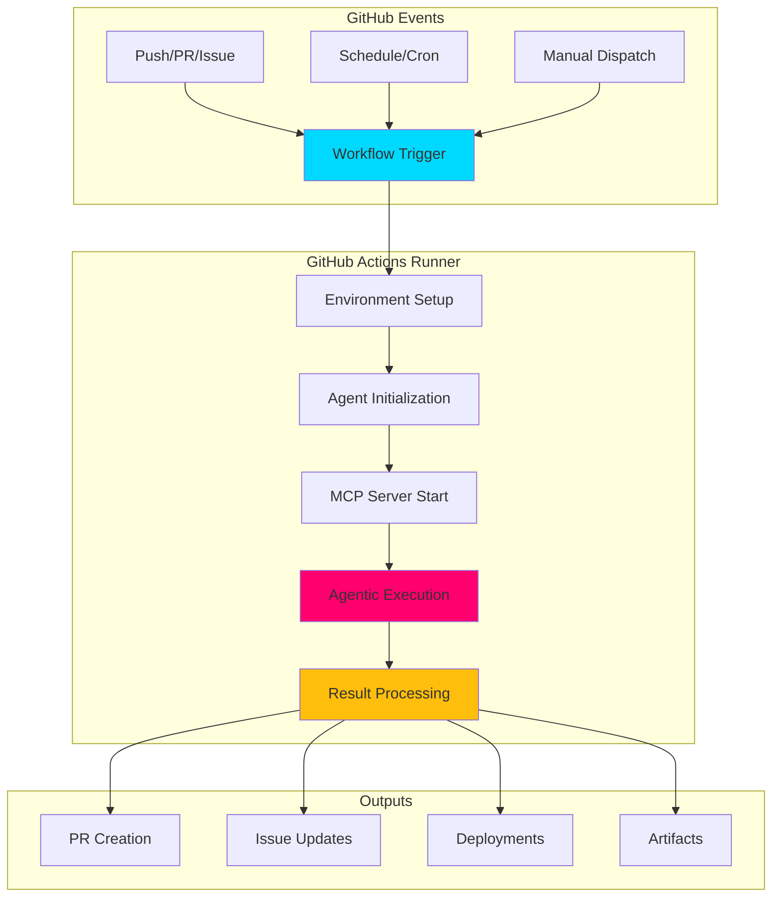

# 🔄 GitHub Actions Integration for Agentic Workflows

## 📋 Overview

This skill provides comprehensive patterns for integrating GitHub Agentic Workflows with GitHub Actions CI/CD pipelines. It covers workflow orchestration, environment configuration, secrets management, parallel execution strategies, and deployment automation for production-ready autonomous agent systems.

## 🎯 Core Concepts

### Agentic Workflow Integration Architecture



### Key Integration Points

1. **Workflow Triggers**: Event-driven agent execution
2. **Environment Configuration**: Runtime setup for agents
3. **Secrets Management**: Secure credential injection
4. **Matrix Strategies**: Parallel agent execution
5. **Deployment Automation**: Production rollout patterns
6. **Artifact Management**: Agent output handling

## 🚀 Workflow Trigger Patterns

### 1. Event-Driven Triggers

#### Pull Request Analysis
```yaml
# .github/workflows/agent-pr-analysis.yml
name: Agentic PR Analysis

on:
  pull_request:
    types: [opened, synchronize, reopened]
    branches:
      - main
      - develop
      - 'feature/**'

permissions:
  contents: read
  pull-requests: write
  issues: write

jobs:
  pr-analysis:
    name: Analyze PR with Agent
    runs-on: ubuntu-latest
    timeout-minutes: 30
    
    steps:
      - name: Harden Runner
        uses: step-security/harden-runner@v2
        with:
          egress-policy: audit
          
      - name: Checkout Code
        uses: actions/checkout@v4
        with:
          fetch-depth: 0  # Full history for comprehensive analysis
          
      - name: Setup Node.js
        uses: actions/setup-node@v4
        with:
          node-version: '25'
          cache: 'npm'
          
      - name: Install Dependencies
        run: npm ci
        
      - name: Initialize MCP Gateway
        run: |
          npx @modelcontextprotocol/gateway start \
            --config .github/copilot-mcp.json \
            --port 3000 &
          
          # Wait for gateway ready
          timeout 30 bash -c 'until curl -f http://localhost:3000/health; do sleep 1; done'
          
      - name: Run Agentic PR Analysis
        id: agent-analysis
        env:
          GITHUB_TOKEN: ${{ secrets.GITHUB_TOKEN }}
          MCP_GATEWAY_URL: http://localhost:3000
          PR_NUMBER: ${{ github.event.pull_request.number }}
          PR_TITLE: ${{ github.event.pull_request.title }}
          PR_AUTHOR: ${{ github.event.pull_request.user.login }}
        run: |
          node scripts/agents/pr-analyzer.js \
            --pr-number="${PR_NUMBER}" \
            --base-ref="${{ github.event.pull_request.base.ref }}" \
            --head-ref="${{ github.event.pull_request.head.ref }}" \
            --output=analysis.json
          
      - name: Post Analysis Comment
        uses: actions/github-script@v7
        with:
          github-token: ${{ secrets.GITHUB_TOKEN }}
          script: |
            const fs = require('fs');
            const analysis = JSON.parse(fs.readFileSync('analysis.json', 'utf8'));
            
            const comment = `## 🤖 Agentic PR Analysis
            
            **Complexity Score**: ${analysis.complexity}/10
            **Security Issues**: ${analysis.security.issues.length}
            **Test Coverage**: ${analysis.coverage.percentage}%
            **Recommendation**: ${analysis.recommendation}
            
            ### 🔍 Key Findings
            ${analysis.findings.map(f => `- ${f}`).join('\n')}
            
            ### 🎯 Action Items
            ${analysis.actionItems.map(item => `- [ ] ${item}`).join('\n')}
            
            ---
            *Analysis performed by GitHub Agentic Workflow*
            `;
            
            await github.rest.issues.createComment({
              owner: context.repo.owner,
              repo: context.repo.repo,
              issue_number: context.issue.number,
              body: comment
            });
            
      - name: Update PR Labels
        if: success()
        uses: actions/github-script@v7
        with:
          github-token: ${{ secrets.GITHUB_TOKEN }}
          script: |
            const fs = require('fs');
            const analysis = JSON.parse(fs.readFileSync('analysis.json', 'utf8'));
            
            const labels = [];
            if (analysis.complexity >= 7) labels.push('complexity:high');
            if (analysis.security.issues.length > 0) labels.push('security:review-needed');
            if (analysis.coverage.percentage < 80) labels.push('test-coverage:low');
            
            if (labels.length > 0) {
              await github.rest.issues.addLabels({
                owner: context.repo.owner,
                repo: context.repo.repo,
                issue_number: context.issue.number,
                labels: labels
              });
            }
```

#### Issue Triage Agent
```yaml
# .github/workflows/agent-issue-triage.yml
name: Agentic Issue Triage

on:
  issues:
    types: [opened, edited, labeled]
  issue_comment:
    types: [created]

permissions:
  issues: write
  contents: read

jobs:
  triage:
    name: Intelligent Issue Triage
    runs-on: ubuntu-latest
    if: github.event_name == 'issues' || (github.event_name == 'issue_comment' && contains(github.event.comment.body, '@agent'))
    
    steps:
      - name: Harden Runner
        uses: step-security/harden-runner@v2
        with:
          egress-policy: audit
          
      - name: Checkout Code
        uses: actions/checkout@v4
        
      - name: Setup Python
        uses: actions/setup-python@v5
        with:
          python-version: '3.11'
          cache: 'pip'
          
      - name: Install Agent Dependencies
        run: |
          pip install -r requirements/agent.txt
          pip install mcp anthropic openai
          
      - name: Run Triage Agent
        env:
          GITHUB_TOKEN: ${{ secrets.GITHUB_TOKEN }}
          ANTHROPIC_API_KEY: ${{ secrets.ANTHROPIC_API_KEY }}
          ISSUE_NUMBER: ${{ github.event.issue.number }}
          ISSUE_TITLE: ${{ github.event.issue.title }}
          ISSUE_BODY: ${{ github.event.issue.body }}
          ISSUE_AUTHOR: ${{ github.event.issue.user.login }}
        run: |
          python scripts/agents/issue_triage.py \
            --issue-number="${ISSUE_NUMBER}" \
            --action=classify
          
      - name: Apply Triage Labels
        uses: actions/github-script@v7
        with:
          github-token: ${{ secrets.GITHUB_TOKEN }}
          script: |
            const fs = require('fs');
            const triage = JSON.parse(fs.readFileSync('triage-result.json', 'utf8'));
            
            await github.rest.issues.addLabels({
              owner: context.repo.owner,
              repo: context.repo.repo,
              issue_number: context.issue.number,
              labels: triage.labels
            });
            
            if (triage.assignee) {
              await github.rest.issues.addAssignees({
                owner: context.repo.owner,
                repo: context.repo.repo,
                issue_number: context.issue.number,
                assignees: [triage.assignee]
              });
            }
            
            if (triage.priority === 'critical') {
              await github.rest.issues.createComment({
                owner: context.repo.owner,
                repo: context.repo.repo,
                issue_number: context.issue.number,
                body: '⚠️ **Critical Priority Detected** - This issue requires immediate attention.'
              });
            }
```

### 2. Scheduled Agent Execution

#### Nightly Intelligence Gathering
```yaml
# .github/workflows/agent-nightly-intelligence.yml
name: Nightly Intelligence Gathering

on:
  schedule:
    # Run every night at 02:00 UTC
    - cron: '0 2 * * *'
  workflow_dispatch:  # Allow manual trigger
    inputs:
      force_refresh:
        description: 'Force refresh all data'
        required: false
        type: boolean
        default: false

permissions:
  contents: write
  pull-requests: write

jobs:
  intelligence:
    name: Gather Intelligence Data
    runs-on: ubuntu-latest
    timeout-minutes: 60
    
    steps:
      - name: Harden Runner
        uses: step-security/harden-runner@v2
        with:
          egress-policy: audit
          
      - name: Checkout Code
        uses: actions/checkout@v4
        with:
          token: ${{ secrets.COPILOT_MCP_GITHUB_PERSONAL_ACCESS_TOKEN }}
          
      - name: Setup Node.js
        uses: actions/setup-node@v4
        with:
          node-version: '25'
          cache: 'npm'
          
      - name: Install Dependencies
        run: npm ci
        
      - name: Start MCP Servers
        run: |
          # Start Riksdag-Regering MCP server
          npm run mcp:riksdag:start &
          
          # Wait for server ready
          sleep 10
          
      - name: Run Intelligence Agent
        id: intelligence
        env:
          GITHUB_TOKEN: ${{ secrets.GITHUB_TOKEN }}
          MCP_RIKSDAG_URL: http://localhost:3001
          FORCE_REFRESH: ${{ github.event.inputs.force_refresh || 'false' }}
        run: |
          node scripts/agents/intelligence-gatherer.js \
            --mode=nightly \
            --output-dir=cia-data \
            --force-refresh="${FORCE_REFRESH}"
          
      - name: Generate Intelligence Reports
        run: |
          node scripts/agents/report-generator.js \
            --input-dir=cia-data \
            --output-dir=news/intelligence \
            --languages=en,sv,da,no,fi
          
      - name: Create Pull Request
        id: create-pr
        uses: peter-evans/create-pull-request@v6
        with:
          token: ${{ secrets.COPILOT_MCP_GITHUB_PERSONAL_ACCESS_TOKEN }}
          commit-message: |
            feat: Nightly intelligence update $(date +%Y-%m-%d)
            
            - Updated CIA intelligence data
            - Generated intelligence reports
            - Data freshness: < 24 hours
            
            Co-authored-by: GitHub Actions <actions@github.com>
          branch: intelligence/nightly-$(date +%Y%m%d)
          delete-branch: true
          title: '🔍 Nightly Intelligence Update - $(date +%Y-%m-%d)'
          body: |
            ## 🤖 Automated Intelligence Update
            
            This PR contains the nightly intelligence data refresh and report generation.
            
            ### 📊 Data Summary
            - **Execution Time**: $(date -u +"%Y-%m-%d %H:%M:%S UTC")
            - **Data Sources**: Riksdag API, CIA Intelligence Platform
            - **Reports Generated**: ${{ env.REPORTS_COUNT }}
            - **Languages**: English, Swedish, Danish, Norwegian, Finnish
            
            ### 🔍 Changes
            - Updated `cia-data/` with latest intelligence exports
            - Generated intelligence reports in `news/intelligence/`
            - Validated data freshness (< 24 hours)
            
            ### ✅ Quality Checks
            - [x] JSON schema validation
            - [x] Data integrity checks
            - [x] Report generation successful
            - [x] Multi-language support verified
            
            ---
            *Generated by GitHub Agentic Workflow*
          labels: |
            automated
            intelligence
            data-update
          assignees: |
            copilot
```

### 3. Manual Dispatch Workflows

#### Ad-Hoc Agent Tasks
```yaml
# .github/workflows/agent-manual-task.yml
name: Manual Agent Task

on:
  workflow_dispatch:
    inputs:
      task_type:
        description: 'Agent task type'
        required: true
        type: choice
        options:
          - code-review
          - security-audit
          - documentation-update
          - data-refresh
          - quality-check
      target:
        description: 'Target (PR number, file path, etc.)'
        required: true
        type: string
      agent_model:
        description: 'Agent model to use'
        required: false
        type: choice
        options:
          - claude-3-5-sonnet
          - gpt-4-turbo
          - gemini-pro
        default: claude-3-5-sonnet
      additional_instructions:
        description: 'Additional instructions for agent'
        required: false
        type: string

permissions:
  contents: write
  pull-requests: write
  issues: write

jobs:
  execute-task:
    name: Execute ${{ github.event.inputs.task_type }}
    runs-on: ubuntu-latest
    timeout-minutes: 45
    
    steps:
      - name: Harden Runner
        uses: step-security/harden-runner@v2
        with:
          egress-policy: audit
          
      - name: Checkout Code
        uses: actions/checkout@v4
        
      - name: Setup Environment
        uses: actions/setup-node@v4
        with:
          node-version: '25'
          cache: 'npm'
          
      - name: Install Dependencies
        run: npm ci
        
      - name: Execute Agent Task
        id: agent-task
        env:
          GITHUB_TOKEN: ${{ secrets.GITHUB_TOKEN }}
          TASK_TYPE: ${{ github.event.inputs.task_type }}
          TARGET: ${{ github.event.inputs.target }}
          AGENT_MODEL: ${{ github.event.inputs.agent_model }}
          ADDITIONAL_INSTRUCTIONS: ${{ github.event.inputs.additional_instructions }}
        run: |
          node scripts/agents/manual-executor.js \
            --task="${TASK_TYPE}" \
            --target="${TARGET}" \
            --model="${AGENT_MODEL}" \
            --instructions="${ADDITIONAL_INSTRUCTIONS}" \
            --output=task-result.json
          
      - name: Process Results
        uses: actions/github-script@v7
        with:
          github-token: ${{ secrets.GITHUB_TOKEN }}
          script: |
            const fs = require('fs');
            const result = JSON.parse(fs.readFileSync('task-result.json', 'utf8'));
            
            // Create summary
            await core.summary
              .addHeading('🤖 Agent Task Results')
              .addTable([
                [{data: 'Property', header: true}, {data: 'Value', header: true}],
                ['Task Type', '${{ github.event.inputs.task_type }}'],
                ['Target', '${{ github.event.inputs.target }}'],
                ['Model', '${{ github.event.inputs.agent_model }}'],
                ['Status', result.status],
                ['Execution Time', `${result.executionTime}s`]
              ])
              .addHeading('📝 Output', 3)
              .addCodeBlock(result.output, 'markdown')
              .write();
            
            // Post results based on task type
            if ('${{ github.event.inputs.task_type }}' === 'code-review') {
              const prNumber = parseInt('${{ github.event.inputs.target }}');
              await github.rest.issues.createComment({
                owner: context.repo.owner,
                repo: context.repo.repo,
                issue_number: prNumber,
                body: result.output
              });
            }
```

## 🔧 Environment Setup Patterns

### 1. Node.js Environment

```yaml
# Node.js setup for agentic workflows
steps:
  - name: Setup Node.js
    uses: actions/setup-node@v4
    with:
      node-version: '25'
      cache: 'npm'
      
  - name: Install Dependencies
    run: |
      npm ci
      
      # Install MCP tools
      npm install -g @modelcontextprotocol/gateway
      npm install -g @modelcontextprotocol/server-github
      npm install -g @modelcontextprotocol/server-filesystem
      
  - name: Verify Installation
    run: |
      node --version
      npm --version
      mcp --version || echo "MCP CLI not available (expected)"
```

### 2. Python Environment

```yaml
# Python setup for agentic workflows
steps:
  - name: Setup Python
    uses: actions/setup-python@v5
    with:
      python-version: '3.11'
      cache: 'pip'
      
  - name: Install Dependencies
    run: |
      python -m pip install --upgrade pip
      pip install -r requirements.txt
      
      # Install MCP Python SDK
      pip install mcp anthropic openai langchain
      
  - name: Verify Installation
    run: |
      python --version
      pip list | grep -E "mcp|anthropic|openai|langchain"
```

### 3. Docker Environment

```yaml
# Docker setup for containerized agents
steps:
  - name: Set up Docker Buildx
    uses: docker/setup-buildx-action@v3
    
  - name: Build Agent Container
    uses: docker/build-push-action@v5
    with:
      context: .
      file: ./docker/agent.Dockerfile
      push: false
      load: true
      tags: agentic-workflow:latest
      cache-from: type=gha
      cache-to: type=gha,mode=max
      
  - name: Run Containerized Agent
    run: |
      docker run --rm \
        -e GITHUB_TOKEN="${{ secrets.GITHUB_TOKEN }}" \
        -e MCP_CONFIG="/config/mcp.json" \
        -v ${{ github.workspace }}:/workspace \
        -v ${{ github.workspace }}/.github/copilot-mcp.json:/config/mcp.json:ro \
        agentic-workflow:latest \
        --task=analyze \
        --target=/workspace
```

### 4. Multi-Runtime Environment

```yaml
# Combined environment for complex workflows
steps:
  - name: Setup Node.js
    uses: actions/setup-node@v4
    with:
      node-version: '25'
      cache: 'npm'
      
  - name: Setup Python
    uses: actions/setup-python@v5
    with:
      python-version: '3.11'
      cache: 'pip'
      
  - name: Setup Go (for MCP servers)
    uses: actions/setup-go@v5
    with:
      go-version: '1.21'
      cache: true
      
  - name: Install All Dependencies
    run: |
      # Node.js
      npm ci
      
      # Python
      pip install -r requirements.txt
      
      # Go (if custom MCP servers)
      go mod download
      
  - name: Start MCP Gateway
    run: |
      npx @modelcontextprotocol/gateway start \
        --config .github/copilot-mcp.json \
        --port 3000 &
      
      # Wait for gateway
      timeout 30 bash -c 'until curl -f http://localhost:3000/health; do sleep 1; done'
```

## 🔐 Secrets Management

### 1. GitHub Secrets Configuration

```yaml
# Secrets usage in workflows
env:
  # GitHub tokens
  GITHUB_TOKEN: ${{ secrets.GITHUB_TOKEN }}  # Automatic token
  COPILOT_PAT: ${{ secrets.COPILOT_MCP_GITHUB_PERSONAL_ACCESS_TOKEN }}  # Custom PAT
  
  # AI model API keys
  ANTHROPIC_API_KEY: ${{ secrets.ANTHROPIC_API_KEY }}
  OPENAI_API_KEY: ${{ secrets.OPENAI_API_KEY }}
  
  # MCP server credentials
  MCP_GITHUB_TOKEN: ${{ secrets.MCP_GITHUB_TOKEN }}
  MCP_DATABASE_URL: ${{ secrets.MCP_DATABASE_URL }}
  
  # Custom service credentials
  CIA_API_KEY: ${{ secrets.CIA_API_KEY }}
  RIKSDAG_API_TOKEN: ${{ secrets.RIKSDAG_API_TOKEN }}
```

### 2. Environment-Specific Secrets

```yaml
# Using GitHub Environments for different deployment stages
jobs:
  deploy-dev:
    name: Deploy to Development
    runs-on: ubuntu-latest
    environment: development
    steps:
      - name: Deploy Agent
        env:
          API_KEY: ${{ secrets.DEV_API_KEY }}
          DATABASE_URL: ${{ secrets.DEV_DATABASE_URL }}
        run: |
          ./scripts/deploy-agent.sh --env=development
          
  deploy-prod:
    name: Deploy to Production
    runs-on: ubuntu-latest
    environment: production
    needs: deploy-dev
    steps:
      - name: Deploy Agent
        env:
          API_KEY: ${{ secrets.PROD_API_KEY }}
          DATABASE_URL: ${{ secrets.PROD_DATABASE_URL }}
        run: |
          ./scripts/deploy-agent.sh --env=production
```

### 3. Secret Rotation Pattern

```yaml
# Automated secret rotation check
jobs:
  check-secrets:
    name: Check Secret Expiration
    runs-on: ubuntu-latest
    steps:
      - name: Check Token Expiration
        env:
          GITHUB_TOKEN: ${{ secrets.GITHUB_TOKEN }}
        run: |
          # Check PAT expiration
          EXPIRATION=$(gh api user | jq -r '.token_expires_at // "never"')
          
          if [ "$EXPIRATION" != "never" ]; then
            DAYS_UNTIL_EXPIRATION=$(( ($(date -d "$EXPIRATION" +%s) - $(date +%s)) / 86400 ))
            
            if [ $DAYS_UNTIL_EXPIRATION -lt 7 ]; then
              echo "⚠️ Token expires in $DAYS_UNTIL_EXPIRATION days"
              gh issue create \
                --title "🔐 GitHub PAT Expiring Soon" \
                --body "Personal Access Token expires in $DAYS_UNTIL_EXPIRATION days. Please rotate." \
                --label security,automation
            fi
          fi
```

## 🔀 Matrix Strategy Patterns

### 1. Parallel Agent Execution

```yaml
# Run multiple agents in parallel across different targets
jobs:
  analyze:
    name: Analyze ${{ matrix.component }}
    runs-on: ubuntu-latest
    timeout-minutes: 30
    
    strategy:
      matrix:
        component:
          - frontend
          - backend
          - api
          - database
          - infrastructure
        include:
          - component: frontend
            agent: ui-enhancement-specialist
            files: 'src/frontend/**'
          - component: backend
            agent: security-architect
            files: 'src/backend/**'
          - component: api
            agent: api-integration
            files: 'src/api/**'
          - component: database
            agent: data-pipeline-specialist
            files: 'migrations/**'
          - component: infrastructure
            agent: devops-engineer
            files: '.github/workflows/**'
      fail-fast: false  # Continue even if one fails
      max-parallel: 5
      
    steps:
      - name: Checkout Code
        uses: actions/checkout@v4
        
      - name: Setup Environment
        uses: actions/setup-node@v4
        with:
          node-version: '25'
          
      - name: Run Agent Analysis
        env:
          GITHUB_TOKEN: ${{ secrets.GITHUB_TOKEN }}
          COMPONENT: ${{ matrix.component }}
          AGENT: ${{ matrix.agent }}
          FILES: ${{ matrix.files }}
        run: |
          node scripts/agents/analyzer.js \
            --component="${COMPONENT}" \
            --agent="${AGENT}" \
            --files="${FILES}" \
            --output="${COMPONENT}-analysis.json"
            
      - name: Upload Analysis Results
        uses: actions/upload-artifact@v4
        with:
          name: analysis-${{ matrix.component }}
          path: ${{ matrix.component }}-analysis.json
          retention-days: 30
          
  aggregate:
    name: Aggregate Analysis Results
    needs: analyze
    runs-on: ubuntu-latest
    
    steps:
      - name: Download All Artifacts
        uses: actions/download-artifact@v4
        with:
          path: analysis-results
          
      - name: Aggregate Results
        run: |
          node scripts/agents/aggregator.js \
            --input-dir=analysis-results \
            --output=final-analysis.json
            
      - name: Create Summary Report
        uses: actions/github-script@v7
        with:
          github-token: ${{ secrets.GITHUB_TOKEN }}
          script: |
            const fs = require('fs');
            const analysis = JSON.parse(fs.readFileSync('final-analysis.json', 'utf8'));
            
            await core.summary
              .addHeading('📊 Multi-Component Analysis Results')
              .addTable([
                [{data: 'Component', header: true}, {data: 'Status', header: true}, {data: 'Issues', header: true}],
                ...Object.entries(analysis.components).map(([component, data]) => [
                  component,
                  data.status === 'pass' ? '✅' : '❌',
                  data.issues.length.toString()
                ])
              ])
              .write();
```

### 2. Multi-Language Agent Execution

```yaml
# Run agents across multiple language versions
jobs:
  validate:
    name: Validate ${{ matrix.language }} Content
    runs-on: ubuntu-latest
    
    strategy:
      matrix:
        language: [en, sv, da, no, fi, de, fr, es, nl, ar, he, ja, ko, zh]
        include:
          - language: en
            file: index.html
            rtl: false
          - language: sv
            file: index_sv.html
            rtl: false
          - language: ar
            file: index_ar.html
            rtl: true
          - language: he
            file: index_he.html
            rtl: true
      fail-fast: false
      
    steps:
      - name: Checkout Code
        uses: actions/checkout@v4
        
      - name: Run Content Validation Agent
        env:
          LANGUAGE: ${{ matrix.language }}
          FILE: ${{ matrix.file }}
          RTL: ${{ matrix.rtl }}
        run: |
          node scripts/agents/content-validator.js \
            --language="${LANGUAGE}" \
            --file="${FILE}" \
            --rtl="${RTL}" \
            --output="validation-${LANGUAGE}.json"
            
      - name: Upload Results
        uses: actions/upload-artifact@v4
        with:
          name: validation-${{ matrix.language }}
          path: validation-${{ matrix.language }}.json
```

### 3. Multi-Platform Testing

```yaml
# Test agents across different platforms
jobs:
  test:
    name: Test on ${{ matrix.os }}
    runs-on: ${{ matrix.os }}
    
    strategy:
      matrix:
        os: [ubuntu-latest, windows-latest, macos-latest]
        node-version: ['25']
      fail-fast: false
      
    steps:
      - name: Checkout Code
        uses: actions/checkout@v4
        
      - name: Setup Node.js
        uses: actions/setup-node@v4
        with:
          node-version: ${{ matrix.node-version }}
          
      - name: Install Dependencies
        run: npm ci
        
      - name: Run Agent Tests
        run: npm test -- --coverage --reporters=json
        
      - name: Upload Coverage
        uses: codecov/codecov-action@v4
        with:
          files: ./coverage/coverage-final.json
          flags: ${{ matrix.os }}-node${{ matrix.node-version }}
```

## 🚀 Deployment Patterns

### 1. Agent Deployment Pipeline

```yaml
# Complete deployment pipeline for agentic workflows
name: Deploy Agentic Workflow

on:
  push:
    branches: [main]
    paths:
      - 'scripts/agents/**'
      - '.github/workflows/agent-*.yml'
      - '.github/copilot-mcp.json'

permissions:
  contents: write
  deployments: write
  packages: write

jobs:
  test:
    name: Test Agents
    runs-on: ubuntu-latest
    
    steps:
      - name: Checkout Code
        uses: actions/checkout@v4
        
      - name: Setup Node.js
        uses: actions/setup-node@v4
        with:
          node-version: '25'
          cache: 'npm'
          
      - name: Install Dependencies
        run: npm ci
        
      - name: Run Tests
        run: npm test
        
      - name: Run Integration Tests
        run: npm run test:integration
        
  build:
    name: Build Agent Container
    needs: test
    runs-on: ubuntu-latest
    
    steps:
      - name: Checkout Code
        uses: actions/checkout@v4
        
      - name: Set up Docker Buildx
        uses: docker/setup-buildx-action@v3
        
      - name: Login to GitHub Container Registry
        uses: docker/login-action@v3
        with:
          registry: ghcr.io
          username: ${{ github.actor }}
          password: ${{ secrets.GITHUB_TOKEN }}
          
      - name: Build and Push
        uses: docker/build-push-action@v5
        with:
          context: .
          file: ./docker/agent.Dockerfile
          push: true
          tags: |
            ghcr.io/${{ github.repository }}/agent:latest
            ghcr.io/${{ github.repository }}/agent:${{ github.sha }}
          cache-from: type=gha
          cache-to: type=gha,mode=max
          
  deploy-staging:
    name: Deploy to Staging
    needs: build
    runs-on: ubuntu-latest
    environment: staging
    
    steps:
      - name: Deploy Agent
        run: |
          # Deploy containerized agent to staging environment
          kubectl set image deployment/agentic-workflow \
            agent=ghcr.io/${{ github.repository }}/agent:${{ github.sha }} \
            --namespace=staging
            
      - name: Verify Deployment
        run: |
          kubectl rollout status deployment/agentic-workflow \
            --namespace=staging \
            --timeout=5m
            
      - name: Run Smoke Tests
        run: |
          # Test agent functionality in staging
          curl -f https://staging.example.com/agent/health || exit 1
          
  deploy-production:
    name: Deploy to Production
    needs: deploy-staging
    runs-on: ubuntu-latest
    environment: production
    
    steps:
      - name: Create Deployment
        uses: chrnorm/deployment-action@v2
        id: deployment
        with:
          token: ${{ secrets.GITHUB_TOKEN }}
          environment: production
          
      - name: Deploy Agent
        run: |
          kubectl set image deployment/agentic-workflow \
            agent=ghcr.io/${{ github.repository }}/agent:${{ github.sha }} \
            --namespace=production
            
      - name: Verify Deployment
        run: |
          kubectl rollout status deployment/agentic-workflow \
            --namespace=production \
            --timeout=10m
            
      - name: Update Deployment Status
        if: always()
        uses: chrnorm/deployment-status@v2
        with:
          token: ${{ secrets.GITHUB_TOKEN }}
          deployment-id: ${{ steps.deployment.outputs.deployment_id }}
          state: ${{ job.status }}
          environment-url: https://example.com
```

### 2. Blue-Green Deployment

```yaml
# Blue-green deployment for zero-downtime agent updates
jobs:
  deploy-green:
    name: Deploy Green Environment
    runs-on: ubuntu-latest
    environment: production
    
    steps:
      - name: Deploy to Green
        run: |
          kubectl apply -f k8s/agent-green.yaml
          
      - name: Wait for Readiness
        run: |
          kubectl wait --for=condition=ready pod \
            -l app=agent,slot=green \
            --timeout=5m
            
      - name: Run Health Checks
        run: |
          GREEN_URL=$(kubectl get svc agent-green -o jsonpath='{.status.loadBalancer.ingress[0].hostname}')
          curl -f "http://${GREEN_URL}/health" || exit 1
          
  switch-traffic:
    name: Switch Traffic to Green
    needs: deploy-green
    runs-on: ubuntu-latest
    environment: production
    
    steps:
      - name: Update Load Balancer
        run: |
          kubectl patch service agent \
            -p '{"spec":{"selector":{"slot":"green"}}}'
            
      - name: Verify Traffic Switch
        run: |
          sleep 30  # Allow DNS propagation
          curl -f https://agent.example.com/health || exit 1
          
  cleanup-blue:
    name: Cleanup Blue Environment
    needs: switch-traffic
    runs-on: ubuntu-latest
    
    steps:
      - name: Scale Down Blue
        run: |
          kubectl scale deployment agent-blue --replicas=0
```

### 3. Canary Deployment

```yaml
# Canary deployment with gradual traffic shift
jobs:
  deploy-canary:
    name: Deploy Canary (10%)
    runs-on: ubuntu-latest
    environment: production
    
    steps:
      - name: Deploy Canary
        run: |
          kubectl apply -f k8s/agent-canary.yaml
          
      - name: Configure Traffic Split (10%)
        run: |
          kubectl apply -f - <<EOF
          apiVersion: networking.istio.io/v1alpha3
          kind: VirtualService
          metadata:
            name: agent
          spec:
            hosts:
            - agent.example.com
            http:
            - match:
              - headers:
                  user-agent:
                    regex: .*canary.*
              route:
              - destination:
                  host: agent-canary
                weight: 100
            - route:
              - destination:
                  host: agent-stable
                weight: 90
              - destination:
                  host: agent-canary
                weight: 10
          EOF
          
      - name: Monitor Canary Metrics
        run: |
          # Monitor for 10 minutes
          for i in {1..10}; do
            ERROR_RATE=$(curl -s prometheus:9090/api/v1/query \
              --data-urlencode 'query=rate(http_requests_total{service="agent-canary",status=~"5.."}[5m])' \
              | jq -r '.data.result[0].value[1]')
              
            if (( $(echo "$ERROR_RATE > 0.05" | bc -l) )); then
              echo "❌ Error rate too high: $ERROR_RATE"
              exit 1
            fi
            
            sleep 60
          done
          
  promote-canary:
    name: Promote Canary (100%)
    needs: deploy-canary
    runs-on: ubuntu-latest
    environment: production
    
    steps:
      - name: Gradually Increase Traffic
        run: |
          for WEIGHT in 25 50 75 100; do
            kubectl patch virtualservice agent --type merge -p \
              "{\"spec\":{\"http\":[{\"route\":[{\"destination\":{\"host\":\"agent-stable\"},\"weight\":$((100-WEIGHT))},{\"destination\":{\"host\":\"agent-canary\"},\"weight\":$WEIGHT}]}]}}"
            
            echo "Traffic split: Stable $((100-WEIGHT))% / Canary ${WEIGHT}%"
            sleep 300  # Wait 5 minutes between increments
          done
          
      - name: Promote Canary to Stable
        run: |
          kubectl set image deployment/agent-stable \
            agent=$(kubectl get deployment agent-canary -o jsonpath='{.spec.template.spec.containers[0].image}')
```

## 🎯 Best Practices

### 1. Workflow Organization

```yaml
# Use reusable workflows for common patterns
# .github/workflows/reusable-agent-setup.yml
name: Reusable Agent Setup

on:
  workflow_call:
    inputs:
      node-version:
        required: false
        type: string
        default: '20'
      python-version:
        required: false
        type: string
        default: '3.11'
    secrets:
      anthropic-key:
        required: false
      openai-key:
        required: false

jobs:
  setup:
    runs-on: ubuntu-latest
    steps:
      - name: Checkout Code
        uses: actions/checkout@v4
        
      - name: Setup Node.js
        uses: actions/setup-node@v4
        with:
          node-version: ${{ inputs.node-version }}
          cache: 'npm'
          
      - name: Setup Python
        uses: actions/setup-python@v5
        with:
          python-version: ${{ inputs.python-version }}
          cache: 'pip'
          
      - name: Install Dependencies
        run: |
          npm ci
          pip install -r requirements.txt

# Use the reusable workflow
# .github/workflows/my-agent.yml
name: My Agent Workflow

on: [push]

jobs:
  my-task:
    uses: ./.github/workflows/reusable-agent-setup.yml
    with:
      node-version: '25'
      python-version: '3.11'
    secrets:
      anthropic-key: ${{ secrets.ANTHROPIC_API_KEY }}
```

### 2. Efficient Caching

```yaml
# Optimize caching for faster builds
steps:
  - name: Cache Node Modules
    uses: actions/cache@v4
    with:
      path: |
        ~/.npm
        node_modules
        .next/cache
      key: ${{ runner.os }}-node-${{ hashFiles('**/package-lock.json') }}
      restore-keys: |
        ${{ runner.os }}-node-
        
  - name: Cache Python Dependencies
    uses: actions/cache@v4
    with:
      path: |
        ~/.cache/pip
        .venv
      key: ${{ runner.os }}-pip-${{ hashFiles('**/requirements.txt') }}
      restore-keys: |
        ${{ runner.os }}-pip-
        
  - name: Cache Docker Layers
    uses: actions/cache@v4
    with:
      path: /tmp/.buildx-cache
      key: ${{ runner.os }}-buildx-${{ github.sha }}
      restore-keys: |
        ${{ runner.os }}-buildx-
```

### 3. Concurrency Control

```yaml
# Prevent concurrent workflow runs
concurrency:
  group: ${{ github.workflow }}-${{ github.ref }}
  cancel-in-progress: true

# Separate concurrency for different workflow types
concurrency:
  group: agent-${{ github.event_name }}-${{ github.ref }}
  cancel-in-progress: ${{ github.event_name == 'pull_request' }}
```

### 4. Timeout Management

```yaml
# Set appropriate timeouts
jobs:
  quick-analysis:
    runs-on: ubuntu-latest
    timeout-minutes: 10  # Quick tasks
    
  deep-analysis:
    runs-on: ubuntu-latest
    timeout-minutes: 60  # Longer tasks
    
  nightly-job:
    runs-on: ubuntu-latest
    timeout-minutes: 360  # 6 hours for intensive tasks
```

## 🔒 Security Best Practices

### 1. Least Privilege Permissions

```yaml
# Minimal permissions
permissions:
  contents: read  # Only read access by default
  
# Add specific permissions as needed
permissions:
  contents: read
  pull-requests: write  # Only for PR comments
  issues: write  # Only for issue updates
```

### 2. Hardened Runner

```yaml
steps:
  - name: Harden Runner
    uses: step-security/harden-runner@v2
    with:
      egress-policy: audit  # Monitor network calls
      allowed-endpoints: >
        api.github.com:443
        github.com:443
        objects.githubusercontent.com:443
        api.anthropic.com:443
```

### 3. Secret Scanning

```yaml
# Add secret scanning to workflows
steps:
  - name: TruffleHog Secret Scan
    uses: trufflesecurity/trufflehog@main
    with:
      path: ./
      base: ${{ github.event.repository.default_branch }}
      head: HEAD
```

## 🐛 Troubleshooting

### Common Issues and Solutions

#### 1. Workflow Not Triggering

**Problem**: Workflow doesn't run on expected events.

**Solution**:
```yaml
# Debug trigger configuration
on:
  push:
    branches: [main]
  pull_request:
    types: [opened, synchronize]
  workflow_dispatch:  # Add manual trigger for testing

jobs:
  debug:
    runs-on: ubuntu-latest
    steps:
      - name: Print Event
        run: |
          echo "Event name: ${{ github.event_name }}"
          echo "Event action: ${{ github.event.action }}"
          echo "Ref: ${{ github.ref }}"
```

#### 2. MCP Server Connection Failures

**Problem**: Agent can't connect to MCP servers.

**Solution**:
```bash
# Add health check and retry logic
steps:
  - name: Start MCP Server with Retry
    run: |
      start_mcp() {
        npx @modelcontextprotocol/gateway start \
          --config .github/copilot-mcp.json \
          --port 3000 &
        
        # Wait for server with timeout
        TIMEOUT=60
        ELAPSED=0
        while ! curl -f http://localhost:3000/health 2>/dev/null; do
          if [ $ELAPSED -ge $TIMEOUT ]; then
            echo "❌ MCP server failed to start"
            return 1
          fi
          sleep 1
          ((ELAPSED++))
        done
        
        echo "✅ MCP server started successfully"
        return 0
      }
      
      # Retry up to 3 times
      for i in {1..3}; do
        if start_mcp; then
          break
        fi
        echo "Retry $i/3..."
        sleep 5
      done
```

#### 3. Artifact Upload Failures

**Problem**: Artifacts fail to upload or download.

**Solution**:
```yaml
# Add error handling for artifacts
steps:
  - name: Upload Artifacts with Retry
    uses: actions/upload-artifact@v4
    with:
      name: analysis-results
      path: results/
      retention-days: 30
      if-no-files-found: warn  # Don't fail if no files
      
  - name: Verify Artifact Upload
    if: success()
    run: |
      echo "✅ Artifacts uploaded successfully"
```

## 📚 Related Skills

- **[gh-aw-mcp-gateway](../gh-aw-mcp-gateway/)** - MCP Gateway configuration and routing
- **[gh-aw-safe-outputs](../gh-aw-safe-outputs/)** - Safe output handling and sanitization
- **[gh-aw-logging-monitoring](../gh-aw-logging-monitoring/)** - Logging and monitoring patterns
- **[gh-aw-authentication-credentials](../gh-aw-authentication-credentials/)** - Authentication and secrets
- **[gh-aw-containerization](../gh-aw-containerization/)** - Docker and container patterns

## 🔗 References

### Official Documentation
- [GitHub Actions Documentation](https://docs.github.com/en/actions)
- [Workflow Syntax](https://docs.github.com/en/actions/using-workflows/workflow-syntax-for-github-actions)
- [GitHub Actions Security](https://docs.github.com/en/actions/security-guides)
- [Reusing Workflows](https://docs.github.com/en/actions/using-workflows/reusing-workflows)

### Security Resources
- [Step Security Harden Runner](https://github.com/step-security/harden-runner)
- [GitHub Actions Security Best Practices](https://docs.github.com/en/actions/security-guides/security-hardening-for-github-actions)
- [OpenSSF Scorecards](https://github.com/ossf/scorecard)

### Tools and Actions
- [actions/checkout](https://github.com/actions/checkout)
- [actions/setup-node](https://github.com/actions/setup-node)
- [actions/upload-artifact](https://github.com/actions/upload-artifact)
- [docker/build-push-action](https://github.com/docker/build-push-action)

## ✅ Remember Checklist

When integrating agentic workflows with GitHub Actions:

- [ ] Use appropriate workflow triggers for your use case
- [ ] Set minimal required permissions
- [ ] Implement timeout management
- [ ] Add harden-runner for security
- [ ] Cache dependencies for faster builds
- [ ] Use matrix strategies for parallel execution
- [ ] Implement proper error handling
- [ ] Add health checks for long-running services
- [ ] Use GitHub Environments for multi-stage deployments
- [ ] Implement secret rotation checks
- [ ] Add concurrency control
- [ ] Monitor workflow execution metrics
- [ ] Document custom workflows
- [ ] Test workflows before deploying to production
- [ ] Implement rollback procedures

---

**License**: Apache-2.0  
**Version**: 2.0.0  
**Last Updated**: 2026-04-02  
**Maintained by**: Hack23 Organization

---
> Converted and distributed by [TomeVault](https://tomevault.io/claim/hack23) — claim your Tome and manage your conversions.
<!-- tomevault:4.0:skill_md:2026-04-13 -->
