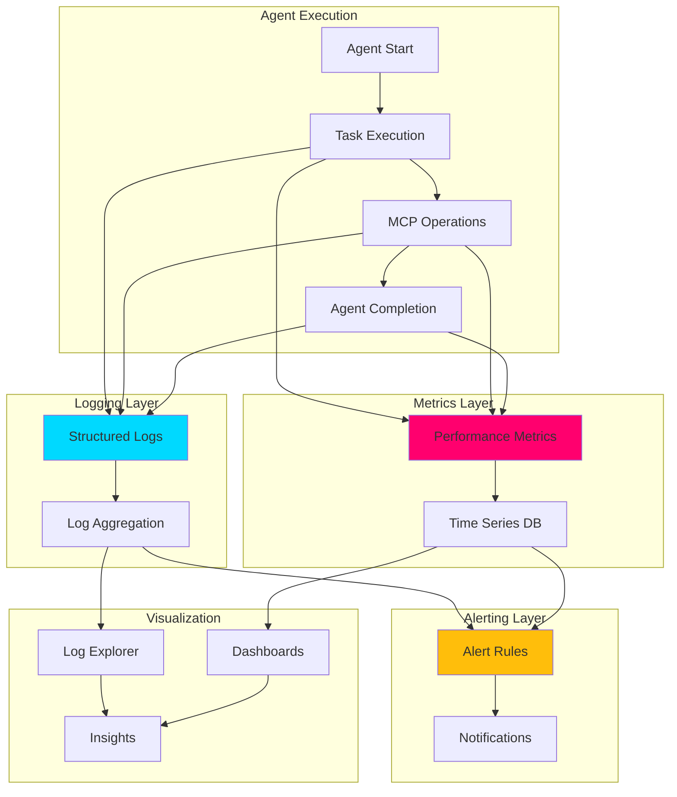

# 📊 Logging and Monitoring for Agentic Workflows

## 📋 Overview

This skill provides comprehensive patterns for implementing observability in GitHub Agentic Workflows. It covers structured logging architectures, metrics collection, alerting strategies, debugging techniques, and production monitoring best practices for autonomous agent systems.

## 🎯 Core Concepts

### Observability Architecture



### Three Pillars of Observability

1. **Logs**: Detailed event records with context
2. **Metrics**: Quantitative measurements over time
3. **Traces**: Request flow through system components

## 📝 Structured Logging

### 1. Logging Architecture

#### JSON Structured Logging Format

```javascript
// scripts/agents/lib/logger.js
import winston from 'winston';
import { v4 as uuidv4 } from 'uuid';

/**
 * Structured logger for agentic workflows
 * Outputs JSON logs with consistent schema
 */
class AgentLogger {
  constructor(options = {}) {
    this.agentId = options.agentId || process.env.AGENT_ID || uuidv4();
    this.sessionId = options.sessionId || uuidv4();
    this.environment = process.env.NODE_ENV || 'development';
    
    this.logger = winston.createLogger({
      level: options.level || process.env.LOG_LEVEL || 'info',
      format: winston.format.combine(
        winston.format.timestamp({ format: 'ISO' }),
        winston.format.errors({ stack: true }),
        winston.format.json()
      ),
      defaultMeta: {
        agent_id: this.agentId,
        session_id: this.sessionId,
        environment: this.environment,
        service: 'agentic-workflow',
        version: process.env.APP_VERSION || '1.0.0'
      },
      transports: [
        // Console output (GitHub Actions)
        new winston.transports.Console({
          format: winston.format.combine(
            winston.format.colorize(),
            winston.format.printf(this.formatConsoleOutput.bind(this))
          )
        }),
        // File output (local development)
        new winston.transports.File({
          filename: 'logs/agent-errors.log',
          level: 'error',
          maxsize: 10485760, // 10MB
          maxFiles: 5,
          tailable: true
        }),
        new winston.transports.File({
          filename: 'logs/agent-combined.log',
          maxsize: 10485760,
          maxFiles: 10,
          tailable: true
        })
      ],
      exitOnError: false
    });
  }
  
  /**
   * Format console output for human readability
   */
  formatConsoleOutput(info) {
    const { timestamp, level, message, ...meta } = info;
    const metaStr = Object.keys(meta).length ? JSON.stringify(meta, null, 2) : '';
    return `${timestamp} [${level}] ${message}${metaStr ? '\n' + metaStr : ''}`;
  }
  
  /**
   * Log agent lifecycle events
   */
  logAgentStart(taskType, context = {}) {
    this.logger.info('Agent execution started', {
      event_type: 'agent_start',
      task_type: taskType,
      ...context
    });
  }
  
  logAgentComplete(taskType, result, metrics = {}) {
    this.logger.info('Agent execution completed', {
      event_type: 'agent_complete',
      task_type: taskType,
      status: result.status,
      duration_ms: metrics.duration,
      tokens_used: metrics.tokens,
      ...result
    });
  }
  
  logAgentError(taskType, error, context = {}) {
    this.logger.error('Agent execution failed', {
      event_type: 'agent_error',
      task_type: taskType,
      error_message: error.message,
      error_stack: error.stack,
      error_code: error.code,
      ...context
    });
  }
  
  /**
   * Log MCP operations
   */
  logMCPCall(toolName, params, context = {}) {
    this.logger.debug('MCP tool call', {
      event_type: 'mcp_call',
      tool_name: toolName,
      params: this.sanitizeParams(params),
      ...context
    });
  }
  
  logMCPResponse(toolName, response, duration) {
    this.logger.debug('MCP tool response', {
      event_type: 'mcp_response',
      tool_name: toolName,
      duration_ms: duration,
      response_size: JSON.stringify(response).length,
      status: 'success'
    });
  }
  
  logMCPError(toolName, error, duration) {
    this.logger.error('MCP tool error', {
      event_type: 'mcp_error',
      tool_name: toolName,
      duration_ms: duration,
      error_message: error.message,
      error_code: error.code
    });
  }
  
  /**
   * Log performance metrics
   */
  logPerformance(operation, metrics) {
    this.logger.info('Performance metrics', {
      event_type: 'performance',
      operation,
      duration_ms: metrics.duration,
      memory_mb: metrics.memory,
      cpu_percent: metrics.cpu
    });
  }
  
  /**
   * Log security events
   */
  logSecurityEvent(eventType, details) {
    this.logger.warn('Security event', {
      event_type: 'security',
      security_event: eventType,
      ...details
    });
  }
  
  /**
   * Sanitize sensitive data from logs
   */
  sanitizeParams(params) {
    const sensitive = ['token', 'password', 'secret', 'key', 'api_key'];
    const sanitized = { ...params };
    
    for (const key of Object.keys(sanitized)) {
      if (sensitive.some(s => key.toLowerCase().includes(s))) {
        sanitized[key] = '***REDACTED***';
      }
    }
    
    return sanitized;
  }
  
  /**
   * Create child logger with additional context
   */
  child(metadata) {
    const childLogger = Object.create(this);
    childLogger.logger = this.logger.child(metadata);
    return childLogger;
  }
}

export default AgentLogger;

// Usage example
const logger = new AgentLogger({
  agentId: 'pr-analyzer',
  sessionId: process.env.GITHUB_RUN_ID
});

logger.logAgentStart('pr-analysis', {
  pr_number: 123,
  repository: 'owner/repo'
});
```

#### Python Structured Logging

```python
# scripts/agents/lib/logger.py
import logging
import json
import sys
import os
from datetime import datetime
from typing import Any, Dict, Optional
import uuid

class JSONFormatter(logging.Formatter):
    """
    JSON formatter for structured logging
    """
    def __init__(self):
        super().__init__()
        self.agent_id = os.getenv('AGENT_ID', str(uuid.uuid4()))
        self.session_id = os.getenv('GITHUB_RUN_ID', str(uuid.uuid4()))
        self.environment = os.getenv('ENVIRONMENT', 'development')
        
    def format(self, record: logging.LogRecord) -> str:
        """Format log record as JSON"""
        log_data = {
            'timestamp': datetime.utcnow().isoformat() + 'Z',
            'level': record.levelname,
            'message': record.getMessage(),
            'agent_id': self.agent_id,
            'session_id': self.session_id,
            'environment': self.environment,
            'service': 'agentic-workflow',
            'logger': record.name,
            'module': record.module,
            'function': record.funcName,
            'line': record.lineno
        }
        
        # Add exception info if present
        if record.exc_info:
            log_data['exception'] = {
                'type': record.exc_info[0].__name__,
                'message': str(record.exc_info[1]),
                'traceback': self.formatException(record.exc_info)
            }
            
        # Add extra fields
        if hasattr(record, 'extra_fields'):
            log_data.update(record.extra_fields)
            
        return json.dumps(log_data)

class AgentLogger:
    """
    Structured logger for agentic workflows
    """
    def __init__(self, name: str, level: str = 'INFO'):
        self.logger = logging.getLogger(name)
        self.logger.setLevel(getattr(logging, level.upper()))
        
        # Console handler with JSON format
        console_handler = logging.StreamHandler(sys.stdout)
        console_handler.setFormatter(JSONFormatter())
        self.logger.addHandler(console_handler)
        
        # File handler for errors
        if not os.path.exists('logs'):
            os.makedirs('logs')
            
        error_handler = logging.FileHandler('logs/agent-errors.log')
        error_handler.setLevel(logging.ERROR)
        error_handler.setFormatter(JSONFormatter())
        self.logger.addHandler(error_handler)
        
    def log_agent_start(self, task_type: str, context: Dict[str, Any] = None):
        """Log agent start event"""
        extra = {
            'extra_fields': {
                'event_type': 'agent_start',
                'task_type': task_type,
                **(context or {})
            }
        }
        self.logger.info('Agent execution started', extra=extra)
        
    def log_agent_complete(self, task_type: str, result: Dict[str, Any], metrics: Dict[str, Any] = None):
        """Log agent completion event"""
        extra = {
            'extra_fields': {
                'event_type': 'agent_complete',
                'task_type': task_type,
                'status': result.get('status'),
                'duration_ms': metrics.get('duration') if metrics else None,
                **result
            }
        }
        self.logger.info('Agent execution completed', extra=extra)
        
    def log_agent_error(self, task_type: str, error: Exception, context: Dict[str, Any] = None):
        """Log agent error event"""
        extra = {
            'extra_fields': {
                'event_type': 'agent_error',
                'task_type': task_type,
                'error_type': type(error).__name__,
                'error_message': str(error),
                **(context or {})
            }
        }
        self.logger.error('Agent execution failed', extra=extra, exc_info=error)
        
    def log_mcp_call(self, tool_name: str, params: Dict[str, Any], context: Dict[str, Any] = None):
        """Log MCP tool call"""
        extra = {
            'extra_fields': {
                'event_type': 'mcp_call',
                'tool_name': tool_name,
                'params': self._sanitize_params(params),
                **(context or {})
            }
        }
        self.logger.debug('MCP tool call', extra=extra)
        
    def _sanitize_params(self, params: Dict[str, Any]) -> Dict[str, Any]:
        """Sanitize sensitive data"""
        sensitive = ['token', 'password', 'secret', 'key', 'api_key']
        sanitized = params.copy()
        
        for key in sanitized.keys():
            if any(s in key.lower() for s in sensitive):
                sanitized[key] = '***REDACTED***'
                
        return sanitized

# Usage
logger = AgentLogger('pr-analyzer', level='INFO')
logger.log_agent_start('pr-analysis', {'pr_number': 123})
```

### 2. Log Levels and When to Use Them

#### Log Level Guidelines

```javascript
// ERROR: System errors requiring immediate attention
logger.error('Failed to connect to MCP server', {
  error: error.message,
  mcp_server: 'github',
  retry_count: 3
});

// WARN: Unexpected conditions that don't prevent operation
logger.warn('MCP response slow', {
  duration_ms: 5000,
  threshold_ms: 3000,
  tool_name: 'github-search'
});

// INFO: Important business events and milestones
logger.info('PR analysis completed', {
  pr_number: 123,
  issues_found: 5,
  duration_ms: 15000
});

// DEBUG: Detailed information for debugging
logger.debug('Processing file', {
  file_path: 'src/index.js',
  file_size: 1024,
  line_count: 50
});

// TRACE: Very detailed diagnostic information (if supported)
logger.trace('Token consumed', {
  token_count: 1000,
  model: 'claude-3-5-sonnet',
  prompt_type: 'analysis'
});
```

### 3. Log Aggregation Patterns

#### GitHub Actions Log Groups

```yaml
# Group related logs in GitHub Actions
steps:
  - name: Run Agent Analysis
    run: |
      echo "::group::Agent Initialization"
      node scripts/agents/pr-analyzer.js --phase=init
      echo "::endgroup::"
      
      echo "::group::MCP Server Connection"
      node scripts/agents/pr-analyzer.js --phase=connect
      echo "::endgroup::"
      
      echo "::group::Analysis Execution"
      node scripts/agents/pr-analyzer.js --phase=analyze
      echo "::endgroup::"
      
      echo "::group::Report Generation"
      node scripts/agents/pr-analyzer.js --phase=report
      echo "::endgroup::"
```

#### Centralized Log Collection

```javascript
// scripts/agents/lib/log-collector.js
import { S3Client, PutObjectCommand } from '@aws-sdk/client-s3';
import { gunzipSync, gzipSync } from 'zlib';

/**
 * Collect and upload logs to centralized storage
 */
class LogCollector {
  constructor(options = {}) {
    this.s3Client = new S3Client({
      region: options.region || 'us-east-1'
    });
    this.bucket = options.bucket || 'agentic-workflow-logs';
    this.compression = options.compression !== false;
  }
  
  /**
   * Upload logs to S3
   */
  async uploadLogs(logFile, metadata = {}) {
    const content = await fs.readFile(logFile, 'utf8');
    const logs = content.split('\n').filter(Boolean).map(JSON.parse);
    
    const key = this.generateLogKey(metadata);
    const body = this.compression ? gzipSync(JSON.stringify(logs)) : JSON.stringify(logs);
    
    await this.s3Client.send(new PutObjectCommand({
      Bucket: this.bucket,
      Key: key,
      Body: body,
      ContentType: 'application/json',
      ContentEncoding: this.compression ? 'gzip' : undefined,
      Metadata: {
        agent_id: metadata.agentId,
        session_id: metadata.sessionId,
        timestamp: new Date().toISOString()
      }
    }));
    
    console.log(`✅ Logs uploaded to s3://${this.bucket}/${key}`);
  }
  
  /**
   * Generate S3 key with partitioning
   */
  generateLogKey(metadata) {
    const date = new Date();
    const year = date.getUTCFullYear();
    const month = String(date.getUTCMonth() + 1).padStart(2, '0');
    const day = String(date.getUTCDate()).padStart(2, '0');
    
    return [
      'logs',
      `year=${year}`,
      `month=${month}`,
      `day=${day}`,
      `agent=${metadata.agentId}`,
      `${metadata.sessionId}.json${this.compression ? '.gz' : ''}`
    ].join('/');
  }
  
  /**
   * Query logs from S3
   */
  async queryLogs(filters = {}) {
    // Use S3 Select for efficient querying
    const params = {
      Bucket: this.bucket,
      Key: filters.key,
      ExpressionType: 'SQL',
      Expression: this.buildSQLQuery(filters),
      InputSerialization: {
        JSON: { Type: 'LINES' },
        CompressionType: this.compression ? 'GZIP' : 'NONE'
      },
      OutputSerialization: {
        JSON: { RecordDelimiter: '\n' }
      }
    };
    
    // Implementation details...
  }
}

export default LogCollector;
```

## 📈 Metrics Collection

### 1. Performance Metrics

#### Agent Execution Metrics

```javascript
// scripts/agents/lib/metrics.js
import { performance } from 'perf_hooks';
import os from 'os';

/**
 * Metrics collector for agentic workflows
 */
class MetricsCollector {
  constructor() {
    this.metrics = new Map();
    this.startTime = performance.now();
  }
  
  /**
   * Record execution time
   */
  recordDuration(operation, duration) {
    this.recordMetric('duration_ms', operation, duration, 'histogram');
  }
  
  /**
   * Record counter metric
   */
  recordCounter(name, value = 1, labels = {}) {
    this.recordMetric(name, JSON.stringify(labels), value, 'counter');
  }
  
  /**
   * Record gauge metric
   */
  recordGauge(name, value, labels = {}) {
    this.recordMetric(name, JSON.stringify(labels), value, 'gauge');
  }
  
  /**
   * Store metric value
   */
  recordMetric(name, key, value, type) {
    const metricKey = `${name}:${key}`;
    
    if (!this.metrics.has(metricKey)) {
      this.metrics.set(metricKey, {
        name,
        type,
        values: [],
        labels: key !== 'default' ? JSON.parse(key) : {}
      });
    }
    
    this.metrics.get(metricKey).values.push({
      value,
      timestamp: Date.now()
    });
  }
  
  /**
   * Calculate system metrics
   */
  getSystemMetrics() {
    const used = process.memoryUsage();
    const cpus = os.cpus();
    
    return {
      memory: {
        heap_used_mb: Math.round(used.heapUsed / 1024 / 1024),
        heap_total_mb: Math.round(used.heapTotal / 1024 / 1024),
        rss_mb: Math.round(used.rss / 1024 / 1024),
        external_mb: Math.round(used.external / 1024 / 1024)
      },
      cpu: {
        count: cpus.length,
        model: cpus[0].model,
        load_avg: os.loadavg()
      },
      uptime_seconds: Math.round(process.uptime())
    };
  }
  
  /**
   * Calculate agent-specific metrics
   */
  getAgentMetrics() {
    const duration = performance.now() - this.startTime;
    
    return {
      total_duration_ms: Math.round(duration),
      operations_count: this.getOperationCount(),
      errors_count: this.getErrorCount(),
      success_rate: this.calculateSuccessRate()
    };
  }
  
  /**
   * Export metrics in Prometheus format
   */
  exportPrometheus() {
    const lines = [];
    
    for (const [key, metric] of this.metrics.entries()) {
      const { name, type, values, labels } = metric;
      
      // Metric help and type
      lines.push(`# HELP ${name} Agent workflow metric`);
      lines.push(`# TYPE ${name} ${type}`);
      
      // Metric values
      const labelStr = Object.entries(labels)
        .map(([k, v]) => `${k}="${v}"`)
        .join(',');
        
      if (type === 'histogram') {
        const sorted = values.map(v => v.value).sort((a, b) => a - b);
        lines.push(`${name}_sum{${labelStr}} ${sorted.reduce((a, b) => a + b, 0)}`);
        lines.push(`${name}_count{${labelStr}} ${sorted.length}`);
        lines.push(`${name}_bucket{${labelStr},le="100"} ${sorted.filter(v => v <= 100).length}`);
        lines.push(`${name}_bucket{${labelStr},le="500"} ${sorted.filter(v => v <= 500).length}`);
        lines.push(`${name}_bucket{${labelStr},le="1000"} ${sorted.filter(v => v <= 1000).length}`);
        lines.push(`${name}_bucket{${labelStr},le="+Inf"} ${sorted.length}`);
      } else if (type === 'counter') {
        const sum = values.reduce((acc, v) => acc + v.value, 0);
        lines.push(`${name}{${labelStr}} ${sum}`);
      } else if (type === 'gauge') {
        const latest = values[values.length - 1];
        lines.push(`${name}{${labelStr}} ${latest.value}`);
      }
    }
    
    return lines.join('\n');
  }
  
  /**
   * Export metrics as JSON
   */
  exportJSON() {
    const metrics = {
      timestamp: new Date().toISOString(),
      agent: this.getAgentMetrics(),
      system: this.getSystemMetrics(),
      custom: {}
    };
    
    for (const [key, metric] of this.metrics.entries()) {
      metrics.custom[metric.name] = {
        type: metric.type,
        labels: metric.labels,
        values: metric.values
      };
    }
    
    return metrics;
  }
}

export default MetricsCollector;

// Usage
const metrics = new MetricsCollector();

// Record operation duration
const start = performance.now();
await performOperation();
metrics.recordDuration('pr_analysis', performance.now() - start);

// Record counter
metrics.recordCounter('files_analyzed', 1, { language: 'javascript' });

// Record gauge
metrics.recordGauge('active_mcp_connections', 3);

// Export metrics
console.log(metrics.exportPrometheus());
```

### 2. Custom Metrics for Agents

```javascript
// Agent-specific metrics
class AgentMetrics extends MetricsCollector {
  /**
   * Track LLM API usage
   */
  recordLLMCall(model, tokens, duration) {
    this.recordCounter('llm_calls_total', 1, { model });
    this.recordCounter('llm_tokens_total', tokens, { model });
    this.recordDuration('llm_duration', duration);
  }
  
  /**
   * Track MCP tool usage
   */
  recordMCPTool(toolName, duration, success) {
    this.recordCounter('mcp_calls_total', 1, { tool: toolName, success: success.toString() });
    this.recordDuration('mcp_duration', duration);
  }
  
  /**
   * Track agent decisions
   */
  recordDecision(decisionType, confidence) {
    this.recordCounter('agent_decisions_total', 1, { type: decisionType });
    this.recordGauge('agent_confidence', confidence, { type: decisionType });
  }
  
  /**
   * Track code changes
   */
  recordCodeChanges(filesModified, linesAdded, linesRemoved) {
    this.recordCounter('files_modified_total', filesModified);
    this.recordCounter('lines_added_total', linesAdded);
    this.recordCounter('lines_removed_total', linesRemoved);
  }
  
  /**
   * Calculate cost metrics
   */
  calculateCost(model, tokens) {
    const costs = {
      'claude-3-5-sonnet': 0.003,  // per 1k tokens
      'gpt-4-turbo': 0.01,
      'gpt-3.5-turbo': 0.0015
    };
    
    const costPerToken = costs[model] || 0;
    const cost = (tokens / 1000) * costPerToken;
    
    this.recordGauge('agent_cost_usd', cost, { model });
    
    return cost;
  }
}
```

### 3. Metrics Visualization

#### GitHub Actions Job Summary

```javascript
// Generate metrics summary for GitHub Actions
async function generateMetricsSummary(metrics) {
  const agentMetrics = metrics.getAgentMetrics();
  const systemMetrics = metrics.getSystemMetrics();
  
  await core.summary
    .addHeading('📊 Agent Execution Metrics')
    .addTable([
      [{data: 'Metric', header: true}, {data: 'Value', header: true}],
      ['Total Duration', `${agentMetrics.total_duration_ms}ms`],
      ['Operations', agentMetrics.operations_count.toString()],
      ['Errors', agentMetrics.errors_count.toString()],
      ['Success Rate', `${agentMetrics.success_rate}%`]
    ])
    .addHeading('💻 System Metrics', 3)
    .addTable([
      [{data: 'Resource', header: true}, {data: 'Usage', header: true}],
      ['Memory (Heap)', `${systemMetrics.memory.heap_used_mb}MB / ${systemMetrics.memory.heap_total_mb}MB`],
      ['Memory (RSS)', `${systemMetrics.memory.rss_mb}MB`],
      ['CPU Count', systemMetrics.cpu.count.toString()],
      ['Uptime', `${systemMetrics.uptime_seconds}s`]
    ])
    .write();
}
```

## 🚨 Alerting Strategies

### 1. Alert Rules Configuration

```yaml
# .github/workflows/alert-rules.yml
# Monitor agent execution and trigger alerts

name: Agent Monitoring & Alerts

on:
  schedule:
    - cron: '*/15 * * * *'  # Every 15 minutes
  workflow_dispatch:

permissions:
  contents: read
  issues: write

jobs:
  check-metrics:
    name: Check Agent Metrics
    runs-on: ubuntu-latest
    
    steps:
      - name: Fetch Recent Workflow Runs
        id: fetch-runs
        uses: actions/github-script@v7
        with:
          github-token: ${{ secrets.GITHUB_TOKEN }}
          script: |
            const { data: runs } = await github.rest.actions.listWorkflowRunsForRepo({
              owner: context.repo.owner,
              repo: context.repo.repo,
              status: 'completed',
              per_page: 50
            });
            
            // Filter agent workflows
            const agentRuns = runs.workflow_runs.filter(run => 
              run.name.includes('Agent') || run.name.includes('Agentic')
            );
            
            return agentRuns;
            
      - name: Calculate Metrics
        id: metrics
        uses: actions/github-script@v7
        with:
          github-token: ${{ secrets.GITHUB_TOKEN }}
          script: |
            const runs = ${{ steps.fetch-runs.outputs.result }};
            
            const total = runs.length;
            const failed = runs.filter(r => r.conclusion === 'failure').length;
            const successRate = total > 0 ? ((total - failed) / total) * 100 : 100;
            
            const durations = runs.map(r => {
              const start = new Date(r.created_at);
              const end = new Date(r.updated_at);
              return (end - start) / 1000;
            });
            
            const avgDuration = durations.reduce((a, b) => a + b, 0) / durations.length;
            const p95Duration = durations.sort((a, b) => a - b)[Math.floor(durations.length * 0.95)];
            
            return {
              total,
              failed,
              successRate,
              avgDuration,
              p95Duration
            };
            
      - name: Check Alert Conditions
        id: check-alerts
        uses: actions/github-script@v7
        with:
          github-token: ${{ secrets.GITHUB_TOKEN }}
          script: |
            const metrics = ${{ steps.metrics.outputs.result }};
            const alerts = [];
            
            // Alert if success rate below 90%
            if (metrics.successRate < 90) {
              alerts.push({
                severity: 'high',
                title: 'Low Agent Success Rate',
                message: `Success rate: ${metrics.successRate.toFixed(1)}% (threshold: 90%)`,
                metric: 'success_rate',
                value: metrics.successRate
              });
            }
            
            // Alert if p95 duration above 10 minutes
            if (metrics.p95Duration > 600) {
              alerts.push({
                severity: 'medium',
                title: 'High Agent Latency',
                message: `P95 duration: ${Math.round(metrics.p95Duration)}s (threshold: 600s)`,
                metric: 'p95_duration',
                value: metrics.p95Duration
              });
            }
            
            // Alert if too many failures
            if (metrics.failed > 5) {
              alerts.push({
                severity: 'high',
                title: 'Multiple Agent Failures',
                message: `${metrics.failed} failures in last 50 runs`,
                metric: 'failure_count',
                value: metrics.failed
              });
            }
            
            return alerts;
            
      - name: Create Alert Issues
        if: steps.check-alerts.outputs.result != '[]'
        uses: actions/github-script@v7
        with:
          github-token: ${{ secrets.GITHUB_TOKEN }}
          script: |
            const alerts = ${{ steps.check-alerts.outputs.result }};
            
            for (const alert of alerts) {
              // Check if alert already exists
              const { data: existingIssues } = await github.rest.issues.listForRepo({
                owner: context.repo.owner,
                repo: context.repo.repo,
                state: 'open',
                labels: 'alert,monitoring',
                per_page: 100
              });
              
              const exists = existingIssues.some(issue => 
                issue.title === `🚨 ${alert.title}`
              );
              
              if (!exists) {
                await github.rest.issues.create({
                  owner: context.repo.owner,
                  repo: context.repo.repo,
                  title: `🚨 ${alert.title}`,
                  body: `## Alert Details
                  
**Severity**: ${alert.severity.toUpperCase()}
**Metric**: ${alert.metric}
**Value**: ${alert.value}

${alert.message}

---
*Auto-generated alert from agent monitoring*
*Timestamp*: ${new Date().toISOString()}`,
                  labels: ['alert', 'monitoring', `severity:${alert.severity}`]
                });
              }
            }
            
      - name: Send Slack Notification
        if: steps.check-alerts.outputs.result != '[]'
        env:
          SLACK_WEBHOOK_URL: ${{ secrets.SLACK_WEBHOOK_URL }}
        run: |
          alerts='${{ steps.check-alerts.outputs.result }}'
          
          curl -X POST "$SLACK_WEBHOOK_URL" \
            -H 'Content-Type: application/json' \
            -d "{
              \"text\": \"🚨 Agent Monitoring Alert\",
              \"blocks\": [
                {
                  \"type\": \"header\",
                  \"text\": {
                    \"type\": \"plain_text\",
                    \"text\": \"🚨 Agent Monitoring Alert\"
                  }
                },
                {
                  \"type\": \"section\",
                  \"text\": {
                    \"type\": \"mrkdwn\",
                    \"text\": \"$alerts\"
                  }
                }
              ]
            }"
```

### 2. Real-Time Alerting

```javascript
// scripts/agents/lib/alerting.js
import { WebClient } from '@slack/web-api';
import nodemailer from 'nodemailer';

/**
 * Alert manager for agentic workflows
 */
class AlertManager {
  constructor(options = {}) {
    this.slackClient = options.slackWebhook ? new WebClient(options.slackToken) : null;
    this.slackChannel = options.slackChannel;
    this.emailTransporter = options.emailConfig ? nodemailer.createTransporter(options.emailConfig) : null;
    this.thresholds = options.thresholds || this.getDefaultThresholds();
  }
  
  getDefaultThresholds() {
    return {
      duration: {
        warning: 300000,  // 5 minutes
        critical: 600000  // 10 minutes
      },
      errorRate: {
        warning: 0.05,    // 5%
        critical: 0.10    // 10%
      },
      memory: {
        warning: 512,     // 512MB
        critical: 1024    // 1GB
      }
    };
  }
  
  /**
   * Check if metric exceeds threshold
   */
  checkThreshold(metric, value) {
    const threshold = this.thresholds[metric];
    if (!threshold) return null;
    
    if (value >= threshold.critical) {
      return { level: 'critical', threshold: threshold.critical };
    } else if (value >= threshold.warning) {
      return { level: 'warning', threshold: threshold.warning };
    }
    
    return null;
  }
  
  /**
   * Send alert to configured channels
   */
  async sendAlert(alert) {
    const promises = [];
    
    if (this.slackClient) {
      promises.push(this.sendSlackAlert(alert));
    }
    
    if (this.emailTransporter) {
      promises.push(this.sendEmailAlert(alert));
    }
    
    await Promise.allSettled(promises);
  }
  
  /**
   * Send Slack alert
   */
  async sendSlackAlert(alert) {
    const emoji = alert.level === 'critical' ? '🔴' : '⚠️';
    const color = alert.level === 'critical' ? 'danger' : 'warning';
    
    await this.slackClient.chat.postMessage({
      channel: this.slackChannel,
      text: `${emoji} ${alert.title}`,
      blocks: [
        {
          type: 'header',
          text: {
            type: 'plain_text',
            text: `${emoji} ${alert.title}`
          }
        },
        {
          type: 'section',
          fields: [
            {
              type: 'mrkdwn',
              text: `*Severity:*\n${alert.level.toUpperCase()}`
            },
            {
              type: 'mrkdwn',
              text: `*Metric:*\n${alert.metric}`
            },
            {
              type: 'mrkdwn',
              text: `*Value:*\n${alert.value}`
            },
            {
              type: 'mrkdwn',
              text: `*Threshold:*\n${alert.threshold}`
            }
          ]
        },
        {
          type: 'section',
          text: {
            type: 'mrkdwn',
            text: alert.message
          }
        },
        {
          type: 'context',
          elements: [
            {
              type: 'mrkdwn',
              text: `Agent: ${alert.agentId} | Session: ${alert.sessionId}`
            }
          ]
        }
      ],
      attachments: [
        {
          color: color,
          text: `View logs: ${alert.logsUrl}`
        }
      ]
    });
  }
  
  /**
   * Send email alert
   */
  async sendEmailAlert(alert) {
    await this.emailTransporter.sendMail({
      from: 'alerts@example.com',
      to: 'team@example.com',
      subject: `[${alert.level.toUpperCase()}] ${alert.title}`,
      html: `
        <h2>${alert.level === 'critical' ? '🔴' : '⚠️'} ${alert.title}</h2>
        <table>
          <tr><th>Severity</th><td>${alert.level.toUpperCase()}</td></tr>
          <tr><th>Metric</th><td>${alert.metric}</td></tr>
          <tr><th>Value</th><td>${alert.value}</td></tr>
          <tr><th>Threshold</th><td>${alert.threshold}</td></tr>
        </table>
        <p>${alert.message}</p>
        <p><a href="${alert.logsUrl}">View Logs</a></p>
      `
    });
  }
}

export default AlertManager;
```

## 🐛 Debugging Techniques

### 1. Debug Mode

```javascript
// Enable debug mode for detailed logging
process.env.DEBUG = 'agent:*,mcp:*';
process.env.LOG_LEVEL = 'debug';

// Use debug module
import createDebug from 'debug';

const debug = createDebug('agent:pr-analyzer');
const debugMCP = createDebug('mcp:github');

debug('Starting PR analysis for #%d', prNumber);
debugMCP('Calling tool %s with params %o', toolName, params);
```

### 2. Interactive Debugging

```yaml
# Enable tmate for interactive debugging
steps:
  - name: Setup tmate session
    if: failure()  # Only on failure
    uses: mxschmitt/action-tmate@v3
    with:
      limit-access-to-actor: true
      timeout-minutes: 30
```

### 3. Trace Analysis

```javascript
// scripts/agents/lib/tracer.js
import { trace, context, SpanStatusCode } from '@opentelemetry/api';

/**
 * OpenTelemetry tracer for agentic workflows
 */
class AgentTracer {
  constructor(serviceName = 'agentic-workflow') {
    this.tracer = trace.getTracer(serviceName);
  }
  
  /**
   * Create span for operation
   */
  async traceOperation(name, fn, attributes = {}) {
    const span = this.tracer.startSpan(name, {
      attributes: {
        'agent.service': 'agentic-workflow',
        ...attributes
      }
    });
    
    try {
      const result = await context.with(
        trace.setSpan(context.active(), span),
        fn
      );
      
      span.setStatus({ code: SpanStatusCode.OK });
      return result;
    } catch (error) {
      span.setStatus({
        code: SpanStatusCode.ERROR,
        message: error.message
      });
      span.recordException(error);
      throw error;
    } finally {
      span.end();
    }
  }
  
  /**
   * Trace MCP tool call
   */
  async traceMCPCall(toolName, params, fn) {
    return this.traceOperation(
      `mcp.${toolName}`,
      fn,
      {
        'mcp.tool': toolName,
        'mcp.params': JSON.stringify(params)
      }
    );
  }
}

// Usage
const tracer = new AgentTracer();

await tracer.traceOperation('pr-analysis', async () => {
  // Operation code
  await tracer.traceMCPCall('github-get-pr', { prNumber }, async () => {
    // MCP call
  });
});
```

## 📊 Observability Best Practices

### 1. Correlation IDs

```javascript
// Generate and propagate correlation IDs
import { v4 as uuidv4 } from 'uuid';

class CorrelationContext {
  constructor() {
    this.correlationId = uuidv4();
    this.parentId = null;
  }
  
  createChild() {
    const child = new CorrelationContext();
    child.parentId = this.correlationId;
    return child;
  }
  
  getHeaders() {
    return {
      'X-Correlation-ID': this.correlationId,
      'X-Parent-ID': this.parentId
    };
  }
}

// Use in all logs and API calls
const ctx = new CorrelationContext();
logger.info('Starting operation', {
  correlation_id: ctx.correlationId,
  parent_id: ctx.parentId
});
```

### 2. Health Checks

```javascript
// scripts/agents/health-check.js
export async function checkHealth() {
  const health = {
    status: 'healthy',
    timestamp: new Date().toISOString(),
    checks: {}
  };
  
  // Check MCP server connectivity
  try {
    await fetch('http://localhost:3000/health');
    health.checks.mcp_server = { status: 'up' };
  } catch (error) {
    health.checks.mcp_server = { status: 'down', error: error.message };
    health.status = 'unhealthy';
  }
  
  // Check memory usage
  const used = process.memoryUsage();
  const memoryPercent = (used.heapUsed / used.heapTotal) * 100;
  health.checks.memory = {
    status: memoryPercent < 90 ? 'healthy' : 'warning',
    heap_used_mb: Math.round(used.heapUsed / 1024 / 1024),
    heap_total_mb: Math.round(used.heapTotal / 1024 / 1024),
    usage_percent: Math.round(memoryPercent)
  };
  
  return health;
}
```

### 3. Dashboards

```javascript
// Generate HTML dashboard
export function generateDashboard(metrics, logs) {
  return `
<!DOCTYPE html>
<html>
<head>
  <title>Agent Metrics Dashboard</title>
  <script src="https://cdn.jsdelivr.net/npm/chart.js"></script>
</head>
<body>
  <h1>📊 Agentic Workflow Metrics</h1>
  
  <div class="metrics">
    <div class="metric-card">
      <h3>Success Rate</h3>
      <div class="value">${metrics.successRate}%</div>
    </div>
    
    <div class="metric-card">
      <h3>Avg Duration</h3>
      <div class="value">${metrics.avgDuration}ms</div>
    </div>
    
    <div class="metric-card">
      <h3>Error Count</h3>
      <div class="value">${metrics.errorCount}</div>
    </div>
  </div>
  
  <canvas id="durationChart"></canvas>
  
  <script>
    const ctx = document.getElementById('durationChart');
    new Chart(ctx, {
      type: 'line',
      data: {
        labels: ${JSON.stringify(metrics.timestamps)},
        datasets: [{
          label: 'Duration (ms)',
          data: ${JSON.stringify(metrics.durations)},
          borderColor: 'rgb(75, 192, 192)',
          tension: 0.1
        }]
      }
    });
  </script>
</body>
</html>
  `;
}
```

## 📚 Related Skills

- **[gh-aw-github-actions-integration](../gh-aw-github-actions-integration/)** - CI/CD integration patterns
- **[gh-aw-mcp-gateway](../gh-aw-mcp-gateway/)** - MCP Gateway configuration
- **[gh-aw-safe-outputs](../gh-aw-safe-outputs/)** - Safe output handling
- **[gh-aw-authentication-credentials](../gh-aw-authentication-credentials/)** - Authentication management
- **[gh-aw-containerization](../gh-aw-containerization/)** - Container deployment

## 🔗 References

### Logging & Monitoring
- [Winston Logger](https://github.com/winstonjs/winston)
- [OpenTelemetry](https://opentelemetry.io/)
- [Prometheus](https://prometheus.io/)
- [Grafana](https://grafana.com/)

### GitHub Actions
- [GitHub Actions Logs](https://docs.github.com/en/actions/monitoring-and-troubleshooting-workflows/using-workflow-run-logs)
- [Job Summaries](https://docs.github.com/en/actions/using-workflows/workflow-commands-for-github-actions#adding-a-job-summary)

### Observability Tools
- [Datadog](https://www.datadoghq.com/)
- [New Relic](https://newrelic.com/)
- [Sentry](https://sentry.io/)

## ✅ Remember Checklist

When implementing logging and monitoring for agentic workflows:

- [ ] Use structured JSON logging format
- [ ] Include correlation IDs in all logs
- [ ] Sanitize sensitive data before logging
- [ ] Set appropriate log levels
- [ ] Implement log aggregation
- [ ] Collect performance metrics
- [ ] Track LLM API usage and costs
- [ ] Define alert rules and thresholds
- [ ] Create actionable alerts (not noise)
- [ ] Implement health checks
- [ ] Use distributed tracing for complex flows
- [ ] Generate metrics dashboards
- [ ] Monitor success rates
- [ ] Track error patterns
- [ ] Implement debug mode for troubleshooting

---

**License**: Apache-2.0  
**Version**: 2.0.0  
**Last Updated**: 2026-04-02  
**Maintained by**: Hack23 Organization

---
> Converted and distributed by [TomeVault](https://tomevault.io/claim/hack23) — claim your Tome and manage your conversions.
<!-- tomevault:4.0:skill_md:2026-04-13 -->
