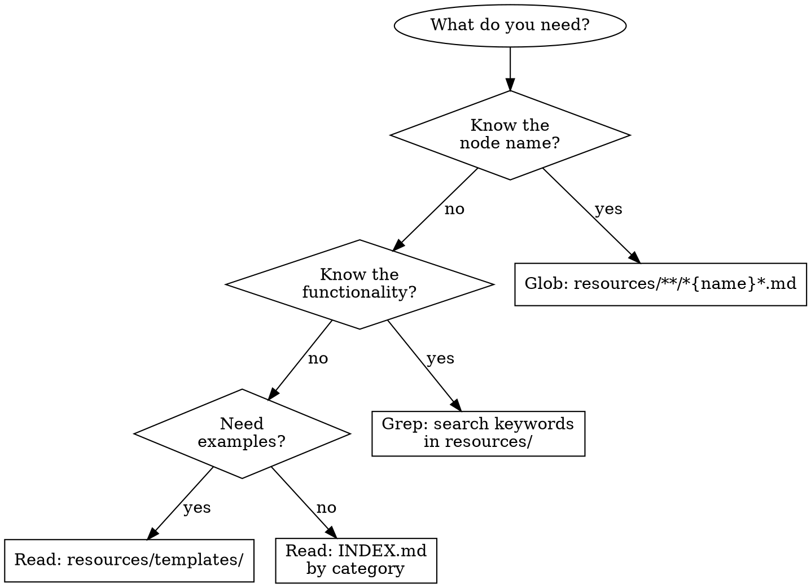

# n8n Workflow Automation Skill Pack

## Overview

This skill helps with:
- Understanding n8n node functionality and usage
- Finding nodes suitable for specific tasks
- Learning common workflow patterns
- Getting node configuration examples
- Solving workflow design problems

This skill includes:
- Detailed information on the 10 most commonly used built-in n8n nodes
- 30+ popular community packages for extended functionality
- Node configuration examples and best practices
- Common workflow patterns
- Node categorization and indexing for both built-in and community nodes

## When to Use

Use this skill when:
- Building or designing n8n workflows
- Searching for nodes that match specific functionality
- Troubleshooting node configurations or connections
- Understanding node input/output compatibility
- Exploring community packages for extended functionality

Do NOT use when:
- Learning general automation concepts (use n8n official docs)
- Deploying or hosting n8n (infrastructure questions)
- Pricing or licensing questions (contact n8n directly)

## Quick Navigation

Use this flowchart to find the right resource:

### Quick Links

- [Complete Node Index](resources/INDEX.md) - All nodes with line numbers
- [How to Find Nodes](resources/guides/how-to-find-nodes.md) - Search strategies
- [Usage Guide](resources/guides/usage-guide.md) - Detailed instructions
- [Workflow Patterns](resources/guides/workflow-patterns.md) - Common patterns

## Common Mistakes

| Mistake | Solution |
|---------|----------|
| Reading entire merged files (thousands of lines) | Use INDEX.md to find line numbers, then use offset/limit for precise reading |
| Confusing Trigger and Action nodes | Triggers can only be placed at workflow start, Actions can be anywhere |
| Ignoring node compatibility | Check compatibility-matrix.md to verify node connections |
| Using wrong node naming format | File format is `nodes-base.{nodeType}.md`, nodeType is usually camelCase |

See [Usage Guide](resources/guides/usage-guide.md#common-pitfalls) for more details.

## Resources

- [Workflow Patterns](resources/guides/workflow-patterns.md) - 6 common workflow patterns
- [Template Library](resources/templates/README.md) - 20 popular templates
- [Node Index](resources/INDEX.md) - Complete node reference
- [Compatibility Matrix](resources/compatibility-matrix.md) - Node connection rules

---

# License and Attribution

## This Skill Pack License

This skill pack project is licensed under the MIT License.
See: https://github.com/haunchen/n8n-skills/blob/main/LICENSE

## Important Notice

This is an unofficial educational project and is not affiliated with n8n GmbH.

This skill content is generated based on the following resources:
- n8n node type definitions (Sustainable Use License)
- n8n official documentation (MIT License)
- n8n-mcp project architecture (MIT License)

For detailed attribution information, please refer to the ATTRIBUTIONS.md file in the project.

## About n8n

n8n is an open-source workflow automation platform developed and maintained by n8n GmbH.

- Official website: https://n8n.io
- Documentation: https://docs.n8n.io
- Source code: https://github.com/n8n-io/n8n
- License: Sustainable Use License

When using n8n software, you must comply with n8n's license terms. See: https://github.com/n8n-io/n8n/blob/master/LICENSE.md

---
> Converted and distributed by [TomeVault](https://tomevault.io/claim/haunchen) — claim your Tome and manage your conversions.
<!-- tomevault:4.0:skill_md:2026-04-13 -->
