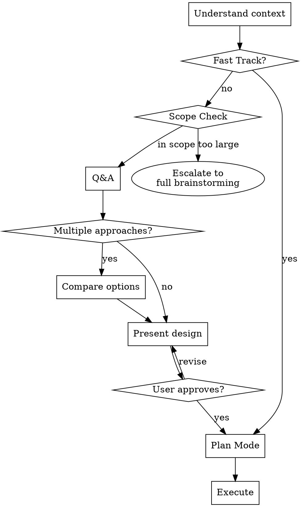

# Quick Brainstorm

**MANDATORY: Do NOT call any file-edit, file-create, or code-generation tools until Phase 1 Q&A self-check has passed or Fast Track criteria are met. Reading files for context is allowed. Violation = immediate stop and return to Q&A.**

Lightweight brainstorming → deep Q&A → design confirmation → Plan Mode → execution.

**Core principle:** Only ask deep, non-obvious questions. Goal is accurate output, not question count.

## Process

## Fast Track

May skip Q&A **only if ALL three conditions are true:**
1. The change is mechanical (single-line fix, typo, rename, or user gave exact code to write)
2. Zero design decisions or trade-offs involved
3. User's instruction leaves no room for interpretation

If any condition fails → go to Phase 1. When in doubt, ask one question to verify.

## Scope Check

If during context reading or Q&A you discover the task involves multiple subsystems, architectural decisions, or greenfield design — **stop** and tell the user this task exceeds quick-brainstorm's scope. Suggest using a full brainstorming skill instead.

## Phase 1: Q&A

**Rules:**
- One question at a time, prefer multiple choice
- Skip anything Claude can infer from code/context
- Before proposing solutions, understand existing patterns in the codebase — follow them unless there's a clear reason not to
- Keep asking until self-check passes — not based on a minimum question count

**Self-check before ending Q&A:**
- [ ] Core functionality approach is clear
- [ ] Edge cases and error handling covered
- [ ] No missing related requirements
- [ ] User has confirmed or implicitly indicated discussion is sufficient (e.g., answered last question with no new concerns)

## Phase 2: Compare Options

**When:** 2+ reasonable approaches exist. **Skip when:** One clearly optimal solution.

Present each option with pros/cons and a recommendation with reasoning. Keep brief.

## Phase 3: Present Design

Present the design scaled to the task. Include only sections that carry information — skip any that add nothing:

1. **What and why** — Change overview
2. **Technical approach** — Implementation details, files involved
3. **Affected interfaces** — API/data/UI changes (skip if none)
4. **Key edge cases** — (skip if obvious or none)
5. **Implementation steps** — Brief execution order

Confirm each section before continuing.

## Phase 4: Plan Mode

After design confirmation, switch to planning-only mode (no code output yet):

1. **Create implementation plan** — List each step: files to change, what to change, expected outcome. If the environment supports a built-in plan mode, use it; otherwise present as a structured list in chat.
2. **Wait for explicit user approval** before writing any code.
3. **During execution**, pause and ask if encountering scenarios not covered in the plan.

## Guardrails

**STOP and return to the correct phase if any of these occur:**

- Calling edit/create tools before Q&A self-check passed (unless Fast Track criteria met)
- User says "no" but continuing with original approach
- Entering Plan Mode without design confirmation
- Executing without Plan Mode approval
- Judging a task as "obvious" without verifying all three Fast Track conditions

---
> Converted and distributed by [TomeVault](https://tomevault.io/claim/hccake) — claim your Tome and manage your conversions.
<!-- tomevault:4.0:skill_md:2026-04-11 -->
