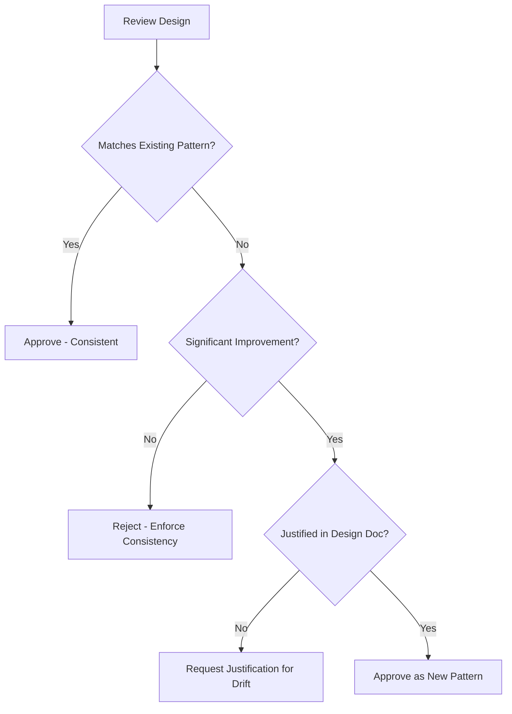

# Architecture Consistency Enforcer

## Purpose

Maintains the structural integrity of the project. This skill ensures that the codebase doesn't become a "ball of mud" by enforcing consistent patterns for data flow, error handling, and component organization.

## When to use this skill
- When designing new components or services
- During architectural reviews of migrations
- When refactoring existing core structures

## Enforcement Steps

1. **Extract Patterns**: Identify how the project currently handles common tasks (e.g., Dependency Injection, API routing).
2. **Compare Proposal**: Check if the new design introduces a "second way" of doing things.
3. **Flag Architectural Drift**: Identify deviations and mark them for review.
4. **Favor Consistency**: If a local improvement creates global inconsistency, it must be justified or rejected.

## Decision Tree

## Review Checklist

1. **Separation of Concerns**: Is business logic leaking into the transport layer?
2. **Dependency Direction**: Are abstractions depending on details? (Violation of DIP)
3. **Error Strategy**: Does it follow the global error handling pattern?
4. **Data Flow**: Is the flow predictable and uni-directional where expected?

## How to provide feedback
- **Be specific**: "This service uses a Singleton pattern, but the project uses Dependency Injection."
- **Explain why**: "Mixing patterns makes the code harder to test and maintain."
- **Suggest alternatives**: "Recommend passing the repository via constructor instead of using Instance()."

Local consistency beats global perfection.

---
> Converted and distributed by [TomeVault](https://tomevault.io/claim/hohai99) — claim your Tome and manage your conversions.
<!-- tomevault:4.0:skill_md:2026-04-14 -->
