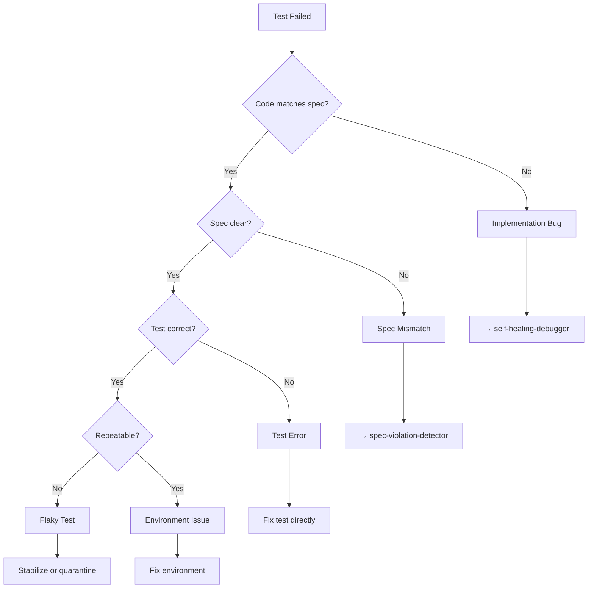

# Autonomous Test Runner

## Purpose

Executes the test suite autonomously and **classifies failures** into actionable categories. This skill never fixes code blindly—it always determines the root cause first.

---

## When to Use

- After generating tests
- During iterative fixing cycles
- Before any release gate

---

## Instructions

### 1. Run the Full Test Suite

```bash
# Example commands
npm test
pytest
go test ./...
```

### 2. Classify Each Failure

Every failure must be classified before any action:

| Classification | Definition | Next Step |
|----------------|------------|-----------|
| **Implementation Bug** | Code doesn't match spec | → `self-healing-debugger` |
| **Spec Mismatch** | Spec is unclear/wrong | → `spec-violation-detector` |
| **Test Error** | Test itself is broken | Fix test, not code |
| **Environment Issue** | Setup/config problem | Fix environment |
| **Flaky Test** | Intermittent failure | Stabilize or quarantine |

### 3. Produce Failure Summary

```markdown
## Test Results Summary

**Run:** 2026-01-22 09:30:00
**Total:** 147 tests
**Passed:** 142 (96.6%)
**Failed:** 5

### Failures

| Test | Spec ID | Classification | Recommended Action |
|------|---------|----------------|-------------------|
| test_login_token | AUTH-001 | Implementation Bug | Fix token expiry |
| test_rate_limit | AUTH-002 | Spec Mismatch | Clarify limit value |
| test_cart_total | CART-001 | Test Error | Fix assertion |
```

### 4. Do Not Assume Intent

```
❌ Wrong: "This test fails, I'll change the assertion to pass"
✅ Right: "This test fails, classification: Implementation Bug, 
         code returns 3600, spec says 86400, fix the code"
```

---

## Classification Decision Tree



---

## Inputs

- Test files from `self-test-generator`
- Relevant spec clauses
- Previous test run history (for flaky detection)

## Outputs

- Test execution results
- Classified failure list
- Recommended actions per failure

---

## Integration

- **Precedes:** `self-healing-debugger` or `spec-violation-detector`
- **Follows:** `self-test-generator`
- **Feeds into:** `delivery-readiness-gate`

---

## How to provide feedback
- **Be specific**: "The failure in 'API-001' was classified as a 'Test Error', but it's actually an 'Implementation Bug'."
- **Explain why**: "Incorrect classification sends the Agent to the wrong skill (fixing test instead of code)."
- **Suggest alternatives**: "Re-classify as 'Implementation Bug' and trigger `self-healing-debugger`."

Classification before action, always.

---
> Converted and distributed by [TomeVault](https://tomevault.io/claim/hohai99) — claim your Tome and manage your conversions.
<!-- tomevault:4.0:skill_md:2026-04-14 -->
