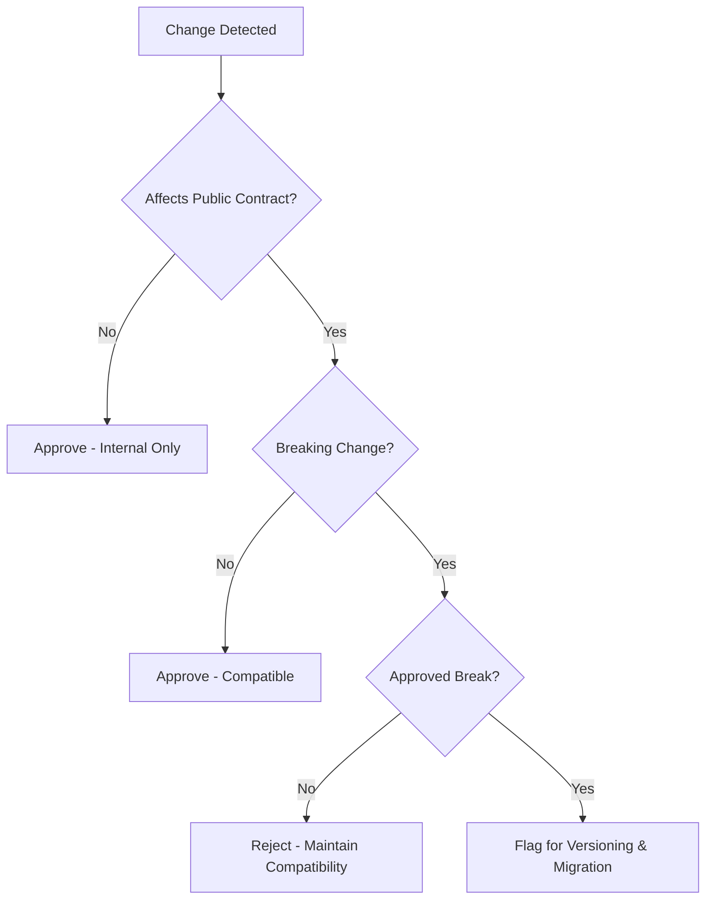

# Backward Compatibility Guardian

## Purpose

Protects the existing user base and downstream systems from breaking changes. This skill forces intentionality when modifying public interfaces or data schemas.

## When to use this skill
- When modifying existing API endpoints
- When changing database schemas or shared data formats
- When updating libraries that expose public interfaces

## Guardian Steps

1. **Identify Existing Contracts**: Map all public APIs and data structures being touched.
2. **Define Compatibility Strategy**:
   - **Full**: Old and new work perfectly.
   - **Backward-Only**: Old consumers work with new producer.
   - **Breaking**: Requires version increment and approval.
3. **Detect Breaking Changes**: Look for deleted fields, changed types, or new required parameters.
4. **Draft Deprecation Plan**: If a change is needed, define the sunset period for the old version.

## Decision Tree

## Review Checklist

1. **API Parity**: Can old clients still call this without modification?
2. **Data Parity**: Can old software versions still read the new data format?
3. **Optionality**: Are new parameters optional/nullable by default?
4. **Documentation**: Are breaking changes clearly marked in the `CHANGELOG`?

## How to provide feedback
- **Be specific**: "Renaming 'user_id' to 'id' in the JSON response is a breaking change."
- **Explain why**: "Existing mobile clients will fail to parse the user profile."
- **Suggest alternatives**: "Recommend keeping 'user_id' as an alias or adding its replacement in a new v2 endpoint."

Breaking changes must be intentional.

---
> Converted and distributed by [TomeVault](https://tomevault.io/claim/hohai99) — claim your Tome and manage your conversions.
<!-- tomevault:4.0:skill_md:2026-04-14 -->
