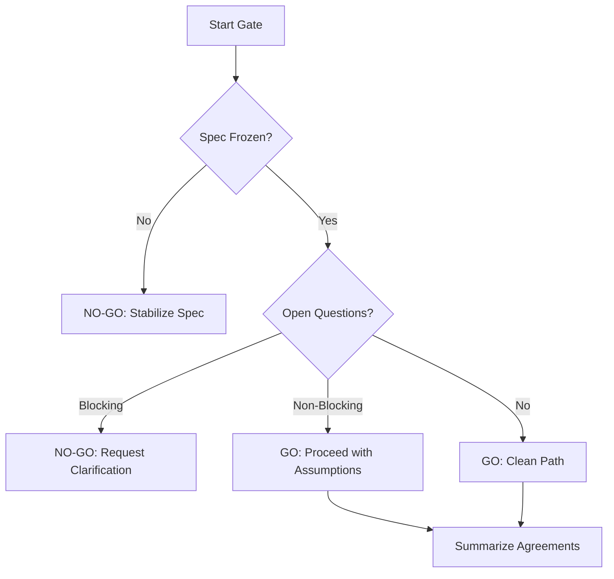

# Decision Freeze Governor

## Purpose

Prevents "starting line errors" by ensuring the AI and Human are in 100% agreement before expensive implementation work begins. It acts as the final gate for spec stability.

## When to use this skill
- Immediately before moving from PLANNING to EXECUTION mode
- When a specification has reached its final draft
- When high-impact decisions are identified by the `risk-hunter`

## Governance Steps

1. **Check for Ambiguity**: Use the `spec-linter` output to identify any "maybe" or "TBD" items.
2. **Identify Blocking Questions**: Separate "nice-to-know" items from "must-know-to-code" items.
3. **Decide GO / NO-GO**: If a critical decision is unfrozen, the path is NO-GO.
4. **Summarize Frozen Decisions**: Create a concise list of exactly what has been agreed upon.

## Decision Tree

## Review Checklist

1. **Stability**: How likely is this decision to change in the next 48 hours?
2. **Commitment**: Has the human explicitly said "Proceed" or similar?
3. **Traceability**: Is the frozen decision linked to a specific requirement ID?
4. **Scope**: Does the freeze cover the *entire* task, or just a part?

## How to provide feedback
- **Be specific**: "The governor approved the task even though the API endpoint name is still TBD."
- **Explain why**: "Implementing with a TBD endpoint name leads to massive refactoring later."
- **Suggest alternatives**: "Mark 'Endpoint Naming' as a blocking question in the `spec-linter`."

Do not ask humans unless blocking.

---
> Converted and distributed by [TomeVault](https://tomevault.io/claim/hohai99) — claim your Tome and manage your conversions.
<!-- tomevault:4.0:skill_md:2026-04-14 -->
