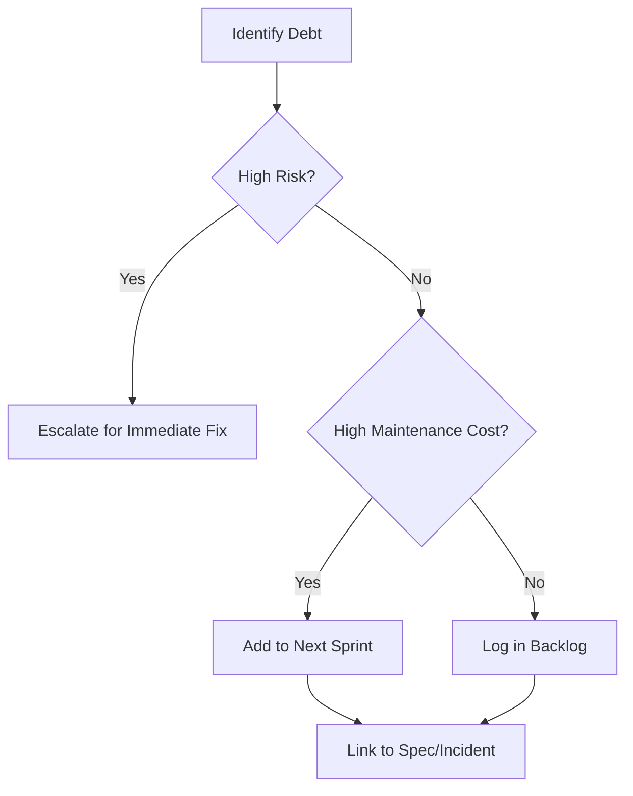

# Long Term Debt Tracker

## Purpose

Provides visibility into the "hidden costs" of past decisions. By tracking debt, the system can advocate for refactoring or spec updates before they cause a critical failure.

## When to use this skill
- During regular maintenance windows
- After an incident where debt was a contributing factor
- When "temporary" workarounds are introduced to meet a deadline

## Tracking Steps

1. **Identify Recurring Pain Points**: Where do developers or the AI struggle most? (e.g., "The auth module is always flaky").
2. **Classify Debt**:
   - **Code Debt**: Hard-to-test logic, duplication.
   - **Spec Debt**: Outdated requirements, missing edge cases.
   - **Process Debt**: Slow CI/CD, manual approval bottlenecks.
3. **Rank by Risk**: Use a Probability x Impact matrix to prioritize.
4. **Propose Remediation**: Suggest specific tasks or skills to address the debt.

## Decision Tree

## Review Checklist

1. **Quantification**: Is the cost of the debt (e.g., extra dev hours) estimated?
2. **Origin**: Is it documented *why* this debt was introduced (e.g., "rushed for MVP")?
3. **Trend**: Is the project debt increasing or decreasing over time?
4. **Scope**: Does the remediation plan address the root cause?

## How to provide feedback
- **Be specific**: "The entry 'Refactor Auth' is too broad."
- **Explain why**: "Broad debt items are never prioritized because they lack clear scope."
- **Suggest alternatives**: "Break into: 'Extract JWT logic from Controller' and 'Add unit tests for refresh-token'."

Untracked debt compounds silently.

---
> Converted and distributed by [TomeVault](https://tomevault.io/claim/hohai99) — claim your Tome and manage your conversions.
<!-- tomevault:4.0:skill_md:2026-04-15 -->
