# Orchestrated Development Controller

## Purpose

The central orchestrator that **automatically chains skills** based on the type of work being performed. This skill is always active and determines which other skills to invoke and in what order.

---

## When to Use

- **Always active** by default in this workspace
- Applies to:
  - New project creation
  - Project migration
  - Feature development
  - Refactoring
  - Bug fixes
  - Pre-release validation

---

## Decision Tree

```mermaid
flowchart TD
    START[User Request] --> CLASSIFY{Classify Request}
    
    CLASSIFY -->|New Project| NP[New Project Flow]
    CLASSIFY -->|Migration| MG[Migration Flow]
    CLASSIFY -->|Implementation| IM[Implementation Flow]
    CLASSIFY -->|Spec Change| SC[Spec Change Flow]
    CLASSIFY -->|Pre-Release| PR[Pre-Release Flow]
    
    subgraph NP[New Project Flow]
        NP1[project-vision-normalizer] --> NP2[mvp-scope-guard]
        NP2 --> NP3[spec-driven-planning]
        NP3 --> NP4[assumption-and-risk-hunter]
        NP4 --> NP5[workspace-spec-linter]
        NP5 --> NP6[decision-freeze-governor]
    end
    
    subgraph MG[Migration Flow]
        MG1[system-context-extractor] --> MG2[legacy-behavior-snapshot]
        MG2 --> MG3[behavior-first-analysis]
        MG3 --> MG4[migration-scope-partitioner]
        MG4 --> MG5[spec-driven-planning]
        MG5 --> MG6[workspace-spec-linter]
        MG6 --> MG7[decision-freeze-governor]
    end
    
    subgraph IM[Implementation Flow]
        IM1[implementation-boundary-guard] --> IM2[no-guess-implementation]
        IM2 --> IM3[self-test-generator]
        IM3 --> IM4[autonomous-test-runner]
        IM4 -->|Pass| IM5[Done]
        IM4 -->|Fail: Bug| IM6[self-healing-debugger]
        IM4 -->|Fail: Spec Issue| IM7[spec-violation-detector]
        IM6 --> IM4
        IM7 --> HUMAN{Human Decision}
    end
    
    subgraph SC[Spec Change Flow]
        SC1[spec-auto-updater] --> SC2[documentation-consistency-keeper]
        SC2 --> SC3[project-regression-checklist]
    end
    
    subgraph PR[Pre-Release Flow]
        PR1[regression-and-parity-check] --> PR2[security-and-compliance-baseline]
        PR2 --> PR3[delivery-readiness-gate]
        PR3 -->|GO| RELEASE[Release]
        PR3 -->|NO-GO| BLOCK[Block Release]
    end
```



---

## Skill Sequences

### If Starting a NEW PROJECT

| Order | Skill | Purpose |
|-------|-------|---------|
| 1 | `project-vision-normalizer` | Normalize raw ideas |
| 2 | `mvp-scope-guard` | Prevent scope creep |
| 3 | `spec-driven-planning` | Create formal spec |
| 4 | `assumption-and-risk-hunter` | Surface hidden risks |
| 5 | `workspace-spec-linter` | Validate spec quality |
| 6 | `decision-freeze-governor` | Lock decisions |

### If MIGRATING a PROJECT

| Order | Skill | Purpose |
|-------|-------|---------|
| 1 | `system-context-extractor` | Map existing system |
| 2 | `legacy-behavior-snapshot` | Capture current behavior |
| 3 | `behavior-first-analysis` | Analyze before changing |
| 4 | `migration-scope-partitioner` | Define safe phases |
| 5 | `spec-driven-planning` | Spec the new system |
| 6 | `workspace-spec-linter` | Validate specs |
| 7 | `decision-freeze-governor` | Lock decisions |

### If IMPLEMENTING a TASK

| Order | Skill | Purpose |
|-------|-------|---------|
| 1 | `implementation-boundary-guard` | Stay in scope |
| 2 | `no-guess-implementation` | Follow spec exactly |
| 3 | `self-test-generator` | Create tests from spec |
| 4 | `autonomous-test-runner` | Run and classify tests |
| 5 | `self-healing-debugger` | Fix bugs (if needed) |
| 6 | `spec-violation-detector` | Detect spec issues (if needed) |

### If SPEC OR CODE CHANGES

| Order | Skill | Purpose |
|-------|-------|---------|
| 1 | `spec-auto-updater` | Update specs (if approved) |
| 2 | `documentation-consistency-keeper` | Sync all docs |
| 3 | `project-regression-checklist` | Check for regressions |

### If PRE-RELEASE

| Order | Skill | Purpose |
|-------|-------|---------|
| 1 | `regression-and-parity-check` | Validate behavior |
| 2 | `security-and-compliance-baseline` | Security audit |
| 3 | `delivery-readiness-gate` | GO / NO-GO decision |

---

## State Transitions

```
┌─────────────────────────────────────────────────────────────┐
│                    ORCHESTRATION STATE                       │
├─────────────────────────────────────────────────────────────┤
│  current_workflow: [new_project | migration | implementation]│
│  current_skill: [skill-name]                                 │
│  skill_queue: [remaining skills]                             │
│  blocked_on: [human | none]                                  │
│  last_result: [success | failure | needs_input]              │
└─────────────────────────────────────────────────────────────┘
```

---

## Human Interaction Rules

Humans are **only** involved if:

| Condition | Action |
|-----------|--------|
| Spec ambiguity is blocking | Request clarification |
| Spec change approval required | Wait for approval |
| GO / NO-GO decision needed | Present evidence, await decision |
| Security/compliance issue detected | Escalate immediately |

**Default to autonomous execution.**

---

## Overrides

The orchestrator can be overridden by:

1. **User explicit instruction** — "Skip spec validation"
2. **Workspace configuration** — Disable specific skills
3. **Emergency mode** — Direct path to hotfix

All overrides are logged and auditable.

---

## Constraints

- Never skip security or compliance skills
- Never proceed without spec on HIGH-risk changes
- Always produce audit trail
- Respect decision freezes

The orchestrator serves the spec, not convenience.

---
> Converted and distributed by [TomeVault](https://tomevault.io/claim/hohai99) — claim your Tome and manage your conversions.
<!-- tomevault:4.0:skill_md:2026-04-15 -->
