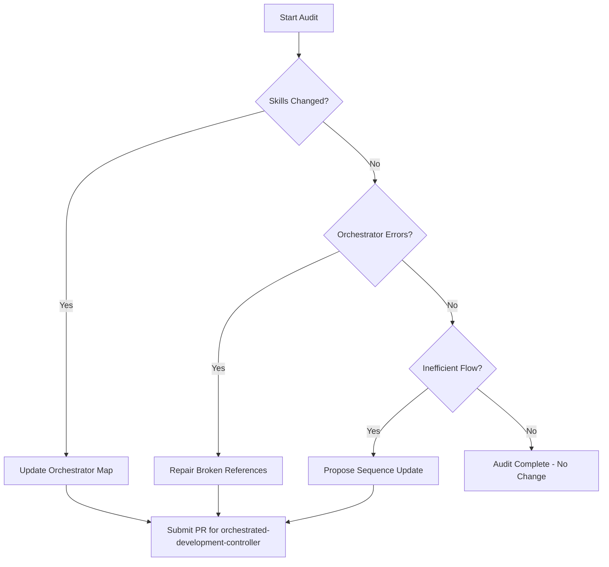

# Orchestrator Self Auditor

## Purpose

Maintains the "brain" of the system by ensuring the `orchestrated-development-controller` is always in sync with the available skills. It prevents the system from using "ghost skills" or missing out on new capabilities.

## When to use this skill
- After a new skill is added via `skill-scaffold-generator`
- When a skill's description or triggers are modified
- Periodically as part of `lifecycle-health-monitor` to optimize flow ordering

## Audit Steps

1. **Scan Skill Registry**: Inventory all files in `.agent/skills/` and `global_skills/`.
2. **Cross-Reference Descriptions**: Compare the orchestrator's decision trees against current skill missions.
3. **Detect Overlaps**: Identify if two skills are now covering the same task.
4. **Detect Gaps**: Identify if a spec-defined task has no supporting skill.
5. **Optimize Ordering**: Ensure skills are chained in the most efficient order (e.g., Linter before Planner).

## Decision Tree

## Review Checklist

1. **Completeness**: Are all 36+ skills referenced where appropriate?
2. **Correctness**: Do the labels in the Mermaid diagrams match actual skill names?
3. **Efficiency**: Has the path to "Done" been shortened without losing safety?
4. **Transparency**: Are orchestration changes documented in the change log?

## How to provide feedback
- **Be specific**: "The auditor missed that 'spec-linter' is now redundant with the new 'vision-normalizer' check."
- **Explain why**: "Running redundant checks slows down the development cycle without adding safety."
- **Suggest alternatives**: "Merge the structure-check from linter into the normalizer and deprecate the linter clause."

Never silently change orchestration logic.

---
> Converted and distributed by [TomeVault](https://tomevault.io/claim/hohai99) — claim your Tome and manage your conversions.
<!-- tomevault:4.0:skill_md:2026-04-15 -->
