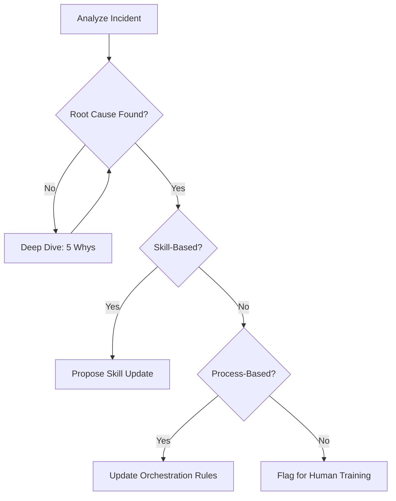

# Postmortem and Learning Extractor

## Purpose

Converts failures into fuel for the system's evolution. It ensures that the same mistake is never made twice by codifying lessons into skills, specs, or orchestration rules.

## When to use this skill
- After an incident or production bug
- After a failed migration attempt or rejected PR
- After the completion of a major delivery to document "what went right"

## Extraction Steps

1. **Identify Root Causes**: Use the "5 Whys" method to get past surface-level symptoms.
2. **Separate Failure Types**:
   - **System Failure**: A skill or orchestration rule was missing or flawed.
   - **Human Failure**: Approval was given to a flawed plan or spec.
3. **Extract Reusable Rules**: What instruction could be added to a `SKILL.md` to prevent this?
4. **Update Specs or Skills**: Trigger the appropriate update skill (e.g., `skill-evolution-engine`).

## Decision Tree

## Review Checklist

1. **Blamelessness**: Does the report focus on "What" and "How" rather than "Who"?
2. **Actionability**: Are the recommendations concrete enough to implement?
3. **Breadth**: Does the lesson apply to other modules or projects?
4. **Verification**: How will we know if this lesson prevents a future failure?

## How to provide feedback
- **Be specific**: "The postmortem for incident #104 identifies 'bad code' but not the missing boundary guard check."
- **Explain why**: "Attributing it to 'bad code' doesn't help the AI prevent it in the next task."
- **Suggest alternatives**: "Add a rule to `implementation-boundary-guard` to check for recursive depth."

Blameless, actionable, reusable.

---
> Converted and distributed by [TomeVault](https://tomevault.io/claim/hohai99) — claim your Tome and manage your conversions.
<!-- tomevault:4.0:skill_md:2026-04-15 -->
