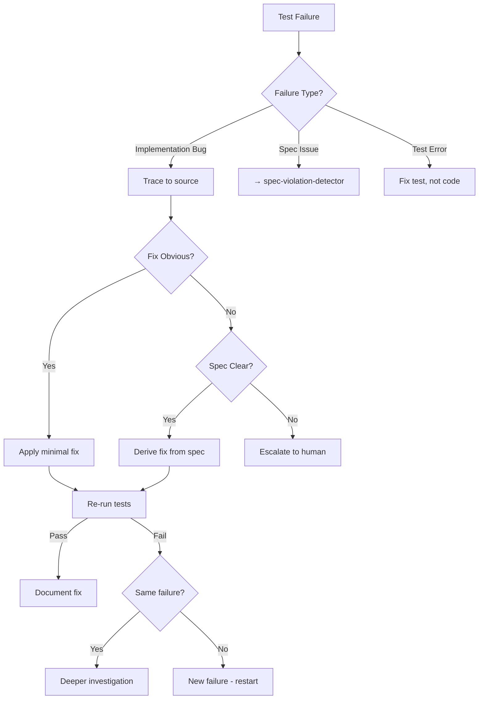

# Self Healing Debugger

## Purpose

Autonomously fixes implementation bugs detected by tests while **strictly preserving spec intent**. This skill only applies fixes that make the code match the spec, never changes that make tests pass by altering expected behavior.

## When to Use

- Test failures classified as **implementation bugs** (not spec issues)
- After `autonomous-test-runner` has classified the failure

## Debugging Steps

1. **Identify Minimal Failing Behavior**: Start with the smallest reproducible failure.
2. **Trace Back to Violating Logic**: Find the exact line(s) causing the discrepancy.
3. **Apply Smallest Possible Fix**: Fix the code, not the test assertion.
4. **Re-run Tests Immediately**: Verify the fix and ensure no regressions.

## Decision Tree

## Review Checklist

1. **Minimalism**: Is the fix the smallest possible change to match the spec?
2. **Alignment**: Does the fix reference the spec ID?
3. **Safety**: Does the fix stay within the task boundary?
4. **Side Effects**: Were existing tests re-run to check for regressions?

## How to provide feedback
- **Be specific**: "The fix for the logout issue changes the database schema, which is out of scope."
- **Explain why**: "Out-of-scope changes violate the `implementation-boundary-guard` and increase risk."
- **Suggest alternatives**: "Recommend a logic-level fix within the `logout` controller instead."

Minimal, targeted, spec-aligned fixes only.

---
> Converted and distributed by [TomeVault](https://tomevault.io/claim/hohai99) — claim your Tome and manage your conversions.
<!-- tomevault:4.0:skill_md:2026-04-15 -->
