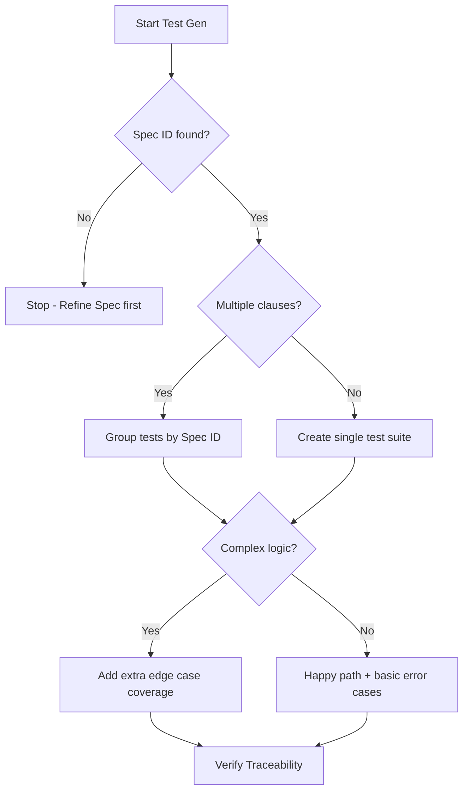

# Self Test Generator

## Purpose

Generates **behavior-based tests** directly from specifications, not from code intuition. Tests are derived from what the spec says, not what the code does.

## When to Use

- After completing an implementation task
- Before any manual review
- When spec changes require test updates

## Generation Steps

1. **Read Spec Sections**: Identify all spec clauses relevant to the implemented task.
2. **Map Spec to Test Cases**: Generate happy path, edge case, error case, and constraint tests.
3. **Write Behavior-Based Tests**: Implement tests using relevant frameworks (JEST, PyTest, etc.).
4. **Reference Spec in Tests**: Every test MUST reference its source spec clause (e.g., `// Spec: AUTH-001`).

## Decision Tree

## Review Checklist

1. **Traceability**: Does every test link back to a valid Spec ID?
2. **Isolation**: Do tests avoid depending on implementation internals?
3. **Completeness**: Are edge cases and error states covered as per spec?
4. **Determinism**: Are tests reliable and independent of environment?

## How to provide feedback
- **Be specific**: "The test for 'Login' fails to assert the 24h expiry requirement from AUTH-001."
- **Explain why**: "Without checking expiry, the test doesn't actually prove the spec is fully implemented."
- **Suggest alternatives**: "Recommend adding `expect(token.expiry).toBe(86400)` to the test."

Tests are spec enforcement, not code validation.

---
> Converted and distributed by [TomeVault](https://tomevault.io/claim/hohai99) — claim your Tome and manage your conversions.
<!-- tomevault:4.0:skill_md:2026-04-15 -->
