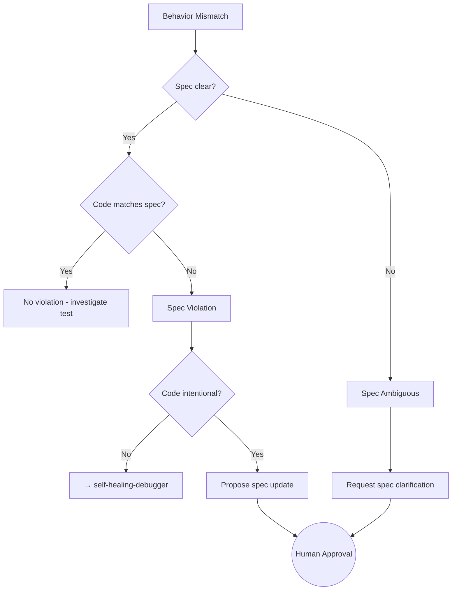

# Spec Violation Detector

## Purpose

Identifies cases where **code behavior doesn't match spec**, but the code appears intentional. This skill determines whether the spec needs updating or the code needs fixing.

---

## When to Use

- Tests fail but code looks correct
- Ambiguous behavior is detected
- Stakeholder reports unexpected behavior
- Implementation and spec seem to contradict

---

## Instructions

### 1. Compare Code Behavior vs Spec Wording

```markdown
## Analysis: AUTH-001

**Spec Says:**
"Token expires in 24 hours"

**Code Does:**
Token expires in 1 hour

**Match:** ❌ NO

**Classification:** Code violates spec (implementation bug)
```

vs

```markdown
## Analysis: AUTH-001

**Spec Says:**
"Token should have reasonable expiry"

**Code Does:**
Token expires in 1 hour

**Match:** ⚠️ AMBIGUOUS

**Classification:** Spec unclear, needs refinement
```

### 2. Identify Unclear or Missing Spec Clauses

```markdown
## Spec Gap Identified

**Area:** Token refresh behavior
**Spec Coverage:** None
**Observed Behavior:** Tokens are not refreshable
**Impact:** Users must re-login after expiry

**Recommendation:** Add spec clause for token refresh
```

### 3. Propose Spec Updates (Don't Change Code)

```markdown
## Spec Update Proposal

**Spec ID:** AUTH-001
**Current Wording:** "Token expires in 24 hours"
**Proposed Wording:** "Token expires in 24 hours from issue time (fixed, not sliding)"

**Justification:** Clarifies ambiguity about sliding expiry
**Impact:** None - documents existing behavior
**Approval Required:** YES
```

### 4. Mark Human Approval as Required

```
⚠️ HUMAN DECISION REQUIRED

This is a spec change, not a code fix.
Code must obey current spec until change is approved.
```

---

## Decision Tree



---

## Violation Types

| Type | Definition | Action |
|------|------------|--------|
| **Clear Violation** | Code contradicts explicit spec | Fix code or update spec |
| **Ambiguous Spec** | Spec doesn't cover this case | Clarify spec first |
| **Missing Spec** | No spec exists for behavior | Write spec, then decide |
| **Outdated Spec** | Spec reflects old requirements | Update spec with approval |

---

## Spec Update Template

```markdown
# Spec Amendment Request

**Request ID:** SPEC-AMD-001
**Date:** YYYY-MM-DD
**Requestor:** [AI/Human]

## Current Spec
[Quote exact current wording]

## Proposed Change
[New wording]

## Justification
- Why the change is needed
- What behavior it documents/changes

## Impact Analysis
- [ ] Breaking change? YES/NO
- [ ] Requires code change? YES/NO
- [ ] Affects other specs? YES/NO

## Approval
- [ ] Spec owner
- [ ] Engineering lead
- [ ] Product (if behavioral change)
```

---

## Integration

- **Precedes:** `spec-auto-updater` (if approved)
- **Follows:** `autonomous-test-runner`
- **Escalates to:** Human decision

---

## How to provide feedback
- **Be specific**: "The violation report says 'Code matches spec', but Spec ID AUTH-001 says 24h while code does 1h."
- **Explain why**: "Incorrect violation detection leads to missed bugs or unnecessary spec updates."
- **Suggest alternatives**: "Mark as 'Clear Violation' and trigger `self-healing-debugger`."

Spec is law. Change the law properly, or obey it.

---
> Converted and distributed by [TomeVault](https://tomevault.io/claim/hohai99) — claim your Tome and manage your conversions.
<!-- tomevault:4.0:skill_md:2026-04-15 -->
