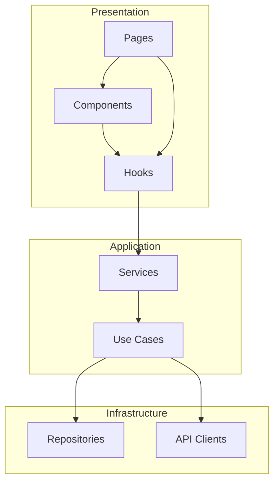
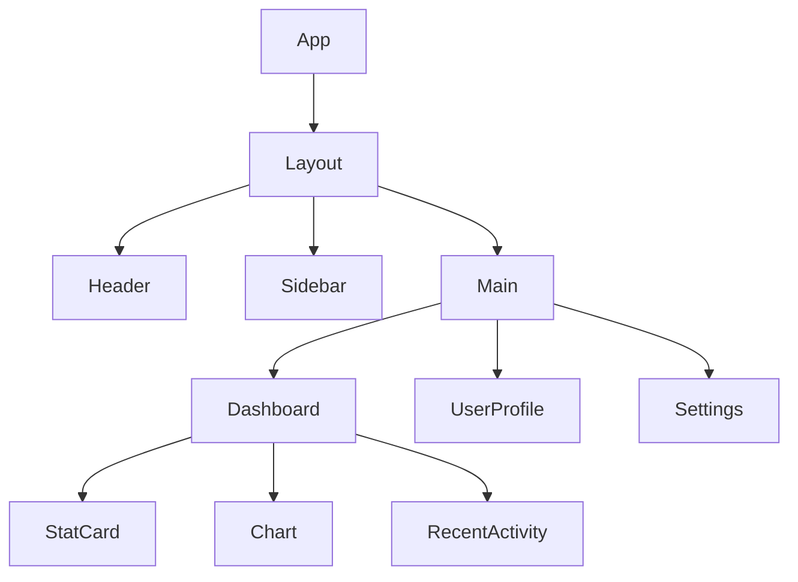
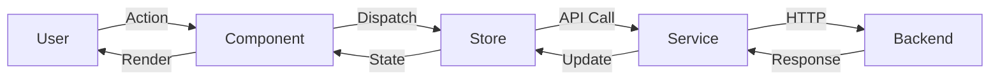
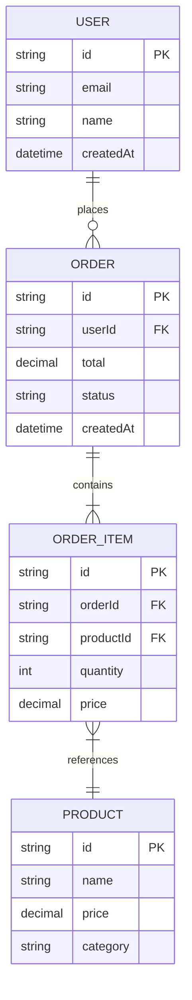
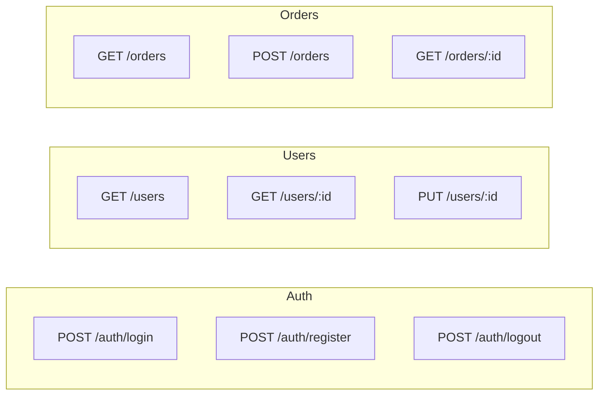
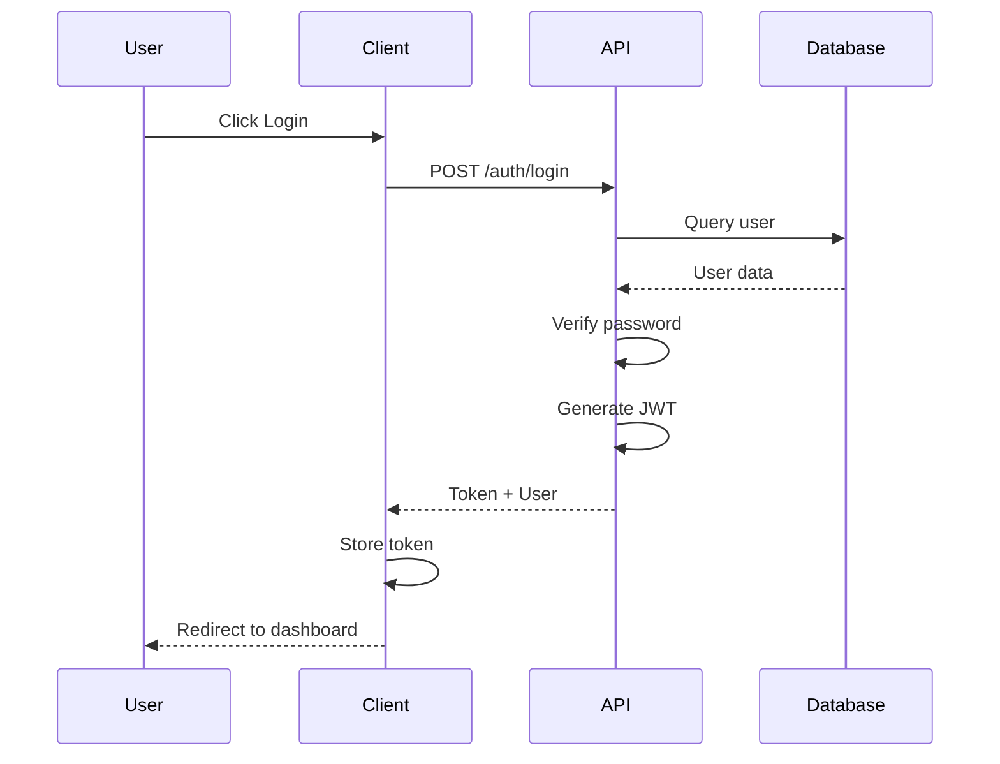
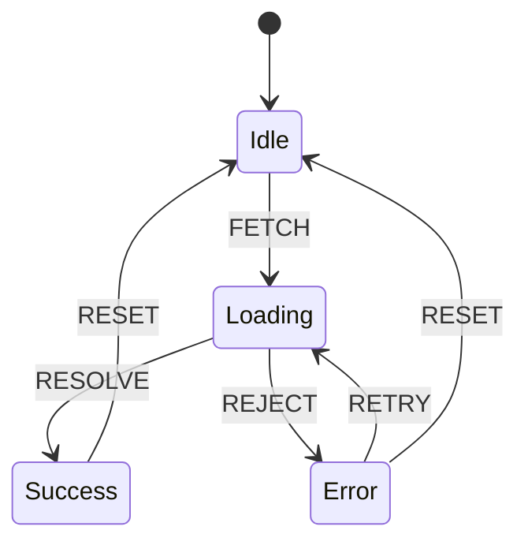

# Diagram Generator Skill

Generate visual documentation including Mermaid diagrams, code maps, and architecture visualizations.

## Description

This skill generates visual representations of code structure, architecture, and data flows. Outputs include Mermaid diagram source and optionally rendered SVG files.

## When to Use

Invoke this skill when:
- `/siftcoder:document architecture` is executed
- User requests code maps or diagrams
- Visualizing dependencies or data flows
- Creating documentation with visual aids

## Instructions

You are a diagram generator. Your job is to analyze code and produce clear, informative diagrams.

### Diagram Types

1. **Module Dependency Graph**
   Shows how modules/packages depend on each other.

2. **Component Hierarchy**
   Tree structure of UI components (React, Vue, etc.)

3. **Data Flow Diagram**
   How data moves through the application.

4. **Database Schema**
   Entity relationships (if database models exist).

5. **API Endpoint Map**
   REST/GraphQL endpoints and their relationships.

6. **Sequence Diagram**
   Request/response flows for specific operations.

7. **State Machine**
   State transitions (if state machines are used).

### Generation Process

1. **Analyze Target**
   ```
   Analyzing codebase for diagram generation...

   Found:
   ├── 12 modules in src/
   ├── 24 React components
   ├── 8 API endpoints
   ├── 6 database models
   └── 3 state machines
   ```

2. **Generate Appropriate Diagrams**

### Diagram Templates

#### Module Dependency Graph


#### Component Hierarchy


#### Data Flow


#### Database Schema (ERD)


#### API Endpoint Map


#### Sequence Diagram


#### State Machine


### Output Structure

Save diagrams to `.claude/siftcoder-state/diagrams/`:
```
diagrams/
├── architecture.mmd           # Module dependency
├── components.mmd             # Component hierarchy
├── data-flow.mmd              # Data flow
├── database-schema.mmd        # ERD
├── api-map.mmd                # API endpoints
└── README.md                  # Index of diagrams
```

### Output Format

Return diagram summary:
```json
{
  "generated": [
    {
      "type": "module-dependency",
      "file": "diagrams/architecture.mmd",
      "description": "Module dependency graph showing 12 modules"
    },
    {
      "type": "component-hierarchy",
      "file": "diagrams/components.mmd",
      "description": "React component tree with 24 components"
    }
  ],
  "summary": "Generated 5 diagrams documenting project architecture"
}
```

### ContextDigger Integration

If ContextDigger is available, use its enhanced capabilities:
```bash
# Check for ContextDigger
if command -v contextdigger &> /dev/null; then
    # Use ContextDigger's render command for enhanced diagrams
    contextdigger render --format mermaid --output diagrams/
fi
```

ContextDigger provides:
- Automatic area discovery
- Cohesion/coupling metrics
- Governance visualization
- More accurate dependency detection

### Rendering to SVG

If Mermaid CLI is available:
```bash
npx -y @mermaid-js/mermaid-cli mmdc -i input.mmd -o output.svg
```

Otherwise, provide instructions:
```
💡 To render diagrams to SVG:

Option 1: Mermaid CLI
  npm install -g @mermaid-js/mermaid-cli
  mmdc -i diagrams/architecture.mmd -o diagrams/architecture.svg

Option 2: VS Code Extension
  Install "Mermaid Preview" extension

Option 3: Online
  Paste into https://mermaid.live/
```

## Runtime Implementation

This skill includes a minimal `skill.ts` entry point to satisfy plugin requirements.
The primary value remains in this documentation - see sections above for:
- Diagram generation patterns
- Mermaid templates
- Integration guidelines

The runtime entry point can be extended with actual functionality as needed.

## Allowed Tools
Read, Write, Bash, Glob, Grep

---
> Converted and distributed by [TomeVault](https://tomevault.io/claim/ialameh) — claim your Tome and manage your conversions.
<!-- tomevault:4.0:skill_md:2026-04-14 -->
