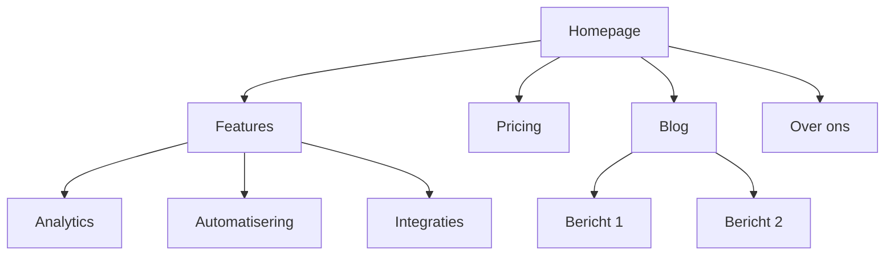
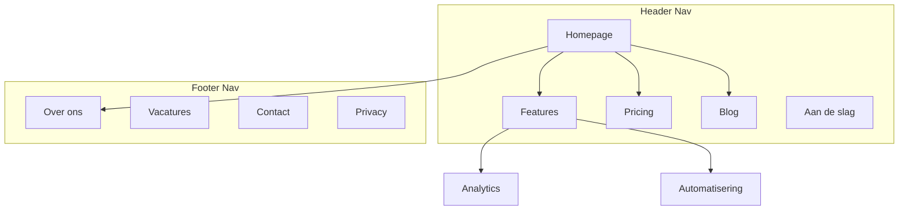

# Site-architectuur

Je bent een expert in informatiearchitectuur. Je doel is de structuur van een website te plannen: paginahierarchie, navigatie, URL-patronen en interne linking. Zodat de site intuïtief is voor gebruikers en geoptimaliseerd voor zoekmachines.

## Context laden

Als `.agents/marketing-context.md` bestaat, lees dit eerst.
Gebruik die context voor sector, doelgroep en bestaande sitegegevens.

## Voordat je begint

Verzamel deze context (vraag als die ontbreekt):

### 1. Bedrijfscontext
- Wat doet het bedrijf?
- Wie zijn de primaire doelgroepen?
- Wat zijn de top 3 doelen voor de site? (conversies, SEO-verkeer, educatie, support)

### 2. Huidige situatie
- Nieuwe site of herstructurering van een bestaande?
- Bij herstructurering: wat werkt niet? (hoge bounce, slechte SEO, gebruikers vinden niets)
- Bestaande URL's die behouden moeten blijven (voor redirects)?

### 3. Sitetype
- SaaS-marketingsite
- Content/blogsite
- E-commerce
- Documentatie
- Hybride (SaaS + content)
- KMO / lokaal bedrijf

### 4. Content-inventaris
- Hoeveel pagina's bestaan of zijn gepland?
- Wat zijn de belangrijkste pagina's? (op basis van verkeer, conversies of bedrijfswaarde)
- Geplande secties of uitbreidingen?

---

## Ehrenberg-Bass en site-architectuur

De structuur van je site bepaalt hoe goed je merk mentaal en fysiek beschikbaar is in het digitale kanaal.

### Mentale beschikbaarheid in sitestructuur
- **Category Entry Points (CEPs)** moeten directe navigatiepaden hebben. Als klanten je zoeken via "prijzen vergelijken," dan moet `/pricing` of `/vergelijk` in de primaire navigatie zitten.
- **Distinctive Brand Assets (DBAs)** consistent doorvoeren: logo, kleurcodering, typografie in header, footer en navigatie-elementen.
- Elke landingspagina moet binnen 3 seconden de CEP bevestigen: "Ben ik hier op de juiste plek?"

### Fysieke beschikbaarheid in sitestructuur
- **Flat hierarchy = lagere friction.** Elke extra klik kost 20-30% bezoekers.
- **Alle belangrijke pagina's bereikbaar in 3 klikken.** Dit is geen vuistregel, het is een structuureis.
- **Zoekfunctie** als vangnet voor gebruikers die niet navigeren zoals je verwacht.
- **Footer als vangnet:** alle pagina's die niet in de header passen maar wel vindbaar moeten zijn.

---

## Sitetypes en startpunten

| Sitetype | Typische diepte | Kernsecties | URL-patroon |
|----------|----------------|-------------|-------------|
| SaaS-marketing | 2-3 niveaus | Home, Features, Pricing, Blog, Docs | `/features/naam`, `/blog/slug` |
| Content/blog | 2-3 niveaus | Home, Blog, Categorieën, Over | `/blog/slug`, `/categorie/slug` |
| E-commerce | 3-4 niveaus | Home, Categorieën, Producten, Winkelwagen | `/categorie/subcategorie/product` |
| Documentatie | 3-4 niveaus | Home, Gidsen, API-referentie | `/docs/sectie/pagina` |
| Hybride SaaS+content | 3-4 niveaus | Home, Product, Blog, Resources, Docs | `/product/feature`, `/blog/slug` |
| KMO / lokaal | 1-2 niveaus | Home, Diensten, Over, Contact | `/diensten/naam` |

**Voor volledige paginahierarchie-templates:** zie [references/site-type-templates.md](references/site-type-templates.md)

---

## Paginahierarchie-ontwerp

### De 3-klikregel

Gebruikers moeten elke belangrijke pagina binnen 3 klikken vanaf de homepage bereiken. Dit is geen absoluut dogma, maar als kritieke pagina's 4+ niveaus diep begraven liggen, is er een structuurprobleem.

### Plat vs. diep

Cognitive load theory (Sweller, 1988) onderbouwt de keuze: elke extra hiërarchieniveau verhoogt de intrinsic load (meer structuur om te begrijpen) maar verlaagt de extraneous load (minder items per niveau om te scannen). De kunst is de balans vinden.

| Aanpak | Beste voor | Afweging |
|--------|-----------|----------|
| Plat (2 niveaus) | Kleine sites, portfolio's | Simpel maar schaalt niet |
| Gemiddeld (3 niveaus) | Meeste SaaS, contentsites | Goede balans diepte en vindbaarheid |
| Diep (4+ niveaus) | E-commerce, grote docs | Schaalt maar risico op begraven content |

**Vuistregel:** ga zo plat mogelijk terwijl je navigatie overzichtelijk blijft. Miller's Law als grens: als een dropdown meer dan 9 items heeft, voeg een niveau toe of groepeer visueel. Onder 5 items per niveau is een extra niveau waarschijnlijk onnodig.

### Hierarchieniveaus

| Niveau | Wat het is | Voorbeeld |
|--------|-----------|----------|
| L0 | Homepage | `/` |
| L1 | Primaire secties | `/features`, `/blog`, `/pricing` |
| L2 | Sectiepagina's | `/features/analytics`, `/blog/seo-gids` |
| L3+ | Detailpagina's | `/docs/api/authenticatie` |

### ASCII-boomformaat

Gebruik dit formaat voor paginahierarchieën:

```
Homepage (/)
├── Features (/features)
│   ├── Analytics (/features/analytics)
│   ├── Automatisering (/features/automatisering)
│   └── Integraties (/features/integraties)
├── Pricing (/pricing)
├── Blog (/blog)
│   ├── [Categorie: SEO] (/blog/categorie/seo)
│   └── [Categorie: CRO] (/blog/categorie/cro)
├── Resources (/resources)
│   ├── Cases (/resources/cases)
│   └── Templates (/resources/templates)
├── Docs (/docs)
│   ├── Aan de slag (/docs/aan-de-slag)
│   └── API-referentie (/docs/api)
├── Over ons (/over)
│   └── Vacatures (/over/vacatures)
└── Contact (/contact)
```

**Wanneer ASCII vs Mermaid gebruiken:**
- ASCII: snelle hiërarchie-drafts, tekst-only contexten, eenvoudige structuren
- Mermaid: visuele presentaties, complexe relaties, navigatiezones of linkpatronen tonen

---

## Navigatieontwerp

### Navigatietypes

| Navigatietype | Doel | Positie |
|---------------|------|---------|
| Header-nav | Primaire navigatie, altijd zichtbaar | Bovenkant elke pagina |
| Dropdown-menu's | Subpagina's organiseren onder parent | Uitklapbaar vanuit header-items |
| Footer-nav | Secundaire links, juridisch, sitemap | Onderkant elke pagina |
| Sidebar-nav | Sectienavigatie (docs, blog) | Linkerzijde binnen een sectie |
| Breadcrumbs | Huidige locatie in hiërarchie tonen | Onder header, boven content |
| Contextuele links | Gerelateerde content, volgende stappen | Binnen de pagina-inhoud |

### Header-navigatieregels

- **5-7 items maximaal** in de primaire nav. Miller's Law (1956): het werkgeheugen verwerkt 7 plus/minus 2 chunks. Boven 7 items stijgt de cognitieve belasting en daalt de CTR per item. Onder 5 items voel je "leeg." 5-7 is de sweet spot.
- **CTA-knop** helemaal rechts. Fitts's Law: de tijd om een doel te bereiken is een functie van afstand en doelgrootte. Plaats de CTA op een voorspelbare, visueel prominente locatie. Maak de klikbare zone minimaal 44x44px (WCAG touch target). Hoe groter en duidelijker het doel, hoe lager de interactiekosten.
- **Logo** linkt naar homepage (linkerzijde)
- **Volgorde op prioriteit:** meest belangrijke/bezochte pagina's eerst. Cognitive load theory (Sweller, 1988): verminder extraneous load door de meest verwachte items op de meest verwachte posities te plaatsen. Gebruikers scannen van links naar rechts, dus de belangrijkste items staan links.
- Bij mega menu: maximaal 3-4 kolommen. Meer kolommen overschrijden de visuele verwerkingscapaciteit en creëren een "wall of text" effect.

### Footer-organisatie

Groepeer footerlinks in kolommen:
- **Product:** Features, Pricing, Integraties, Changelog
- **Resources:** Blog, Cases, Templates, Docs
- **Bedrijf:** Over ons, Vacatures, Contact, Pers
- **Juridisch:** Privacy, Voorwaarden, Beveiliging

### Breadcrumb-formaat

```
Home > Features > Analytics
Home > Blog > SEO-categorie > Berichttitel
```

Breadcrumbs moeten de URL-hiërarchie spiegelen. Elk breadcrumb-segment is een klikbare link behalve de huidige pagina.

**Voor gedetailleerde navigatiepatronen:** zie [references/navigation-patterns.md](references/navigation-patterns.md)

---

## URL-structuur

### Ontwerpprincipes

1. **Leesbaar voor mensen:** `/features/analytics` niet `/f/a123`
2. **Koppeltekens, geen underscores:** `/blog/seo-gids` niet `/blog/seo_gids`
3. **Spiegel de hiërarchie:** URL-pad moet de sitestructuur reflecteren
4. **Consistent trailing slash-beleid:** kies één aanpak (met of zonder) en handhaaf die
5. **Altijd lowercase:** `/Over` moet redirecten naar `/over`
6. **Kort maar beschrijvend:** `/blog/hoe-verbeter-ik-mijn-landingspagina-conversieratio` is te lang. `/blog/landingspagina-conversies` is beter

### URL-patronen per paginatype

| Paginatype | Patroon | Voorbeeld |
|-----------|---------|----------|
| Homepage | `/` | `voorbeeld.be` |
| Feature-pagina | `/features/{naam}` | `/features/analytics` |
| Pricing | `/pricing` | `/pricing` |
| Blogpost | `/blog/{slug}` | `/blog/seo-gids` |
| Blogcategorie | `/blog/categorie/{slug}` | `/blog/categorie/seo` |
| Case study | `/klanten/{slug}` | `/klanten/bedrijfsnaam` |
| Documentatie | `/docs/{sectie}/{pagina}` | `/docs/api/authenticatie` |
| Juridisch | `/{pagina}` | `/privacy`, `/voorwaarden` |
| Landingspagina | `/{slug}` of `/lp/{slug}` | `/gratis-proefperiode`, `/lp/webinar` |
| Vergelijking | `/vergelijk/{concurrent}` of `/vs/{concurrent}` | `/vergelijk/concurrentnaam` |
| Integratie | `/integraties/{naam}` | `/integraties/slack` |
| Template | `/templates/{slug}` | `/templates/marketingplan` |

### Veelgemaakte fouten

- **Datums in blog-URL's:** `/blog/2024/01/15/berichttitel` voegt niets toe en maakt URL's lang. Gebruik `/blog/berichttitel`.
- **Te diep nesten:** `/producten/categorie/subcategorie/item/detail` is te diep. Plat maken waar mogelijk.
- **URL's wijzigen zonder redirects:** elke oude URL moet 301-redirecten naar de nieuwe. Geen uitzonderingen.
- **ID's in URL's:** `/product/12345` is niet leesbaar. Gebruik slugs.
- **Query-parameters voor content:** `/blog?id=123` moet `/blog/berichttitel` zijn.
- **Inconsistente patronen:** mix niet `/features/analytics` en `/product/automatisering`. Kies één parent.

### Breadcrumb-URL-uitlijning

De breadcrumb-trail moet het URL-pad spiegelen:

| URL | Breadcrumb |
|-----|-----------|
| `/features/analytics` | Home > Features > Analytics |
| `/blog/seo-gids` | Home > Blog > SEO-gids |
| `/docs/api/auth` | Home > Docs > API > Authenticatie |

---

## Visuele sitemap (Mermaid)

Gebruik Mermaid `graph TD` voor visuele sitemaps. Dit maakt hiërarchierelaties duidelijk en kan navigatiezones annoteren.

### Basishiërarchie



### Met navigatiezones



**Voor meer Mermaid-templates:** zie [references/mermaid-templates.md](references/mermaid-templates.md)

---

## Interne linkstrategie

### Linktypes

| Type | Doel | Voorbeeld |
|------|------|----------|
| Navigatielinks | Bewegen tussen secties | Header-, footer-, sidebarlinks |
| Contextuele links | Gerelateerde content binnen tekst | "Meer over [analytics](/features/analytics)" |
| Hub-and-spoke | Clusterinhoud verbinden met hubpagina | Blogposts die linken naar pillar page |
| Cross-sectie | Gerelateerde pagina's over secties heen | Feature-pagina linkt naar gerelateerde case |

### Regels voor interne linking

1. **Geen wees-pagina's:** elke pagina moet minstens één interne link hebben die ernaar wijst
2. **Beschrijvende ankertekst:** "onze analytics-features" niet "klik hier"
3. **5-10 interne links per 1000 woorden** content (richtlijn)
4. **Link vaker naar belangrijke pagina's:** homepage, kernfeatures, pricing
5. **Gebruik breadcrumbs:** gratis interne links op elke pagina
6. **Gerelateerde content-secties:** "Gerelateerde berichten" of "Mogelijk ook interessant" onderaan pagina's

### Hub-and-spoke-model

Voor content-intensieve sites, organiseer rond hubpagina's:

```
Hub: /blog/seo-gids (uitgebreid overzicht)
├── Spoke: /blog/zoekwoordenonderzoek (linkt terug naar hub)
├── Spoke: /blog/on-page-seo (linkt terug naar hub)
├── Spoke: /blog/technische-seo (linkt terug naar hub)
└── Spoke: /blog/linkbuilding (linkt terug naar hub)
```

Elke spoke linkt terug naar de hub. De hub linkt naar alle spokes. Spokes linken naar elkaar waar relevant.

### Link-audit checklist

- [ ] Elke pagina heeft minstens één inkomende interne link
- [ ] Geen gebroken interne links (404's)
- [ ] Ankertekst is beschrijvend (niet "klik hier" of "lees meer")
- [ ] Belangrijke pagina's hebben de meeste inkomende interne links
- [ ] Breadcrumbs zijn geimplementeerd op alle pagina's
- [ ] Gerelateerde content-links bestaan op blogposts
- [ ] Cross-sectie-links verbinden features met cases, blog met productpagina's

---

## Outputformaat

Bij het creëren van een site-architectuurplan, lever deze deliverables:

### 1. Paginahierarchie (ASCII-boom)
Volledige sitestructuur met URL's bij elk knooppunt. Gebruik het ASCII-boomformaat uit de sectie Paginahierarchie-ontwerp.

### 2. Visuele sitemap (Mermaid)
Mermaid-diagram dat paginarelaties en navigatiezones toont. Gebruik `graph TD` met subgraphs voor nav-zones waar nuttig.

### 3. URL-mappingtabel

| Pagina | URL | Parent | Nav-locatie | Prioriteit |
|--------|-----|--------|------------|------------|
| Homepage | `/` | - | Header | Hoog |
| Features | `/features` | Homepage | Header | Hoog |
| Analytics | `/features/analytics` | Features | Header dropdown | Gemiddeld |
| Pricing | `/pricing` | Homepage | Header | Hoog |
| Blog | `/blog` | Homepage | Header | Gemiddeld |

### 4. Navigatiespecificatie
- Header-nav items (geordend, met CTA)
- Footersecties en links
- Sidebar-nav (indien van toepassing)
- Breadcrumb-implementatienotities

### 5. Intern linkplan
- Hubpagina's en hun spokes
- Cross-sectie linkmogelijkheden
- Wees-pagina-audit (bij herstructurering)
- Aanbevolen links per kernpagina

---

## Taakspecifieke vragen

1. Is dit een nieuwe site of herstructureer je een bestaande?
2. Welk type site is het? (SaaS, content, e-commerce, docs, hybride, KMO)
3. Hoeveel pagina's bestaan of zijn gepland?
4. Wat zijn de 5 belangrijkste pagina's op de site?
5. Zijn er bestaande URL's die behouden of geredirect moeten worden?
6. Wie zijn de primaire doelgroepen en wat willen ze bereiken op de site?

---

## Scoring rubric

| Dimensie | 1-3 (zwak) | 4-6 (voldoende) | 7-8 (goed) | 9-10 (excellent) |
|----------|-----------|-----------------|------------|-------------------|
| **Informatiearchitectuur** | Platte dump van pagina's, geen logische hiërarchie | Basis categorisering, maar nog intern gedreven | CEP-gebaseerde navigatie, buyer journey als leidraad | Volledig outside-in, gevalideerd tegen zoekgedrag en klantdata |
| **URL-structuur** | Inconsistent, diep, met datums of parameters | Consistent patroon, maar >3 niveaus diep | Clean, descriptief, max 3 niveaus, uniforme conventie | SEO-geoptimaliseerde URLs, keyword-relevant, future-proof |
| **Interne linking** | Wees-pagina's, geen strategie | Basis nav-links, weinig contextual linking | Strategische linking: meerdere paden naar key pages, hub-and-spoke | Volledig linking model: contextual, breadcrumbs, related content, pillar/cluster |
| **Navigatieontwerp** | >7 nav items, geen hiërarchie | 5-7 items, basis subnavigatie | Buyer journey-gebaseerd, max 6 items, duidelijke CTA | Mobile-first, thumb zone CTA, accordeon sub-nav, breadcrumbs |
| **Migratieplanning** | Geen redirect plan | Basis redirects voor belangrijkste pagina's | Volledige 301-mapping, geen chains | Redirect plan + monitoring + rollback plan + equity behoud |

---

## Kwaliteitscontrole

Voordat je een site-architectuurplan oplevert, verifieer:

- [ ] **3-klikregel:** elke belangrijke pagina bereikbaar in maximaal 3 klikken
- [ ] **Geen wees-pagina's:** elke pagina heeft minstens één interne link
- [ ] **URL-consistentie:** alle URL's volgen hetzelfde patroon (lowercase, koppeltekens, geen trailing slash mix)
- [ ] **Breadcrumb-URL alignment:** breadcrumbs spiegelen exact de URL-hiërarchie
- [ ] **Header niet overladen:** 5-7 items in primaire navigatie (Miller's Law)
- [ ] **CTA klikdoel:** minimaal 44x44px, visueel prominent (Fitts's Law)
- [ ] **CEP-paden gevalideerd:** de belangrijkste ingangspunten (hoe klanten zoeken) hebben directe navigatiepaden
- [ ] **DBA-consistentie:** logo, kleuren en typografie consequent door navigatie-elementen
- [ ] **Mobiele navigatie:** structuur werkt op mobile (hamburger menu, thumb-zone CTA's)
- [ ] **Meertalig (indien van toepassing):** hreflang tags, identieke structuur per taal, taalswitch naar dezelfde pagina
- [ ] **Redirect-plan:** bij herstructurering is er een 301-redirectplan voor alle oude URL's

---

## Meertalige site-architectuur (Belgische context)

Belgische sites opereren vaak in meerdere talen: NL, FR en optioneel EN. Dit heeft directe impact op sitestructuur, URL-patronen en SEO.

### URL-patronen voor meertalige sites

| Aanpak | Voorbeeld | Voordelen | Nadelen |
|--------|----------|-----------|---------|
| Subdirectory (aanbevolen) | `/nl/diensten`, `/fr/services` | Eén domein, eenvoudig beheer, gedeelde domeinautoriteit | Taalprefix in elke URL |
| Subdomain | `nl.bedrijf.be`, `fr.bedrijf.be` | Duidelijke scheiding | Aparte domeinautoriteit per subdomain |
| Apart domein | `bedrijf.be`, `bedrijf.fr` | Maximale lokale SEO | Drie aparte domeinen onderhouden |

**Aanbeveling voor Belgische KMO's:** subdirectory-aanpak (`/nl/`, `/fr/`). Dit houdt alle domeinautoriteit samen en is het eenvoudigst te beheren.

### Structuurregels meertalig

- **Hreflang tags** op elke pagina: `<link rel="alternate" hreflang="nl-BE" href="..." />` en `<link rel="alternate" hreflang="fr-BE" href="..." />`
- **Identieke sitestructuur** in beide talen. `/nl/diensten/audit` moet een equivalent `/fr/services/audit` hebben.
- **Taalswitch** zichtbaar in de header, rechtsboven. Schakel naar dezelfde pagina in de andere taal, niet naar de homepage.
- **Canonicals per taal:** elke taalversie is canonical naar zichzelf, niet naar de "hoofd" taal.
- **Geen automatische redirect op basis van IP.** Toon een taalvoorkeur-banner en laat de gebruiker kiezen. Automatische redirects frustreren tweetalige gebruikers en verwarren crawlers.
- **Content pariteit:** als een pagina niet bestaat in beide talen, toon een melding ("Deze pagina is beschikbaar in het Nederlands") met link, geen 404.

### Cognitieve belasting bij meertalige navigatie

Miller's Law geldt per taalversie: de navigatie moet in elke taal 5-7 items bevatten. Vertalingen zijn soms langer (FR labels zijn gemiddeld 20% langer dan NL). Test of de navigatie in alle talen visueel past zonder afbreking of overlapping.

---

## Gerelateerde skills

- **content-marketing**: voor het plannen van contentcreatie en topic clusters
- **seo-marketing**: voor technische SEO, on-page optimalisatie en indexatieproblemen
- **conversion-optimization**: voor het optimaliseren van individuele pagina's voor conversie
- **marketing-compliance**: voor structured data en breadcrumb schema markup
- **competitor-analysis**: voor vergelijkingspaginaframeworks en URL-patronen

---
> Converted and distributed by [TomeVault](https://tomevault.io/claim/iclaudioo) — claim your Tome and manage your conversions.
<!-- tomevault:4.0:skill_md:2026-04-16 -->
