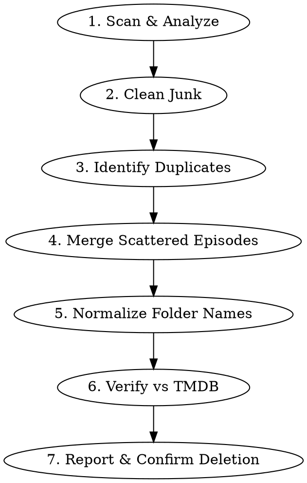

# Media Library Organizer

## Overview

Systematically clean, merge, rename, and verify media libraries so that Jellyfin/Emby/Plex can correctly identify and scrape all content.

## When to Use

- Media directory has messy folder names with encoding info
- Same show scattered across multiple folders
- Junk files wasting space
- Need to verify episode completeness against TMDB

## Workflow

## Steps

Each step has detailed instructions and reusable scripts:

1. **[Scan & Analyze](docs/scan-and-analyze.md)** - Survey directory, identify issues, generate report
   - Script: `scripts/scan-media.sh`
2. **[Clean Junk](docs/clean-junk.md)** - Remove temp files, empty dirs, orphan fragments
3. **[Identify Duplicates](docs/identify-duplicates.md)** - Find same content across folders by title/year matching
4. **[Merge Scattered Episodes](docs/merge-scattered-episodes.md)** - Combine split episodes into one folder
   - Script: `scripts/check-episodes.sh`
5. **[Normalize Folder Names](docs/normalize-folder-names.md)** - Rename to `Title (Year)` format
   - Script: `scripts/normalize-names.sh`
6. **[Verify vs TMDB](docs/verify-against-tmdb.md)** - Compare local episode count against TMDB
7. **[Report & Confirm](docs/report-and-confirm.md)** - Present findings, wait for user confirmation

## Common Mistakes

| Mistake | Fix |
|---------|-----|
| Renaming folders breaks PT/BT seeding | Confirm with user if they're still seeding |
| Gap detection only checks internal gaps | Must compare against TMDB total count |
| macOS `grep` lacks `-P` flag | Use `egrep -o` instead of `grep -oP` |
| `sed` with multi-line input fails on macOS | Use `awk` for complex text processing |
| Merging without checking overlaps | Always verify no episode overlap before merge |
| Guessing Chinese titles from English | Search TMDB/MyDramaList for authoritative names |
| Movie in TV folder or vice versa | Check if content is film or series before placing |

---
> Source: [Innei/media-library-organizer-skill](https://github.com/Innei/media-library-organizer-skill) — distributed by [TomeVault](https://tomevault.io).
<!-- tomevault:4.0:skill_md:2026-06-30 -->
