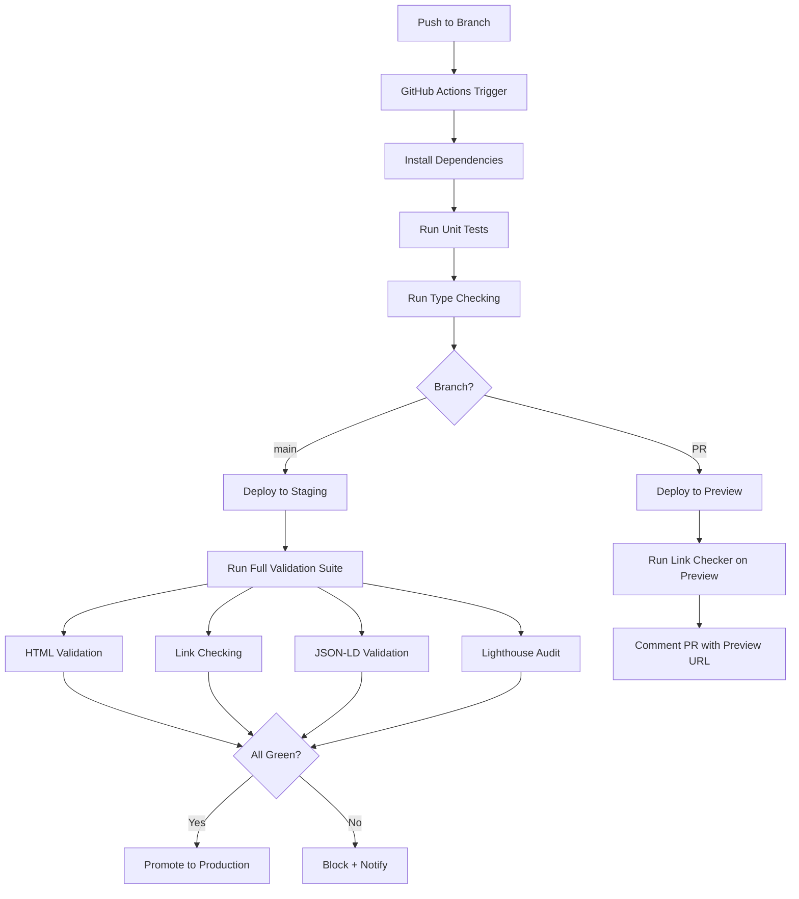

# CI/CD Pipelines

Part of [Agent Skills™](https://github.com/itallstartedwithaidea/agent-skills) by [googleadsagent.ai™](https://googleadsagent.ai)

## Description

CI/CD Pipelines defines production-grade continuous integration and deployment workflows using GitHub Actions with wrangler deploy, link validation, HTML validation, and automated quality gates. This skill encodes the actual CI/CD patterns used by googleadsagent.ai™ to deploy Workers, validate 18,000+ pages of generated content, and maintain zero-downtime production releases.

A CI pipeline is only as valuable as its gates. This skill goes beyond "run tests and deploy" to include HTML validation (no broken markup in generated pages), internal link checking (no dead links across the city × service matrix), structured data validation (JSON-LD schema compliance), and Lighthouse performance audits. Every merge to main triggers a cascade of validation steps that catch regressions before they reach production.

The deployment pipeline implements progressive rollout: deploy to a staging environment first, run the full validation suite against staging, promote to production only on green, and maintain instant rollback capability via wrangler rollback. Preview deployments for pull requests give reviewers a live URL to test changes before approval.

## Use When

- Setting up CI/CD for Cloudflare Workers or Pages projects
- Adding HTML validation or link checking to a pipeline
- Implementing progressive deployment with staging and production
- Automating quality gates for content-heavy sites
- Configuring preview deployments for pull requests
- Building rollback capability into deployment workflows

## How It Works



The pipeline fans out for validation (HTML, links, JSON-LD, Lighthouse run in parallel) and gates on the aggregate result. Production promotion only occurs when all gates pass.

## Implementation

```yaml
name: CI/CD Pipeline
on:
  push:
    branches: [main]
  pull_request:
    branches: [main]

jobs:
  test:
    runs-on: ubuntu-latest
    steps:
      - uses: actions/checkout@v4
      - uses: actions/setup-node@v4
        with: { node-version: "20" }
      - run: npm ci
      - run: npx tsc --noEmit
      - run: npm test

  deploy-staging:
    needs: test
    if: github.ref == 'refs/heads/main'
    runs-on: ubuntu-latest
    steps:
      - uses: actions/checkout@v4
      - uses: actions/setup-node@v4
        with: { node-version: "20" }
      - run: npm ci
      - run: npx wrangler deploy --env staging
        env:
          CLOUDFLARE_API_TOKEN: ${{ secrets.CF_API_TOKEN }}

  validate:
    needs: deploy-staging
    runs-on: ubuntu-latest
    strategy:
      matrix:
        check: [html, links, jsonld, lighthouse]
    steps:
      - uses: actions/checkout@v4
      - name: HTML Validation
        if: matrix.check == 'html'
        run: |
          npx html-validate "https://staging.googleadsagent.ai" \
            --config .htmlvalidate.json
      - name: Link Checking
        if: matrix.check == 'links'
        run: |
          npx linkinator https://staging.googleadsagent.ai \
            --recurse --timeout 30000 \
            --skip "^https://(?!staging\.googleadsagent\.ai)"
      - name: JSON-LD Validation
        if: matrix.check == 'jsonld'
        run: node scripts/validate-jsonld.js --base-url=https://staging.googleadsagent.ai
      - name: Lighthouse Audit
        if: matrix.check == 'lighthouse'
        run: |
          npx lhci autorun --config=lighthouserc.json \
            --collect.url=https://staging.googleadsagent.ai

  deploy-production:
    needs: validate
    runs-on: ubuntu-latest
    steps:
      - uses: actions/checkout@v4
      - uses: actions/setup-node@v4
        with: { node-version: "20" }
      - run: npm ci
      - run: npx wrangler deploy --env production
        env:
          CLOUDFLARE_API_TOKEN: ${{ secrets.CF_API_TOKEN }}
```

## Best Practices

- Run validation checks in parallel using matrix strategy to minimize pipeline duration
- Store the previous deployment version for instant rollback via `wrangler rollback`
- Cache `node_modules` and build artifacts between jobs to reduce install time
- Set Lighthouse performance budgets and fail the pipeline on regressions
- Use OIDC tokens instead of long-lived API tokens for Cloudflare authentication
- Monitor pipeline duration as a metric—slow pipelines reduce deployment frequency

## Platform Compatibility

| Platform | Support | Notes |
|----------|---------|-------|
| Cursor | Full | GitHub Actions authoring |
| VS Code | Full | GitHub Actions extension |
| Windsurf | Full | CI/CD workflow support |
| Claude Code | Full | YAML generation + validation |
| Cline | Full | Pipeline configuration |
| aider | Full | YAML file editing |

## Related Skills

- [Cloudflare Workers](../cloudflare-workers/)
- [Edge Rendering](../edge-rendering/)
- [Observability](../observability/)
- [Agent Security Scanning](../../security/agent-security-scanning/)

## Keywords

`ci-cd` `github-actions` `wrangler-deploy` `html-validation` `link-checking` `lighthouse` `progressive-deployment` `quality-gates`

---

© 2026 googleadsagent.ai™ | Agent Skills™ | MIT License

---
> Source: [itallstartedwithaidea/agent-skills](https://github.com/itallstartedwithaidea/agent-skills) — distributed by [TomeVault](https://tomevault.io).
<!-- tomevault:4.0:skill_md:2026-06-15 -->
