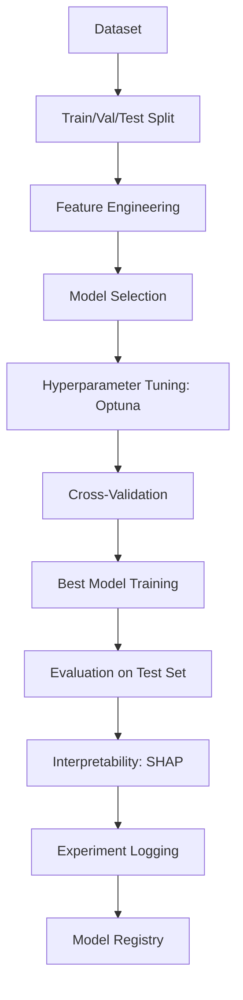

# Machine Learning

Part of [Agent Skills™](https://github.com/itallstartedwithaidea/agent-skills) by [googleadsagent.ai™](https://googleadsagent.ai)

## Description

Machine Learning provides end-to-end ML pipeline construction with PyTorch and scikit-learn, covering model selection, training, evaluation, interpretability, hyperparameter tuning, and experiment tracking. The agent builds reproducible ML workflows that follow software engineering best practices: version-controlled experiments, deterministic training, and interpretable results.

The gap between a working notebook and a production ML pipeline is enormous. This skill bridges that gap by enforcing structured experiment management, proper train/validation/test splits, stratified cross-validation, learning curve analysis, and systematic hyperparameter optimization. The agent tracks every experiment with its configuration, metrics, and artifacts, making it possible to reproduce any result months later.

Model interpretability is treated as a first-class requirement, not an optional post-hoc analysis. Every model comes with SHAP values, feature importance rankings, and partial dependence plots that explain what the model learned and why it makes specific predictions. Black-box predictions without explanations are insufficient for scientific and business-critical applications.

## Use When

- Building classification or regression models
- Tuning hyperparameters systematically
- Explaining model predictions with SHAP or feature importance
- Setting up experiment tracking for ML projects
- Evaluating model performance with proper cross-validation
- Training PyTorch models with structured training loops

## How It Works



The pipeline enforces a strict separation between tuning (using validation data) and final evaluation (using held-out test data). The test set is touched exactly once, preventing information leakage from repeated evaluation.

## Implementation

```python
import torch
import torch.nn as nn
from torch.utils.data import DataLoader, TensorDataset
from sklearn.model_selection import StratifiedKFold
from sklearn.metrics import classification_report, roc_auc_score
import optuna
import shap
import numpy as np

class Classifier(nn.Module):
    def __init__(self, input_dim: int, hidden_dim: int, dropout: float):
        super().__init__()
        self.net = nn.Sequential(
            nn.Linear(input_dim, hidden_dim),
            nn.ReLU(),
            nn.Dropout(dropout),
            nn.Linear(hidden_dim, hidden_dim // 2),
            nn.ReLU(),
            nn.Dropout(dropout),
            nn.Linear(hidden_dim // 2, 1),
        )

    def forward(self, x: torch.Tensor) -> torch.Tensor:
        return self.net(x)

def train_epoch(model, loader, optimizer, criterion, device):
    model.train()
    total_loss = 0
    for X_batch, y_batch in loader:
        X_batch, y_batch = X_batch.to(device), y_batch.to(device)
        optimizer.zero_grad()
        pred = model(X_batch).squeeze()
        loss = criterion(pred, y_batch.float())
        loss.backward()
        optimizer.step()
        total_loss += loss.item() * len(X_batch)
    return total_loss / len(loader.dataset)

def hyperparameter_search(X: np.ndarray, y: np.ndarray, n_trials: int = 50) -> dict:
    def objective(trial):
        hidden = trial.suggest_int("hidden_dim", 32, 256)
        lr = trial.suggest_float("lr", 1e-4, 1e-2, log=True)
        dropout = trial.suggest_float("dropout", 0.1, 0.5)

        skf = StratifiedKFold(n_splits=5, shuffle=True, random_state=42)
        scores = []
        for train_idx, val_idx in skf.split(X, y):
            model = Classifier(X.shape[1], hidden, dropout)
            optimizer = torch.optim.Adam(model.parameters(), lr=lr)
            criterion = nn.BCEWithLogitsLoss()

            train_ds = TensorDataset(torch.tensor(X[train_idx], dtype=torch.float32),
                                     torch.tensor(y[train_idx], dtype=torch.float32))
            loader = DataLoader(train_ds, batch_size=64, shuffle=True)

            for _ in range(20):
                train_epoch(model, loader, optimizer, criterion, "cpu")

            model.eval()
            with torch.no_grad():
                val_pred = model(torch.tensor(X[val_idx], dtype=torch.float32)).squeeze()
            scores.append(roc_auc_score(y[val_idx], val_pred.numpy()))

        return np.mean(scores)

    study = optuna.create_study(direction="maximize")
    study.optimize(objective, n_trials=n_trials)
    return study.best_params

def explain_model(model, X_sample: np.ndarray, feature_names: list[str]):
    model.eval()
    explainer = shap.DeepExplainer(model, torch.tensor(X_sample[:100], dtype=torch.float32))
    shap_values = explainer.shap_values(torch.tensor(X_sample, dtype=torch.float32))
    shap.summary_plot(shap_values, X_sample, feature_names=feature_names, show=False)
```

## Best Practices

- Set random seeds for numpy, torch, and Python's random module for reproducibility
- Use stratified splits for classification to preserve class distribution
- Touch the test set exactly once—never tune hyperparameters on test data
- Report confidence intervals from cross-validation, not single-run metrics
- Include SHAP or permutation importance for every model beyond a baseline
- Log all experiment parameters, metrics, and artifacts for reproducibility

## Platform Compatibility

| Platform | Support | Notes |
|----------|---------|-------|
| Cursor | Full | Python + PyTorch + Jupyter |
| VS Code | Full | ML extension ecosystem |
| Windsurf | Full | ML workflow support |
| Claude Code | Full | Training script generation |
| Cline | Full | ML pipeline construction |
| aider | Partial | Code generation only |

## Related Skills

- [Data Analysis](../data-analysis/)
- [Bioinformatics](../bioinformatics/)
- [Research Methodology](../research-methodology/)
- [Workflow Orchestration](../../productivity/workflow-orchestration/)

## Keywords

`machine-learning` `pytorch` `scikit-learn` `hyperparameter-tuning` `optuna` `shap` `interpretability` `experiment-tracking` `cross-validation`

---

© 2026 googleadsagent.ai™ | Agent Skills™ | MIT License

---
> Source: [itallstartedwithaidea/agent-skills](https://github.com/itallstartedwithaidea/agent-skills) — distributed by [TomeVault](https://tomevault.io).
<!-- tomevault:4.0:skill_md:2026-05-22 -->
