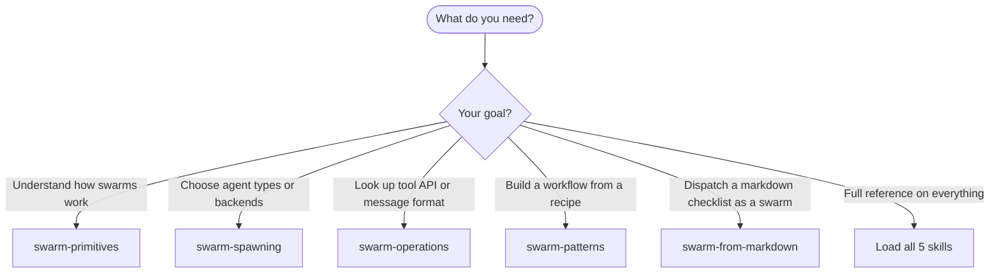

# Claude Code Swarm Orchestration

Master multi-agent orchestration using Claude Code's TeamCreate, SendMessage, TeamDelete, and Agent tools.

This skill is a facade that routes to 4 specialist skills. Load whichever you need.

---

## Specialist Skills

### Core Concepts

`Skill(skill: "swarm-primitives")`

What teams, teammates, tasks, and inboxes are. File layouts, team config structure, lifecycle diagrams, message flow sequences.

### Spawning Agents

`Skill(skill: "swarm-spawning")`

How to create agents -- subagent vs teammate decision, built-in agent types (Explore, Plan, general-purpose, Bash, etc.), plugin agent types, spawn backends (in-process, tmux, iterm2), environment variables.

### API Reference

`Skill(skill: "swarm-operations")`

Tool signatures and message schemas -- TeamCreate, SendMessage (direct, broadcast, shutdown, plan approval), TeamDelete, Agent tool parameters. Error handling, graceful shutdown sequence, crashed teammate recovery, debugging.

### Patterns and Recipes

`Skill(skill: "swarm-patterns")`

6 orchestration patterns (parallel specialists, pipeline, swarm, research+implement, plan approval, coordinated refactoring), 3 complete workflows, best practices, quick reference.

### Checklist-to-Swarm Automation

`Skill(skill: "swarm-from-markdown")`

Parse a markdown `- [ ]` checklist file and generate the full `TeamCreate` + `TaskCreate` + `Agent` call sequence automatically. Use when you have a `todo.md` or any checkbox file and want to dispatch items as a self-organizing swarm without writing the TaskCreate loop by hand.

---

## Quick Start



---

## Minimal Example

```javascript
// 1. Create team
TeamCreate({ team_name: "my-team" })

// 2. Create tasks
TaskCreate({ subject: "Review auth", description: "Review auth module", activeForm: "Reviewing..." })
TaskCreate({ subject: "Review API", description: "Review API endpoints", activeForm: "Reviewing..." })

// 3. Spawn teammates
Agent({ team_name: "my-team", name: "reviewer-1", subagent_type: "general-purpose", prompt: "Claim task #1, review it, send findings to team-lead.", run_in_background: true })
Agent({ team_name: "my-team", name: "reviewer-2", subagent_type: "general-purpose", prompt: "Claim task #2, review it, send findings to team-lead.", run_in_background: true })

// 4. Collect results (messages arrive automatically)

// 5. Shutdown and cleanup
SendMessage({ type: "shutdown_request", recipient: "reviewer-1", content: "Done" })
SendMessage({ type: "shutdown_request", recipient: "reviewer-2", content: "Done" })
// Wait for approvals...
TeamDelete()
```

---

SOURCE: Claude Code v2.1.45 -- verified 2026-02-18

---
> Source: [jamie-bitflight/claude_skills](https://github.com/jamie-bitflight/claude_skills) — distributed by [TomeVault](https://tomevault.io).
<!-- tomevault:4.0:skill_md:2026-06-07 -->
