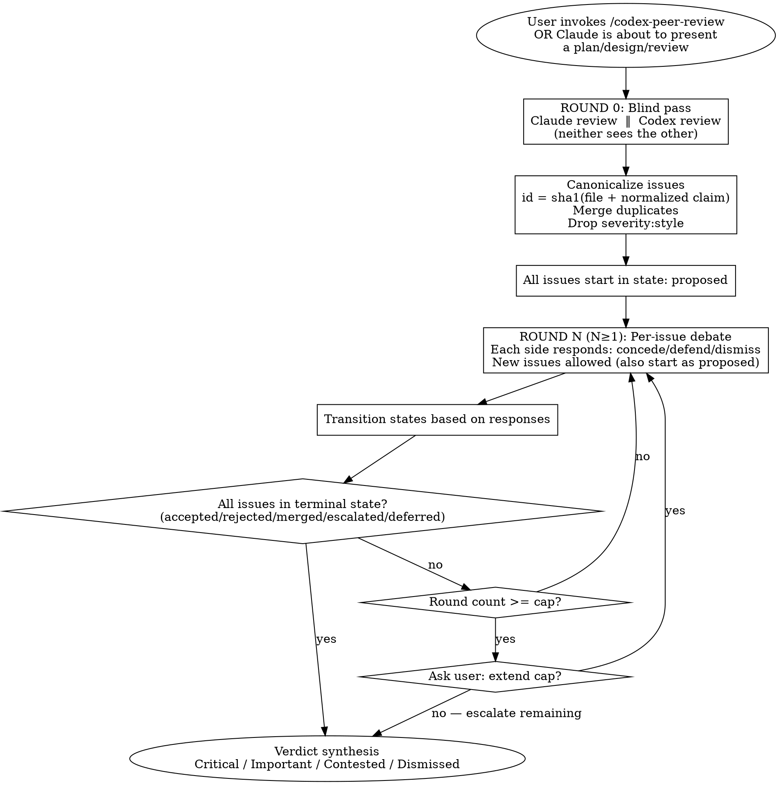

# Codex Peer Review

Symmetric two-AI peer review using OpenAI Codex CLI. Both AIs review independently, then debate per-issue with terminal states until convergence — not a one-shot validation.

**Core principle:** Asymmetric "validate my answer" loops anchor on the proposer's framing. Symmetric blind passes catch ~2x as many issues because each AI examines the work without priming. The debate phase then resolves conflicts deterministically via per-issue terminal states.

This is the **single source of truth** for the peer review protocol. The agent file is a thin dispatcher that loads this skill.

## Reference Files

@discussion-protocol.md — debate mechanics (round-by-round prompts)
@escalation-criteria.md — when to skip the debate and go to external research
@common-mistakes.md — anti-patterns and recovery

## Modes

| Mode | Command | When |
|------|---------|------|
| **blind-debate** (default) | `/codex-peer-review` | Symmetric blind pass + structured debate. Best signal. |
| **classic** (deprecated) | `/codex-peer-review --mode classic` | Old single-pass validation. Cheap, weaker signal. Will be removed. |

Auto-trigger (proactive validation before presenting plans/designs/reviews) always uses **blind-debate**.

## Codex CLI Compatibility

Tested against `codex-cli 0.136.0`. Hard requirements:

- `codex exec` for ALL machine-readable output (`codex review` exposes only `--base` — no `--json`, `-o`, or `--output-schema` — so it cannot drive parseable workflows)
- `jq` (fail fast if missing — required for session ID extraction and JSONL parsing)
- A configured `peer-review` profile **file** at `~/.codex/peer-review.config.toml`, layered via `--profile peer-review` (see "Codex Profile Setup" below)

**Schema is enforced via prompt template, parsed with `jq`** — not via `--output-schema`. (`codex exec` does expose `--output-schema <FILE>`, but the prompt-template + jq path is version-stable and avoids depending on its behavior.)

## Codex Profile Setup

Model selection lives in per-profile files under `~/.codex/`, not in this plugin. Codex CLI (profile-v2) resolves `--profile <name>` by layering `~/.codex/<name>.config.toml` on top of the base `~/.codex/config.toml`. This keeps CLI flags out of prompts and lets users tune without editing the plugin or touching `config.toml`.

Run this once per machine (the plugin's `init` flow does this automatically if the files are missing):

```bash
cat > ~/.codex/peer-review.config.toml <<'EOF'
model = "gpt-5.4"
model_reasoning_effort = "high"
EOF

cat > ~/.codex/peer-review-summarizer.config.toml <<'EOF'
model = "gpt-5.4-mini"
model_reasoning_effort = "low"
EOF
```

The plugin invokes Codex as `codex exec --profile peer-review ...` — the file is layered automatically. **Never hardcode `-m gpt-5.x-...`** in agent prompts.

`gpt-5.4-mini` is the durable cheap-workhorse choice for the summarizer profile.

> **Legacy note:** Pre-0.12 Codex used `[profiles.peer-review]` tables inside `config.toml`. Those are inert under profile-v2 — remove them by hand if you upgraded from an older plugin version. The plugin never writes to or edits `config.toml`.

## The Workflow



**Default cap:** 3 rounds total (1 blind + 2 debate). The peer review found that 5 (the dg default) is too expensive for serious code review and risks rationalization loops. Allow extension only when new evidence appears in the final round.

## Round 0: Blind Pass

Both AIs review the **same scope** with the **same prompt**, neither seeing the other's work.

### Scope determination

| User input | Scope |
|------------|-------|
| `/codex-peer-review` (no args) | Use `AskUserQuestion` to select: changes vs branch / uncommitted / specific commit |
| `/codex-peer-review --base X` | `git diff X...HEAD` |
| `/codex-peer-review --uncommitted` | Staged + unstaged + untracked |
| `/codex-peer-review --commit SHA` | Single commit |
| `/codex-peer-review <question>` | Question text — no diff, validate the answer |
| Auto-trigger from Claude's plan | Plan text + affected files |

**Never guess the base branch.** Always ask via `AskUserQuestion` if not specified.

### The blind-pass prompt template

Both Claude and Codex receive this exact template (variables filled in):

```
You are performing an independent code review. Another AI is reviewing the same
work in parallel. You will not see their findings until after this pass.

## Scope
{scope_description}

## Files / Diff
{files_or_diff}

## Review lenses (apply BOTH)

1. CRITIC LENS: For each issue you raise, you MUST provide ONE of:
   - A concrete exploit path or attack scenario
   - A failing test case (input + expected vs actual)
   - A specific failure mode (e.g., "concurrent writes to map at handler.go:42 will panic under load")
   Vague concerns ("could be improved", "might be fragile") are REJECTED.

2. DEFENDER LENS: Before raising an issue, check whether:
   - An existing test covers it
   - A codebase invariant or convention makes it impossible
   - It is intentional per a comment, ADR, or commit message
   If yes, do not raise it.

## Output format (strict)

Emit a single fenced code block tagged `findings` containing JSONL — one finding per line:

```findings
{"id":"<sha1(file+claim)>","file":"path:line","severity":"critical|high|medium|low|style","claim":"<one sentence>","evidence":"<exploit/test/failure mode>","category":"security|correctness|performance|maintainability|style"}
{"id":"...","file":"...","severity":"...","claim":"...","evidence":"...","category":"..."}
```

If you find no issues, emit an empty `findings` block.

After the block, write a 2-3 sentence summary of the work's overall quality and your confidence level.
```

### Codex invocation

```bash
codex exec --profile peer-review --sandbox read-only \
  -o /tmp/codex_round0.txt \
  --json 2>&1 | tee /tmp/codex_round0.jsonl <<'EOF'
[blind-pass prompt above]
EOF
```

`-o` writes the final assistant message only — that is what we parse for the `findings` block. The JSONL stream is for progress polling and session ID extraction.

### Issue canonicalization

After both sides emit findings, normalize and merge:

```bash
# Concatenate both findings blocks
jq -s '.' /tmp/claude_findings.json /tmp/codex_findings.json > /tmp/all_findings.json

# Merge by id; if both AIs reported the same id, mark source="both"
jq '
  group_by(.id)
  | map({
      id: .[0].id,
      file: .[0].file,
      severity: .[0].severity,
      claim: .[0].claim,
      evidence: (map(.evidence) | unique | join(" || ")),
      category: .[0].category,
      source: (if length == 2 then "both" else .[0]._source end),
      status: "proposed"
    })
' /tmp/all_findings.json > /tmp/canonical_issues.json
```

**Issue IDs are content-hashed**, not positional. The same finding from both AIs collapses to one row with `source: "both"` (a strong signal — these usually become `accepted` immediately).

**Drop `severity:style` from the debate.** Style issues never converge through debate; they're resolved by project conventions. Surface them in the final report as a separate "style notes" section, not in the verdict.

## Rounds 1+: Per-Issue Debate

Each side sees:
- The full canonical issue table with current states
- The previous round's response (if any)

Each side emits **per-issue stances** for every non-terminal issue, plus any new issues (which start as `proposed`).

### State machine

```
                    ┌──────────┐
                    │ proposed │  ◄── new in this round
                    └────┬─────┘
                         │
        ┌────────────────┼────────────────┐
        │                │                │
        ▼                ▼                ▼
   ┌─────────┐     ┌──────────┐    ┌────────────┐
   │accepted │     │ rejected │    │ escalated  │
   └─────────┘     └──────────┘    └─────┬──────┘
        ▲                ▲               │
        │                │               ▼
        │                │         (next round)
        │                │
   ┌────┴────┐      ┌────┴────┐
   │ merged  │      │deferred │
   └─────────┘      └─────────┘
```

### Transition rules

For each non-terminal issue, after both sides respond in round N:

| Claude stance | Codex stance | New state |
|---------------|--------------|-----------|
| concede | concede | **rejected** (both withdrew) |
| defend | defend | **escalated** (carry to next round) |
| dismiss | dismiss | **rejected** |
| concede / dismiss | accept / push | **accepted** (one side conceded the other's claim) |
| accept / push | concede / dismiss | **accepted** |
| proposed (new evidence merges with existing) | — | **merged** into target id |

**Terminal states:** `accepted`, `rejected`, `merged`, `deferred`. Issues in these states drop out of the debate.

**`escalated`** issues survive to round N+1, but require **new evidence** to remain alive past round 2. An issue defended only by re-asserting the same point in round 3 auto-transitions to `deferred` (presented to user as "contested, both held position").

### Convergence

```
converged = (no issues in state ∈ {proposed, escalated})
```

This is **derived**, not declared. No top-level `converged: true` flag from the model — that just invites premature claims of consensus.

### Round prompt template (Round 1+)

```
You are continuing the peer review debate. The other AI has emitted findings.
You must respond to each non-terminal issue with a stance.

## Canonical issue table (current state)

{table_of_issues_with_states}

## The other AI's round N response

{other_ai_response}

## Your task

1. For each non-terminal issue, emit ONE stance line:

```stances
{"id":"<id>","stance":"concede|defend|dismiss|accept","reasoning":"<one sentence>","new_evidence":"<optional — required to keep defend alive past round 2>"}
```

   - `concede` = you no longer believe this issue is real
   - `defend` = you maintain this issue (must include new_evidence in round 3+)
   - `dismiss` = you believe the OTHER AI's claim is wrong
   - `accept` = you accept the OTHER AI's claim that you originally raised was wrong (use when conceding YOUR OWN issue under their dismiss)

2. After the stances block, you may emit a `findings` block with NEW issues only.
   New issues must follow all CRITIC LENS rules (concrete evidence required).

3. Apply both lenses (critic and defender) as before.
```

### Session resume (optimization, not correctness)

```bash
# Round 1 — extract session ID from JSONL
SESSION_ID=$(jq -r 'select(.type=="thread.started") | .thread_id' /tmp/codex_round0.jsonl | head -1)

# Round 2 — try to resume
if [ -n "$SESSION_ID" ]; then
  codex exec --profile peer-review --sandbox read-only resume "$SESSION_ID" \
    -o /tmp/codex_round1.txt --json 2>&1 | tee /tmp/codex_round1.jsonl <<'EOF'
[round prompt]
EOF
fi

# If resume fails (session store error, missing ID), fall back to fresh exec with full canonical table re-injected
```

**Session resume is best-effort.** Each round prompt re-injects the canonical issue table, so a session-store error degrades latency but not correctness.

## Verdict Synthesis

After convergence (or cap exhausted), categorize all issues by terminal state:

| Verdict | Source states | Meaning |
|---------|---------------|---------|
| **Critical** | `accepted` AND severity ∈ {critical, high} | Real bugs, ship as required fixes |
| **Important** | `accepted` AND severity = medium | Strong recommendation |
| **Contested** | `escalated` (cap hit) OR `deferred` | Both held positions — present both views, user decides |
| **Dismissed** | `rejected` | Raised but withdrawn — informational only |
| **Style notes** | severity = style | Bypassed debate entirely — informational |

## Output format

```markdown
## Peer Review Result — {scope}
**Mode:** blind-debate
**Rounds:** N (converged | cap reached)
**Issues canonical:** X total, Y from both AIs, Z unique to one side

### Critical
- `file:line` — {claim}
  - Evidence: {evidence}
  - Source: both | claude | codex

### Important
- `file:line` — {claim}
  - Evidence: {evidence}

### Contested (both AIs held position)
- `file:line` — {claim}
  - Claude's view: {summary}
  - Codex's view: {summary}
  - Recommendation: {how user should decide}

### Dismissed (raised but withdrawn)
- `file:line` — {claim} — {why withdrawn}

### Style notes
- `file:line` — {note}

### Process notes
- {anything notable about the debate, e.g., "Codex raised 3 security issues Claude missed"}
- {immediate-escalation triggers fired, if any}
```

## Immediate Escalation (Skip Debate)

Some classes of finding skip the per-issue debate and go straight to external research arbitration:

- **Security**: auth bypass, injection, secrets exposure, crypto misuse
- **Architecture**: fundamental design conflicts (e.g., one side says "this whole module should be event-driven")
- **Breaking changes**: backward compat disputes
- **Order-of-magnitude perf**: "this is O(n²) in a hot path" vs "fine"

If either AI flags a security concern in the blind pass, escalate that issue immediately to external research. The peer review skill is agnostic about *which* research tool to use — pick the best one available (web search, an MCP research tool, vendor docs, etc.). See @escalation-criteria.md.

## Subagent Dispatch (CRITICAL)

**Always run via the `codex-peer-reviewer` subagent.** The main conversation must never see raw Codex output, JSONL streams, or per-round transcripts — only the final synthesized verdict.

The agent file (`agents/codex-peer-reviewer.md`) is a thin dispatcher that loads this skill and runs the protocol.

## Prerequisites

```bash
# Required
command -v codex >/dev/null || { echo "ERROR: install codex CLI: npm i -g @openai/codex"; exit 1; }
command -v jq >/dev/null || { echo "ERROR: install jq: brew install jq"; exit 1; }

# Verify peer-review profile file exists
[ -f ~/.codex/peer-review.config.toml ] || {
  echo "ERROR: missing ~/.codex/peer-review.config.toml. Run: codex-peer-review init"
  exit 1
}

# Verify auth
codex login --check 2>/dev/null || echo "WARNING: run 'codex login'"
```

## Quick reference

| Scenario | Action |
|----------|--------|
| About to present design/plan | Auto-trigger blind-debate, no args |
| About to present code review | Auto-trigger blind-debate, scope = the diff |
| User asks broad question | blind-debate with question as scope, no diff |
| User runs `/codex-peer-review` | Ask for scope, run blind-debate |
| User runs `/codex-peer-review --mode classic` | Single-pass validation (deprecated) |
| Security issue surfaces | Immediate escalation, skip per-issue debate |
| Cap hit, issues still escalated | Mark as Contested, present both views |

**Key changes from prior versions:**
- ❌ `codex review --json` removed (`codex review` exposes only `--base`; use `codex exec`)
- ❌ Hardcoded `gpt-5.3-codex-spark` removed (use Codex profiles instead)
- ❌ Asymmetric "Claude proposes, Codex validates" removed (now symmetric blind pass)
- ❌ Top-level `converged: bool` removed (now derived from per-issue states)
- ✅ Schema enforced via prompt template, parsed with jq (NOT `--output-schema`, which is unstable)
- ✅ Session resume is best-effort optimization, not correctness-critical

---
> Source: [jcputney/agent-peer-review](https://github.com/jcputney/agent-peer-review) — distributed by [TomeVault](https://tomevault.io).
<!-- tomevault:4.0:skill_md:2026-06-17 -->
