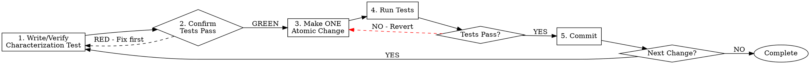

# Safe Refactoring

## The Iron Law

```
╔═══════════════════════════════════════════════════════════════════╗
║  NO STRUCTURAL CHANGE WITHOUT CHARACTERIZATION TEST FIRST         ║
║  NO MULTIPLE CHANGES IN ONE COMMIT                                ║
║  NO PROCEEDING WITHOUT GREEN TESTS                                ║
╚═══════════════════════════════════════════════════════════════════╝
```

This is non-negotiable. There are no exceptions.

## Refactoring Cycle



## Common Rationalizations - BLOCKED

| Excuse | Reality |
|--------|---------|
| "This code is simple, no test needed" | Simple code still breaks. 30 seconds to write a test. |
| "Multiple changes at once is faster" | Rollback impossible = debugging nightmare = MORE time |
| "I'll write tests after" | You won't. And when it breaks, you won't know why. |
| "The existing tests cover this" | Verify it. Run them. See them pass. Then proceed. |
| "This is just a rename" | Renames break things. Test first. |
| "I'm just moving code" | Moving code breaks imports. Test first. |
| "It's only formatting" | Use formatter. If logic change mixed in, test first. |

## Red Flags - STOP IMMEDIATELY

If you think any of these, you are about to make a mistake:

- "I don't need a test for this"
- "Let me fix these three things together"
- "I'll commit after I finish all changes"
- "Tests are slowing me down"
- "I know this works"
- "It's an obvious fix"

## Atomic Change Definition

An atomic change is:

- **ONE** logical modification
- Independently testable
- Independently revertable
- Describable in ONE sentence

Examples of atomic changes:
- Rename a variable
- Extract a method
- Move a function to another file
- Change a function signature
- Replace a conditional with polymorphism (ONE class at a time)

NOT atomic (break these down):
- "Refactor the entire module" → Multiple extract/rename/move operations
- "Clean up this class" → Individual smell fixes
- "Modernize the API" → One endpoint at a time

## Characterization Test Template

Before ANY change, write a test that captures current behavior:

```python
# Python example
def test_current_behavior_of_target_function():
    """Characterization test - captures current behavior before refactoring."""
    # Arrange: Set up the exact state
    input_data = create_typical_input()

    # Act: Call the function being refactored
    result = target_function(input_data)

    # Assert: Verify current behavior (even if it seems wrong)
    assert result == expected_current_output

    # Document any edge cases discovered
    assert target_function(edge_case_input) == edge_case_output
```

```typescript
// TypeScript example
describe('target_function characterization', () => {
  it('captures current behavior before refactoring', () => {
    // Arrange
    const input = createTypicalInput();

    // Act
    const result = targetFunction(input);

    // Assert current behavior
    expect(result).toEqual(expectedCurrentOutput);
  });
});
```

## Refactoring Catalog

Safe refactorings to apply ONE at a time:

### Extract Method
1. Identify code to extract
2. Write test covering that code path
3. Extract to new method
4. Run tests
5. Commit

### Rename
1. Identify element to rename
2. Verify tests cover usage
3. Rename using IDE refactoring tool
4. Run tests
5. Commit

### Move
1. Identify element to move
2. Verify tests cover usage
3. Move to new location
4. Update imports
5. Run tests
6. Commit

### Replace Conditional with Polymorphism
1. Identify conditional to replace
2. Write tests for each branch
3. Create interface/base class
4. Implement ONE concrete class
5. Run tests
6. Commit
7. Repeat 4-6 for each branch

## Verification Checklist

Before committing any change:

```markdown
- [ ] Characterization test exists for affected code
- [ ] All tests were GREEN before this change
- [ ] Only ONE atomic change was made
- [ ] All tests are GREEN after this change
- [ ] Change is independently revertable
- [ ] Commit message describes the single change
```

## Emergency Rollback

If tests fail after a change:

```bash
# Discard all uncommitted changes
git checkout -- .

# If already committed, revert
git revert HEAD

# Never force-push to fix mistakes
# Never --amend to hide failed attempts
```

## Example Session

```markdown
Human: Refactor this 200-line function

---
> Converted and distributed by [TomeVault](https://tomevault.io/claim/joowankim) — claim your Tome and manage your conversions.
<!-- tomevault:4.0:skill_md:2026-04-14 -->
