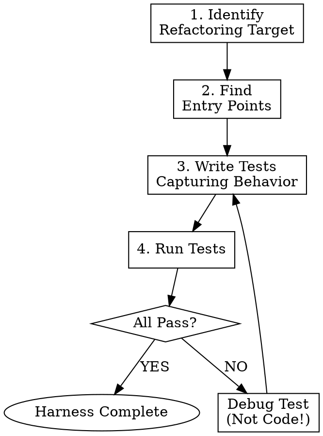

# Test Harness Creation

## The Iron Law

```
╔═══════════════════════════════════════════════════════════════════╗
║  NO REFACTORING WITHOUT CHARACTERIZATION TESTS FIRST             ║
╚═══════════════════════════════════════════════════════════════════╝
```

## Purpose

Create a safety net of tests that capture the **current behavior** of code before refactoring. These tests ensure that refactoring preserves behavior, even if that behavior has bugs.

## Key Principle

> "Characterization tests document what the system actually does, not what it should do."
> — Michael Feathers, Working Effectively with Legacy Code

## Test Harness Workflow



## Step 1: Identify Entry Points

For the code being refactored, identify all ways it can be called:

```markdown
- [ ] Public methods/functions
- [ ] Event handlers
- [ ] API endpoints
- [ ] CLI commands
- [ ] Scheduled jobs
- [ ] Message queue consumers
```

## Step 2: Capture Input/Output Pairs

For each entry point, document:

| Input | Expected Output | Side Effects |
|-------|-----------------|--------------|
| Typical case | Current result | DB writes, logs |
| Edge case 1 | Current result | ... |
| Error case | Current exception | ... |
| Null/empty | Current behavior | ... |

## Step 3: Write Characterization Tests

### Python Template

```python
import pytest
from module_under_test import target_function

class TestTargetFunctionCharacterization:
    """
    Characterization tests for target_function.
    These capture CURRENT behavior, not desired behavior.
    DO NOT modify expected values during refactoring.
    """

    def test_typical_input_returns_expected_output(self):
        # Arrange
        input_data = {"user_id": 123, "action": "purchase"}

        # Act
        result = target_function(input_data)

        # Assert - This is what it DOES, not what it SHOULD do
        assert result == {"status": "ok", "transaction_id": "expected_id"}

    def test_empty_input_returns_error(self):
        # Arrange
        input_data = {}

        # Act
        result = target_function(input_data)

        # Assert
        assert result == {"status": "error", "message": "Missing user_id"}

    def test_invalid_action_behavior(self):
        # Arrange
        input_data = {"user_id": 123, "action": "invalid"}

        # Act & Assert - Document current exception behavior
        with pytest.raises(ValueError) as exc:
            target_function(input_data)
        assert "Unknown action" in str(exc.value)

    def test_side_effects_are_captured(self, mock_database):
        # Arrange
        input_data = {"user_id": 123, "action": "purchase"}

        # Act
        target_function(input_data)

        # Assert side effects
        mock_database.insert.assert_called_once_with(
            "transactions",
            {"user_id": 123, "action": "purchase"}
        )
```

### TypeScript Template

```typescript
import { targetFunction } from './module-under-test';

describe('targetFunction characterization', () => {
  /**
   * Characterization tests - capture CURRENT behavior.
   * DO NOT modify expected values during refactoring.
   */

  it('handles typical input correctly', () => {
    const input = { userId: 123, action: 'purchase' };

    const result = targetFunction(input);

    expect(result).toEqual({ status: 'ok', transactionId: 'expected_id' });
  });

  it('handles empty input', () => {
    const input = {};

    const result = targetFunction(input);

    expect(result).toEqual({ status: 'error', message: 'Missing userId' });
  });

  it('throws on invalid action', () => {
    const input = { userId: 123, action: 'invalid' };

    expect(() => targetFunction(input)).toThrow('Unknown action');
  });

  it('logs expected messages', () => {
    const consoleSpy = jest.spyOn(console, 'log');
    const input = { userId: 123, action: 'purchase' };

    targetFunction(input);

    expect(consoleSpy).toHaveBeenCalledWith('Processing purchase for 123');
  });
});
```

## Step 4: Handle Dependencies

### Mocking Strategy

| Dependency Type | Strategy |
|-----------------|----------|
| Database | Mock at boundary |
| External API | Mock responses |
| File system | Use temp directory |
| Time/dates | Freeze time |
| Random | Seed or mock |

### Dependency Injection for Testability

If code is too coupled to dependencies:

1. Extract dependency to parameter
2. Provide default for production
3. Inject mock for tests

```python
# Before: Hard to test
def process_order(order_id):
    db = DatabaseConnection()  # Hidden dependency
    order = db.get_order(order_id)
    # ...

# After: Testable
def process_order(order_id, db=None):
    db = db or DatabaseConnection()  # Injectable
    order = db.get_order(order_id)
    # ...
```

## Step 5: Verify Harness

Before proceeding to refactoring:

```markdown
- [ ] All characterization tests pass
- [ ] Each entry point has at least one test
- [ ] Edge cases are covered
- [ ] Error paths are covered
- [ ] Side effects are verified
- [ ] Tests fail when behavior changes
```

### Mutation Testing (Optional but Recommended)

Verify tests actually catch changes:

```bash
# Python
mutmut run --paths-to-mutate=module_under_test.py

# JavaScript
npx stryker run
```

## Red Flags - STOP

| Thought | Reality |
|---------|---------|
| "The existing tests are enough" | Verify it. Run them. Check coverage. |
| "I'll add tests after refactoring" | You'll miss behavior changes. |
| "This code is too tangled to test" | That's why you need the harness. Extract seams first. |
| "Testing this is too slow" | Slow tests > broken refactoring |

## Checklist

```markdown
- [ ] Entry points identified
- [ ] Input/output pairs documented
- [ ] Characterization tests written
- [ ] All tests passing
- [ ] Edge cases covered
- [ ] Error paths covered
- [ ] Side effects verified
- [ ] Dependencies properly mocked
```

## Signal

When harness is complete, emit:

```
HARNESS_COMPLETE
```

---
> Converted and distributed by [TomeVault](https://tomevault.io/claim/joowankim) — claim your Tome and manage your conversions.
<!-- tomevault:4.0:skill_md:2026-04-14 -->
