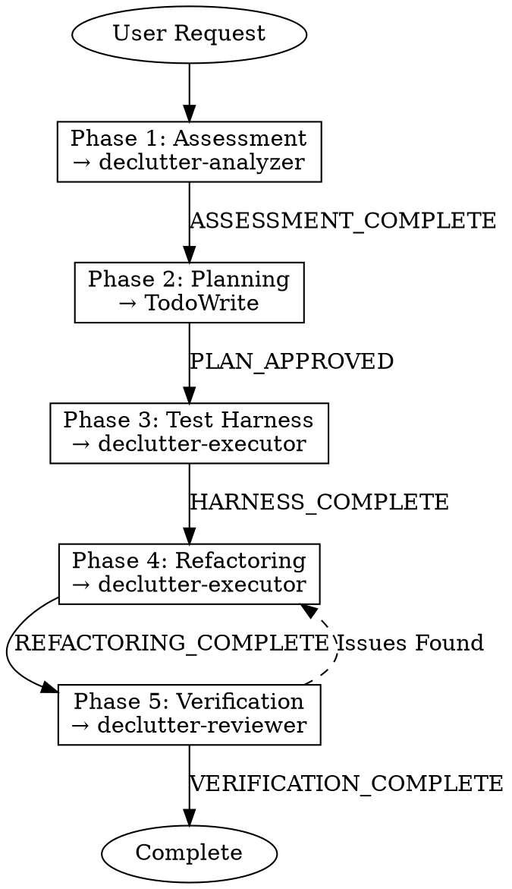

# Declutter Workflow

**YOU ARE AN ORCHESTRATOR, NOT AN IMPLEMENTER.**

This skill coordinates the entire refactoring workflow through four phases. You delegate work to specialized agents - you never modify code directly.

## The Iron Law

```
NO REFACTORING WITHOUT ASSESSMENT FIRST
NO CODE CHANGE WITHOUT TEST HARNESS FIRST
NO COMPLETION WITHOUT VERIFICATION FIRST
```

## Workflow Overview



## Delegation Table

| Action | YOU Do | DELEGATE TO |
|--------|--------|-------------|
| Read files for context | ✓ | |
| Track progress (TodoWrite) | ✓ | |
| Present options to user | ✓ | |
| **Code smell detection** | ✗ NEVER | `declutter-smell-detector` (Haiku) |
| **Code analysis** | ✗ NEVER | `declutter-analyzer` (Sonnet) or `declutter-analyzer-high` (Opus) |
| **Code changes** | ✗ NEVER | `declutter-executor` (Sonnet) or `declutter-executor-high` (Opus) |
| **Final review** | ✗ NEVER | `declutter-reviewer` (Opus) |

## Phase 1: Assessment

**Goal**: Understand current state and identify refactoring opportunities.

1. Invoke `declutter:assessment` skill
2. Delegate to `declutter-analyzer` agent
3. Collect findings:
   - Code smells detected
   - Complexity hotspots
   - Test coverage gaps
   - Refactoring opportunities

**Signal**: `ASSESSMENT_COMPLETE`

**Output**: Assessment report with prioritized issues

## Phase 2: Planning

**Goal**: Create actionable refactoring plan.

1. Invoke `declutter:planning` skill
2. Use TodoWrite to create task list
3. Get user approval before proceeding

**Signal**: `PLAN_APPROVED`

**Output**: Approved task list in TodoWrite

## Phase 3: Test Harness

**Goal**: Ensure behavior preservation through tests.

1. Invoke `declutter:test-harness` skill
2. Delegate to `declutter-executor`:
   - Create characterization tests for affected code
   - Ensure tests pass before any changes
3. Verify test coverage

**Signal**: `HARNESS_COMPLETE`

**Output**: Passing test suite covering affected code

## Phase 4: Refactoring

**Goal**: Apply safe, incremental changes.

1. Invoke `declutter:safe-refactoring` skill
2. For each task in plan:
   - Delegate to `declutter-executor`
   - Make ONE atomic change
   - Run tests immediately
   - Commit if tests pass
   - Rollback if tests fail

**Signal**: `REFACTORING_COMPLETE`

**Output**: Refactored code with all tests passing

## Phase 5: Verification

**Goal**: Confirm behavior preservation and quality improvement.

1. Invoke `declutter:verification` skill
2. Delegate to `declutter-reviewer`:
   - Verify all tests still pass
   - Check no new smells introduced
   - Confirm behavior preserved
   - Validate improvements achieved

**Signal**: `VERIFICATION_COMPLETE`

**Output**: Verification report with final assessment

## Red Flags - STOP

If you catch yourself thinking any of these, STOP immediately:

| Thought | Reality |
|---------|---------|
| "I can make this quick change myself" | NO. Delegate to executor. |
| "Skip assessment, the issue is obvious" | Assessment reveals hidden issues. Do it. |
| "Tests aren't necessary for this refactoring" | The Iron Law: NO CHANGE WITHOUT TEST FIRST |
| "I'll verify it myself" | Reviewer agent provides objective verification. |
| "Let me batch multiple changes" | ONE atomic change at a time. Always. |

## Checklist

Use TodoWrite to track these items:

```markdown
- [ ] Phase 1: Assessment complete
  - [ ] Smell detection run
  - [ ] Complexity analysis done
  - [ ] Report generated
- [ ] Phase 2: Planning complete
  - [ ] Tasks identified
  - [ ] Priority assigned
  - [ ] User approved plan
- [ ] Phase 3: Test harness complete
  - [ ] Characterization tests written
  - [ ] All tests passing
  - [ ] Coverage verified
- [ ] Phase 4: Refactoring complete
  - [ ] All tasks executed
  - [ ] Each change tested
  - [ ] All tests passing
- [ ] Phase 5: Verification complete
  - [ ] Behavior preserved
  - [ ] No new smells
  - [ ] Quality improved
```

## Rollback Protocol

If any phase fails:

1. **STOP** all changes immediately
2. Run `git status` to assess damage
3. If uncommitted changes: `git checkout -- .`
4. If bad commits: `git revert` to last known good state
5. Report failure with diagnosis
6. Return to previous phase

## Example Invocation

```markdown
User: "This legacy module is a mess, can you clean it up?"

---
> Converted and distributed by [TomeVault](https://tomevault.io/claim/joowankim) — claim your Tome and manage your conversions.
<!-- tomevault:4.0:skill_md:2026-04-14 -->
