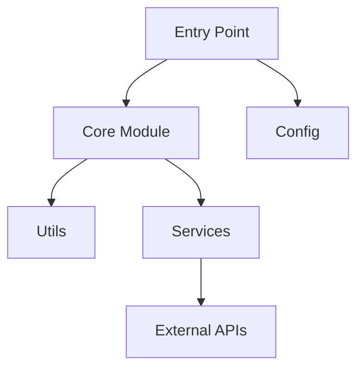
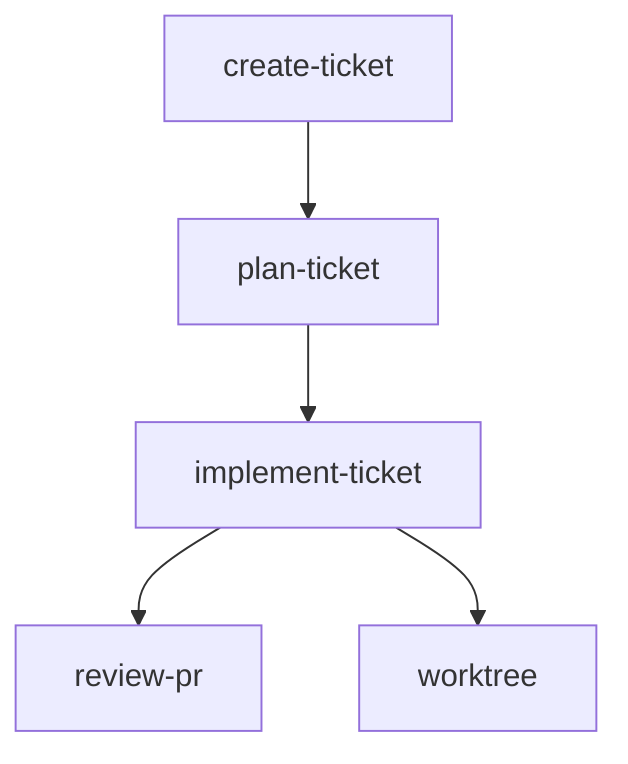

# Codebase Map

Generate a structural overview and dependency diagram of the current codebase.

## Purpose

This skill produces a clear visual and textual representation of codebase structure, helping developers understand:
- How directories and modules are organised
- What each major component does
- How modules relate to and depend on each other

## Prerequisites

- Git remote must exist (maps should be for projects with remotes)
- No requirement for clean working tree (read-only operation)

## When to Use

Use this skill when you want to:
- Understand an unfamiliar codebase
- Document project architecture
- Onboard new team members
- Visualise module dependencies
- Get a high-level overview before diving into code

## Workflow

### Step 1: Verify Environment

Check we have a GitHub remote:

```bash
git remote -v
```

**STOP if:**
- No remote exists → "This skill requires a GitHub remote. Codebase maps are intended for projects with remotes."

### Step 2: Explore the Codebase

Use the Task tool with `subagent_type: "Explore"` for thorough codebase exploration:

```
Tool: Task
Parameters:
  subagent_type: "Explore"
  description: "Explore codebase structure for mapping"
  prompt: |
    Explore this codebase to understand its structure and organisation.

    Identify:
    - Top-level directory structure and purpose of each directory
    - Entry points (main files, CLI entry points, server start files)
    - Key modules/packages and their responsibilities
    - Import relationships between modules
    - Configuration files and their purposes
    - Test structure and organisation
    - Build/deployment files

    For each significant directory:
    - What it contains
    - What purpose it serves
    - What depends on it / what it depends on

    Use thoroughness level: "very thorough"

    Return:
    1. Complete directory tree with annotations
    2. List of entry points
    3. Module dependency relationships
    4. Key configuration files
```

### Step 3: Generate Structure Overview

Produce a hierarchical markdown overview of the codebase structure.

**Format:**
```
## Structure Overview

project-root/
├── src/                    # Main source code
│   ├── components/         # UI components
│   ├── services/           # Business logic and API calls
│   └── utils/              # Shared utilities
├── tests/                  # Test files mirroring src structure
├── config/                 # Configuration files
└── scripts/                # Build and deployment scripts
```

**Guidelines for annotations:**
- Keep descriptions short (3-8 words)
- Focus on purpose, not contents
- Only annotate significant directories
- Use consistent terminology

### Step 4: Identify Key Files

List the most important files in the codebase with brief descriptions:

**Format:**
```
## Key Files

| File | Purpose |
|------|---------|
| `src/index.ts` | Application entry point |
| `src/config.ts` | Configuration loading and validation |
| `package.json` | Dependencies and scripts |
```

Include:
- Entry points
- Main configuration files
- Core modules that others depend on
- Files that define key abstractions

### Step 5: Generate Dependency Diagram

Create a mermaid diagram showing module relationships.

**Format:**


**Guidelines:**
- Show major modules, not individual files
- Group related functionality
- Indicate direction of dependency (arrow points from dependent to dependency)
- Keep diagram readable (10-20 nodes maximum)
- Use clear, short labels

**Diagram types by project:**
- **Simple projects**: Single `graph TD` showing module relationships
- **Layered architectures**: Show layers with subgraphs
- **Microservices**: Show service boundaries and communication

### Step 6: Add Project-Specific Context

Include relevant context based on project type:

**Python projects:**
- Package structure (`__init__.py` locations)
- Virtual environment setup
- Entry points from `pyproject.toml` or `setup.py`

**JavaScript/TypeScript projects:**
- Module system (CommonJS vs ESM)
- Build output locations
- Package manager (`npm`, `yarn`, `pnpm`)

**Multi-language projects:**
- Language boundaries
- Inter-language communication
- Build coordination

### Step 7: Compile Final Output

Combine all sections into the final output.

## Output Format

```
# Codebase Map: [project-name]

## Summary

[2-3 sentences describing what this project is and its primary purpose]

## Structure Overview

[Hierarchical directory tree with annotations]

## Key Files

| File | Purpose |
|------|---------|
| ... | ... |

## Module Dependencies

[Mermaid diagram]

## Entry Points

- **Main**: `path/to/main` - Description
- **CLI**: `path/to/cli` - Description
- **Tests**: `path/to/tests` - Description

## Notes

[Any additional context: conventions, patterns, gotchas]
```

## Guidelines

**DO:**
- Focus on structure and relationships, not implementation details
- Use consistent terminology throughout
- Keep annotations brief and informative
- Show what matters most (entry points, core modules)
- Tailor output to the project type
- Make the diagram readable (simplify if needed)

**DON'T:**
- List every single file
- Include generated or build output directories
- Add implementation details to annotations
- Create overly complex diagrams
- Speculate about purpose when unclear

## Handling Different Project Types

### Python Package
```
mypackage/
├── src/mypackage/      # Package source
│   ├── __init__.py     # Package initialisation
│   ├── core.py         # Core functionality
│   └── cli.py          # Command-line interface
├── tests/              # Test suite
├── pyproject.toml      # Project metadata and dependencies
└── README.md           # Documentation
```

### JavaScript/Node.js
```
myproject/
├── src/                # Source files
│   ├── index.js        # Entry point
│   └── lib/            # Library code
├── dist/               # Build output (generated)
├── test/               # Tests
├── package.json        # Dependencies and scripts
└── tsconfig.json       # TypeScript config (if applicable)
```

### Django Project
```
myproject/
├── myproject/          # Project settings
│   ├── settings.py     # Django settings
│   ├── urls.py         # URL routing
│   └── wsgi.py         # WSGI entry point
├── apps/               # Django applications
│   ├── users/          # User management
│   └── api/            # API endpoints
├── manage.py           # Django management script
└── requirements.txt    # Dependencies
```

## Example Output

```
# Codebase Map: my-claude-skills

## Summary

A collection of Claude Code skills for automating development workflows. Skills handle tasks like ticket management, code review, and project setup.

## Structure Overview

my-claude-skills/
├── skills/                 # Individual skill definitions
│   ├── create-ticket/      # GitHub issue creation
│   ├── plan-ticket/        # Implementation planning
│   ├── implement-ticket/   # Ticket implementation
│   ├── review-pr/          # Pull request review
│   └── ...                 # Other skills
└── README.md               # Project documentation

## Key Files

| File | Purpose |
|------|---------|
| `skills/*/SKILL.md` | Skill definition and instructions |
| `README.md` | Usage documentation |

## Module Dependencies



## Entry Points

- **Skills**: Individual `SKILL.md` files invoked via `/skill-name`

## Notes

- Skills are symlinked to `~/.claude/skills/` for activation
- Each skill follows a standard YAML frontmatter format
- Skills can reference other skills in their workflows
```

---
> Converted and distributed by [TomeVault](https://tomevault.io/claim/josh-gree) — claim your Tome and manage your conversions.
<!-- tomevault:4.0:skill_md:2026-04-14 -->
