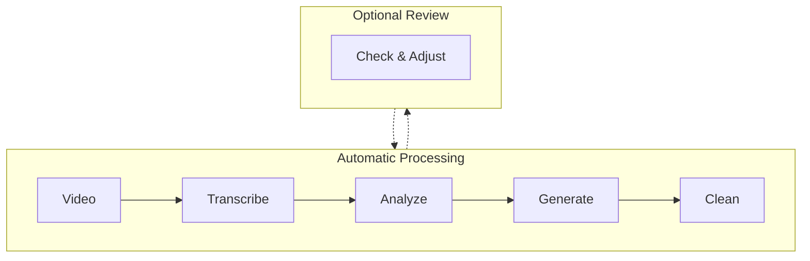
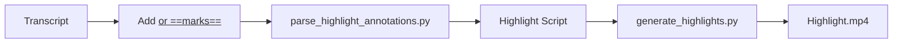
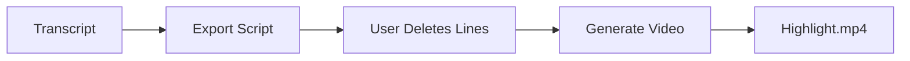

# video-add-chapters

Transcribe videos using Whisper API, automatically detect chapter boundaries, and generate structured markdown documents with YouTube chapter markers. Optionally create highlight videos from selected segments.

## When to Use This Skill

- Transcribing long videos (20+ minutes) and splitting into chapters
- Converting video transcripts into structured documentation
- Generating YouTube chapter markers for video descriptions
- Cleaning up raw transcripts into readable documents
- **Creating highlight videos** from selected transcript segments

## Example Results

- **Live Example**: [AI4PKM W2 Tutorial Part 1](https://pub.aiforbetter.me/community/2026-01-cohort/2026-01-14-ai-4-pkm-w2-tutorial-part-1/)
- See `examples/` folder for sample outputs

## Requirements

### System
- Python 3.7+
- FFmpeg (for audio extraction)

### Python Packages
```bash
pip install -r requirements.txt
```

### Environment Variables
- `OPENAI_API_KEY` - Required for Whisper API

## How It Works



All steps run automatically without user intervention. Optional review step available if manual adjustment is needed.

## Usage

### Quick Start (Automated Pipeline)
```bash
# Run all steps automatically
python transcribe_video.py "video.mp4" --language ko --output-dir "./output"
python suggest_chapters.py "video.mp4" --output "chapters.json"
python generate_docs.py "video.mp4" --chapters "chapters.json" --output-dir "./output"
python clean_transcript.py "./output/merged_document.md" --backup
```

### Step-by-Step Details

**1. Transcribe Video**
```bash
python transcribe_video.py "video.mp4" --language ko --output-dir "./output"

# Skip if transcript already exists (useful for workflow integration)
python transcribe_video.py "video.mp4" --skip-if-exists
```
- Splits video into 15-minute chunks
- Transcribes using Whisper API
- Handles timestamp offsets automatically
- Output: `{video} - transcript.json`

**2. Detect Chapter Boundaries**
```bash
python suggest_chapters.py "video.mp4" --output "chapters.json"
```
- Analyzes transcript for topic transitions
- Uses transition signal patterns (not pauses)
- Output: `chapters.json` with suggested boundaries

**3. Generate Documents**
```bash
python generate_docs.py "video.mp4" --chapters "chapters.json" --output-dir "./output"
```
- Creates individual chapter markdown files
- Generates merged document and index
- Outputs YouTube chapter markers

**4. Clean Transcript**
```bash
python clean_transcript.py "./output/merged_document.md" --backup
```
- Removes filler words
- Improves sentence structure
- Enhances paragraph cohesion
- Preserves timestamps and chapter boundaries

### Optional: Manual Review
If chapter boundaries need adjustment:
1. Edit `chapters.json` with corrected timestamps
2. Re-run `generate_docs.py` to regenerate documents

---

## Highlight Video Generation (Optional)

After completing the chapter workflow, you can create a highlight video by selecting specific segments from the transcript.

### Method 1: Annotation in Transcript (Recommended)

Mark highlights directly in the transcript using `<u>` or `==` annotations.



**Quick Start:**
```bash
# 1. Open transcript markdown and add annotations:
#    <u>text to highlight</u>  or  ==text to highlight==

# 2. Parse annotations to generate highlight script
python parse_highlight_annotations.py "transcript.md" --video "video.mp4"

# 3. (Optional) Edit the generated highlight script to add titles

# 4. Generate highlight video
python generate_highlights.py "transcript - highlight_script.md" --padding 0.5
```

**Supported Annotation Formats:**
- `<u>highlighted text</u>` - HTML underline (visible in most editors)
- `==highlighted text==` - Markdown highlight (Obsidian compatible)

**Features:**
- Consecutive highlighted segments are automatically merged
- End times calculated from next segment start
- Auto-generates titles from first few words

### Method 2: Manual Script Editing

Export full transcript as editable script, then delete unwanted lines.



**Quick Start:**
```bash
# 1. Export editable highlight script
python export_highlight_script.py "video.mp4" \
  --transcript "./output/video - transcript.json"

# 2. Edit the script - delete unwanted lines (in any text editor)

# 3. Generate highlight video
python generate_highlights.py "./output/video - highlight_script.md"
```

### Generate Highlight Video

```bash
python generate_highlights.py "highlight_script.md" --output "highlights.mp4" --padding 0.5 --title-duration 3
```
- Parses `[START-END]` timestamps from script
- Adds 0.5s padding before/after each segment to avoid mid-sentence cuts
- Displays optional segment titles (yellow centered text, Korean font) for 3 seconds
- Merges all segments into single video using FFmpeg
- Output: `{video} - highlights.mp4`

### Highlight Script Format

```markdown
# Highlight Script: Video Title

**Source Video**: /path/to/video.mp4

---

[00:00:09-00:00:21] {Gemini CLI 설정} 우선은 Gemini에다가 제가 현재 커뮤니티 볼트가...

[01:46-02:15] {설치 완료} 네 설치가 된 것 같습니다. 볼트에서 확인해 볼까요.

[03:56-04:01] 아웃박스 커뮤니티 폴더에 질문을 생성을 했어요.
```

**Format**: `[START-END] {Optional Title} Text content`
- Titles in `{curly braces}` are optional
- If provided, title appears as yellow centered text overlay (144px, Korean font supported)

---

## File Structure

```
video-add-chapters/
├── SKILL.md                    # This document
├── requirements.txt            # Python dependencies
├── transcribe_video.py         # Step 1: Video → Transcript
├── suggest_chapters.py         # Step 2: Chapter boundary detection
├── generate_docs.py            # Step 3: Document generation
├── clean_transcript.py         # Step 4: Transcript cleaning
├── parse_highlight_annotations.py  # Parse <u> and == annotations from transcript
├── export_highlight_script.py      # Export transcript as editable highlight script
├── generate_highlights.py          # Generate highlight video from script
├── templates/                  # Markdown templates
│   ├── chapter.md
│   ├── index.md
│   └── youtube_chapters.txt
└── examples/                   # Sample outputs
    ├── sample_chapter.md
    └── sample_youtube_chapters.txt
```

## Troubleshooting

| Issue | Cause | Solution |
|-------|-------|----------|
| Chapter boundaries don't match content | Boundary set at keyword first mention | Use transition signal patterns for boundaries |
| Merged document content mismatch | Manual updates missed in separate files | Update all related files when changing boundaries |
| Transcript timing seems off | Misdiagnosed as offset issue | Verify: Whisper timestamps = video timestamps (no offset) |
| Chapter content overlap | Boundary doesn't match content transition | Use end signals for endpoints, start signals for start points |

### Verification Checklist

1. [ ] Verify video timestamp at each chapter start
2. [ ] Confirm next chapter content doesn't start before current chapter ends
3. [ ] Check merged document body matches chapter boundaries
4. [ ] Test YouTube link timestamps are accurate
5. [ ] Verify original meaning is preserved after cleaning

## Language Support

Currently optimized for **Korean** language with hardcoded transition patterns. Multi-language support: **TBA**.

## Cost Estimate

Whisper API pricing: ~$0.006 per minute of audio
- 1-hour video: ~$0.36
- Processing is done in 15-minute chunks

## Integration

### Related Skills
- **video-full-process**: Combined workflow with video-clean + chapter remapping
- **video-cleaning**: Remove pauses and filler words
- **shorts-extraction**: Extract chapters as short-form clips
- **youtube-transcript**: Download YouTube video transcripts

### Combined Workflow with video-clean

Use `video-full-process` skill for a unified pipeline that:
1. Transcribes once (saving ~50% API costs)
2. Removes pauses and filler words
3. Remaps chapter timestamps to cleaned video
4. Embeds chapters into final video

```bash
# From video-full-process skill directory
python process_video.py "video.mp4" --language ko
```

### Transcript Reuse

The `--skip-if-exists` flag enables transcript reuse across skills:

```bash
# First transcription
python transcribe_video.py "video.mp4"

# Skip if already transcribed (reuses existing transcript)
python transcribe_video.py "video.mp4" --skip-if-exists
```

This prevents duplicate API calls when multiple skills need the same transcript

## Reference: CHAPTERS Array Format

```python
# Format: (start_seconds, title, description)
CHAPTERS = [
    (0, "Intro", "Introduction and welcome"),
    (98, "Setup", "Environment setup guide"),
    (420, "Main Content", "Core tutorial content"),
    # ... each chapter's start time, title, description
]
```

---
> Converted and distributed by [TomeVault](https://tomevault.io/claim/jykim) — claim your Tome and manage your conversions.
<!-- tomevault:4.0:skill_md:2026-04-11 -->
