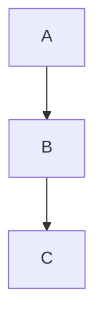
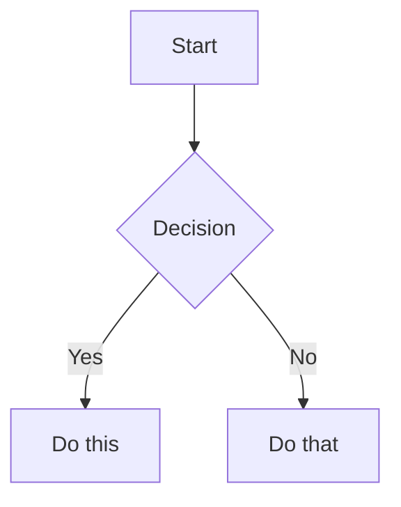

# Slidev Presentation Assistant

This skill helps create and manage presentations using Slidev, a developer-focused presentation framework that combines markdown simplicity with web technology power.

## Content Density Rules (HARD LIMITS)

These limits prevent content overflow and ensure readability. Based on cognitive science (Miller's Law, dual-channel processing) and established across multiple AI-assisted Slidev workflows.

### Per-Slide Budgets

| Constraint | Limit | Rationale |
|---|---|---|
| Elements per slide | MAX 6 | Bullets + images + diagrams + code blocks combined |
| Body text words | MAX 50 | Excluding title; forces conciseness |
| Code blocks per slide | MAX 1-2 | 8-10 lines each; use `maxHeight` if longer |
| Ideas per slide | ONE | If multiple ideas, split into separate slides |
| Bullet words | MAX 6 per bullet | Phrases not sentences (6x6 rule) |

### Content Density by Slide Type

| Slide Type | Maximum Content |
|---|---|
| Title/Cover | 1 heading + subtitle + optional tagline |
| Content | 1 heading + 4-6 bullets OR 2 short paragraphs |
| Feature grid | 6 cards maximum (2x3 or 3x2) |
| Code | 1 heading + 8-10 lines of code |
| Quote | 3 lines max + attribution |
| Image | 1 heading + 1 image |
| Diagram | 1 heading + 1 diagram (constrained height) |

### The Split-Don't-Compress Rule

When content doesn't fit:
- **ALWAYS** split into additional slides
- **ALWAYS** move details to presenter notes (`<!-- ... -->`) or backup slides
- **NEVER** compress or shrink font below minimums to cram more content
- **NEVER** reduce body font below 18pt or heading font below 24pt

### Font Size Minimums

| Element | Minimum | Ideal Range |
|---|---|---|
| H1 | 36pt | 44-60pt |
| H2 | 28pt | 32-40pt |
| H3 | 24pt | 24-28pt |
| Body / Bullets | 18pt | 18-24pt |
| Code | 14pt | 14-18pt |

Limit to 2 font families maximum. Use sans-serif for body text on screens.

## Overflow Prevention Toolkit

Slidev's default canvas is **980x552px** (16:9). Content must fit within these dimensions.

### Canvas Size Configuration (Global Headmatter)

```yaml
---
canvasWidth: 980
aspectRatio: 16/9
---
```

### Per-Slide Zoom (Frontmatter)

Scale down an entire slide when content is slightly too large. Prefer this over reducing font sizes:

```yaml
---
zoom: 0.8
---
# This slide's content is rendered at 80% scale
```

Only use for minor adjustments (0.8-0.95). If you need `zoom` below 0.8, the slide has too much content — split it.

### `<Transform>` Component (Element-Level Scaling)

Scale specific elements without affecting the rest of the slide:

```html
<Transform :scale="0.7" origin="top center">
  <div>This content is 70% of normal size</div>
</Transform>
```

### `<AutoFitText>` Component

Built-in component where font size automatically adapts to fit the container:

```html
<AutoFitText>
  Text that automatically shrinks to fit available space
</AutoFitText>
```

### Code Block `maxHeight` (Prevents Code Overflow)

Built-in feature to constrain code blocks with scrolling:

````markdown
```ts {2|3|7|12}{maxHeight:'200px'}
// Long code that would overflow the slide
// Gets a scrollbar instead of pushing content off-screen
function example() {
  const a = 1
  const b = 2
  const c = 3
  const d = 4
  const e = 5
  const f = 6
  return a + b + c + d + e + f
}
```
````

### Constraining Diagrams

Wrap Mermaid diagrams to prevent overflow:

```html
<div class="overflow-hidden max-h-[400px] flex justify-center">



</div>
```

### Progressive Disclosure with `v-click`

Instead of showing all bullets at once (overflow risk), reveal incrementally. Hidden elements use `opacity: 0` and still occupy space (no layout shift):

```markdown
<v-clicks>

- Point 1
- Point 2
- Point 3
- Point 4

</v-clicks>
```

This keeps visible element count within cognitive bounds at any moment.

## CSS Rules for Slidev

### Critical: Always Scope Under `.slidev-layout`

Unscoped CSS breaks presenter mode and overview panels. **This is the #1 CSS mistake in Slidev:**

```html
<!-- CORRECT: Scoped to slide content -->
<style>
.slidev-layout { overflow: hidden; }
.slidev-layout h1 { font-size: 2.5rem; }
</style>

<!-- ALSO CORRECT: Per-slide scoped style -->
<style scoped>
h1 { font-size: 2rem; }
</style>

<!-- WRONG: Will break presenter mode UI -->
<style>
h1 { font-size: 2rem; }
.grid { align-items: center; }
</style>
```

### Recommended Global `style.css`

Place in project root alongside `slides.md`:

```css
/* Prevent content from overflowing slide boundaries */
.slidev-layout {
  overflow: hidden;
}

/* Allow code blocks to scroll when they exceed available space */
.slidev-layout .slidev-code-wrapper {
  overflow: auto !important;
  max-height: 80%;
}

/* Ensure code content itself can scroll horizontally */
.slidev-layout .slidev-code {
  overflow: auto !important;
}
```

Use `overflow: hidden` for hard-clip (good for export/PDF) or `overflow: auto` for scrolling (good for live presentations).

### Per-Slide CSS Targeting

Target specific slides by page number:

```css
.slidev-page-2 {
  zoom: 90%;
}

.slidev-page-5 .slidev-layout {
  overflow-y: auto;
}
```

### UnoCSS Utility Classes Reference

Slidev uses `@unocss/preset-wind3` (Tailwind-compatible). Key classes for layout control:

| Class | Effect |
|---|---|
| `overflow-hidden` | Clips content at container boundary |
| `overflow-auto` | Adds scrollbar when content overflows |
| `overflow-y-auto` | Vertical scrollbar only |
| `text-sm` / `text-xs` | Reduce font size |
| `text-[0.7rem]` | Arbitrary font size |
| `max-h-[400px]` | Constrain element height |
| `max-h-full` | Max height = 100% of parent |
| `grid grid-cols-2 gap-4` | Two-column CSS Grid |
| `grid grid-cols-3 gap-2` | Three-column CSS Grid |
| `grid grid-cols-[200px_1fr]` | Custom column proportions |
| `flex flex-wrap` | Flexbox with wrapping |
| `w-1/2` / `w-1/3` / `w-2/3` | Fractional widths |
| `p-2` / `px-4` / `py-2` | Padding adjustments |

Apply to slides via frontmatter or inline:

```yaml
---
class: text-sm overflow-hidden
---
```

```html
<div class="grid grid-cols-2 gap-4">
  <div>Column 1</div>
  <div>Column 2</div>
</div>
```

### UnoCSS `--uno:` Directive in CSS

```css
.slidev-layout {
  --uno: px-14 py-10 text-[1.1rem];
}
```

## Quick Start

### Creating a New Presentation

```bash
# Initialize new Slidev project
npm init slidev@latest

# Or use existing project
npm install @slidev/cli --save-dev
```

### Basic Slide Structure

```markdown
---
theme: seriph
background: https://source.unsplash.com/collection/94734566/1920x1080
---

# Welcome to Slidev

Presentation slides for developers

---

# Agenda

- Introduction
- Code Examples
- Live Demo
- Q&A

---
layout: two-cols
---

# Two Column Layout

::left::

Left side content

::right::

Right side content
```

## Core Commands

### Development
```bash
slidev                    # Start dev server (default: slides.md)
slidev slides.md -o       # Start and open in browser
slidev --port 3030        # Use custom port
```

### Building & Exporting
```bash
slidev build              # Build static SPA
slidev export             # Export to PDF (default)
slidev export --format pptx    # Export to PowerPoint
slidev export --format png     # Export as PNG images
slidev export --with-clicks    # Include animation steps
slidev export --range 1,4-8    # Export specific slides
slidev export --per-slide      # Per-slide rendering (includes backgrounds)
```

### Export Verification

#### Automated Content Fit Verification (Recommended)

For comprehensive content verification, use the specialized agent:

```bash
# Claude Code will invoke the slidev-content-verifier agent
# This agent will automatically:
# 1. Export slides to PNG with proper wait times
# 2. Analyze each slide systematically
# 3. Check for all types of content issues
# 4. Provide specific fix recommendations
```

To use the agent, simply ask Claude Code:
- "Verify that all slide content fits properly"
- "Check my slides for content cutoffs"
- "Run content fit verification on the presentation"

The agent uses the workflow described below and provides a detailed report with specific fixes.

#### `slidev-overflow-checker` (Pixel-Level CI Tool)

A Playwright-based CLI tool that renders slides in a real browser and detects pixel-level overflow. Detects three issue types: text-overflow, element-overflow, and unintended scrollbars.

```bash
# Install
npm install -g slidev-overflow-checker

# Start dev server first, then in another terminal:
slidev-overflow-checker --url http://localhost:3030

# CI integration (fails build on overflow)
slidev-overflow-checker --url http://localhost:3030 --fail-on-issues

# Check specific slides
slidev-overflow-checker --url http://localhost:3030 --pages 1-10

# Verbose output with source line mapping
slidev-overflow-checker --url http://localhost:3030 --verbose --project ./
```

**GitHub Actions integration:**
```yaml
- name: Check slide overflow
  run: |
    npx slidev dev &
    sleep 10
    slidev-overflow-checker --url http://localhost:3030 --fail-on-issues
```

**Claude Code command integration:**
```bash
mkdir -p .claude/commands
curl -o .claude/commands/fix-slidev-overflow.md \
  https://raw.githubusercontent.com/mizuirorivi/slidev-overflow-checker/master/templates/fix-slidev-overflow.md
# Then invoke with: /fix-slidev-overflow ./
```

Source: [mizuirorivi/slidev-overflow-checker](https://github.com/mizuirorivi/slidev-overflow-checker)

#### Manual Content Fit Verification Workflow
For manual verification or understanding the process, use PNG export with direct analysis:

```bash
# 1. Export slides to PNG with proper wait times
slidev export --format png --wait 2000 --timeout 120000

# Export specific slides for quick iteration
slidev export --format png --range 5,8,12 --wait 2000

# 2. List exported PNGs
ls -la slides-export/

# 3. Use Read tool to analyze each PNG directly
# The Read tool can display PNG images for visual inspection
# Check each slide systematically
```

**Analysis Workflow with Read Tool:**
```bash
# After export, use Read tool on each PNG to verify:
# - All text is visible and not cut off at edges
# - Code blocks are fully displayed with all lines
# - Bullet points and list items are complete
# - Headers and footers are within slide bounds
# - Images and diagrams are not clipped
# - Long URLs or file paths aren't truncated
# - Mermaid diagrams render completely
# - Tables fit within slide width

# Example verification process:
# Read slides-export/001.png - Check title slide
# Read slides-export/002.png - Verify agenda items all visible
# Read slides-export/003.png - Confirm code block not cut off
# Read slides-export/004.png - Check diagram fully renders
```

**Content Fit Checklist:**
When analyzing each PNG:
- Top margin: Header/title not cut off
- Bottom margin: Footer/content fully visible
- Left edge: No text clipping on bullet points or code
- Right edge: Long lines don't exceed slide width
- Code blocks: All lines visible, no vertical scroll needed
- Lists: All items and sub-items render completely
- Diagrams: Full diagram visible, no edge clipping
- Element count: No more than 6 elements visible
- Font sizes: Body text appears >= 18pt equivalent

**Fixing Content That Doesn't Fit:**
```markdown
# Ordered by preference (best first):

# 1. Split into multiple slides (PREFERRED)
# Move excess content to a new slide

# 2. Move details to presenter notes
<!--
Detailed explanation goes here, not on the slide
-->

# 3. Use per-slide zoom (minor adjustments only)
---
zoom: 0.9
---

# 4. Use two-column layout to spread horizontally
---
layout: two-cols
---

# 5. Use maxHeight on code blocks
```ts {all}{maxHeight:'200px'}
long code here
```

# 6. Apply text-sm class (stays above 18pt minimum)
---
class: text-sm
---

# 7. Scale specific elements with Transform
<Transform :scale="0.8">
  <div>Dense content here</div>
</Transform>

# 8. Use AutoFitText for text that must fit
<AutoFitText>
  Variable-length text
</AutoFitText>
```

#### Timing and Rendering Issues
To ensure proper rendering before export:
```bash
# Add wait time for animations/content loading
slidev export --wait 2000

# Use specific wait conditions for network resources
slidev export --wait-until networkidle

# Increase timeout for complex slides with heavy content
slidev export --timeout 120000

# Combine for best results
slidev export --format png --wait 3000 --wait-until networkidle --timeout 120000
```

## Custom Layouts with Overflow Protection

Place `.vue` files in a `layouts/` directory alongside `slides.md`.

### Scrollable Layout

`layouts/scrollable.vue`:
```vue
<template>
  <div class="slidev-layout scrollable-layout">
    <slot />
  </div>
</template>

<style scoped>
.scrollable-layout {
  overflow-y: auto;
  max-height: 100%;
  padding: 2rem;
}
</style>
```

Usage:
```yaml
---
layout: scrollable
---
# Slide with lots of content that can scroll
```

### Safe Content Layout (Flexbox with Overflow Guard)

`layouts/safe-content.vue`:
```vue
<template>
  <div class="slidev-layout safe-content">
    <div class="content-wrapper">
      <slot />
    </div>
  </div>
</template>

<style scoped>
.safe-content {
  padding: 2rem 3rem;
  height: 100%;
  display: flex;
  flex-direction: column;
}

.content-wrapper {
  flex: 1;
  overflow-y: auto;
  max-height: calc(100% - 2rem);
}
</style>
```

## Essential Features

### Code Highlighting

````markdown
```ts {2,3|5|all}
function add(a: number, b: number): number {
  // This line highlights first
  return a + b
}
console.log(add(1, 2)) // Then this
```
````

### Components & Interactivity

```markdown
<Counter :count="10" />

<Tweet id="1390115482657726468" />

<Youtube id="eW7v-2ZKZOU" />
```

### Presenter Notes

```markdown
# My Slide

Content visible to audience

<!--
Presenter notes here
- Reminder point 1
- Key talking point
- Detailed explanation that would clutter the slide
-->
```

Use presenter notes aggressively to keep slides clean. Any text that explains or elaborates should go in notes, not on the slide.

### Animations

```markdown
# Animations

<v-clicks>

- First item appears
- Second item appears
- Third item appears

</v-clicks>

<v-click>

This appears on click

</v-click>
```

Note: `v-click` uses `opacity: 0` + `pointer-events: none` by default. Hidden elements **still occupy space** in the layout (no layout shift). If total content exceeds slide boundaries, add `overflow: hidden` to the slide.

## Advanced Features

### Diagrams with Mermaid

````markdown

````

### LaTeX Math

```markdown
$\sqrt{3x-1}+(1+x)^2$

$$
\begin{array}{c}
\nabla \times \vec{\mathbf{B}} = \mu_0 \vec{\mathbf{J}}
\end{array}
$$
```

### Custom Layouts

```markdown
---
layout: center
class: text-center
---

# Centered Content

---
layout: image-right
image: ./path/to/image.png
---

# Content with Image

Text on the left, image on right
```

### Built-in Layouts Reference

| Layout | Purpose | Slots |
|---|---|---|
| `default` | Standard content | default |
| `center` | Centered content | default |
| `cover` | Title/cover slide | default |
| `two-cols` | Two-column grid | `::left::`, `::right::` |
| `two-cols-header` | Header + two columns | `::left::`, `::right::` |
| `image-right` / `image-left` | Content + image (50/50) | default |
| `fact` | Large statistic emphasis | default |
| `quote` | Quote display | default |
| `full` | Maximizes space (no padding) | default |
| `iframe` / `iframe-right` | Embedded web content | default |
| `end` | End slide | default |

## Frontmatter Configuration

```yaml
---
theme: default          # Theme name
title: My Presentation  # HTML title
titleTemplate: '%s - Slidev'  # Title template
canvasWidth: 980        # Canvas width in px (default: 980)
aspectRatio: 16/9       # Aspect ratio (default: 16/9)
info: |                 # Info for overview
  ## My Presentation
  Learn about...
author: Your Name       # Presenter name
keywords: slidev,presentation  # SEO keywords
favicon: favicon.ico    # Custom favicon
highlighter: shiki      # Code highlighter
drawings:
  persist: false        # Persist drawings
transition: slide-left  # Slide transition
css: unocss            # CSS framework
fonts:
  sans: Roboto         # Custom fonts
  mono: Fira Code
---
```

## Theme Management

```bash
# Install themes
npm install @slidev/theme-seriph
npm install @slidev/theme-apple-basic

# Use in frontmatter
---
theme: seriph
---
```

## Markdownlint Configuration

Slidev's multi-frontmatter syntax (slide separators `---`) can be corrupted by markdown linters. Add this `.markdownlint.json` to prevent issues:

```json
{
  "MD003": false,
  "MD024": false,
  "MD025": false,
  "MD026": false,
  "MD033": false,
  "MD041": false
}
```

## Common Workflows

### Creating Technical Presentation

1. Initialize project with appropriate theme
2. Plan content with density limits in mind (max 6 elements, max 50 words per slide)
3. Structure with one idea per slide
4. Add code examples with highlighting and `maxHeight`
5. Include diagrams with height constraints
6. Move detailed explanations to presenter notes
7. Test presenter mode
8. Run overflow verification (agent or `slidev-overflow-checker`)
9. Export to PDF for sharing

### Live Coding Demo

```markdown
---
layout: iframe
url: https://stackblitz.com/edit/vue
---
```

### Recording Presentation

```bash
# Built-in recording (with camera)
slidev --record

# Export recording
slidev export --format webm
```

## Best Practices

### Slide Design
- ONE idea per slide (split if multiple)
- MAX 6 elements per slide (bullets + images + code blocks combined)
- MAX 50 words body text per slide
- Use phrases not sentences for bullets (3-6 words each)
- Titles should be assertions, not labels ("API Reduces Latency 3x" not "API Performance")
- Use presenter notes aggressively for detailed explanations
- Use `v-click` for progressive disclosure on slides with 4+ bullets

### Content Fitting Priority
When content overflows, fix in this order:
1. Split into multiple slides
2. Move details to presenter notes
3. Use `zoom: 0.9` frontmatter (minor adjustment)
4. Use two-column layout
5. Apply `maxHeight` to code blocks
6. Use `<Transform :scale="0.8">` on specific elements
7. Apply `class: text-sm` (but respect font minimums)

### Performance
- Optimize images (use appropriate formats)
- Lazy load heavy components
- Test exports early to catch rendering issues
- Use `--wait` parameter for animation-heavy slides

### Accessibility
- Body text minimum 18pt, headings minimum 24pt
- Contrast ratio minimum 4.5:1 (WCAG AA)
- Use colorblind-safe palette (Blue + Orange as default)
- Provide alt text for images
- Ensure sufficient color contrast
- Test keyboard navigation
- Include slide numbers for reference
- Limit to 2 font families

## Troubleshooting

### Export Issues

**Text cut off in PDF:**
```bash
slidev export --wait 3000 --timeout 120000
```

**Content overflows in export but looks fine in browser:**
Add global overflow protection:
```css
/* style.css */
.slidev-layout {
  overflow: hidden;
}
```

**Missing emojis in export:**
```bash
# Install emoji font (Linux)
sudo apt-get install fonts-noto-color-emoji
```

**PPTX text not selectable:**
This is a known limitation - PPTX slides export as images.

### Layout Issues

**Code block pushes content off slide:**
````markdown
```ts {all}{maxHeight:'200px'}
// Code gets a scrollbar instead of overflowing
```
````

**Diagram too large:**
```html
<div class="overflow-hidden max-h-[350px]">


</div>
```

**Custom CSS breaks presenter mode:**
Always scope CSS — use `<style scoped>` or prefix selectors with `.slidev-layout`.

### Development Issues

**Port already in use:**
```bash
slidev --port 3031
```

**Hot reload not working:**
```bash
# Clear cache and restart
rm -rf node_modules/.vite
slidev --force
```

## Quick Reference

### Keyboard Shortcuts
- `Space/Right`: Next slide
- `Left`: Previous slide
- `G`: Go to slide
- `O`: Toggle overview
- `D`: Toggle dark mode
- `F`: Toggle fullscreen
- `P`: Toggle presenter mode
- `C`: Show camera view
- `R`: Start recording

### Directory Structure
```
my-presentation/
   slides.md          # Main presentation file
   style.css          # Global styles (scope under .slidev-layout)
   public/           # Static assets
   components/       # Custom Vue components
   layouts/          # Custom layouts (overflow-safe .vue files)
   styles/           # Additional styles (index.css auto-loaded)
   .slidev/          # Generated files
```

## Examples

### Complete Slide with Features

```markdown
---
layout: two-cols
transition: fade-out
---

# Advanced Example

<v-clicks>

- Automated animations
- Code with highlighting
- Mathematical equations

</v-clicks>

::right::

```js {2|4|6}
const greeting = 'Hello'
console.log(greeting)

const name = 'Slidev'
console.log(name)

console.log(`${greeting} ${name}!`)
```

$E = mc^2$

<!--
Remember to explain the equation
-->
```

### Overflow-Safe Code Slide

````markdown
---
zoom: 0.95
---

# Implementation Details

```ts {2|5|8}{maxHeight:'300px'}
class DataProcessor {
  private cache = new Map<string, Result>()

  async process(input: Input): Promise<Result> {
    if (this.cache.has(input.key)) {
      return this.cache.get(input.key)!
    }
    const result = await this.transform(input)
    this.cache.set(input.key, result)
    return result
  }
}
```

<!--
Walk through the caching strategy:
- Map-based cache with string keys
- Cache-first lookup pattern
- Async transform with cache population
-->
````

### Dense Content with Grid Layout

```markdown
---
class: text-sm
---

# Feature Comparison

<div class="grid grid-cols-2 gap-4">
<div>

### Option A
- Fast startup
- Low memory
- Simple config

</div>
<div>

### Option B
- Better throughput
- Plugin ecosystem
- Auto-scaling

</div>
</div>

<!--
Detailed comparison notes for presenter...
-->
```

For additional customization and advanced features, refer to the [Slidev documentation](https://sli.dev).

## Sources

Improvements informed by:
- [rhuss/cc-slidev](https://github.com/rhuss/cc-slidev) - Evidence-based content limits and design guardrails
- [mizuirorivi/slidev-overflow-checker](https://github.com/mizuirorivi/slidev-overflow-checker) - Playwright-based overflow detection
- [antfu/skills](https://github.com/antfu/skills/tree/main/skills/slidev) - Official Slidev AI skill
- [clearfunction/cf-devtools](https://github.com/clearfunction/cf-devtools) - Markdownlint configuration
- [zarazhangrui/frontend-slides](https://github.com/zarazhangrui/frontend-slides) - Viewport fitting rules
- [Slidev Official Docs](https://sli.dev) - Canvas size, zoom, Transform, AutoFitText, maxHeight, layouts
- [Slidev GitHub Issues](https://github.com/slidevjs/slidev/issues/2446) - CSS scoping requirements

---
> Converted and distributed by [TomeVault](https://tomevault.io/claim/kaovilai) — claim your Tome and manage your conversions.
<!-- tomevault:4.0:skill_md:2026-04-15 -->
