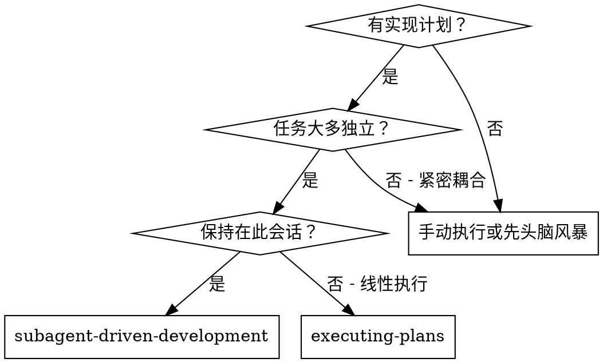
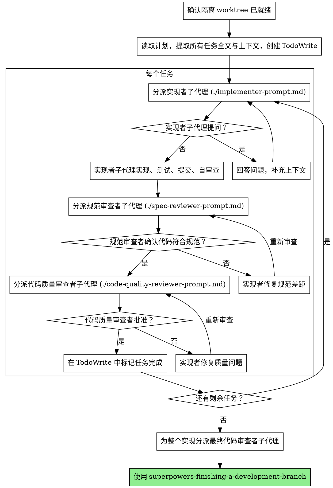

# 子代理驱动开发

通过为每个任务分派新的子代理执行计划，并在每个任务后做两阶段审查：先审规范一致性，再审代码质量。

**为什么用子代理：** 子代理拥有隔离上下文。你可以精确构造它们需要的输入，让它们只聚焦当前任务，而不是继承你整段会话历史。这既提高成功率，也保留了你的主上下文用于协调和判断。

**核心原则：** 每个任务使用新的子代理 + 两阶段审查（规范然后质量）= 高质量、快速迭代

**前置要求：** 在执行任何任务前，先确认当前工作发生在隔离的 git worktree 中；若还没有，先调用 `superpowers-using-git-worktrees`。

## 何时使用



**相比执行计划（线性执行）：**
- 同一会话，无需切换上下文
- 每个任务使用新的子代理，避免上下文污染
- 每个任务后都有两阶段审查：先规范、后质量
- 任务之间不需要人工逐段介入，迭代更快

## 执行流程



## 模型选择

使用刚好能胜任任务的最轻模型，既节省成本，也能加快迭代。

**机械型实现任务**：边界清晰、只涉及 1-2 个文件、规格明确，优先用快而便宜的模型。

**集成与判断型任务**：涉及多文件联动、模式匹配、调试，使用中等能力模型。

**架构、设计、审查型任务**：使用可用范围内最强的模型。

**复杂度判断信号：**
- 只改 1-2 个文件且 spec 非常清晰：低成本模型
- 涉及多个文件与集成顾虑：中等模型
- 需要设计判断或广泛代码库理解：高能力模型

## 处理实现者状态

实现者子代理会返回四种状态，必须分别处理：

**DONE：** 进入规范合规性审查。

**DONE_WITH_CONCERNS：** 任务做完了，但实现者对正确性或范围仍有疑问。先读清这些疑问；如果是正确性或范围问题，先处理再送审；如果只是观察项，例如“这个文件越来越大”，记录后继续送审。

**NEEDS_CONTEXT：** 所需上下文不足。补充上下文后重新派发。

**BLOCKED：** 无法完成任务。你需要判断阻塞类型：
1. 是上下文缺失：补上下文，用同一模型重新派发
2. 是推理能力不足：换更强模型
3. 是任务过大：拆小
4. 是计划本身有问题：升级给人类伙伴

**不要**忽视升级信号，也不要在没有任何变化的情况下让同一个模型盲试。

## 提示模板

- `./implementer-prompt.md` - 分派实现者子代理
- `./spec-reviewer-prompt.md` - 分派规范合规性审查者子代理
- `./code-quality-reviewer-prompt.md` - 分派代码质量审查者子代理

## 示例工作流

```
您：我将使用子代理驱动开发执行这个计划。

[读取计划文件一次：docs/superpowers/plans/feature-plan.md]
[提取所有 5 个任务的全文和上下文]
[创建包含所有任务的 TodoWrite]

任务 1：钩子安装脚本

[获取任务 1 文本和上下文（已提取）]
[分派实现者子代理，提供完整任务文本 + 上下文]

实现者："开始前有个问题：钩子应安装在用户级还是系统级？"

您："用户级（~/.config/superpowers/hooks/）"

实现者："明白了，现在开始实现……"
[稍后] 实现者：
  - 实现了 install-hook 命令
  - 添加了测试，5/5 通过
  - 自审查：发现遗漏了 --force 标志，已补上
  - 已提交

[分派规范合规性审查者]
规范审查者：✅ 符合规范 - 所有要求都满足，没有额外内容

[获取 git SHA，分派代码质量审查者]
代码审查者：优点：测试覆盖良好，代码清晰。问题：无。已批准。

[标记任务 1 完成]
```

## 危险信号

**永远不要：**
- 未准备隔离 worktree 就直接开始实现
- 跳过审查（无论是规范合规性还是代码质量）
- 在问题未修复时继续推进
- 并行分派多个实现者子代理处理会互相冲突的任务
- 让子代理自己去读整份计划文件（应直接给完整任务文本）
- 跳过场景上下文，让子代理不知道该任务在整体中的位置
- 忽略子代理的问题
- 在规范合规性还没通过前就开始代码质量审查
- 在任一审查仍有开放问题时移动到下一个任务

## 集成

**必需的工作流技能：**
- `superpowers-using-git-worktrees` - 在执行任何任务前准备并验证隔离工作区
- `superpowers-writing-plans` - 创建本技能执行的计划
- `superpowers-requesting-code-review` - 提供审查模板
- `superpowers-finishing-a-development-branch` - 在所有任务完成后收尾

**子代理实现时应遵循：**
- `superpowers-test-driven-development` - 为每个任务执行 TDD

**替代工作流：**
- `superpowers-executing-plans` - 用于不走子代理的线性执行

---
> Converted and distributed by [TomeVault](https://tomevault.io/claim/klaaay) — claim your Tome and manage your conversions.
<!-- tomevault:4.0:skill_md:2026-04-13 -->
